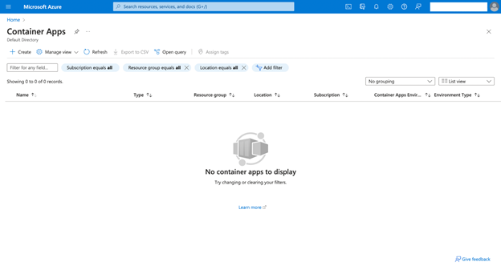

<head> 
  <meta property="og:url" content="https://azure.github.io/cloud-native/60daysofia/personalizing-education-with-generative-ai-and-retrieval-augmented-generation-3"/>
  <meta property="og:type" content="website"/> 
  <meta property="og:title" content="Build Intelligent Apps | AI Apps on Azure"/> 
  <meta property="og:description" content="Join us on a learning journey to build intelligent apps on Azure. Read all about the upcoming #BuildIntelligentApps initiative on this post!"/> 
  <meta property="og:image" content="https://github.com/Azure/Cloud-Native/blob/main/website/static/img/ogImage.png"/> 
  <meta name="twitter:url" content="https://azure.github.io/Cloud-Native/60daysofIA/personalizing-education-with-generative-ai-and-retrieval-augmented-generation-3" /> 
  <meta name="twitter:title" content="Build Intelligent Apps | AI Apps on Azure" />
 <meta name="twitter:description" content="Azure and platform engineering pave the way for the efficient development, deployment, and maintenance of Intelligent Apps, triumphing over traditional approaches." />
  <meta name="twitter:image" content="https://azure.github.io/Cloud-Native/img/ogImage.png" /> 
  <meta name="twitter:card" content="summary_large_image" /> 
  <meta name="twitter:creator" content="@devanshidiaries" /> 
  <link rel="canonical" href="https://azure.github.io/Cloud-Native/60daysofIA/personalizing-education-with-generative-ai-and-retrieval-augmented-generation-3" /> 
</head> 

<!-- End METADATA -->


*In this three-part series, you’ll use Azure Container Apps, Azure OpenAI Service, and Retrieval Augmented Generation to create a personal tutor chatbot that dynamically adjusts educational materials and quizzes based on user interactions. This final article demonstrates how to deploy using Azure Container Apps.*

## Personalizing Education with Generative AI and Retrieval Augmented Generation Part 3

Welcome to the final installment of our three-part tutorial series on building a personalized Python tutor with Generative AI and Retrieval Augmented Generation (RAG)! If you’re new to this series, be sure to check out [Part 1](https://azure.github.io/Cloud-Native/60DaysOfIA/personalizing-education-with-generative-ai-and-retrieval-augmented-generation-1), which shows you how to set up the essential Azure resources, and [Part 2](https://azure.github.io/Cloud-Native/60DaysOfIA/personalizing-education-with-generative-ai-and-retrieval-augmented-generation-2), which explains how to build out the chatbot’s core functionality.

In this final tutorial, you’ll take your chatbot from the development environment to a live web application where anyone can interact with it.

### Prerequisites

To follow this tutorial, ensure you have the following:

* The Azure services set up in Part 1
* The [Python web app](https://github.com/contentlab-io/Personalizing-Education-with-Generative-AI-and-RAG/blob/main/main.py) built in Part 2
* An active Azure subscription
* The [Azure command-line interface (CLI)](https://learn.microsoft.com/cli/azure/?ocid=buildia24_60days_blogs) installed
* [Docker](https://www.docker.com/get-started) installed

To preview the final application, take a look at the [complete project code](https://github.com/contentlab-io/Personalizing-Education-with-Generative-AI-and-RAG).

:::info
Register for **[Episode 4](https://aka.ms/serverless-learn-live/ep4?ocid=buildia24_60days_blogs)** of the new hands-on live learning series with an SME on **Intelligent Apps with Serverless on Azure**.
:::

### Deploy the Web Interface for the Educational Chatbot

With the chatbot’s intelligence and functionality in place, it’s time to make it accessible to the world. You’ll use [Azure Container Apps](https://azure.microsoft.com/products/container-apps?ocid=buildia24_60days_blogs) for a smooth and scalable deployment.

Azure Container Apps is a serverless platform designed to streamline the deployment and management of containerized applications. It handles infrastructure complexities for you, letting you focus on your application’s code.

Containerization packages your chatbot’s code, dependencies, and runtime into a self-contained image. This means it will run consistently across different environments. Since it’s lightweight, you can scale up or down based on demand.

#### Creating an Azure Container Registry

[Azure Container Registry](https://azure.microsoft.com/products/container-registry?ocid=buildia24_60days_blogs) (ACR) is your private storage space for container images. To get started with ACR, use the Azure CLI to log in to your Azure account by running:

```
az login
```

After authenticating, run the following, ensuring you replace `personaltutor` with your chosen registry name:

```
az acr login --name personaltutor
```

#### Building the Container Image

Next, create a file named `Dockerfile` in your project’s root directory. This file provides Docker with instructions for building your image:

```
FROM python:3.11-slim-bullseye 

WORKDIR /app

# Install Streamlit and other dependencies
COPY requirements.txt ./
RUN pip install -r requirements.txt

# Copy your application files
COPY . ./

# Expose the port used by Streamlit
EXPOSE 8501

# Command to start your app
CMD streamlit run main.py
```

Execute the following command to build the image, making sure to use your registry name:

```
az acr build --registry personaltutor --image python-tutor:latest --file Dockerfile .
```

This command instructs Azure to build a container image named `python-tutor:latest`, using your Dockerfile and the code in the current directory (indicated by the period). The image is then stored in your ACR.

Once you push your image to ACR, open the Azure portal and navigate to your container registry. Enable admin access by selecting **Access keys** under **Settings**, and then clicking **Enable** under **Admin** user.

Alternatively, run the following command from the terminal to enable admin access (again, updating `personaltutor` to reflect your selected registry name):

```
az acr update -n personaltutor --admin-enabled true
```

#### Creating an Environment

An [Azure Container Apps environment](https://learn.microsoft.com/azure/container-apps/environment?ocid=buildia24_60days_blogs) acts as a logical boundary for your apps. Think of it as the neighborhood where your chatbot will live.

To create a container app environment, run:

```
az containerapp env create \
   --name python-tutor-app-env \
   --resource-group personal-tutor \
   --location eastus
```

This command creates an environment named `python-tutor-app-env` within your existing resource group, located in the `eastus` region.

#### Creating the Container App

Now, you can deploy your application using Azure Container Apps!

Sign in to the Azure portal and search for “Azure Container Apps” in the search bar at the top. Select the service. Then, click **+ Create** to start a new container app.



On the **Basics** tab, configure the settings as follows:

* **Subscription** and **Resource group** — For consistency, ensure these match the resources you set in the first two parts of this series.
* **Container app name** — Choose a unique name, such as “personaltutor.”
* **Region** — Select the same region where you created your environment.
* **Container Apps Environment** — Select the environment you created earlier.


