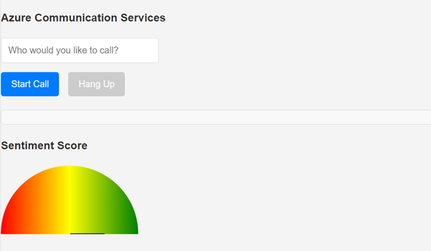

<head> 
  <meta property="og:url" content="https://azure.github.io/cloud-native/60daysofia/real-time-voice-sentiment-analysis-system-1"/>
  <meta property="og:type" content="website"/> 
  <meta property="og:title" content="Build Intelligent Apps | AI Apps on Azure"/> 
  <meta property="og:description" content="Join us on a learning journey to build intelligent apps on Azure. Read all about the upcoming #BuildIntelligentApps initiative on this post!"/> 
  <meta property="og:image" content="https://github.com/Azure/Cloud-Native/blob/main/website/static/img/ogImage.png"/> 
  <meta name="twitter:url" content="https://azure.github.io/Cloud-Native/60daysofIA/real-time-voice-sentiment-analysis-system-1" /> 
  <meta name="twitter:title" content="Build Intelligent Apps | AI Apps on Azure" />
 <meta name="twitter:description" content="Azure and platform engineering pave the way for the efficient development, deployment, and maintenance of Intelligent Apps, triumphing over traditional approaches." />
  <meta name="twitter:image" content="https://azure.github.io/Cloud-Native/img/ogImage.png" /> 
  <meta name="twitter:card" content="summary_large_image" /> 
  <meta name="twitter:creator" content="@devanshidiaries" /> 
  <link rel="canonical" href="https://azure.github.io/Cloud-Native/60daysofIA/real-time-voice-sentiment-analysis-system-1" /> 
</head> 

<!-- End METADATA -->

## Real-time Voice Sentiment Analysis System Using Azure Communication Services, Azure AI and Azure OpenAI (Part 1)

### Introduction

In today's fast-paced digital world, understanding customer sentiment in real-time during voice calls can provide businesses with a competitive edge. This guide will show developers how to build a robust real-time voice sentiment analysis application using several key Azure services. Specifically, we'll leverage:

* [Azure Container Apps](https://learn.microsoft.com/azure/container-apps/overview?ocid=buildia24_60days_blogs) to deploy the backend web API 
* ASP.NET Core web API backend for processing 
* [Azure Communication Services](https://learn.microsoft.com/azure/communication-services/overview?ocid=buildia24_60days_blogs) for handling voice calls 
* [Azure AI Language](https://learn.microsoft.com/azure/ai-services/language-service/overview?ocid=buildia24_60days_blogs) and [Azure OpenAI](https://learn.microsoft.com/azure/ai-services/openai/overview?ocid=buildia24_60days_blogs) for analyzing sentiment 
* Node.js frontend for user interactions. 

#### Architecture diagram


#### Frontend of the sample app



The sample app will manage Voice over IP (VoIP) and Public Switched Telephone Network (PSTN) calling capabilities, converting speech to text on the fly, and will evaluate the sentiment of the conversation in real-time. There are many scenarios where these capabilities could be used:

1. **Customer Support Call Centers**: Analyze customer sentiment in real-time during support calls, allowing agents to adjust their approach based on the emotional tone of the conversation. This can lead to improved customer satisfaction and faster resolution times. 

1. **Market Research Interviews**: Conduct telephonic interviews with participants and use sentiment analysis to gauge reactions to new product ideas or advertisements, providing valuable insights into market trends and consumer preferences. 

1. **Telehealth Services**: In virtual healthcare consultations, use the system to assess the sentiment of patients as they describe their symptoms or concerns. This can help healthcare providers better understand the patient's emotional state and potentially improve diagnosis and patient care. 

1. **Remote Education and E-Learning**: For online classes or training sessions, analyze the sentiment of students' responses during voice interactions to assess engagement, comprehension, and the effectiveness of the teaching material. 

1. **Financial Services**: Use in banking and financial advice call centers to detect customer sentiment during calls, identifying potential issues or opportunities for additional services based on the emotional tone of the customer. 

1. **Sales and Lead Generation**: During sales calls, analyze potential customers' sentiment to tailor the pitch dynamically, improving conversion rates by aligning with the customers' emotional responses. 

By the end of this blog, you will understand how to:

* Set up and manage voice calling with Azure Communication Services. 
* Convert speech to text using Azure Communication Service Calling Captions. 
* Perform sentiment analysis on the text with both Azure AI Language and Azure Open AI Service. 
* Use ASP.NET Core and Node.js to tie these services together in a seamless application.

Let's get started.

### Prerequisites

#### Tools and Accounts Required:

1. **Azure Account**: An active Azure account is required to access Azure services like Azure Communication Services, Azure AI Language, and Azure OpenAI. If you don't already have an account, you can sign up for a free trial [here](https://azure.com/free?ocid=buildia24_60days_blogs). 

1. **Visual Studio Code**: This powerful and lightweight code editor from Microsoft supports development in multiple languages including Node.js and C#. Download it from [here](https://code.visualstudio.com/). 

1. **Azure CLI**: The Azure Command Line Interface is a set of commands used to manage Azure resources directly from the terminal or command prompt. Download and installation instructions can be found [here](https://docs.microsoft.com/cli/azure/install-azure-cli?ocid=buildia24_60days_blogs). 

1. **Postman**: An API development tool that makes it easier to create, share, test, and document APIs. This is optional but recommended for testing your application’s back-end services. Download Postman from [here](https://www.postman.com/downloads/). 

1. **Node.js**: Node.js is a JavaScript runtime that allows you to build scalable network applications. It's essential for developing the front-end of our application. Download and install it from [here](https://nodejs.org/). 

1. **Docker**: Docker is a platform for developing, shipping, and running applications. We'll use it for containerizing and deploying our ASP.NET Core backend. Download and install it from [here](https://www.docker.com/products/docker-desktop).

##### VS Code Extensions:

1. **C# Dev Kit for Visual Studio Code**: While VS Code does support C# development, this specific extension provides advanced features and functionalities tailored for C# development within Azure. It's especially handy for Azure Functions development in C#. Install it from [here](https://marketplace.visualstudio.com/items?itemName=ms-dotnettools.csdevkit). 

1. **Azure Tools**: This extension provides a set of tools for working with Azure services directly from VS Code. It's a must-have for managing Azure resources and services. Install it from [here](https://marketplace.visualstudio.com/items?itemName=ms-vscode.vscode-node-azure-pack). 

1. **Docker Extension**: This extension provides a set of tools for working with Docker containers directly from VS Code. It's essential for containerizing and deploying our ASP.NET Core backend. Install it from [here](https://marketplace.visualstudio.com/items?itemName=ms-azuretools.vscode-docker). 

1. **Azure Container Apps Extension**: This extension provides a set of tools for working with Azure Container Apps directly from VS Code. It's essential for deploying our ASP.NET Core backend. Install it from [here](https://marketplace.visualstudio.com/items?itemName=ms-azuretools.vscode-azurecontainerapps). 

1. **Azure Static Web Apps Extension**: This extension provides a set of tools for working with Azure Static Web Apps directly from VS Code. It's essential for deploying our Node.js frontend. Install it from [here](https://marketplace.visualstudio.com/items?itemName=ms-azuretools.vscode-azurestaticwebapps).

:::info
Checkout the demo bytes for [Intelligent Apps](https://developer.microsoft.com/en-us/reactor/series/S-1308/?wt.mc_id=blog_S-1308_webpage_reactor&ocid=buildia24_60days_blogs) with Azure Container Apps where the product team gives a walkthrough on using open-source vector databases and building a multi-LLM chat application. 
:::

### Creating Azure Resources

With the prerequisites set, the next step is to create necessary Azure resources. These resources include Azure Communication Services for handling voice calls, Azure AI Language for sentiment analysis, and Azure OpenAI as an alternative for more complex sentiment analysis tasks. Here’s how to set each of these up. 

#### Azure Communication Services Resource

**Azure Communication Services (ACS)** will manage all aspects of voice calling within our application. To create a new ACS resource:

1. **Open Azure Portal**: Navigate to the [Azure Portal](https://portal.azure.com) and sign in with your Azure account. 
1. **Create Resource**: Click on the "+ Create a resource" button found on the upper-left corner of the Azure Portal dashboard. 
1. **Search for Communication Services**: In the "Search the Marketplace" field, enter "Communication Services" and select it from the dropdown list. 
1. **Create**: Click the "Create" button.
    1. On the "Basics" tab, fill in the required fields:

        1. **Subscription**: Choose your Azure subscription.
        1. **Resource group**: Create a new resource group or select an existing one.
        1. **Resource name**: Enter a name for your Communication Services resource.
        1. **Region**: Select a region near you or your target audience.
    1. Click "Review + create" to review your settings and then click the "Create" button to provision the resource. 
1. **Configure**:
    1. Once the deployment is complete, navigate to your resource.
    1. Under the "Keys and Endpoint" section, note down your connection string. You'll need this to configure the backend of your application. 
1. **Get a UserToken**  - For initial frontend testing, we need a user token. In your Azure Communication Services resource, navigate to the "Identities & User Access Tokens" section and create a new user with 'Voice and video calling (VOIP)' services. Note down the user token for use later in the tutorial. 

#### Obtain a Free Trial Phone Number

To enable PSTN calling capabilities (optional), you'll need a phone number. Azure Communication Services offers a free trial phone number for testing purposes. Here's how to obtain one:

1. **Navigate to Your ACS Resource**: Sign in to the [Azure Portal](https://portal.azure.com) and go to your newly created Azure Communication Services resource. 

1. **Phone Numbers Section**: On the left-hand menu of your ACS resource overview page, find and select the **Phone Numbers** option. This section allows you to manage phone numbers associated with your ACS resource. 

1. **Get Trial Number**: Inside the Phone Numbers section, you'll see an option to get a free trial phone number. Click on the **Get** button next to the Free Trial Number. Azure will prompt you with the terms and conditions for using a trial number. Please read through these carefully as they contain important information regarding the limitations and permitted use of the free trial number. 

1. **Confirmation**: After accepting the terms, Azure will automatically allocate a trial phone number to your ACS resource. This process may take a few moments. Once completed, the number will be displayed on the screen. Note this number as you will need it for configuring voice calling capabilities in your application.

* **Note**: The free trial phone number comes with certain limitations. For example, there may be restrictions on the number of calls that can be made or received, call duration, and available features compared to a purchased number. These restrictions are in place to manage the service's use during the trial period. 

* **Note**: If you don't, or can't, obtain a free trial phone number, you can still proceed with the rest of the tutorial. The application will work with VoIP calling capabilities, and you can always add a phone number later if needed. Either clone and run the [Azure Communication Service Calling Quickstart](https://learn.microsoft.com/azure/communication-services/quickstarts/voice-video-calling/getting-started-with-calling?tabs=uwp&pivots=platform-web&ocid=buildia24_60days_blogs) or the [Calling Hero App](https://learn.microsoft.com/azure/communication-services/samples/calling-hero-sample?pivots=platform-web&ocid=buildia24_60days_blogs) and use a user ID or group ID respective when making a call. 

Note down the phone number for use later in the tutorial.

#### Azure AI Resource

For basic sentiment analysis, we'll use **Azure AI Language** services. Here's how to set up this resource:

1. **Create Resource**: From the Azure Portal dashboard, click "+ Create a resource". 
1. **Search for AI Language**: Type "Language" in the search bar and select "Language" from the results. 
1. **Create**: Press the "Create" button.
    1. Complete the form:
        1. **Subscription** and **Resource group**: As before.
        1. **Name**: Give your AI Language service a unique name.
        1. **Pricing tier**: Select the pricing tier that fits your needs (you can start with the free tier for testing purposes). 
        1. **Region**: Choose the same region as your Communication Services to minimize latency.
    1. Proceed to "Review + create" and then click "Create".
1. **Configure**:
    1. After your Language resource is deployed, go to it and note down the Key1 and Endpoint from the "Keys and endpoint" section.

#### Azure OpenAI Resource

To leverage more advanced AI capabilities, we also integrate **Azure OpenAI Service**. Setting up this resource involves:

1. **Create Resource**: Again, from the Azure Portal dashboard, click "+ Create a resource". 
1. **Search for OpenAI**: Enter "OpenAI" in the search field and select "OpenAI Service" from the dropdown. 
1. **Create**: Hit the "Create" button.
    1. Fill in the details like you did for the Language service, taking special note of the **Subscription**, **Resource group**, **Name**, **Pricing tier**, and **Region**. 
    1. Review your settings and click "Create".
1. **Configure**: Before you can generate text or inference, you need to deploy a model. You can select from one of several available models in Azure OpenAI Studio. To deploy a model, follow these steps:
    * Sign in to [Azure OpenAI Studio](https://oai.azure.com/)
    * Choose the subscription and the Azure OpenAI resource to work with and select Use resource. 
    * Under Management select Deployments.
    * Select Create new deployment and configure the following fields: Model, Deployment name
1. **Keys**: Once deployed, navigate to the OpenAI resource in Azure Portal. - In the "Keys and endpoint" section, copy Key1 and Endpoint. These will be crucial for integrating advanced sentiment analysis into your application.

### Developing the Node.js Frontend

In this section, we'll dive into creating the front-end of our real-time voice sentiment analysis application using Node.js. The front end will provide a simple yet functional user interface (UI) for making voice calls and displaying closed captions generated from the conversation. We'll also ensure it can display the sentiment analysis results in real-time.

#### Setting Up Your Node.js Environment

First, ensure Node.js is installed on your development machine. If not, download and install it from the [official Node.js website](https://nodejs.org/). With Node.js installed, you can now set up your project environment.

1. Create a New Directory: Create a new folder for your project. This is where all your Node.js front-end files will reside.

    `bash`
    ``` 
    mkdir voice-sentiment
    cd voice-sentiment 
    ```

1. **Initialize Your Project**: Run the following command to create a `package.json` file, which will keep track of your project dependencies.

    `bash`
    ```
    npm init -y
    ```

1. **Install Parcel**: We'll use Parcel, a web application bundler, for a seamless development experience. Install Parcel as a development dependency.

    `bash`
    ```
    npm install parcel --save-dev
    ```

1. **Install Azure Communication Calling SDK**: This SDK is essential for integrating voice calling features in our front-end.

    `bash`
    ```
    npm install @azure/communication-calling --save
    ```

#### Creating the UI for Calling

Now, let's create the basic structure of our frontend application. This includes setting up HTML, CSS, and JavaScript files.

1. **HTML**: Create an index.html file in your project root. This file will serve as the entry point for your application.

    `html`
    ```
    <!DOCTYPE html> 
    <html lang="en"> 
    <head> 
        <meta charset="UTF-8"> 
        <meta name="viewport" content="width=device-width, initial-scale=1.0"> 
        <title>Real-time Voice Sentiment Analysis</title> 
        <link rel="stylesheet" href="styles.css">
    </head> 
    <body> 
        <div id="app"> 
            <input type="text" id="callee-phone-input" placeholder="Enter Phone Number"> 
            <button id="call-phone-button">Start Call</button> 
            <button id="hang-up-phone-button" disabled>Hang Up</button> 
            <div id="captionsArea"></div> 
        </div> 
        <script src="app.js"></script> 
    </body> 
    </html> 
    ```

1. **CSS**: Create a `styles.css` file to style your application. Feel free to customize the styles as per your preference.

    `css`
    ```
    body { 
        font-family: Arial, sans-serif; 
        display: flex; 
        justify-content: center; 
        align-items: center; 
        height: 100vh; 
        margin: 0; 
        background-color: #f5f5f5; 
    } 

    #app { 
        text-align: center; 
    } 

    input[type="text"], button { 
        padding: 10px; 
        margin: 10px; 
        border: 1px solid #ccc; 
        border-radius: 5px; 
    } 

    #captionsArea { 
        margin-top: 20px; 
    } 
    ```

1. **JavaScript**: Create an `app.js` file. This is where we'll write the logic for initializing voice calling and handling sentiment analysis.

Let's start by setting up a basic structure for making and ending calls using the Azure Communication Calling SDK you previously installed. 

    `javascript`
    ```
    import { CallClient, CallAgent } from '@azure/communication-calling'; 

    let callAgent; 
    let acsPhoneNumber; 
    let tokenCredential; 
    let captions; 

    const calleeInput = document.getElementById('callee-phone-input'); 
    const callButton = document.getElementById('call-phone-button'); 
    const hangUpButton = document.getElementById('hang-up-phone-button'); 

    async function initCallAgent() { 
        const callClient = new CallClient(); 

        // Hard code token for now, will be replaced with actual token later 
        tokenCredential = new AzureCommunicationTokenCredential("<<TOKEN_FROM_AZURE_PORTAL>>"); 
        acsPhoneNumber = "<<PHONE_NUMBER_FROM_AZURE_PORTAL>>"; 

        callAgent = await callClient.createCallAgent(tokenCredential);  
        attachCallListeners(); 
    } 

    function attachCallListeners() { 
        callButton.addEventListener('click', startCall); 
        hangUpButton.addEventListener('click', endCall); 
    } 

    async function startCall() { 
        const callee = calleeInput.value; 
        if (callee) { 
            const call = callAgent.startCall([{phoneNumber: callee}]); 
            // More call handling code here 
        } 
    } 

    async function endCall() { 
        if (call) { 
            await call.hangUp({forEveryone: true}); 
            // toggle button states 
            hangUpPhoneButton.disabled = true; 
            callPhoneButton.disabled = false; 
        } 
    } 

    initCallAgent(); 
    ```

**Note**: Make sure to replace placeholders like `tokenCredential` with actual values obtained from your backend or Azure Communication Services resource.

#### Testing and Running Your Application

1. **Run Your Application**: Use Parcel to serve your application. Run the following command in your project root.

    `bash`
    ```
    npx parcel index.html 
    ```
    * Visit the URL provided by Parcel to view your application.

1. **Testing**: Test the calling functionality by entering a valid phone number and clicking the "Start Call" button. Ensure you have backend support to handle getting a token for Azure Communication Services.

#### Handle UserIds and GroupIds

If you didn't acquire a phone number above, we'll add code here to handle user and group ids. This will allow you to make calls without a phone number. To startCall() add:

`javascript`
```
// start a call to phone 
const callee = calleePhoneInput.value; 

const guidPattern = /^[0-9a-f]{8}-[0-9a-f]{4}-[1-5][0-9a-f]{3}-[89ab][0-9a-f]{3}-[0-9a-f]{12}$/i; 
const phoneNumberPattern = /^\+\d+$/; 
const userIdPattern = /^8:acs:[0-9a-f]{8}-[0-9a-f]{4}-[0-9a-f]{4}-[0-9a-f]{4}-[0-9a-f]{12}_[0-9a-f-]+$/i; 

if (guidPattern.test(callee)) { 
    call = callAgent.join({ groupId: callee}); 
} else if (phoneNumberPattern.test(callee)) { 
    call = callAgent.startCall( 
        [{phoneNumber: callee}], { alternateCallerId: {phoneNumber: acsPhoneNumber} 
    }); 
} else if (userIdPattern.test(callee)) { 
    call = callAgent.startCall({ communicationUserId: callee }); 
} else { 
    console.error('Invalid input. Must be a phone number, user ID, or GUID'); 
    return; 
} 
```
#### Adding Captions

Under `More calling code here` add the following code to check for, and enable, captions:

`javascript`
```
captions = call.feature(Features.Captions).captions; 
transcript = []; 
try { 
    if (!captions.isCaptionsFeatureActive) { 
        await captions.startCaptions({ spokenLanguage: 'en-us' }); 
    } 
    captions.on('CaptionsReceived', captionsReceivedHandler); 
} catch (e) { 
    console.error('startCaptions failed', e); 
} 
```

Add a `captionsReceivedHandler` function to parse the captions and add it to the caption area:

`javascript`
```
function captionsReceivedHandler(captionsReceivedEvent) { 
    let mri = ''; 

    if (captionData.speaker.identifier.kind === 'communicationUser') { 
        mri = captionData.speaker.identifier.communicationUserId; 
        mri = mri.slice(-8); 
    } else if (captionData.speaker.identifier.kind === 'microsoftTeamsUser') { 
        mri = captionData.speaker.identifier.microsoftTeamsUserId; 
        mri = mri.slice(-8); 
    } else if (captionData.speaker.identifier.kind === 'phoneNumber') { 
        mri = captionData.speaker.identifier.phoneNumber; 
    } 

    let displayName = captionData.speaker.displayName || mri; 

    // Get the captions area container 
    let captionAreasContainer = document.getElementById('captionsArea'); 

    // Generate a class name based on the MRI 
    const newClassName = `prefix${mri.replace(/[:\-+]/g, '')}`; 

    // Generate the caption text 
    const captionText = `${captionData.timestamp.toUTCString()} ${displayName}: ${captionData.captionText ?? captionData.spokenText}`; 

    // Try to find an existing caption container 
    let captionContainer = captionAreasContainer.querySelector(`.${newClassName}[isNotFinal='true']`); 

    // If no existing caption container was found, create a new one 
    if (!captionContainer) { 
        captionContainer = document.createElement('div'); 
        captionContainer.setAttribute('isNotFinal', 'true'); 
        captionContainer.classList.add(newClassName, 'caption-item'); 
        captionAreasContainer.appendChild(captionContainer); 
    } 

    // Set the caption text 
    captionContainer.textContent = captionText; 

    // If the caption is final, update the 'isNotFinal' attribute 
    if (captionData.resultType === 'Final') { 
        captionContainer.setAttribute('isNotFinal', 'false'); 
    } 
} 
```

Test the calling functionality by entering a valid phone number (or user ID, or group ID) and clicking the "Start Call" button.

### Next Steps

Continue to the [next part](https://azure.github.io/cloud-native/60daysofia/real-time-voice-sentiment-analysis-system-2) of this topic to further explore building, deploying and testing your intelligent app for a real=time voice analysis system. 