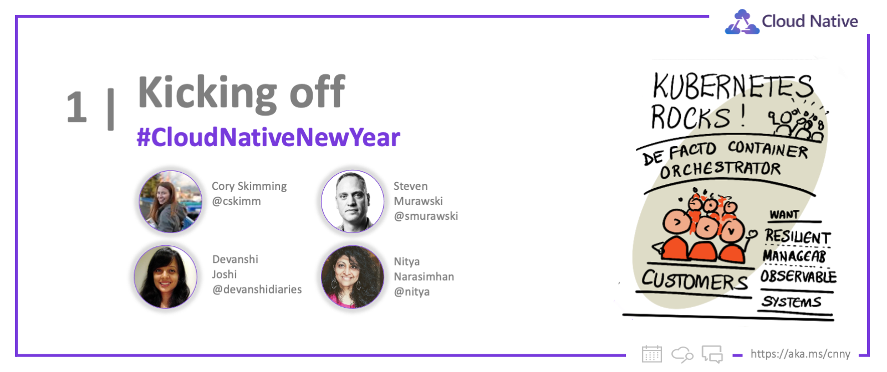

<head>
  <meta name="twitter:url" 
    content="https://azure.github.io/Cloud-Native/cnny-2023/cnny-kickoff" />
  <meta name="twitter:title" 
    content="Kicking off Cloud Native New Year 2023" />
  <meta name="twitter:description" 
    content="Let's  kick-off Cloud Native New Year with #30DaysOfCloudNative" />
  <meta name="twitter:image" 
    content="https://azure.github.io/Cloud-Native/img/og/30-00.png" />
  <meta name="twitter:card" content="summary_large_image" />
  <meta name="twitter:creator" 
    content="@nitya" />
  <meta name="twitter:site" content="@nitya" /> 
  <link rel="canonical" 
    href="https://azure.github.io/Cloud-Native/cnny-2023/cnny-kickoff" />
</head>

Welcome to the `Kick-off Post` for #30DaysOfCloudNative - one of the core initiatives within #CloudNativeNewYear! Over the next four weeks, join us as we take you from fundamentals to functional usage of Cloud-native technologies, one blog post at a time! Read on to learn a little bit about this initiative and what you can expect to learn from this journey!

## What We'll Cover
 * What is Cloud-native New Year? (3 initiatives)
 * How can I _skill up_ (30 days)
 * Who is behind this? (Team Contributors)
 * **Exercise**: Take the [Cloud Skills Challenge](https://aka.ms/CNNY/Challenge)!
 * **Resources**: [#30DaysOfCloudNative Collection](https://aka.ms/CNNY/collection).

---

Welcome to `Week 01` of [ 🥳 #CloudNativeNewYear ](https://aka.ms/CNNY)! Today, we kick off a full month of content and activities to skill you up on all things Cloud-native on Azure with content, events, and community interactions! Read on to learn about what we have planned!

---

## Explore our initiatives

We have a number of initiatives planned for the month to help you learn and skill up on relevant technologies. Click on the links to visit the relevant pages for each. 

* [#30DaysOfCloudNative](/Cloud-Native/cnny-2023/) - 4 themed weeks of daily articles in a structured roadmap
* [Cloud Skills Challenge](https://aka.ms/CNNY/Challenge) - skill up by competing with peers to complete modules
* [Ask The Expert](https://aka.ms/CNNY/ate) - join live Q&A sessions with Product Engineering teams

We'll go into more details about **#30DaysOfCloudNative** in this post - don't forget to [subscribe](https://azure.github.io/Cloud-Native/cnny-2023/rss.xml) to the blog to get daily posts delivered directly to your preferred feed reader!

---

## Register for events!

What are 3 things you can do today, to jumpstart your learning journey?

 * **Register** for live Q&A sessions (free, online) 
    - Feb 9 - [Ask The Expert: Azure Kubernetes Service (PDT)](https://aka.ms/ATE0209/RSVP)
    - Feb 10 - [Ask the Expert: Azure Kubernetes Service (SGT)](https://aka.ms/ATE0209/APAC-RSVP)
  * **Register** for the [Cloud Skills Challenge](https://aka.ms/Challenge) - 30 days to complete it!

---

## #30DaysOfCloudNative

[#30DaysOfCloudNative](https://azure.github.io/Cloud-Native/New-Year/) is a month-long series of daily blog posts grouped into 4 themed weeks - taking you from core concepts to end-to-end solution examples in 30 days. Each article will be short (5-8 mins reading time) and provide exercises and resources to help you reinforce learnings and take next steps.

This series focuses on the [Cloud-native On Azure](https://azure.microsoft.com/solutions/cloud-native-apps/?WT.mc_id=javascript-74010-ninarasi) learning journey in **four stages**, each building on the previous week to help you skill up in a beginner-friendly way:
 * **Week 1:** Get started with [Cloud-native Concepts](https://azure.microsoft.com/solutions/cloud-native-apps/?WT.mc_id=javascript-74010-ninarasi) 
 * **Week 2:** Build & deploy [Kubernetes Apps on cloud](https://azure.microsoft.com/solutions/kubernetes-on-azure/?WT.mc_id=javascript-74010-ninarasi).
 * **Week 3:** Migrate your applications to [Azure Kubernetes Service](https://azure.microsoft.com/products/kubernetes-service/?WT.mc_id=javascript-74010-ninarasi).
 * **Week 4:** Go from Code to Containers to Cloud with [Cloud-native solutions](https://azure.microsoft.com/solutions/cloud-native-apps/?WT.mc_id=javascript-74010-ninarasi)

We have a tentative weekly-themed roadmap for the topics we hope to cover and will keep this updated as we go with links to actual articles as they get published.

:::info Week 1: FOCUS ON CLOUD-NATIVE FUNDAMENTALS

Here's a sneak peek at the week 1 schedule. We'll start with a broad review of cloud-native fundamentals and walkthrough the core concepts of microservices, containers and Kubernetes.

 * **Jan 23**: Learn Core Concepts for Cloud-native
 * **Jan 24**: Container 101
 * **Jan 25**: Adopting Microservices with Kubernetes
 * **Jan 26**: Kubernetes 101
 * **Jan 27**: Exploring your Cloud Native Options

:::

---

## Let's Get Started!

Now you know everything! We hope you are as excited as we are to dive into a full month of active learning and doing! Don't forget to [subscribe](https://azure.github.io/Cloud-Native/cnny-2023/rss.xml?WT.mc_id=javascript-74010-ninarasi) for updates in your favorite feed reader! **And look out for our first Cloud-native Fundamentals post on January 23rd!**

---
