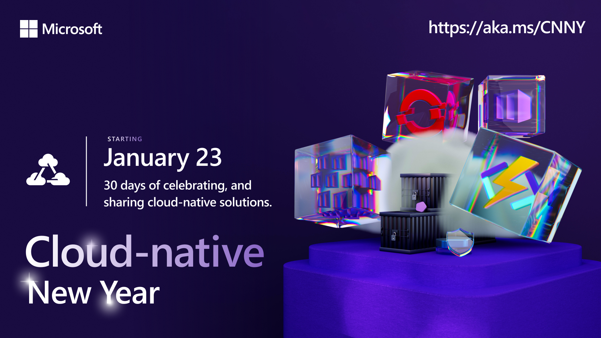

Welcome to `Week 1` of #CloudNativeNewYear!

You will often hear the term "cloud-native" when discussing modern application development, but even a quick online search will return a huge number of articles, tweets, and web pages with a variety of definitions. So, what does cloud-native actually mean? Also, what makes an application a *cloud-native application* versus a "regular" application? 

Today, we will address these questions and more as we kickstart our learning journey (and our new year!) with an introductory dive into the wonderful world of cloud-native. 

---

## What We'll Cover
 * What is cloud-native? 
 * What is a cloud-native application?
 * The benefits of cloud-native
 * The five pillars of cloud-native 
 * **Exercise**: Take the [Cloud Skills Challenge](https://aka.ms/CNNY/Challenge)!

---

## 1. What is cloud-native? 

The term "cloud-native" can seem pretty self-evident (yes, hello, native to the cloud?), and in a way, it is. 
While there are lots of definitions of cloud-native floating around, at it's core, cloud-native simply refers to a modern approach to building software that takes advantage of cloud services and environments. This includes using cloud-native technologies, such as containers, microservices, and serverless, and following best practices for deploying, scaling, and managing applications in a cloud environment.

:::info **Official definition** from the [Cloud Native Computing Foundation](https://www.cncf.io/):
*Cloud-native technologies empower organizations to build and run scalable applications in modern, dynamic environments such as public, private, and hybrid clouds. Containers, service meshes, microservices, immutable infrastructure, and declarative APIs exemplify this approach.*

*These techniques enable loosely coupled systems that are resilient, manageable, and observable. Combined with robust automation, they allow engineers to make high-impact changes frequently and predictably with minimal toil.* [Source](https://github.com/cncf/foundation/blob/main/charter.md)
:::

---

## 2. So, what exactly is a cloud-native application? 
 Cloud-native applications are *specifically* designed to take advantage of the scalability, resiliency, and distributed nature of modern cloud infrastructure.  But how does this differ from a "traditional" application?

Traditional applications are generally been built, tested, and deployed as a single, monolithic unit.  The monolithic nature of this type of architecture creates close dependencies between components.  This complexity and interweaving only increases as an application grows and can make it difficult to evolve (not to mention troubleshoot) and challenging to operate over time. 

To contrast, in cloud-native architectures the application components are decomposed into loosely coupled services, rather than built and deployed as one block of code. This decomposition into multiple self-contained services enables teams to manage complexity and improve the speed, agility, and scale of software delivery. Many small parts enables teams to make targeted updates, deliver new features, and fix any issues without leading to broader service disruption. 

---

## 3. The benefits of cloud-native
Cloud-native architectures can bring many benefits to an organization, including: 

1. **Scalability:** easily scale up or down based on demand, allowing organizations to adjust their resource usage and costs as needed.
2. **Flexibility:** deploy and run on any cloud platform, and easily move between clouds and on-premises environments.
3. **High-availability:** techniques such as redundancy, self-healing, and automatic failover help ensure that cloud-native applications are designed to be highly-available and fault tolerant.
4. **Reduced costs:** take advantage of the pay-as-you-go model of cloud computing, reducing the need for expensive infrastructure investments.
5. **Improved security:** tap in to cloud security features, such as encryption and identity management, to improve the security of the application.
6. **Increased agility:** easily add new features or services to your applications to meet changing business needs and market demand.

---

## 4. The pillars of cloud-native

There are five areas that are generally cited as the core building blocks of cloud-native architecture: 

1.	[Microservices](https://learn.microsoft.com/devops/deliver/what-are-microservices): Breaking down monolithic applications into smaller, independent, and loosely-coupled services that can be developed, deployed, and scaled independently.
2.	Containers: Packaging software in lightweight, portable, and self-sufficient containers that can run consistently across different environments.
3.	Automation: Using automation tools and DevOps processes to manage and operate the cloud-native infrastructure and applications, including deployment, scaling, monitoring, and self-healing.
4.	Service discovery: Using service discovery mechanisms, such as APIs & service meshes, to enable services to discover and communicate with each other.
5.	Observability: Collecting and analyzing data from the infrastructure and applications to understand and optimize the performance, behavior, and health of the system.

These can (and should!) be used in combination to deliver cloud-native solutions that are highly scalable, flexible, and available. 

:::info WHAT'S NEXT

Stay tuned, as we will be diving deeper into these topics in the coming weeks:

* **Jan 24**: Containers 101
* **Jan 25**: Adopting Microservices with Kubernetes
* **Jan 26**: Kubernetes 101
* **Jan 27**: Exploring your Cloud-native Options
:::

---

## Resources

* **Register** for the [Cloud Skills Challenge](https://aka.ms/Challenge) - 30 days to complete it!
* **Resources**: [#30DaysOfCloudNative Collection](https://aka.ms/CNNY/collection)
* **eBook:** [Cloud Native Infrastructure with Azure](https://azure.microsoft.com/resources/cloud-native-infrastructure-with-microsoft-azure/)

---

Don't forget to [subscribe](https://azure.github.io/Cloud-Native/cnny-2023/rss.xml?WT.mc_id=javascript-99907-ninarasi) to the blog to get daily posts delivered directly to your favorite feed reader!

---
