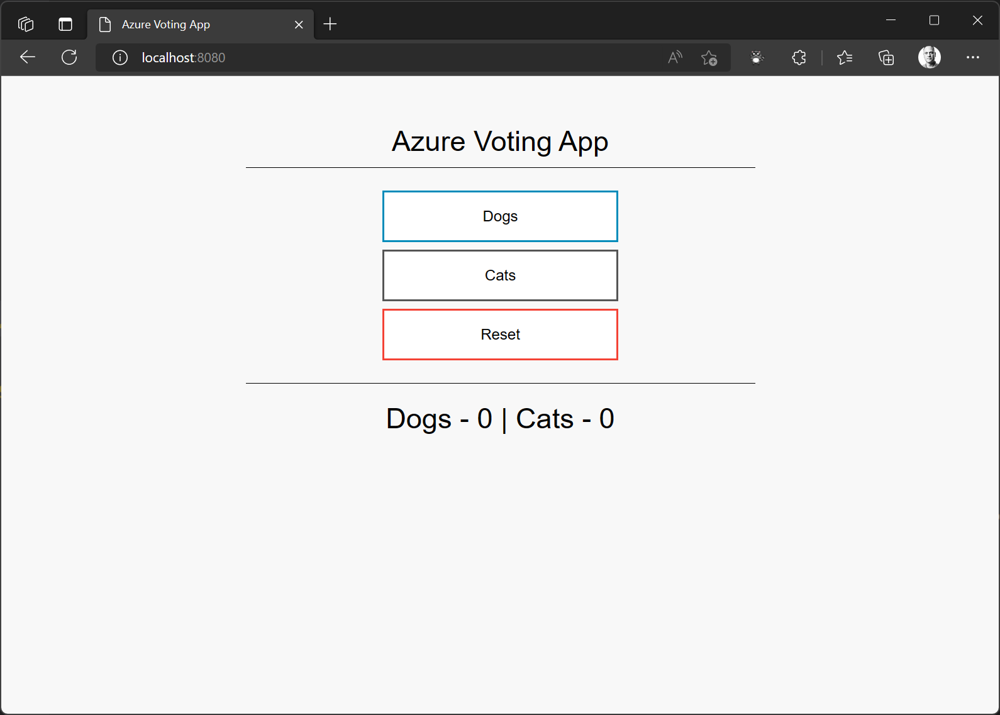

<head>
  <meta name="twitter:url"
    content="https://azure.github.io/Cloud-Native/cnny-2023/fundamentals-day-1" />
  <meta name="twitter:title"
    content="2-1. Kubernetes Fundamentals - Pods and Deployments" />
  <meta name="twitter:description"
    content="The theme for this week is Kubernetes fundamentals. Today we'll explore the topic of Pods and Deployments in Kubernetes." />
  <meta name="twitter:image"
    content="https://azure.github.io/Cloud-Native/img/og/30-06.png" />
  <meta name="twitter:card" content="summary_large_image" />
  <meta name="twitter:creator"
    content="@stevenmurawski" />
  <meta name="twitter:site" content="@AzureAdvocates" />
  <link rel="canonical"
    href="https://azure.github.io/Cloud-Native/cnny-2023/fundamentals-day-1" />
</head>

Welcome to `Day #1 of Week 2` of #CloudNativeNewYear!

The theme for this week is Kubernetes fundamentals. Last week we talked about Cloud Native architectures and the Cloud Native landscape. Today we'll explore the topic of Pods and Deployments in Kubernetes.

:::tip Ask the Experts Thursday, February 9th at 8 AM PST

[Join us for a live Q&A with Experts from the Azure Kubernetes Service product team!](https://aka.ms/ateonlearn)

:::

:::tip Catch the Replay of the Live Demo

Join us for a live demo and let us answer your questions.

[We were live on YouTube walking through today's (and the rest of this week's) demos](https://aka.ms/cnny/week2-demo).  

:::

## What We'll Cover
 * Setting Up A Kubernetes Environment in Azure
 * Running Containers in Kubernetes Pods
 * Making the Pods Resilient with Deployments
 * Exercise
 * Resources

## Setting Up A Kubernetes Environment in Azure

For this week, we'll be working with a simple app - [the Azure Voting App](https://aka.ms/azure-voting-app-rust). My teammate [Paul Yu](https://github.com/pauldotyu) ported the app to Rust and we tweaked it a bit to let us highlight some of the basic features of Kubernetes.

You should be able to replicate this in just about any Kubernetes environment, but we'll use [Azure Kubernetes Service](https://learn.microsoft.com/azure/aks/intro-kubernetes?WT.mc_id=containers-84290-stmuraws) (AKS) as our working environment for this week.

To make it easier to get started, there's a [Bicep](https://learn.microsoft.com/azure/azure-resource-manager/bicep/overview?WT.mc_id=containers-84290-stmuraws&tabs=bicep) template to deploy an AKS cluster, an Azure Container Registry (ACR) (to host our container image), and connect the two so that we can easily deploy our application.

### Step 0 - Prerequisites

There are a few things you'll need if you want to work through this and the following examples this week.

Required:

* Git (and probably a GitHub account if you want to persist your work outside of your computer)
* Azure CLI
* An Azure subscription (if you want to follow along with the Azure steps)
* Kubectl (the command line tool for managing Kubernetes)

Helpful:

* Visual Studio Code (or equivalent editor)

### Step 1 - Clone the application repository

First, I forked [the source repository](https://aka.ms/azure-voting-app-rust) to my account.

```powershell
$GitHubOrg = 'smurawski' # Replace this with your GitHub account name or org name
git clone "https://github.com/$GitHubOrg/azure-voting-app-rust"
cd azure-voting-app-rust
```

Leave your shell opened with your current location inside the application repository.

### Step 2 - Set up AKS

Running the template deployment from the demo script (I'm using the PowerShell example in [cnny23-week2-day1.ps1](https://aka.ms/azure-voting-app-rust/setup-powershell), but there's a Bash variant at [cnny23-week2-day1.sh](https://aka.ms/azure-voting-app-rust/setup-bash)) stands up the environment.  The second, third, and fourth commands take some of the output from the Bicep deployment to set up for later commands, so don't close out your shell after you run these commands.

```powershell
az deployment sub create --template-file ./deploy/main.bicep --location eastus --parameters 'resourceGroup=cnny-week2'
$AcrName = az deployment sub show --name main --query 'properties.outputs.acr_name.value' -o tsv
$AksName = az deployment sub show --name main --query 'properties.outputs.aks_name.value' -o tsv
$ResourceGroup = az deployment sub show --name main --query 'properties.outputs.resource_group_name.value' -o tsv

az aks get-credentials --resource-group $ResourceGroup --name $AksName
```

### Step 3 - Build our application container

Since we have an Azure Container Registry set up, I'll use ACR Build Tasks to build and store my container image.

```powershell
az acr build --registry $AcrName --% --image cnny2023/azure-voting-app-rust:{{.Run.ID}} .
$BuildTag = az acr repository show-tags `
                              --name $AcrName `
                              --repository cnny2023/azure-voting-app-rust `
                              --orderby time_desc `
                              --query '[0]' -o tsv
```

:::tip
Wondering what the `--%` is in the first command line?  That tells the PowerShell interpreter to pass the input after it "as is" to the command without parsing/evaluating it. Otherwise, PowerShell messes a bit with the templated `{{.Run.ID}}` bit.
:::

## Running Containers in Kubernetes Pods

Now that we have our AKS cluster and application image ready to go, let's look into how Kubernetes runs containers.

If you've been in tech for any length of time, you've seen that every framework, runtime, orchestrator, etc.. can have their own naming scheme for their concepts. So let's get into some of what Kubernetes calls things.

### The Pod

A container running in Kubernetes is called a [Pod](https://learn.microsoft.com/azure/aks/concepts-clusters-workloads?WT.mc_id=containers-84290-stmuraws#pods). A Pod is basically a running container on a [Node](https://learn.microsoft.com/azure/aks/concepts-clusters-workloads?WT.mc_id=containers-84290-stmuraws#nodes-and-node-pools) or VM. It can be more. For example you can run multiple containers and specify some funky configuration, but we'll keep it simple for now - add the complexity when you need it.

Our Pod definition can be created via the `kubectl` command imperatively from arguments or declaratively from a configuration file.  We'll do a little of both.  We'll use the `kubectl` command to help us write our configuration files.  Kubernetes configuration files are YAML, so having an editor that supports and can help you syntax check YAML is really helpful.

### Creating a Pod Definition

Let's create a few Pod definitions.  Our application requires two containers to get working - the application and a database.

Let's create the database Pod first.  And before you comment, the configuration isn't secure nor best practice.  We'll fix that later this week.  For now, let's focus on getting up and running.

This is a trick I learned from one of my teammates - Paul.  By using the `--output yaml` and `--dry-run=client` options, we can have the command help us write our YAML.  And with a bit of output redirection, we can stash it safely in a file for later use.

```powershell
kubectl run azure-voting-db `
            --image "postgres:15.0-alpine" `
            --env "POSTGRES_PASSWORD=mypassword" `
            --output yaml `
            --dry-run=client > manifests/pod-db.yaml
```

This creates a file that looks like:

```yml
apiVersion: v1
kind: Pod
metadata:
  creationTimestamp: null
  labels:
    run: azure-voting-db
  name: azure-voting-db
spec:
  containers:
  - env:
    - name: POSTGRES_PASSWORD
      value: mypassword
    image: postgres:15.0-alpine
    name: azure-voting-db
    resources: {}
  dnsPolicy: ClusterFirst
  restartPolicy: Always
status: {}
```

The file, when supplied to the Kubernetes API, will identify what kind of resource to create, the API version to use, and the details of the container (as well as an environment variable to be supplied).

We'll get that container image started with the `kubectl` command.  Because the details of what to create are in the file, we don't need to specify much else to the `kubectl` command but the path to the file.

```powershell
kubectl apply -f ./manifests/pod-db.yaml
```

I'm going to need the IP address of the Pod, so that my application can connect to it, so we can use `kubectl` to get some information about our pod.  By default, `kubectl get pod` only displays certain information but it retrieves a lot more.  We can use the [JSONPath syntax](https://kubernetes.io/docs/reference/kubectl/jsonpath/) to index into the response and get the information you want.

:::tip

To see what you can get, I usually run the `kubectl` command with the output type (`-o JSON`) of JSON and then I can find where the data I want is and create my JSONPath query to get it.

:::

```powershell,
$DB_IP = kubectl get pod azure-voting-db -o jsonpath='{.status.podIP}'
```

Now, let's create our Pod definition for our application.  We'll use the same technique as before.

```powershell
kubectl run azure-voting-app `
            --image "$AcrName.azurecr.io/cnny2023/azure-voting-app-rust:$BuildTag" `
            --env "DATABASE_SERVER=$DB_IP" `
            --env "DATABASE_PASSWORD=mypassword`
            --output yaml `
            --dry-run=client > manifests/pod-app.yaml
```

That command gets us a similar YAML file to the database container - you can see [the full file here](https://github.com/azure-samples/azure-voting-app-rust/blob/week2/day1/manifests/pod-app.yaml)

Let's get our application container running.

```powershell
kubectl apply -f ./manifests/pod-app.yaml
```

### Now that the Application is Running

We can check the status of our Pods with:

```powershell
kubectl get pods
```

And we should see something like:

```
azure-voting-app-rust ❯  kubectl get pods
NAME               READY   STATUS    RESTARTS   AGE
azure-voting-app   1/1     Running   0          36s
azure-voting-db    1/1     Running   0          84s
```

Once our pod is running, we can check to make sure everything is working by letting `kubectl` proxy network connections to our Pod running the application. If we get the voting web page, we'll know the application found the database and we can start voting!

```powershell
kubectl port-forward pod/azure-voting-app 8080:8080
```



When you are done voting, you can stop the port forwarding by using Control-C to break the command.

### Clean Up

Let's clean up after ourselves and see if we can't get Kubernetes to help us keep our application running.  We can use the same configuration files to ensure that Kubernetes only removes what we want removed.

```powershell
kubectl delete -f ./manifests/pod-app.yaml
kubectl delete -f ./manifests/pod-db.yaml
```

### Summary - Pods

A Pod is the most basic unit of work inside Kubernetes. Once the Pod is deleted, it's gone.  That leads us to our next topic (and final topic for today.)

## Making the Pods Resilient with Deployments

We've seen how easy it is to deploy a Pod and get our containers running on Nodes in our Kubernetes cluster.  But there's a problem with that.  Let's illustrate it.

### Breaking Stuff

#### Setting Back Up

First, let's redeploy our application environment.  We'll start with our application container.

```powershell
kubectl apply -f ./manifests/pod-db.yaml
kubectl get pod azure-voting-db -o jsonpath='{.status.podIP}'
```

The second command will report out the new IP Address for our database container.  Let's open `./manifests/pod-app.yaml` and update the container IP to our new one.

```yml
- name: DATABASE_SERVER
  value: YOUR_NEW_IP_HERE
```

Then we can deploy the application with the information it needs to find its database.  We'll also list out our pods to see what is running.

```powershell
kubectl apply -f ./manifests/pod-app.yaml
kubectl get pods
```

Feel free to look back and use the port forwarding trick to make sure your app is running if you'd like.

#### Knocking It Down

The first thing we'll try to break is our application pod.  Let's delete it.

```powershell
kubectl delete pod azure-voting-app
```

Then, we'll check our pod's status:

```powershell
kubectl get pods
```

Which should show something like:

```
azure-voting-app-rust ❯  kubectl get pods
NAME              READY   STATUS    RESTARTS   AGE
azure-voting-db   1/1     Running   0          50s
```

We should be able to recreate our application pod deployment with no problem, since it has the current database IP address and nothing else depends on it.

```powershell
kubectl apply -f ./manifests/pod-app.yaml
```

Again, feel free to do some fun port forwarding and check your site is running.

#### Uncomfortable Truths

Here's where it gets a bit stickier, what if we delete the database container?

If we delete our database container and recreate it, it'll likely have a new IP address, which would force us to update our application configuration.  We'll look at some solutions for these problems in the next three posts this week.

Because our database problem is a bit tricky, we'll primarily focus on making our application layer more resilient and prepare our database layer for those other techniques over the next few days.

Let's clean back up and look into making things more resilient.

```powershell
kubectl delete -f ./manifests/pod-app.yaml
kubectl delete -f ./manifests/pod-db.yaml
```

### The Deployment

One of the reasons you may want to use Kubernetes is it's ability to orchestrate workloads.  Part of that orchestration includes being able to ensure that certain workloads are running (regardless of what Node they might be on).

We saw that we could delete our application pod and then restart it from the manifest with little problem.  It just meant that we had to run a command to restart it.  We can use the [Deployment](https://learn.microsoft.com/azure/aks/concepts-clusters-workloads?WT.mc_id=containers-84290-stmuraws#deployments-and-yaml-manifests) in Kubernetes to tell the orchestrator to ensure we have our application pod running.

The Deployment also can encompass a lot of extra configuration - controlling how many containers of a particular type should be running, how upgrades of container images should proceed, and more.

#### Creating the Deployment

First, we'll create a Deployment for our database. We'll use a technique similar to what we did for the Pod, with just a bit of difference.

```powershell
kubectl create deployment azure-voting-db `
                            --image "postgres:15.0-alpine" `
                            --port 5432 `
                            --output yaml `
                            --dry-run=client > manifests/deployment-db.yaml
```

Unlike our Pod definition creation, we can't pass in environment variable configuration from the command line.  We'll have to edit the YAML file to add that.

So, let's open `./manifests/deployment-db.yaml` in our editor and add the following in the `spec/containers` configuration.

```yml
        env:
        - name: POSTGRES_PASSWORD
          value: "mypassword"
```

Your file should look like this [deployment-db.yaml](https://github.com/azure-samples/azure-voting-app-rust/blob/week2/day1/manifests/deployment-db.yaml).

Once we have our configuration file updated, we can deploy our database container image.

```powershell
kubectl apply -f ./manifests/deployment-db.yaml
```

For our application, we'll use the same technique.

```powershell
kubectl create deployment azure-voting-app `
                        --image "$AcrName.azurecr.io/cnny2023/azure-voting-app-rust:$BuildTag" `
                        --port 8080 `
                        --output yaml `
                        --dry-run=client > manifests/deployment-app.yaml
```

Next, we'll need to add an environment variable to the generated configuration.  We'll also need the new IP address for the database deployment.

Previously, we named the pod and were able to ask for the IP address with `kubectl` and a bit of JSONPath. Now, the deployment created the pod for us, so there's a bit of random in the naming.  Check out:

```powershell
kubectl get pods
```

Should return something like:

```
azure-voting-app-rust ❯  kubectl get pods
NAME                               READY   STATUS    RESTARTS   AGE
azure-voting-db-686d758fbf-8jnq8   1/1     Running   0          7s
```

We can either ask for the IP with the new pod name, or we can use a [selector](https://kubernetes.io/docs/concepts/overview/working-with-objects/labels/#label-selectors) to find our desired pod.

```powershell
kubectl get pod --selector app=azure-voting-db -o jsonpath='{.items[0].status.podIP}'
```

Now, we can update our application deployment configuration file with:

```yml
        env:
        - name: DATABASE_SERVER
          value: YOUR_NEW_IP_HERE
        - name: DATABASE_PASSWORD
          value: mypassword
```

Your file should look like this [deployment-app.yaml](https://github.com/azure-samples/azure-voting-app-rust/blob/week2/day1/manifests/deployment-app.yaml) (but with IPs and image names matching your environment).

After we save those changes, we can deploy our application.

```powershell
kubectl apply -f ./manifests/deployment-app.yaml
```

Let's test the resilience of our app now. First, we'll delete the pod running our application, then we'll check to make sure Kubernetes restarted our application pod.

```powershell
kubectl get pods
```

```
azure-voting-app-rust ❯  kubectl get pods
NAME                                READY   STATUS    RESTARTS   AGE
azure-voting-app-56c9ccc89d-skv7x   1/1     Running   0          71s
azure-voting-db-686d758fbf-8jnq8    1/1     Running   0          12m
```

```powershell
kubectl delete pod azure-voting-app-56c9ccc89d-skv7x
kubectl get pods
```

```
azure-voting-app-rust ❯  kubectl delete pod azure-voting-app-56c9ccc89d-skv7x
>> kubectl get pods
pod "azure-voting-app-56c9ccc89d-skv7x" deleted
NAME                                READY   STATUS    RESTARTS   AGE
azure-voting-app-56c9ccc89d-2b5mx   1/1     Running   0          2s
azure-voting-db-686d758fbf-8jnq8    1/1     Running   0          14m
```

:::info
Your Pods will likely have different identifiers at the end, so adjust your commands to match the names in your environment.
:::

As you can see, by the time the `kubectl get pods` command was run, Kubernetes had already spun up a new pod for the application container image.  Thanks Kubernetes!

### Clean up

Since we can't just delete the pods, we have to delete the deployments.

```powershell
kubectl delete -f ./manifests/deployment-app.yaml
kubectl delete -f ./manifests/deployment-db.yaml
```

### Summary - Deployments

Deployments allow us to create more durable configuration for the workloads we deploy into Kubernetes. As we dig deeper, we'll discover more capabilities the deployments offer. Check out the Resources below for more.

## Exercise

If you want to try these steps, head over to [the source repository](https://aka.ms/azure-voting-app-rust), fork it, clone it locally, and give it a spin!

You can check your manifests against the manifests in the `week2/day1` [branch of the source repository](https://github.com/azure-samples/azure-voting-app-rust/tree/week2/day1/manifests).

## Resources

:::tip Take the Cloud Skills Challenge!

[Enroll](https://learn.microsoft.com/training/challenges?id=a0e385b9-f970-4182-b2e2-3b4619b6c356) in the Cloud Skills Challenge! 

Don't miss out on this opportunity to level up your skills and stay ahead of the curve in the world of cloud native. 
:::

### Documentation

* [Azure Kubernetes Service](https://learn.microsoft.com/azure/aks/intro-kubernetes?WT.mc_id=containers-84290-stmuraws)
* [Bicep](https://learn.microsoft.com/azure/azure-resource-manager/bicep/overview?WT.mc_id=containers-84290-stmuraws&tabs=bicep)
* [Azure Voting App in Rust](https://aka.ms/azure-voting-app-rust)
* [Pods](https://learn.microsoft.com/azure/aks/concepts-clusters-workloads?WT.mc_id=containers-84290-stmuraws#pods).
* [Nodes](https://learn.microsoft.com/azure/aks/concepts-clusters-workloads?WT.mc_id=containers-84290-stmuraws#nodes-and-node-pools)
* [kubectl](https://kubernetes.io/docs/reference/kubectl/kubectl/)
* [JSONPath syntax](https://kubernetes.io/docs/reference/kubectl/jsonpath/)
* [Deployment](https://learn.microsoft.com/azure/aks/concepts-clusters-workloads?WT.mc_id=containers-84290-stmuraws#deployments-and-yaml-manifests)
* [Labels and Selectors](https://kubernetes.io/docs/concepts/overview/working-with-objects/labels/#label-selectors)

### Training

* [Learning Path - Introduction to Kubernetes on Azure](https://learn.microsoft.com/training/paths/intro-to-kubernetes-on-azure/?WT.mc_id=containers-84290-stmuraws)