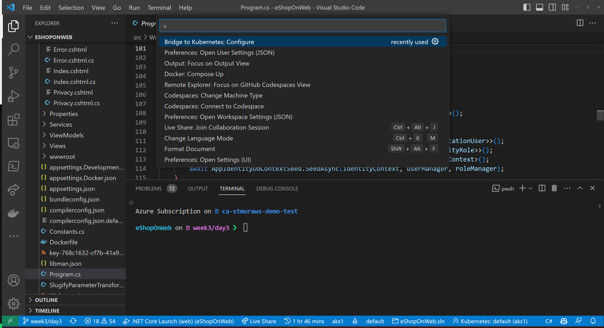
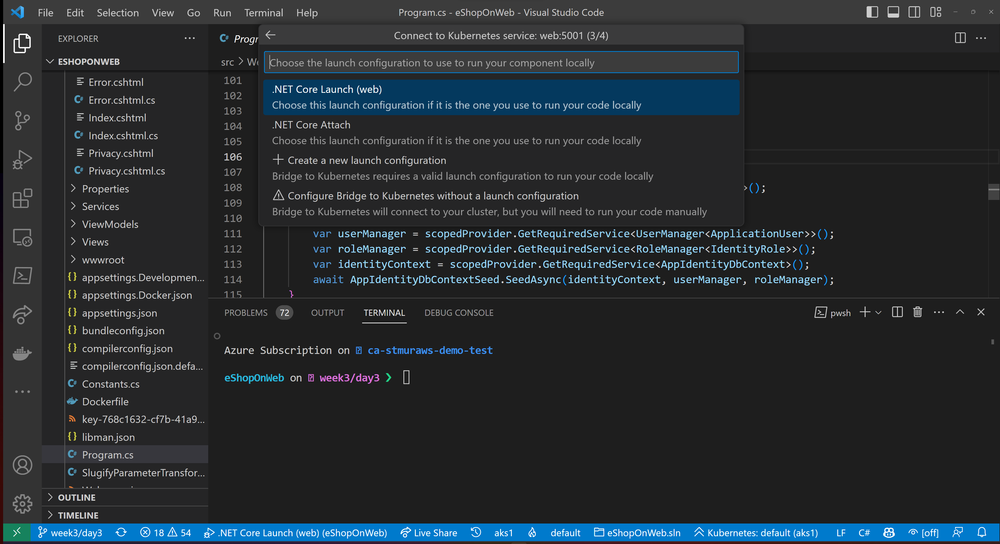
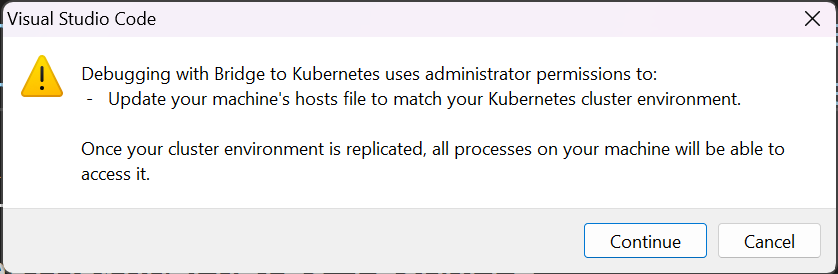

<head>
  <meta name="twitter:url"
    content="https://azure.github.io/Cloud-Native/cnny-2023/bring-your-app-day-4" />
  <meta name="twitter:title"
    content="3-4. Bringing Your Application to Kubernetes - Debugging and Instrumentation" />
  <meta name="twitter:description"
    content="Using Bridge to Kubernetes to debug your application." />
  <meta name="twitter:image"
    content="https://azure.github.io/Cloud-Native/img/og/30-14.png" />
  <meta name="twitter:card" content="summary_large_image" />
  <meta name="twitter:creator"
    content="@stevenmurawski" />
  <meta name="twitter:site" content="@AzureAdvocates" />
  <link rel="canonical"
    href="https://azure.github.io/Cloud-Native/cnny-2023/bring-your-app-day-4" />
</head>

Welcome to `Day 4 of Week 3` of #CloudNativeNewYear!

The theme for this week is Bringing Your Application to Kubernetes. Yesterday we exposed the eShopOnWeb app so that customers can reach it over the internet using a custom domain name and TLS. Today we'll explore the topic of debugging and instrumentation.

:::tip Ask the Experts Thursday, February 9th at 9 AM PST

[Join us for a live Q&A with Experts from the Azure Kubernetes Service product team!](https://aka.ms/cnny/ate)

:::

:::tip Friday, February 10th at 11 AM PST

Join us for a live demo and let us answer your questions.

[We'll be live on YouTube walking through today's (and the rest of this week's) demos](https://aka.ms/cnny/live-coding).  Join us Friday, February 10th and bring your questions!

:::

## What We'll Cover
 * Debugging
 * Bridge To Kubernetes
 * Instrumentation
 * Resources: For self-study!


<!-- ************************************* -->
<!--  AUTHORS: ONLY UPDATE BELOW THIS LINE -->
<!-- ************************************* -->

## Debugging

Debugging applications in a Kubernetes cluster can be challenging for several reasons:

* **Complexity:** Kubernetes is a complex system with many moving parts, including pods, nodes, services, and config maps, all of which can interact in unexpected ways and cause issues.
* **Distributed Environment:** Applications running in a Kubernetes cluster are often distributed across multiple nodes, which makes it harder to determine the root cause of an issue.
* **Logging and Monitoring:** Debugging an application in a Kubernetes cluster requires access to logs and performance metrics, which can be difficult to obtain in a large and dynamic environment.
* **Resource Management:** Kubernetes manages resources such as CPU and memory, which can impact the performance and behavior of applications. Debugging resource-related issues requires a deep understanding of the Kubernetes resource model and the underlying infrastructure.
* **Dynamic Nature:** Kubernetes is designed to be dynamic, with the ability to add and remove resources as needed. This dynamic nature can make it difficult to reproduce issues and debug problems.

However, there are many tools and practices that can help make debugging applications in a Kubernetes cluster easier, such as using centralized logging, monitoring, and tracing solutions, and following best practices for managing resources and deployment configurations.

There's also another great tool in our toolbox - [Bridge to Kubernetes](https://learn.microsoft.com/visualstudio/bridge/overview-bridge-to-kubernetes?WT.mc_id=containers-84290-stmuraws).

## Bridge to Kubernetes

Bridge to Kubernetes is a great tool for microservice development and debugging applications without having to locally replicate all the required microservices.

Bridge to Kubernetes works with [Visual Studio](https://marketplace.visualstudio.com/items?itemName=ms-azuretools.mindaro&WT.mc_id=containers-84290-stmuraws) or [Visual Studio Code](https://marketplace.visualstudio.com/items?itemName=mindaro.mindaro&WT.mc_id=containers-84290-stmuraws).

We'll walk through using it with Visual Studio Code.

### Connecting Bridge to Kubernetes to Our Cluster

#### Ensure your AKS cluster is the default for `kubectl`

If you've recently spun up a new AKS cluster or you have been working with a different cluster, you may need to change what cluster credentials you have configured.

If it's a new cluster, we can use:

```shell
RESOURCE_GROUP=<YOUR RESOURCE GROUP NAME>
CLUSTER_NAME=<YOUR AKS CLUSTER NAME>
az aks get-credentials az aks get-credentials --resource-group $RESOURCE_GROUP --name $CLUSTER_NAME
```

#### Open the command palette 

Open the command palette and find `Bridge to Kubernetes: Configure`.  You may need to start typing the name to get it to show up.



#### Pick the service you want to debug

Bridge to Kubernetes will redirect a service for you.  Pick the service you want to redirect, in this case we'll pick `web`.


#### Identify the port your application runs on

Next, we'll be prompted to identify what port our application will run on locally.  For this application it'll be 5001, but that's just specific to this application (and the default for ASP.NET 7, I believe).


#### Pick a debug configuration to extend

Bridge to Kubernetes has a couple of ways to run - it can inject it's setup and teardown to your existing debug configurations.  We'll pick `.NET Core Launch (web)`.



#### Forward Traffic for All Requests

The last prompt you'll get in the configuration is about how you want Bridge to Kubernetes to handle re-routing traffic.  The default is that all requests into the service will get your local version.  

You can also redirect specific traffic.  Bridge to Kubernetes will set up a subdomain and route specific traffic to your local service, while allowing other traffic to the deployed service.


### Using Bridge to Kubernetes to Debug Our Service

Now that we've configured Bridge to Kubernetes, we see that tasks and a new launch configuration have been added.

Added to `.vscode/tasks.json`:

```yml
        {
            "label": "bridge-to-kubernetes.resource",
            "type": "bridge-to-kubernetes.resource",
            "resource": "web",
            "resourceType": "service",
            "ports": [
                5001
            ],
            "targetCluster": "aks1",
            "targetNamespace": "default",
            "useKubernetesServiceEnvironmentVariables": false
        },
        {
            "label": "bridge-to-kubernetes.compound",
            "dependsOn": [
                "bridge-to-kubernetes.resource",
                "build"
            ],
            "dependsOrder": "sequence"
        }
```

And added to `.vscode/launch.json`:

```yml
{
        "name": ".NET Core Launch (web) with Kubernetes",
        "type": "coreclr",
        "request": "launch",
        "preLaunchTask": "bridge-to-kubernetes.compound",
        "program": "${workspaceFolder}/src/Web/bin/Debug/net7.0/Web.dll",
        "args": [],
        "cwd": "${workspaceFolder}/src/Web",
        "stopAtEntry": false,
        "env": {
            "ASPNETCORE_ENVIRONMENT": "Development",
            "ASPNETCORE_URLS": "http://+:5001"
        },
        "sourceFileMap": {
            "/Views": "${workspaceFolder}/Views"
        }
    }
```

#### Launch the debug configuration

We can start the process with the `.NET Core Launch (web) with Kubernetes` launch configuration in the `Debug` pane in Visual Studio Code.


#### Enable the Endpoint Manager

Part of this process includes a local service to help manage the traffic routing and your hosts file.  This will require admin or `sudo` privileges.  On Windows, you'll get a prompt like:



#### Access your Kubernetes cluster "locally"

Bridge to Kubernetes will set up a tunnel (thanks to port forwarding) to your local workstation and create local endpoints for the other Kubernetes hosted services in your cluster, as well as pretending to be a pod in that cluster (for the application you are debugging).


After making the connection to your Kubernetes cluster, the launch configuration will continue. In this case, we'll make a debug build of the application and attach the debugger.  (This process may cause the terminal in VS Code to scroll with build output. You can find the Bridge to Kubernetes output with the local IP addresses and ports in the Output pane for Bridge to Kubernetes.)

You can set breakpoints, use your debug console, set watches, run tests against your local version of the service.

#### Exploring the Running Application Environment

One of the cool things that Bridge to Kubernetes does for our debugging experience is bring the environment configuration that our deployed pod would inherit.  When we launch our app, it'll see configuration and secrets that we'd expect our pod to be running with.  

To test this, we'll set a breakpoint in our application's start up to see what SQL Server is being used.  We'll set a breakpoint at `src/Infrastructure/Dependencies.cs` on line 32.

Then, we will start debugging the application with Bridge to Kubernetes.  When it hits the breakpoint, we'll open the Debug pane and type `configuration.GetConnectionString("CatalogConnection")`.

When we run locally (not with Bridge to Kubernetes), we'd see:

```
configuration.GetConnectionString("CatalogConnection")
 "Server=(localdb)\\mssqllocaldb;Integrated Security=true;Initial Catalog=Microsoft.eShopOnWeb.CatalogDb;"
```

But, with Bridge to Kubernetes we see something more like (yours will vary based on the password ):

```
configuration.GetConnectionString("CatalogConnection")
 "Server=db;Database=Microsoft.eShopOnWeb.CatalogDb;User Id=sa;Password=*****************;TrustServerCertificate=True;"
```


We can see that the database server configured is based on our `db` service and the password is pulled from our secret in Azure KeyVault (via AKS).

This helps us run our local application just like it was actually in our cluster.

### Going Further

Bridge to Kubernetes also supports more advanced scenarios and, as you need to start routing traffic around inside your cluster, may require you to modify your application to pass along a `kubernetes-route-as` header to help ensure that traffic for your debugging workloads is properly handled.  The docs go into much greater detail about that.

## Instrumentation

Now that we've figured out our debugging story, we'll need to ensure that we have the right context clues to find where we need to debug or to give us a better idea of how well our microservices are running.

### Logging and Tracing

Logging and tracing become even more critical in Kubernetes, where your application could be running in a number of pods across different nodes. When you have an issue, in addition to the normal application data, you'll want to know what pod and what node had the issue, what the state of those resources were (were you resource constrained or were shared resources unavailable?), and if autoscaling is enabled, you'll want to know if a scale event has been triggered. There are a multitude of other concerns based on your application and the environment you maintain.

Given these informational needs, it's crucial to revisit your existing logging and instrumentation. Most frameworks and languages have extensible logging, tracing, and instrumentation libraries that you can iteratively add information to, such as pod and node states, and ensuring that requests can be traced across your microservices. This will pay you back time and time again when you have to troubleshoot issues in your existing environment.

### Centralized Logging

To enhance the troubleshooting process further, it's important to implement centralized logging to consolidate logs from all your microservices into a single location. This makes it easier to search and analyze logs when you're troubleshooting an issue. 

### Automated Alerting

Additionally, implementing automated alerting, such as sending notifications when specific conditions occur in the logs, can help you detect issues before they escalate.

### End to end Visibility

End-to-end visibility is also essential in understanding the flow of requests and responses between microservices in a distributed system. With end-to-end visibility, you can quickly identify bottlenecks and slowdowns in the system, helping you to resolve issues more efficiently.

## Resources

* [Use Bridge to Kubernetes in VS Code](https://learn.microsoft.com/visualstudio/bridge/bridge-to-kubernetes-vs-code?WT.mc_id=containers-84290-stmuraws)
* [Bridge to Kubernetes Visual Studio Extension](https://marketplace.visualstudio.com/items?itemName=ms-azuretools.mindaro&WT.mc_id=containers-84290-stmuraws) 
* [Bridge to Kubernetes Visual Studio Code Extension](https://marketplace.visualstudio.com/items?itemName=mindaro.mindaro&WT.mc_id=containers-84290-stmuraws).

* [Kubernetes monitoring and logging](https://learn.microsoft.com/azure/architecture/aws-professional/eks-to-aks/monitoring?WT.mc_id=containers-84290-stmuraws)
* [Monitor a microservices architecture in Azure Kubernetes Service (AKS)](https://learn.microsoft.com/azure/architecture/microservices/logging-monitoring?WT.mc_id=containers-84290-stmuraws)