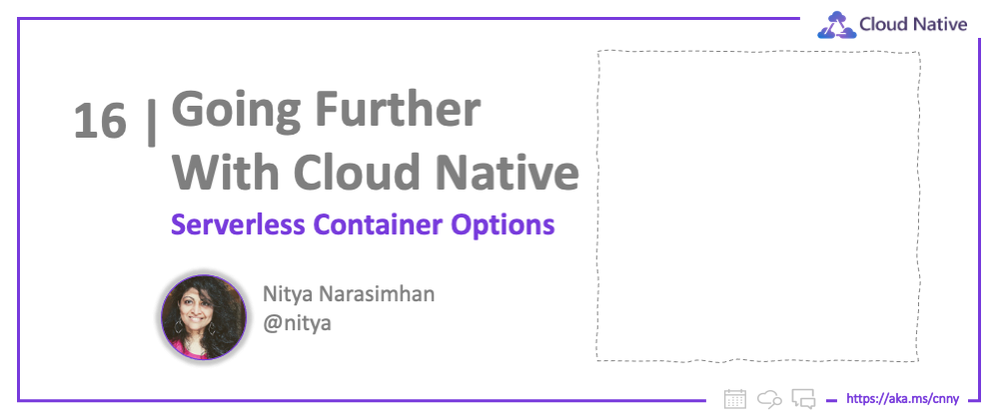

<head>
  <meta name="twitter:url" 
    content="https://azure.github.io/Cloud-Native/cnny-2023/serverless-containers" />
  <meta name="twitter:title" 
    content="Serverless Container Options For Azure" />
  <meta name="twitter:description" 
    content="Explore serverless container options for development - including managed options like AKS and ACA" />
  <meta name="twitter:image" 
    content="https://azure.github.io/Cloud-Native/img/og/30-16.png" />
  <meta name="twitter:card" content="summary_large_image" />
  <meta name="twitter:creator" 
    content="@nitya" />
  <meta name="twitter:site" content="@nitya" /> 
  <link rel="canonical" 
    href="https://azure.github.io/Cloud-Native/cnny-2023/serverless-containers" />
</head>

Welcome to `Week 4` of #CloudNativeNewYear!

This week we'll _go further with Cloud-native_ by exploring advanced topics and best practices for the Cloud-native practitioner. We'll start with an exploration of _Serverless Container Options_  - ranging from managed services to Azure Kubernetes Service (AKS) and Azure Container Apps (ACA), to options that allow more granular control!

## What We'll Cover
 * The Azure Compute Landscape
 * Serverless Compute on Azure
 * Comparing Container Options On Azure
 * Other Considerations
 * Exercise: Try this yourself!
 * Resources: For self-study!

---

We started this series with an introduction to core concepts:
 * In [Containers 101](/cnny-2023/containers-101), we learned **why containerization matters**. Think portability, isolation, scalability, resource-efficiency and cost-effectiveness. _But not all apps can be containerized._
 * In [Kubernetes 101](/cnny-2023/Kubernetes-101), we learned **how orchestration works**. Think systems to automate container deployment, scaling, and management. _But using Kubernetes directly can be complex_.
 * In [Exploring Cloud Native Options](/cnny-2023/explore-options) we asked the real questions: **can we containerize - and should we?**. The first depends on app characteristics, the second on your requirements.
 
For example: 
 * _Can we containerize?_ The answer might be no if your app has system or OS dependencies, requires access to low-level hardware, or maintains complex state across sessions.
 * _Should we containerize?_ The answer might be yes if your app is microservices-based, is stateless by default, requires portability, or is a legaacy app that can benefit from container isolation.

As with every technology adoption decision process, there are no clear yes/no answers - just _tradeoffs_ that you need to evaluate based on your **architecture** and **application requirements**. In today's post, we try to look at this from two main perspectives:
 1. _Should you go serverless?_ Think: managed services that let you focus on app, not infra.
 2. _What Azure Compute should I use?_ Think: best fit for my architecture & technology choices.

## Azure Compute Landscape

Let's answer the second question first by exploring all [**available compute options on Azure**](https://learn.microsoft.com/azure/architecture/guide/technology-choices/compute-decision-tree?WT.mc_id=javascript-84290-ninarasi). The illustrated decision-flow below is my favorite ways to navigate the choices, with questions like:
 * Are you migrating an existing app or building a new one?
 * Can you app be containerized?
 * Does it use a specific technology (Spring Boot, Red Hat Openshift)?
 * Do you need access to the Kubernetes API?
 * What characterizes the workload? (event-driven, web app, microservices etc.)

Read the docs to understand how your choices can be influenced by the _hosting model_ (IaaS, PaaS, FaaS), supported _features_ (Networking, DevOps, Scalability, Availability, Security), _architectural styles_ (Microservices, Event-driven, High-Performance Compute, Task Automation,Web-Queue Worker) etc. 

Now that we know _all_ available compute options, let's address the second question: _why go serverless?_ and what are my serverless compute options on Azure?

## Azure Serverless Compute

Serverless gets defined many ways, but from a compute perspective, we can focus on a few key characteristics that are key to influencing this decision:

 * **managed services** - focus on application, let cloud provider handle infrastructure.
 * **pay for what you use** - get cost-effective resource utilization, flexible pricing options.
 * **autoscaling on demand** - take advantage of built-in features like KEDA-compliant triggers.
 * **use preferred languages** - write code in Java, JS, C#, Python etc. (specifics based on service)
 * **cloud-native architectures** - can support event-driven solutions, APIs, Microservices, DevOps!

So what are some of the key options for [**Serverless Compute on Azure**](https://azure.microsoft.com/solutions/serverless/#solutions?WT.mc_id=javascript-84290-ninarasi)? The article dives into serverless support for _fully-managed end-to-end serverless solutions_ with comprehensive support for DevOps, DevTools, AI/ML, Database, Storage, Monitoring and Analytics integrations. But we'll just focus on the **4 categories of applications** when we look at Compute!

 1. **Serverless Containerized Microservices** _using [Azure Container Apps](https://azure.microsoft.com/en-us/services/container-apps/?WT.mc_id=javascript-84290-ninarasi)_. Code in your preferred language, exploit full Dapr support, scale easily with any KEDA-compliant trigger.
 2. **Serverless Application Environments** _using [Azure App Service](https://azure.microsoft.com/products/app-service/?WT.mc_id=javascript-84290-ninarasi)_. Suitable for hosting monolithic apps (vs. microservices) in a managed service, with built-in support for on-demand scaling.
 3. **Serverless Kubernetes** _using [Azure Kubernetes Service (AKS)](https://azure.microsoft.com/products/kubernetes-service/?WT.mc_id=javascript-84290-ninarasi)_. Spin up pods inside container instances and deploy Kubernetes-based applications with built-in KEDA-compliant autoscaling.
 4. **Serverless Functions** _using [Azure Functions](https://azure.microsoft.com/products/functions/?WT.mc_id=javascript-84290-ninarasi)_. Execute "code at the granularity of functions" in your preferred language, and scale on demand with event-driven compute.

We'll talk about these, and other compute comparisons, at the end of the article. But let's start with the core option you might choose if you want a managed serverless compute solution with built-in features for delivering containerized microservices at scale. Hello, **Azure Container Apps!**.

## Azure Container Apps

[Azure Container Apps (ACA)](https://learn.microsoft.com/azure/container-apps/?WT.mc_id=javascript-84290-ninarasi) became generally available in May 2022 - providing customers with the ability to run **microservices and containerized applications on a serverless, consumption-based platform**. The figure below showcases the different types of applications that can be built with ACA. Note that it comes with built-in KEDA-compliant autoscaling triggers, and other auto-scale criteria that may be better-suited to the type of application you are building.

So far in the series, we've put the spotlight on Azure Kubernetes Service (AKS) - so you're probably asking yourself: _How does ACA compare to AKS?_. We're glad you asked. Check out our _[Go Cloud-native with Azure Container Apps](https://azure.github.io/Cloud-Native/blog/zero2hero-aca-01)_ post from the #ServerlessSeptember series last year for a deeper-dive, or review the figure below for the main comparison points. 

The key takeaway is this. Azure Container Apps (ACA) **also runs on Kubernetes** but abstracts away its complexity in a _managed service offering_ that lets you get productive quickly without requiring detailed knowledge of Kubernetes workings or APIs. However, if you **want full access and control over the Kubernetes API** then go with Azure Kubernetes Service (AKS) instead.

## Other Container Options

Azure Container Apps is the preferred **Platform As a Service (PaaS)** option for a fully-managed serverless solution on Azure that is purpose-built for cloud-native microservices-based application workloads. But - there are other options that may be suitable for your specific needs, from a requirements and tradeoffs perspective. Let's review them quickly:

 1. **[Azure Functions](https://learn.microsoft.com/azure/azure-functions/functions-overview?WT.mc_id=javascript-84290-ninarasi)** is the serverless _Functions-as-a-Service_ (FaaS) option, as opposed to ACA which supports a PaaS approach. It's optimized for running event-driven applications built at the granularity of _ephemeral functions_ that can be deployed as code or containers.
 2. **[Azure App Service](https://learn.microsoft.com/azure/app-service/?WT.mc_id=javascript-84290-ninarasi)** provides fully managed hosting for web applications that may be deployed using code or containers. It can be integrated with other services including Azure Container Apps and Azure Functions. It's optimized for deploying traditional web apps.
 3. **[Azure Kubernetes Service](https://learn.microsoft.com/azure/aks/intro-kubernetes?WT.mc_id=javascript-84290-ninarasi)** provides a fully managed Kubernetes option capable of running any Kubernetes workload, with  direct access to the Kubernetes API.
 4. **[Azure Container Instances](https://learn.microsoft.com/azure/container-instances/?WT.mc_id=javascript-84290-ninarasi)** provides a _single pod_ of Hyper-V isolated containers on demand, making them more of a low-level "building block" option compared to ACA.

Based on the **technology choices you made for application development** you may also have more specialized options you want to consider. For instance:

 1. **[Azure Spring Apps](https://learn.microsoft.com/azure/spring-apps/overview?WT.mc_id=javascript-84290-ninarasi)** is ideal if you're running Spring Boot or Spring Cloud workloads on Azure,
 2. **[Azure Red Hat OpenShift](https://learn.microsoft.com/azure/openshift/intro-openshift?WT.mc_id=javascript-84290-ninarasi)** is ideal for integrated Kubernetes-powered OpenShift on Azure.
 3. **[Azure Confidential Computing](https://learn.microsoft.com/azure/confidential-computing/choose-confidential-containers-offerings)** is ideal if you have data/code integrity and confidentiality needs.
 4. **[Kubernetes At The Edge](https://learn.microsoft.com/azure/architecture/operator-guides/aks/choose-kubernetes-edge-compute-option)** is ideal for bare-metal options that extend compute to edge devices.

This is just the tip of the iceberg in your decision-making journey - but hopefully, it gave you a good sense of the options and criteria that influences your final choices. Let's wrap this up with a look at self-study resources for skilling up further.

## Exercise

Want to get hands on learning related to these technologies?

:::tip TAKE THE CLOUD SKILLS CHALLENGE
[Register today](https://learn.microsoft.com/training/challenges?id=a0e385b9-f970-4182-b2e2-3b4619b6c356&WT.mc_id=javascript-84290-ninarasi) and level up your skills by completing free learning modules, while competing with your peers for a place on the leaderboards!
:::

## Resources

 * [Choose an Azure compute service](https://learn.microsoft.com/azure/architecture/guide/technology-choices/compute-decision-tree?WT.mc_id=javascript-84290-ninarasi)
 * [Serverless On Azure](https://azure.microsoft.com/solutions/serverless/#solutions?WT.mc_id=javascript-84290-ninarasi)
 * [Go Cloud-native with Azure Container Apps](https://azure.github.io/Cloud-Native/blog/zero2hero-aca-01?WT.mc_id=javascript-84290-ninarasi)
 * [Comparing Container Apps with other Azure container options](https://learn.microsoft.com/azure/container-apps/compare-options?WT.mc_id=javascript-84290-ninarasi)