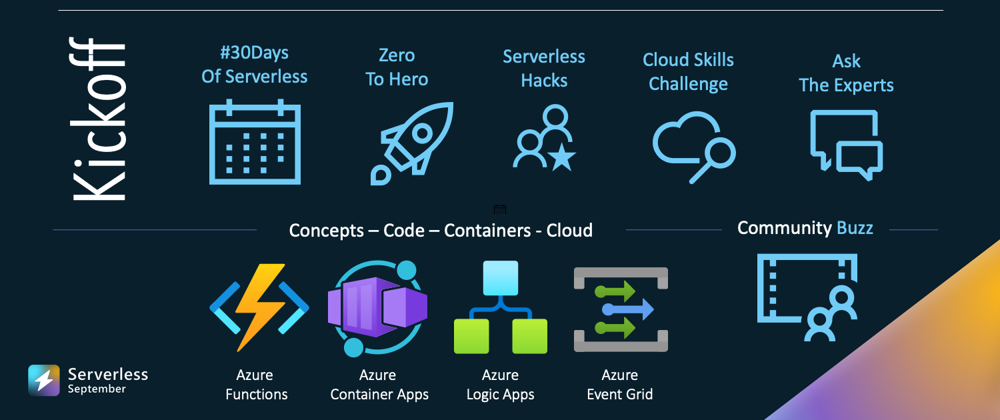
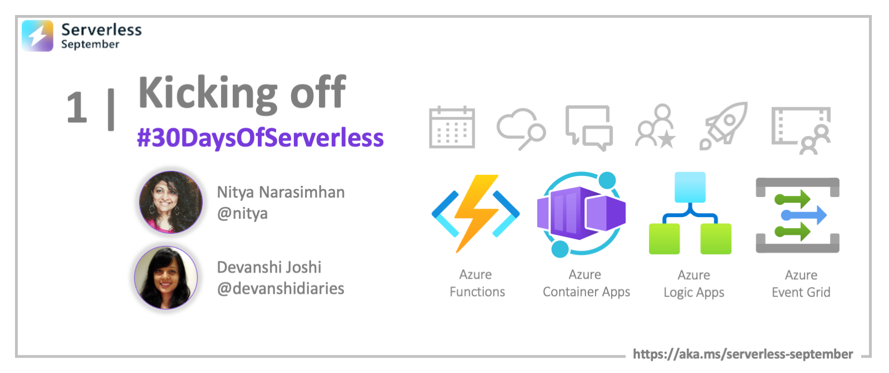

<head>
  <meta name="twitter:url" content="https://azure.github.io/Cloud-Native/blog/01-kickoff" />
  <meta name="twitter:title" content="#01 - It's 30DaysOfServerless!" />
  <meta name="twitter:description" content="Join #ServerlessSeptember as we kickoff #30DaysOfServerless with a look at @AzureFunctions and more. Visit https://aka.ms/serverless-september" />
  <meta name="twitter:image" content="https://azure.github.io/Cloud-Native/assets/images/post-kickoff-4a04995b44f0cc4a784fb4ab5e29cf7c.png" />
  <meta name="twitter:card" content="summary_large_image" />
  <meta name="twitter:creator" content="@nitya" />
  <meta name="twitter:site" content="@AzureStaticApps" /> 
</head>

## What We'll Cover
 * What is Serverless September? (6 initiatives)
 * How can I _participate_? (3 actions)
 * How can I _skill up_ (30 days)
 * Who is behind this? (Team Contributors)
 * How can _you_ contribute? (Custom Issues)
 * **Exercise**: Take the [Cloud Skills Challenge](https://docs.microsoft.com/learn/challenges?id=b950cd7a-d456-46ab-81ba-3bd1ad86dc1c&WT.mc_id=javascript-74010-ninarasi)!
 * **Resources**: [#30DaysOfServerless Collection](https://aka.ms/30DaysOfServerless/collection).

---

Welcome to `Day 01` of [🍂 #ServerlessSeptember](https://aka.ms/serverless-september)! Today, we kick off a full month of content and activities to skill you up on all things Serverless on Azure with content, events, and community interactions! Read on to learn about what we have planned!

---

## Explore our initiatives

We have a number of initiatives planned for the month to help you learn and skill up on relevant technologies. Click on the links to visit the relevant pages for each. 

* [#30DaysOfServerless](/serverless-september/30DaysOfServerless) - 4 themed weeks of daily articles in a structured roadmap
* [Zero To Hero](/serverless-september/ZeroToHero) - 4-part series from Product Engineering teams on best practices
* [Serverless Hacks](/serverless-september/ServerlessHacks) - build a serverless tollbooth by solving 8 challenges - with help!
* [Cloud Skills Challenge](/serverless-september/30DaysOfServerless) - skill up by competing with peers to complete modules
* [Ask The Expert](/serverless-september/AskTheExpert/) - join live Q&A sessions with Product Engineering teams
* [Community Buzz](https://github.com/Azure/Cloud-Native/issues/new/choose) - participate by submitting questions, or contributing content

We'll go into more details about **#30DaysOfServerless** in this post - don't forget to [subscribe](https://azure.github.io/Cloud-Native/blog/rss.xml) to the blog to get daily posts delivered directly to your preferred feed reader!

---

## Register for events!

What are 3 things you can do today, to jumpstart your learning journey?

 * **Register** for live Q&A sessions (free, online)
    - Sep 15 - [Ask The Expert: Azure Functions](https://reactor.microsoft.com/en-us/reactor/events/17000/)
    - Sep 29 - [Ask the Expert: Azure Container Apps](https://reactor.microsoft.com/en-us/reactor/events/17000/)
  * **Register** for the [Cloud Skills Challenge](https://docs.microsoft.com/learn/challenges?id=b950cd7a-d456-46ab-81ba-3bd1ad86dc1c&WT.mc_id=javascript-74010-ninarasi) - 30 days to complete it!
 * **Register** for the [Serverless Hacks Challenge](https://docs.microsoft.com/events/learn-events/reactor-serverlessseptember/?wt.mc_id=eventspg_16946_webpage_reactor&WT.mc_id=javascript-74010-ninarasi) office hours (weekly)

---

## #30DaysOfServerless

[#30DaysOfServerless](/serverless-september/30DaysOfServerless) is a month-long series of daily blog posts grouped into 4 themed weeks - taking you from core concepts to end-to-end solution examples in 30 days. Each article will be short (5-8 mins reading time) and provide exercises and resources to help you reinforce learnings and take next steps.

This series focuses on the [Serverless On Azure](https://azure.microsoft.com/en-us/solutions/serverless/?WT.mc_id=javascript-74010-ninarasi) learning journey in **four stages**, each building on the previous week to help you skill up in a beginner-friendly way:
 * **Week 1:** Get started with serverless using [Azure Functions](https://docs.microsoft.com/azure/azure-functions/functions-overview?WT.mc_id=javascript-74010-ninarasi) 
 * **Week 2:** Build & deploy microservices with [Azure Container Apps](https://docs.microsoft.com/azure/container-apps/overview?WT.mc_id=javascript-74010-ninarasi) and [Dapr](https://dapr.io/?WT.mc_id=javascript-74010-ninarasi).
 * **Week 3:** Streamline integrations using [Azure Logic Apps](https://docs.microsoft.com/azure/logic-apps/?WT.mc_id=javascript-74010-ninarasi) and [Azure Event Grid](https://docs.microsoft.com/azure/event-grid/overview?WT.mc_id=javascript-74010-ninarasi)
 * **Week 4:** Develop End-to-End solutions with [Serverless on Azure](https://azure.microsoft.com/en-us/solutions/serverless/?WT.mc_id=javascript-74010-ninarasi)

We have a [tentative roadmap](/serverless-september/30DaysOfServerless) for the topics we hope to cover and will keep this updated as we go with links to actual articles as they get published.

:::info Week 1: FOCUS ON FUNCTIONS ⚡️

Here's a sneak peek at what we have planned for week 1. We'll start with a broad look at fundamentals, walkthrough examples for each targeted programming language, then wrap with a post that showcases the role of Azure Functions in powering different serverless scenarios.

 * Sep 02: Learn Core Concepts for Azure Functions
 * Sep 03: Build and deploy your first Function
 * Sep 04: Azure Functions - for Java Developers!
 * Sep 05: Azure Functions - for JavaScript Developers!
 * Sep 06: Azure Functions - for .NET Developers!
 * Sep 07: Azure Functions - for Python Developers!
 * Sep 08: Wrap: Azure Functions + Serverless on Azure

:::

---

## Ways to Participate..

We hope you are as excited as we are, to jumpstart this journey. We want to make this a **useful, beginner-friendly** journey and we need your help!

Here are the many ways you can participate:

* **[Follow Azure on dev.to](https://dev.to/azure)** - we'll republish posts under [this series page](https://dev.to/nitya/series/19576) and welcome comments and feedback there!
* **[Discussions on GitHub](https://github.com/Azure/Cloud-Native/discussions)** - Use this if you have feedback for us (on how we can improve these resources), or want to chat with your peers about serverless topics.
* **[Custom Issues](https://github.com/Azure/Cloud-Native/issues/new/choose)** - just pick a template, create a new issue by filling in the requested details, and submit. You can use these to:
    - submit questions for **AskTheExpert** (live Q&A) ahead of time
    - submit your own articles or projects for community to learn from
    - share your **ServerlessHack** and get listed in our Hall Of Fame!
    - report bugs or share ideas for improvements

Here's the list of custom issues currently defined.

## Let's Get Started!

Now you know everything! We hope you are as excited as we are to dive into a full month of active learning and doing! Don't forget to [subscribe](https://azure.github.io/Cloud-Native/blog/rss.xml?WT.mc_id=javascript-74010-ninarasi) for updates in your favorite feed reader! **And look out for our first Azure Functions post tomorrow!**

---