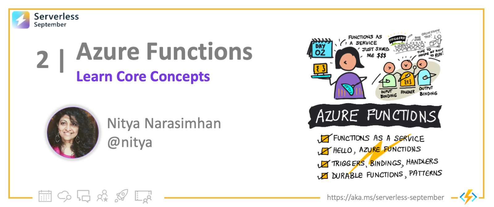

<head>
  <meta name="twitter:url" 
    content="https://azure.github.io/Cloud-Native/blog/functions-1" />
  <meta name="twitter:title" 
    content="#30DaysOfServerless: Azure Functions Fundamentals" />
  <meta name="twitter:description" 
    content="#30DaysOfServerless: Azure Functions Fundamentals" />
  <meta name="twitter:image"
    content="https://azure.github.io/Cloud-Native/img/banners/post-kickoff.png" />
  <meta name="twitter:card" content="summary_large_image" />
  <meta name="twitter:creator" 
    content="@nitya" />
  <meta name="twitter:site" content="@AzureAdvocates" /> 
  <link rel="canonical" 
    href="https://azure.github.io/Cloud-Native/blog/02-functions-intro" />
</head>

---

Welcome to `Day 2` of #30DaysOfServerless!

Today, we kickstart our journey into serveless on Azure with a look at _Functions As a Service_. Specifically, we'll explore Azure Functions - from core concepts to usage patterns. Let's get started!

---

## What We'll Cover
 * What is Functions-as-a-Service? (FaaS)
 * What is Azure Functions?
 * Triggers, Bindings and Custom Handlers
 * What is Durable Functions?
 * Orchestrators, Entity Functions and Application Patterns
 * Exercise: Try this yourself!
 * Resources: For self-study!



---


## 1. What is FaaS?

Faas stands for [Functions As a Service (FaaS)](https://docs.microsoft.com/en-us/azure/architecture/guide/technology-choices/compute-decision-tree?WT.mc_id=javascript-74010-ninarasi ). But what does that mean for us as application developers? We know that 
building and deploying modern applications **at scale** can get _complicated_ and it starts with us needing to take decisions on _Compute_. In other words, we need to answer this question: "**where should I host my application given my resource dependencies and scaling requirements?**" 


Azure has [this useful flowchart](https://docs.microsoft.com/en-us/azure/architecture/guide/technology-choices/compute-decision-tree?WT.mc_id=javascript-74010-ninarasi ) (shown below) to guide your decision-making. You'll see that hosting options generally fall into three categories:
 * **Infrastructure as a Service (IaaS)** - where you provision and manage Virtual Machines yourself (cloud provider manages infra).
 * **Platform as a Service (PaaS)** - where you use a provider-_managed_ hosting environment like Azure Container Apps.
 * **Functions as a Service (FaaS)** - where you forget about hosting environments and simply _deploy your code_ for the provider to run.

Here, "serverless" compute refers to hosting options where we (as developers) can focus on building apps _without having to manage the infrastructure_. See [serverless compute options on Azure](https://azure.microsoft.com/en-us/solutions/serverless/?WT.mc_id=javascript-74010-ninarasi ) for more information.

---

## 2. Azure Functions

[Azure Functions](https://docs.microsoft.com/en-us/azure/azure-functions/?WT.mc_id=javascript-74010-ninarasi ) is the Functions-as-a-Service (FaaS) option on Azure. It is the ideal serverless solution if your application is event-driven with short-lived workloads. With Azure Functions, we develop applications as modular blocks of code (`functions`) that are executed on demand, in response to configured events (`triggers`). This approach brings us two advantages:
 * _It saves us money._ We only pay for the time the function runs.
 * _It scales with demand._ We have 3 hosting plans for flexible scaling behaviors.

Azure Functions can be programmed in many popular languages (C#, F#, Java, JavaScript, TypeScript, PowerShell or Python), with Azure providing [language-specific](https://docs.microsoft.com/en-us/azure/azure-functions/supported-languages?WT.mc_id=javascript-74010-ninarasi ) handlers and default [runtimes](https://docs.microsoft.com/en-us/azure/azure-functions/supported-languages#languages-by-runtime-version?WT.mc_id=javascript-74010-ninarasi ) to execute them.

:::tip Concept: Custom Handlers

* What if we wanted to program in a non-supported language? 
* Or we wanted to use a different runtime for a supported language? 
:::

**[Custom Handlers](https://docs.microsoft.com/en-us/azure/azure-functions/functions-custom-handlers?WT.mc_id=javascript-74010-ninarasi )** have you covered! These are lightweight webservers that can receive and process input events from the Functions host - and return responses that can be delivered to any output targets. By this definition, custom handlers can be implemented by _any language that supports receiving HTTP events_. Check out [this example](https://docs.microsoft.com/en-us/azure/azure-functions/media/functions-custom-handlers/azure-functions-custom-handlers-overview.png?WT.mc_id=javascript-74010-ninarasi ) for a custom handler in Go.


:::tip Concept: Trigger and Bindings

We talked about what functions are (code blocks). But when are they invoked or executed? And how do we provide inputs (arguments) and retrieve outputs (results) from this execution?
:::

This is where **triggers** and **bindings** come in.

 * `Triggers` define how a function is invoked and what associated data it will provide. _A function must have exactly one trigger_.
 * `Bindings` _declaratively_ define how a resource is connected to the function. The resource or binding can be of type input, output, or both. _Bindings are optional. A Function can have multiple input, output bindings_.

Triggers and bindings help you abstract your function's interfaces to other components it interacts with, eliminating hardcoded integrations. They are [configured differently based on the programming language](https://docs.microsoft.com/en-us/azure/azure-functions/functions-triggers-bindings?tabs=csharp#trigger-and-binding-definitions&WT.mc_id=javascript-74010-ninarasi ) you use. For example - JavaScript functions are configured in the [functions.json](https://docs.microsoft.com/en-us/azure/azure-functions/functions-reference?tabs=blob#function-code?WT.mc_id=javascript-74010-ninarasi ) file. Here's an example of what that looks like.


```js
{
    "disabled":false,
    "bindings":[
        // ... bindings here
        {
            "type": "bindingType",
            "direction": "in",
            "name": "myParamName",
            // ... more depending on binding
        }
    ]
}
```

The key thing to remember is that triggers and bindings have a `direction` property - triggers are always `in`, input bindings are `in` and output bindings are `out`. Some bindings can support a special `inout` direction. 

The documentation has [code examples](https://docs.microsoft.com/en-us/azure/azure-functions/functions-triggers-bindings?tabs=javascript#supported-bindings&WT.mc_id=javascript-74010-ninarasi ) for bindings to popular Azure services. Here's an example of the bindings and trigger configuration for a [BlobStorage](https://docs.microsoft.com/en-us/azure/azure-functions/functions-bindings-storage-blob-input?tabs=in-process%2Cextensionv5&pivots=programming-language-javascript#example&WT.mc_id=javascript-74010-ninarasi ) use case.

```js
// function.json configuration

{
  "bindings": [
    {
      "queueName": "myqueue-items",
      "connection": "MyStorageConnectionAppSetting",
      "name": "myQueueItem",
      "type": "queueTrigger",
      "direction": "in"
    },
    {
      "name": "myInputBlob",
      "type": "blob",
      "path": "samples-workitems/{queueTrigger}",
      "connection": "MyStorageConnectionAppSetting",
      "direction": "in"
    },
    {
      "name": "myOutputBlob",
      "type": "blob",
      "path": "samples-workitems/{queueTrigger}-Copy",
      "connection": "MyStorageConnectionAppSetting",
      "direction": "out"
    }
  ],
  "disabled": false
}
```
The code below shows the function implementation. In this scenario, the function is triggered by a _queue message_ carrying an _input payload_ with a blob name. In response, it copies that data to the resource associated with the _output binding_.

```js
// function implementation

module.exports = async function(context) {
    context.log('Node.js Queue trigger function processed', context.bindings.myQueueItem);
    context.bindings.myOutputBlob = context.bindings.myInputBlob;
};
```


:::tip Concept: Custom Bindings

What if we have a more complex scenario that requires bindings for non-supported resources? 
:::

There is an option create custom bindings if necessary. We don't have time to dive into details here but definitely check out the [documentation](https://github.com/Azure/azure-webjobs-sdk/wiki/Creating-custom-input-and-output-bindings)

---

## 3. Durable Functions

This sounds great, right?. But now, let's talk about one challenge for Azure Functions. In the use cases so far, the functions are _stateless_ - they take inputs at runtime if necessary, and return output results if required. But they are otherwise self-contained, which is great for scalability!

But what if I needed to build more complex _workflows_ that need to store and transfer state, and complete operations in a reliable manner? [Durable Functions](https://docs.microsoft.com/en-us/azure/azure-functions/durable/durable-functions-overview?tabs=csharp&WT.mc_id=javascript-74010-ninarasi ) are an extension of Azure Functions that makes _stateful workflows_ possible.

:::tip Concept: Orchestrator Functions

How can I create workflows that coordinate functions?
:::

Durable Functions use [orchestrator functions](https://docs.microsoft.com/en-us/azure/azure-functions/durable/durable-functions-orchestrations?tabs=csharp&WT.mc_id=javascript-74010-ninarasi ) to coordinate execution of other Durable functions within a given Functions app. These functions are _durable and reliable_. Later in this post, we'll talk briefly about some application patterns that showcase popular orchestration scenarios.

:::tip Concept:  Entity Functions
How do I persist and manage state across workflows?
:::

Entity Functions provide explicit _state mangement_ for Durable Functions, defining operations to read and write state to _durable entities_. They are associated with a special _entity trigger_ for invocation. These are currently available only for a subset of programming languages so check to see if they are supported for your programming language of choice.

:::tip USAGE: Application Patterns
:::

Durable Functions are a fascinating topic that would require a separate, longer post, to do justice. For now, 
let's look at some [application patterns](https://docs.microsoft.com/en-us/azure/azure-functions/durable/durable-functions-entities?tabs=csharp&WT.mc_id=javascript-74010-ninarasi ) that showcase the value of these starting with the simplest one: [Function Chaining](https://docs.microsoft.com/en-us/azure/azure-functions/durable/durable-functions-overview?tabs=csharp#chaining&WT.mc_id=javascript-74010-ninarasi ).


 Here, we want to execute a sequence of named functions _in a specific order_. As shown in the snippet below, the orchestrator function coordinates invocations on the given functions in the desired sequence - "chaining" inputs and outputs to establish the workflow. Take note of the `yield` keyword. This triggers a checkpoint, preserving the current state of the function for reliable operation.


```
const df = require("durable-functions");

module.exports = df.orchestrator(function*(context) {
    try {
        const x = yield context.df.callActivity("F1");
        const y = yield context.df.callActivity("F2", x);
        const z = yield context.df.callActivity("F3", y);
        return    yield context.df.callActivity("F4", z);
    } catch (error) {
        // Error handling or compensation goes here.
    }
});
```

Other application patterns for durable functions include:
 * [Fan-out/fan-in](https://docs.microsoft.com/en-us/azure/azure-functions/durable/durable-functions-overview?tabs=javascript#fan-in-out&WT.mc_id=javascript-74010-ninarasi )
 * [Async HTTP APIs](https://docs.microsoft.com/en-us/azure/azure-functions/durable/durable-functions-overview?tabs=javascript#async-http&WT.mc_id=javascript-74010-ninarasi )
 * [Monitoring](https://docs.microsoft.com/en-us/azure/azure-functions/durable/durable-functions-overview?tabs=javascript#monitoring&WT.mc_id=javascript-74010-ninarasi )
 * [Human Interaction](https://docs.microsoft.com/en-us/azure/azure-functions/durable/durable-functions-overview?tabs=javascript#human&WT.mc_id=javascript-74010-ninarasi )
 * [Aggregator (stateful entities)](https://docs.microsoft.com/en-us/azure/azure-functions/durable/durable-functions-overview?tabs=javascript#aggregator&WT.mc_id=javascript-74010-ninarasi )

There's a lot more to explore but we won't have time to do that today. Definitely [check the documentation](https://docs.microsoft.com/en-us/azure/azure-functions/durable/?WT.mc_id=javascript-74010-ninarasi ) and take a minute to read the [comparison with Azure Logic Apps](https://docs.microsoft.com/en-us/azure/azure-functions/functions-compare-logic-apps-ms-flow-webjobs#compare-azure-functions-and-azure-logic-apps?WT.mc_id=javascript-74010-ninarasi ) to understand what each technology provides for serverless workflow automation.

---

## 4. Exercise

That was a lot of information to absorb! Thankfully, there are a lot of examples in the documentation that can help put these in context. Here are a couple of exercises you can do, to reinforce your understanding of these concepts.

* Explore the [supported bindings](https://docs.microsoft.com/en-us/azure/azure-functions/functions-triggers-bindings?tabs=csharp#supported-bindings&WT.mc_id=javascript-74010-ninarasi ) for Azure Functions.
* Look at [code examples](https://docs.microsoft.com/en-us/azure/azure-functions/functions-triggers-bindings?tabs=javascript#bindings-code-examples&WT.mc_id=javascript-74010-ninarasi ), think of usage scenarios.

---

## 5. What's Next?

The goal for today was to give you a quick tour of key terminology and concepts related to Azure Functions. Tomorrow, we dive into _the developer experience_, starting with core tools for local development and ending by deploying our first Functions app.

Want to do some prep work? Here are a few useful links:
- [Azure Functions Quickstart](https://docs.microsoft.com/en-us/azure/azure-functions/create-first-function-vs-code-node&WT.mc_id=javascript-74010-ninarasi )
- [Durable Functions Quickstart](https://docs.microsoft.com/en-us/azure/azure-functions/durable/quickstart-js-vscode)
- [Azure Functions VS Code Extension](https://docs.microsoft.com/en-us/azure/azure-functions/functions-develop-vs-code?tabs=csharp&WT.mc_id=javascript-74010-ninarasi )
- [Azure Functions Core Tools](https://docs.microsoft.com/en-us/azure/azure-functions/functions-triggers-bindings?tabs=javascript#bindings-code-examples&WT.mc_id=javascript-74010-ninarasi )


---

## 6. Resources
* Developer Guide: [Azure Functions](https://docs.microsoft.com/en-us/azure/azure-functions/functions-reference?tabs=blob)
* Azure Functions: [Tutorials](https://docs.microsoft.com/en-us/azure/azure-functions/functions-twitter-email) and [Samples](https://docs.microsoft.com/en-us/samples/browse/?products=azure-functions&languages=javascript)
* Durable Functions: [Tutorials](https://docs.microsoft.com/en-us/azure/azure-functions/durable/durable-functions-sequence?tabs=javascript) and [Samples](https://docs.microsoft.com/en-us/samples/browse/?products=azure-functions&term=durable&terms=durable&languages=javascript) 
* Self-Paced Learning: [MS Learn Modules](https://docs.microsoft.com/en-us/learn/browse/?products=azure-functions&filter-products=Functions)
* Video Playlists: [Azure Functions on YouTube ](https://www.youtube.com/c/AzureFunctions)

---
