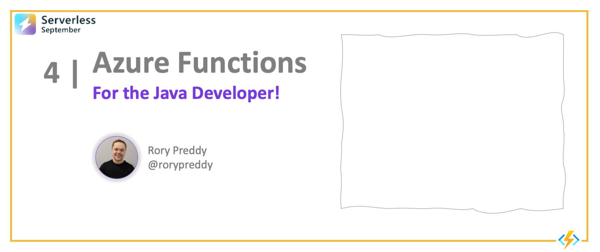

<head>
  <meta name="twitter:url" 
    content="https://azure.github.io/Cloud-Native/blog/04-functions-java" />
  <meta name="twitter:title" 
    content="Azure Functions: For The Java Developer" />
  <meta name="twitter:description" 
    content="#30DaysOfServerless: Azure Functions For The Java Developer" />
  <meta name="twitter:image"
    content="https://azure.github.io/Cloud-Native/assets/images/post-kickoff-4a04995b44f0cc4a784fb4ab5e29cf7c.png" />
  <meta name="twitter:card" content="summary_large_image" />
  <meta name="twitter:creator" 
    content="@nitya" />
  <meta name="twitter:site" content="@AzureAdvocates" /> 
  <link rel="canonical" 
    href="https://azure.github.io/Cloud-Native/blog/04-functions-java" />
</head>

---

Welcome to `Day 4` of #30DaysOfServerless!

We're reaching the half-way mark for the week, and today we want to talk about Azure Functions for the _Java_ developer! By the end of this article, you should know how to setup your local environment for Azure Functions, and built and deployed your first Functions app, and get a sense for what you can build with it next.

---

## What We'll Cover
 * **Quickstart**: Create a Java Functions App
 * **Preview**: Run your Functions App locally
 * **Deploy**: Run your Functions App on Azure
 * **Usage**: Explore scenarios and next steps!
 * **Exercise:** [Develop Java serverless Functions on Azure using Maven](https://docs.microsoft.com/learn/modules/develop-azure-functions-app-with-maven-plugin/) 
 * **Resources**: Check out [Java at Microsoft](https://developer.microsoft.com/en-us/java/) and use [Java Your Way](https://aka.ms/JavaYourWay)!



---

## 1. Create The App

In today's post, we'll walk through the [Quickstart: Azure Functions](https://docs.microsoft.com/en-gb/azure/azure-functions/create-first-function-vs-code-java) tutorial using Visual Studio Code. In the process, we'll setup our development environment with the relevent command-line tools and VS Code extensions required to make building and deploying Functions apps fairly painless.

_Note: Completing this exercise may incur a a cost of a few USD cents based on your Azure subscription. Explore [pricing details](https://azure.microsoft.com/en-us/pricing/details/functions/#pricing) to learn more_.

First, make sure you have your development environment setup and configured.

:::info PRE-REQUISITES

 1. **An Azure account with an active subscription** - [Create an account for free](https://azure.microsoft.com/free/?ref=microsoft.com&utm_source=microsoft.com&utm_medium=docs&utm_campaign=visualstudio)
 2. **The Java Development Kit, version 11 or 8.** - [Install](https://docs.microsoft.com/azure/developer/java/fundamentals/java-support-on-azure)
 3. **Apache Maven, version 3.0 or above.** - [Install](https://maven.apache.org/)
 4. **Visual Studio Code.** - [Install](https://code.visualstudio.com/)
 5. **The Java extension pack** - [Install](https://marketplace.visualstudio.com/items?itemName=vscjava.vscode-java-pack)
 6. **The Azure Functions extension for Visual Studio Code** - [Install](https://marketplace.visualstudio.com/items?itemName=ms-azuretools.vscode-azurefunctions)
:::

First, open a command-line terminal and create a folder for your project. Then use the `code` command to launch Visual Studio Code from that directory.

1. Now, open a terminal, to create and change into a new directory:

    ```bash
    $ mkdir java-function-resource-group-api
    $ cd java-function-resource-group-api
    $ code .
    ```

2. Open the Visual Studio Command Palette (<kbd>Ctrl</kbd> + <kbd>Shift</kbd> + <kbd>p</kbd>)

    

3. Enter `Azure Functions: create new project`. Use the following table to finish the prompts:

    |Prompt|Value|
    |--|--|
    |**Choose the directory location.**|You should either create a new folder or choose an empty folder for the project workspace. Don't choose a project folder that is already part of a workspace.|
    |**Select a language**| Choose `Java`.|
    |**Select a version of Java**| Choose `Java 11` or `Java 8`, the Java version on which your functions run in Azure. Choose a Java version that you've verified locally. |
    | **Provide a group ID** | Choose `com.function`. |
    | **Provide an artifact ID** | Choose `myFunction`. |
    | **Provide a version** | Choose `1.0-SNAPSHOT`. |
    | **Provide a package name** | Choose `com.function`. |
    | **Provide an app name** | Choose `HttpExample`. |
    | **Select the build tool for Java project** | Choose `Maven`. |


Visual Studio Code uses the provided information and generates an Azure Functions project. You can view the local project files in the Explorer.

## 2. Preview The App


Visual Studio Code integrates with the Azure Functions Core tools to let you run this project on your local development computer before you publish to Azure.

1. To build and run the application, use the following Maven command. You should see output similar to that shown below.

  ```bash
  $ mvn clean package azure-functions:run
  ..
  ..
  Now listening on: http://0.0.0.0:7071
  Application started. Press Ctrl+C to shut down.

  Http Functions:

    HttpExample: [GET,POST] http://localhost:7071/api/HttpExample
  ...
  ```

2. Copy the URL of your HttpExample function from this output to a browser and append the query string **?name=<YOUR_NAME>**, making the full URL something like `http://localhost:7071/api/HttpExample?name=Functions`. The browser should display a message that echoes back your query string value. The terminal in which you started your project also shows log output as you make requests.

1. With the **Terminal** panel focused, press <kbd>Ctrl + C</kbd> to stop Core Tools and disconnect the debugger.

After you've verified that the function runs correctly on your local computer, it's time to use Visual Studio Code and Maven to publish and test the project on Azure.

## 3. Sign into Azure

Before you can deploy, sign in to your Azure subscription.

```bash
az login
```

The az login command signs you into your Azure account.

Use the following command to deploy your project to a new function app.

```bash
mvn clean package azure-functions:deploy
```

When the creation is complete, the following Azure resources are created in your subscription:

* Resource group. Named as java-functions-group.
* Storage account. Required by Functions. The name is generated randomly based on Storage account name requirements.
* Hosting plan. Serverless hosting for your function app.The name is *java-functions-app-service-plan*.
* Function app. A function app is the deployment and execution unit for your functions. The name is randomly generated based on your artifactId, appended with a randomly generated number.


## 4. Deploy to Azure

1. Back in the **Resources** area in the side bar, expand your subscription, your new function app, and **Functions**. Right-click (Windows) or <kbd>Ctrl -</kbd> click (macOS) the `HttpExample` function and choose **Execute Function Now...**.

    

2. In **Enter request body** you see the request message body value of `{ "name": "Azure" }`. Press Enter to send this request message to your function.

3. When the function executes in Azure and returns a response, a notification is raised in Visual Studio Code.

You can also copy the complete Invoke URL shown in the output of the publish command into a browser address bar, appending the query parameter ?name=Functions. The browser should display similar output as when you ran the function locally.

## 5. Clean up resources

Use the following command to delete the resource group and all its contained resources to avoid incurring further costs.

```bash
az group delete --name java-functions-group
```


## Exercise

Time to put this into action and validate your development workflow:
 * Walk through this tutorial yourself, and deploy your first function!
 * Complete the [Develop Java serverless Functions on Azure using Maven](https://docs.microsoft.com/learn/modules/develop-azure-functions-app-with-maven-plugin/) module

## Resources
 * [Azure Functions: Java Quickstarts](https://docs.microsoft.com/en-us/azure/azure-functions/create-first-function-vs-code-java)
 * [Best Practices for Java Apps On Azure](https://docs.microsoft.com/en-us/learn/paths/best-practices-java-azure/)
 * [Java at Microsoft](https://developer.microsoft.com/en-us/java/) 
 * [Java with EventHub Trigger and CosmosDB Binding](https://docs.microsoft.com/en-us/azure/azure-functions/functions-event-hub-cosmos-db?tabs=bash)
 * [Java Integrations: Azure Functions and SignalR](https://docs.microsoft.com/en-us/azure/azure-signalr/signalr-quickstart-azure-functions-java?toc=%2Fazure%2Fazure-functions%2Ftoc.json)
 * [Java Samples: Azure Functions](https://docs.microsoft.com/en-us/samples/browse/?products=azure-functions&languages=java)
