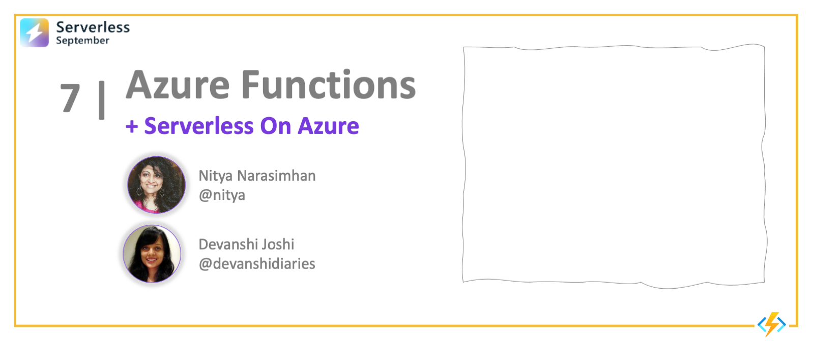

<head>
  <meta name="twitter:url" 
    content="https://azure.github.io/Cloud-Native/blog/functions-1" />
  <meta name="twitter:title" 
    content="#30DaysOfServerless: Azure Functions Fundamentals" />
  <meta name="twitter:description" 
    content="#30DaysOfServerless: Azure Functions Fundamentals" />
  <meta name="twitter:image"
    content="https://azure.github.io/Cloud-Native/img/banners/post-kickoff.png" />
  <meta name="twitter:card" content="summary_large_image" />
  <meta name="twitter:creator" 
    content="@nitya" />
  <meta name="twitter:site" content="@AzureAdvocates" /> 
  <link rel="canonical" 
    href="https://azure.github.io/Cloud-Native/blog/08-functions-azure" />
</head>

---
:::warning SEP 08: CHANGE IN PUBLISHING SCHEDULE

Starting from Week 2 (Sep 8), we'll be publishing blog posts in _batches_ rather than on a daily basis, so you can read a series of related posts together. _Don't want to miss updates?_ Just [subscribe to the feed](https://azure.github.io/Cloud-Native/blog/rss.xml)
:::

---

Welcome to `Day 8` of #30DaysOfServerless!

The theme for this week is Azure Functions. We'll talk about ...

## What We'll Cover
 * Section 1
 * Section 2
 * Section 3
 * Section 4
 * Exercise: Try this yourself!
 * Resources: For self-study!

---

## Section 1

## Section 2

## Section 3

## Section 4

## Exercise

## Resources