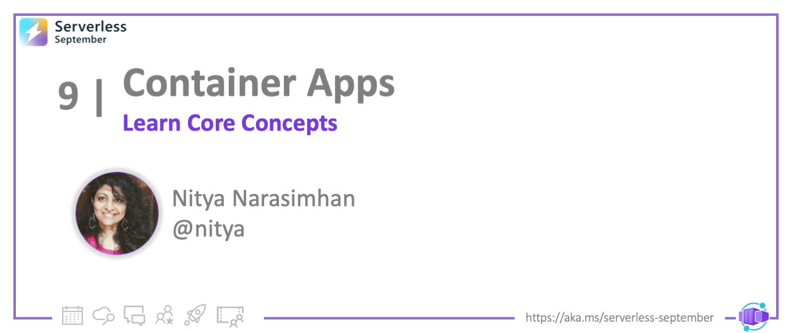

<head>
  <meta name="twitter:url" 
    content="https://azure.github.io/Cloud-Native/blog/09-aca-fundamentals" />
  <meta name="twitter:title" 
    content="#30DaysOfServerless: Introduction to Container Apps Core Concepts" />
  <meta name="twitter:description" 
    content="#30DaysOfServerless: Introduction to Container Apps Core Concepts" />
  <meta name="twitter:image"
    content="https://azure.github.io/Cloud-Native/img/banners/post-kickoff.png" />
  <meta name="twitter:card" content="summary_large_image" />
  <meta name="twitter:creator" 
    content="@nitya" />
  <meta name="twitter:site" content="@AzureAdvocates" /> 
  <link rel="canonical" 
    href="https://azure.github.io/Cloud-Native/blog/09-aca-fundamentals" />
</head>

---

Welcome to `Day 9` of #30DaysOfServerless!

---

## What We'll Cover
 * The Week Ahead
 * Hello, Container Apps!
 * Quickstart: Build Your First ACA!
 * Under The Hood: Core ACA Concepts
 * Exercise: Try this yourself!
 * Resources: For self-study!



---

## The Week Ahead

Welcome to Week 2 of #ServerlessSeptember, where we put the focus on **Microservices** and building Cloud Native applications that are optimized for **serverless** solutions on Azure. One week is not enough to do this complex topic justice so consider this a 7-part jumpstart to the longer journey.

 1. **Hello, Container Apps (ACA)** - Learn about Azure Container Apps, a key service that helps you _run microservices and containerized apps on a serverless platform_. Know the core concepts. (_Tutorial 1: First ACA_)
 2. **Communication with Microservices** - Dive deeper into two key concepts: _environments_ and _virtual networking_. Learn how microservices communicate in ACA, and walkthrough an example. _(Tutorial 2: ACA with 3 Microservices)_
 3. **Scaling Your Container Apps** - Learn about KEDA. Understand how to configure your ACA for auto-scaling with KEDA-supported triggers. Put this into action by walking through a tutorial. _(Tutorial 3: Configure Autoscaling_)
 4. **Hello, Distributed Application Runtime (Dapr)** - Learn about Dapr and how its _Building Block APIs_ simplify microservices development with ACA. Know how the _sidecar pattern_ enables incremental adoption of Dapr APIs without requiring any Dapr code integration in app. (_Tutorial 4: Setup & Explore Dapr_)
 5. **Building ACA with Dapr** - See how Dapr works with ACA by building a Dapr-enabled Azure Container App. Walk through a .NET tutorial using Pub/Sub and State Management APIs in an enterprise scenario. (_Tutorial 5: Build ACA with Dapr_)
 6. **Managing Secrets With Dapr** - We'll look at the Secrets API (a key Building Block of Dapr) and learn how it simplifies management of sensitive information in ACA.
 7. **Microservices + Serverless On Azure** - We recap Week 2 (_Microservices_) and set the stage for Week 3 ( _Integrations_) of Serverless September. Plus, self-study resources including ACA development tutorials in different languages.

Ready? Let's go!

---

## Azure Container Apps!

When building your application, your first decision is about _where you host your application_. The [Azure Architecture Center has a handy chart](https://docs.microsoft.com/azure/architecture/guide/technology-choices/compute-decision-tree?WT.mc_id=javascript-74010-ninarasi) to help you decide between choices like Azure Functions, Azure App Service, Azure Container Instances, Azure Container Apps and more. But if you are new to this space, you'll need a good understanding of the terms and concepts behind the services Today, we'll focus on _Azure Container Apps_ (ACA) - so let's start with the fundamentals.


### Containerized App Defined

A containerized app is one where the application components, dependencies, and configuration, are packaged into a single file (**container image**), which can be instantiated in an isolated runtime environment (**container**) that is portable across hosts (OS). This makes containers lightweight and scalable - and ensures that applications behave consistently on different host platforms.

Container images can be shared via  **container registries** (public or private) helping developers discover and deploy related apps with less effort. **Scaling** a containerized app can be as simple as activating more instances of its container image. However, this requires **container orchestrators** to automate the management of container apps for efficiency. Orchestrators use technologies like Kubernetes to support capabilities like _workload scheduling, self-healing and auto-scaling on demand_.

### Cloud Native & Microservices

Containers are seen as one of the [5 pillars of Cloud Native app development](https://techcommunity.microsoft.com/t5/apps-on-azure-blog/go-cloud-native-with-azure-container-apps/ba-p/3616407?WT.mc_id=javascript-74010-cxa), an approach where applications are designed explicitly to take advantage of the unique benefits of modern dynamic environments (involving public, private and hybrid clouds). Containers are particularly suited to **serverless solutions based on microservices**.

 * _With serverless_ - developers use **managed services** instead of managing their own infrastructure. Services are typically event-driven and can be configured for autoscaling with rules tied to event triggers. Serverless is cost-effective, with developers paying only for the compute cycles and resources they use.
 * _With microservices_ - developers **compose their applications from independent components**. Each component can be deployed in its own container, and scaled at that granularity. This simplifies component reuse (across apps) and maintainability (over time) - with developers evolving functionality at microservice (vs. app) levels.

### Hello, Azure Container Apps!

Azure Container Apps is the managed service that helps you run containerized apps and microservices as a serverless compute solution, on Azure. You can:

 * **deploy serverless API endpoints** - autoscaled by HTTP request traffic
 * **host background processing apps** - autoscaled by CPU or memory load
 * **handle event-driven processing** - autoscaled by #messages in queue
 * **run microservices** - autoscaled by any KEDA-supported scaler.

Want a quick intro to the topic? Start by watching the short video below - then read these two posts from our _ZeroToHero_ series:
 * [Go cloud native with Azure Container Apps](https://techcommunity.microsoft.com/t5/apps-on-azure-blog/go-cloud-native-with-azure-container-apps/ba-p/3616407?WT.mc_id=javascript-74010-cxa) - also see [the illustrated guide](http://localhost:3000/Cloud-Native/assets/images/Go-Cloud-Native-f6ac3225c3d9741a1fbff81030f7f830.png)
 * [Journey to the cloud with Azure Container Apps](https://techcommunity.microsoft.com/t5/apps-on-azure-blog/journey-to-the-cloud-with-azure-container-apps/ba-p/3622609?WT.mc_id=javascript-74010-cxa) - for developer tooling options.

<iframe width="600" height="400" src="https://www.youtube.com/embed/b3dopSTnSRg" title="How to Build and Deliver Apps Fast and Scalable with Azure Container Apps" frameborder="0" allow="accelerometer; autoplay; clipboard-write; encrypted-media; gyroscope; picture-in-picture" allowfullscreen></iframe>

---

## Deploy Your First ACA

### Dev Options

We typically have **three options** for development:
 * Use the [Azure Portal](https://docs.microsoft.com/azure/container-apps/get-started-existing-container-image-portal?pivots=container-apps-private-registry) - provision and deploy from a browser.
 * Use [Visual Studio Code](https://docs.microsoft.com/azure/container-apps/deploy-visual-studio-code) (with relevant extensions) - if you prefer an IDE
 * Using [Azure CLI](https://docs.microsoft.com/azure/container-apps/get-started-existing-container-image?tabs=bash&pivots=container-apps-private-registry) - if you prefer to build and deploy from command line.

The documentation site has quickstarts for three contexts:
 * [using a sample container image](https://docs.microsoft.com/azure/container-apps/quickstart-portal) - pre-existing example on Azure for convenience
 * [using a custom container image](https://docs.microsoft.com/azure/container-apps/get-started-existing-container-image-portal?pivots=container-apps-private-registry) - to understand container registry usage
 * [using code on your local machine](https://docs.microsoft.com/azure/container-apps/quickstart-code-to-cloud?tabs=bash%2Ccsharp&pivots=acr-remote) - to start from source repo

For this quickstart, we'll go with the first option (sample image) so we can move quickly to core concepts. We'll leave the others as an exercise for you to explore.

### 1. Setup Resources

:::info PRE-REQUISITES
You need:
 * An Azure account with an active subscription
 * An installed [Azure CLI](https://docs.microsoft.com/cli/azure/install-azure-cli)
:::

Start by logging into Azure from the CLI. The command should launch a browser to complete the auth flow (or give you an option to take an alternative path).

```bash
$ az login
```

Successful authentication will result in extensive command-line output detailing the status of your subscription. 

Next, install the Azure Container Apps extension for the CLI

```bash
$ az extension add --name containerapp --upgrade
...
The installed extension 'containerapp' is in preview.
```

Once successfully installed, register the `Microsoft.App` namespace.

```bash
$ az provider register --namespace Microsoft.App
```

Then set local _environment variables_ in that terminal - and verify they are set correctly:

```bash
$ RESOURCE_GROUP="my-container-apps"
$ LOCATION="canadacentral"
$ CONTAINERAPPS_ENVIRONMENT="my-environment"

$ echo $LOCATION $RESOURCE_GROUP $CONTAINERAPPS_ENVIRONMENT
canadacentral my-container-apps my-environment
```

Now you can use Azure CLI to provision a _resource group_ for this tutorial. Creating a resource group also makes it easier for us to delete/reclaim all resources used at the end of this tutorial.

```bash
az group create \
  --name $RESOURCE_GROUP \
  --location $LOCATION
```

:::success Congratulations

You completed the Setup step!

On completion, the console should print out the details of the newly created resource group. You should also be able to visit the Azure Portal and find the newly-active `my-container-apps` resource group under your active subscription.

:::

### 2. Create Environment

An environment is like the picket fence around your property. It creates a _secure boundary_ that contains a group of container apps - such that all apps deployed to it share the same virtual network and logging resources.

```bash
$ az containerapp env create \
  --name $CONTAINERAPPS_ENVIRONMENT \
  --resource-group $RESOURCE_GROUP \
  --location $LOCATION

No Log Analytics workspace provided.
Generating a Log Analytics workspace with name ...
```
This can take a few minutes. When done, you will see the terminal display more details. You can also check the resource group in the portal and see that a _Container Apps Environment_ and a _Log Analytics Workspace_ are created for you as part of this step.

You've got the fence set up. Now it's time to build your home - er, container app!

### 3. Create Container App

Here's the command we'll use to create our first Azure Container App. Note that the `--image` argument provides the link to a pre-existing `containerapps-helloworld` image. 

```bash
az containerapp create \
  --name my-container-app \
  --resource-group $RESOURCE_GROUP \
  --environment $CONTAINERAPPS_ENVIRONMENT \
  --image mcr.microsoft.com/azuredocs/containerapps-helloworld:latest \
  --target-port 80 \
  --ingress 'external' \
  --query properties.configuration.ingress.fqdn
...
...

Container app created. Access your app at <URL>
```

The `--ingress` property shows that the app is open to _external_ requests; in other words, it is publicly visible at the `<URL>` that is printed out on the terminal on successsful completion of this step.

### 4. Verify Deployment

Let's see if this works. You can verify that your container app by visitng the URL returned above in your browser. You should see something like this!


You can also visit the Azure Portal and look under the created Resource Group. You should see a new `Container App` type of resource was created after this step.

:::success Congratulations
You just created and deployed your first "Hello World" Azure Container App! This validates your local development environment setup and existence of a valid Azure subscription.
:::

### 5. Clean Up Your Resources

It's good practice to clean up resources once you are done with a tutorial. 

:::warning THIS ACTION IS IRREVERSIBLE
 This command deletes the resource group we created above - and all resources in it. So make sure you specified the right name, then confirm deletion.
:::


```bash
$ az group delete --name $RESOURCE_GROUP
Are you sure you want to perform this operation? (y/n): 
```

Note that you can also delete the resource group from the Azure Portal interface if that feels more comfortable. For now, we'll just use the Portal to verify that deletion occurred. If you had previously opened the Resource Group page for the created resource, just refresh it. You should see something like this:


---

## Core Concepts

:::info COMING SOON
An illustrated guide summarizing these concepts in a single sketchnote.
:::

We covered a lot today - we'll stop with a quick overview of core concepts behind Azure Container Apps, each linked to documentation for self-study. We'll dive into more details on _some_ of these concepts in upcoming articles:

 * [Environments](https://docs.microsoft.com/azure/container-apps/environment) - are the _secure boundary_ around a group of container apps that are deployed in the same virtual network. They write logs to a shared Log Analytics workspace and can communicate seamlessly using Dapr, if used.
 * [Containers](https://docs.microsoft.com/azure/container-apps/containers) refer to the _container image_ deployed in the Azure Container App. They can use any runtime, programming language, or development stack - and be discovered using any public or private container registry. A container app can support multiple containers.
 * [Revisions](https://docs.microsoft.com/azure/container-apps/revisions) are _immutable_ snapshots of an Azure Container App. The first revision is created when the ACA is first deployed, with new revisions created when redeployment occurs with [revision-scope changes](https://docs.microsoft.com/azure/container-apps/revisions#revision-scope-changes). Multiple revisions can run concurrently in an environment.
 * [Application Lifecycle Management](https://docs.microsoft.com/azure/container-apps/application-lifecycle-management) revolves around these revisions, with a container app having three phases: _deployment_, _update_ and _deactivation_.
 * [Microservices](https://docs.microsoft.com/azure/container-apps/microservices) are independent units of functionality in cloud native architectures. _A single container app typically represents a single microservice_, and can be composed from one or more containers. Microservices can now be scaled and upgraded indepedently, giving your application more flexbility and control.
 * [Networking](https://docs.microsoft.com/azure/container-apps/networking) architecture consist of a virtual network (VNET) associated with the environment. Unless you provide a custom VNET at environment creation time, a default VNET is automatically created. The VNET configuration determines access (ingress, internal vs. external) and can influence auto-scaling choices (e.g., use HTTP Edge Proxy and scale based on number of HTTP requests).
 * [Observability](https://docs.microsoft.com/azure/container-apps/observability) is about monitoring the health of your application and diagnosing it to improve reliability or performance. Azure Container Apps has a number of features - from Log streaming and Container console to integration with Azure Monitor - to provide a holistic view of application status over time.
 * [Easy Auth](https://docs.microsoft.com/azure/container-apps/authentication) is possible with built-in support for authentication and authorization including support for popular identity providers like Facebook, Google, Twitter and GitHub - alongside the Microsoft Identity Platform.

Keep these terms in mind as we walk through more tutorials this week, to see how they find application in real examples. Finally, a note on Dapr, the [Distributed Application Runtime](http://dapr.io) that abstracts away many of the challenges posed by distributed systems - and lets you focus on your application logic.

:::info DAPR INTEGRATION MADE EASY
 
[Dapr](https://docs.microsoft.com/azure/container-apps/dapr-overview?tabs=bicep1%2Cyaml) uses a sidecar architecture, allowing Azure Container Apps to communicate with Dapr Building Block APIs over either gRPC or HTTP. Your ACA can be built to run with or without Dapr - giving you the flexibility to _incrementally adopt_ specific APIs and unlock related capabilities as the need arises.
:::


In later articles this week, we'll do a deeper dive into Dapr and build our first Dapr-enable Azure Container App to get a better understanding of this integration.

## Exercise

Congratulations! You made it! By now you should have a good idea of what Cloud Native development means, why Microservices and Containers are important to that vision - and how Azure Container Apps helps simplify the building and deployment of _microservices based applications_ using _serverless architectures_ on Azure.

Now it's your turn to reinforce learning by doing.
 * Try walking through this quickstart yourself, but [using the Azure Portal](https://docs.microsoft.com/azure/container-apps/quickstart-portal) option.
 * Then try a [custom container image](https://docs.microsoft.com/azure/container-apps/deploy-visual-studio-code) option using Visual Studio Code, and validate your IDE-based setup for future tutorials.

## Resources

Three key resources to bookmark and explore:
 * [Azure Container Apps](https://docs.microsoft.com/azure/container-apps/) - documentation
 * [Distributed Application Runtime (Dapr)](https://docs.dapr.io/) - documentation
 * [Azure Container Apps](https://docs.microsoft.com/azure/container-apps/samples) - samples for exploration