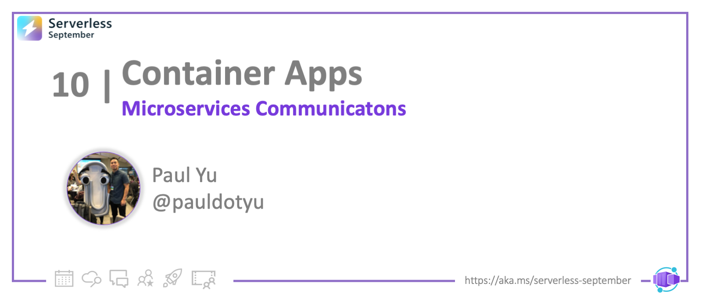
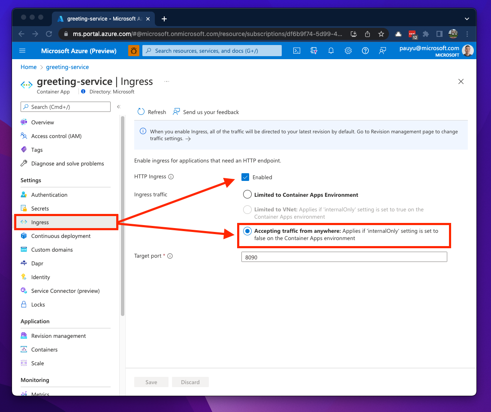
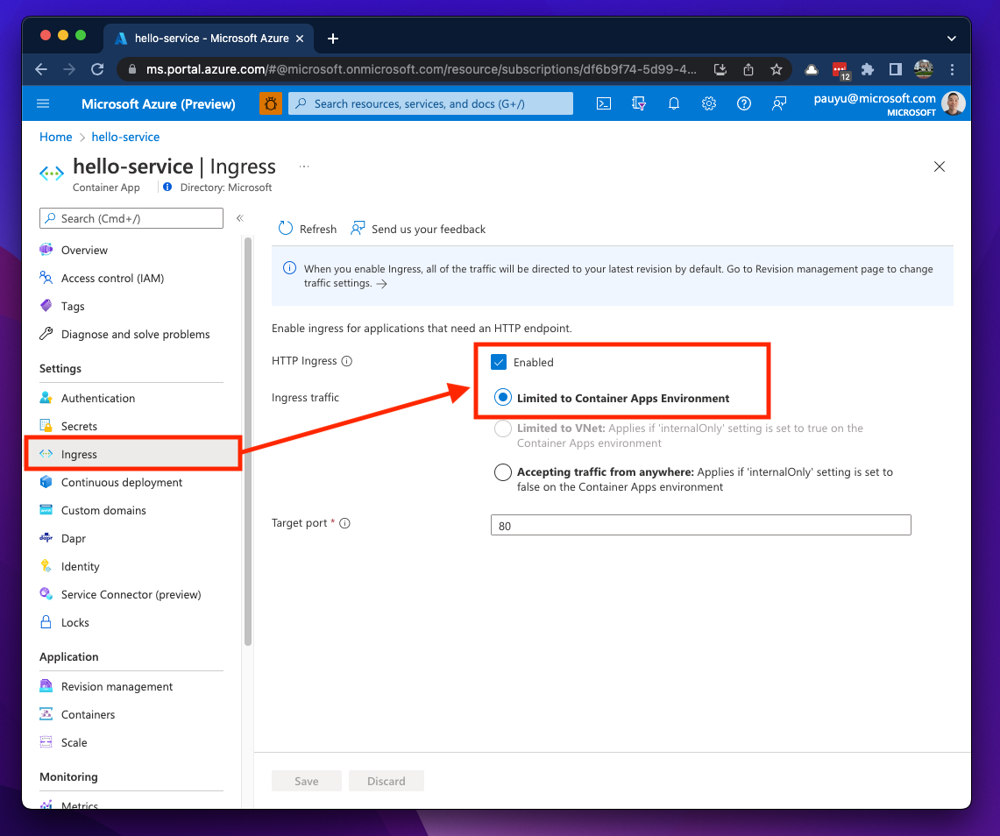
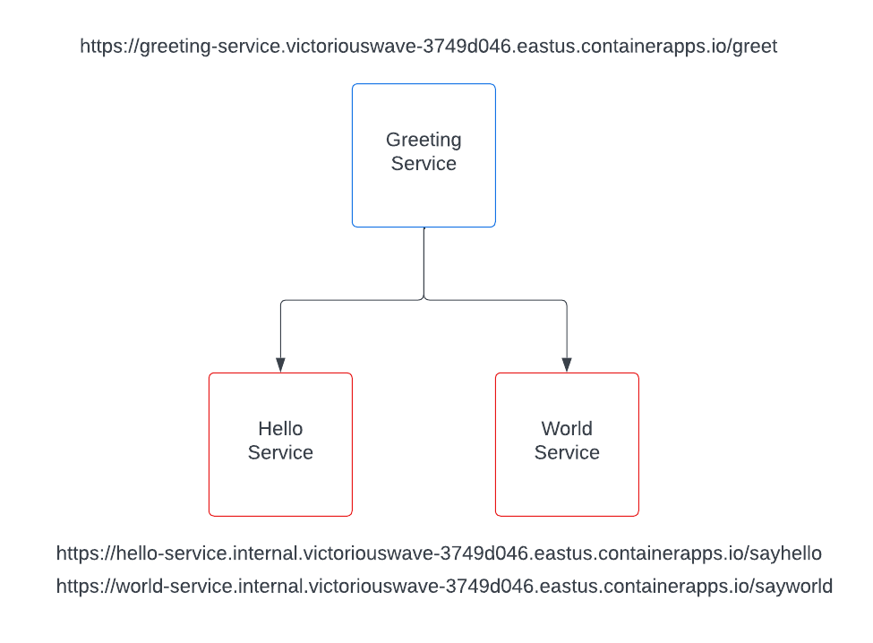
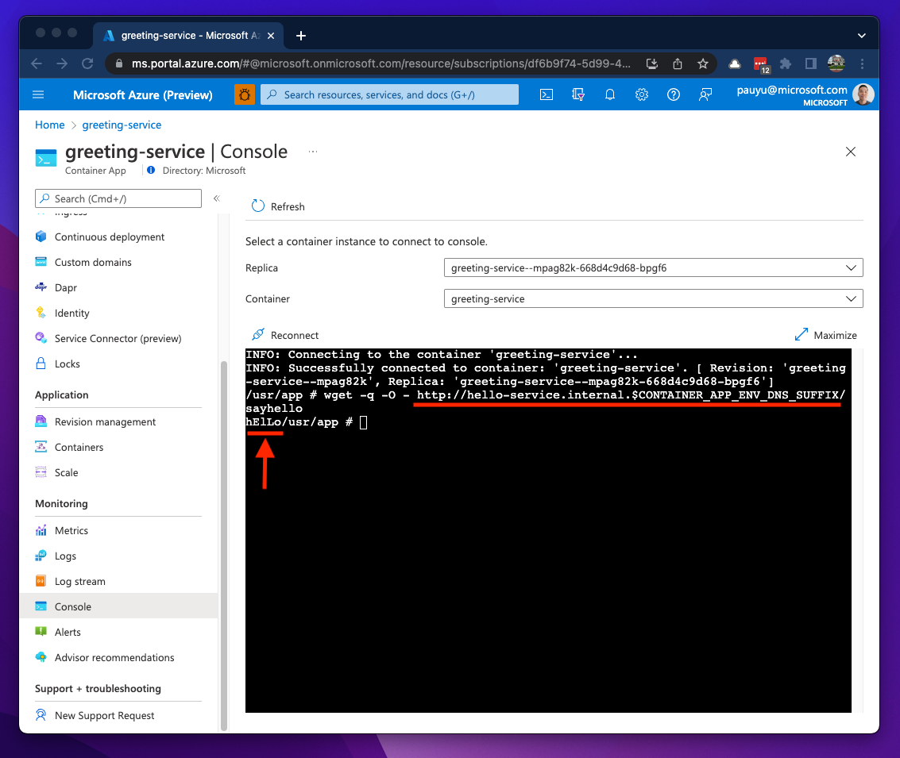
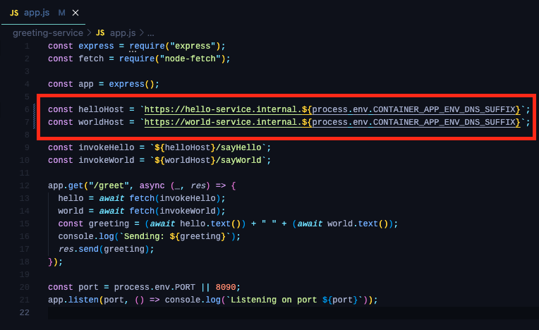
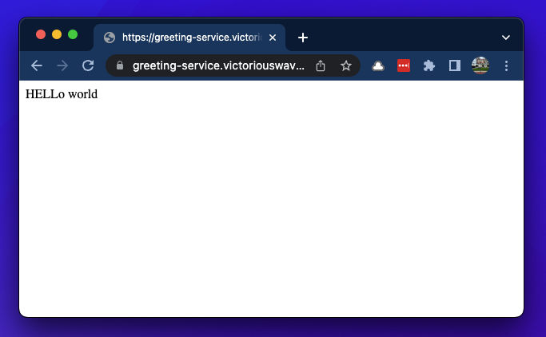

<head>
  <meta name="twitter:url" 
    content="https://azure.github.io/Cloud-Native/blog/functions-1" />
  <meta name="twitter:title" 
    content="#30DaysOfServerless: Azure Functions Fundamentals" />
  <meta name="twitter:description" 
    content="#30DaysOfServerless: Azure Functions Fundamentals" />
  <meta name="twitter:image"
    content="https://azure.github.io/Cloud-Native/img/banners/post-kickoff.png" />
  <meta name="twitter:card" content="summary_large_image" />
  <meta name="twitter:creator" 
    content="@nitya" />
  <meta name="twitter:site" content="@AzureAdvocates" /> 
  <link rel="canonical" 
    href="https://azure.github.io/Cloud-Native/blog/functions-1" />
</head>

---

Welcome to `Day 10` of #30DaysOfServerless!

The theme for this week is Azure Functions. We'll talk about what Functions is, and how to get started building your first Functions example in different languages. And we'll look at how Functions-as-a-Service helps build End-to-End Serverless Solutions

---

## What We'll Cover

- Section 1
- Section 2
- Section 3
- Section 4
- Exercise: Try this yourself!
- Resources: For self-study!

---

## Introduction

In yesterday's post, we learned what the Azure Container Apps (ACA) service is and the problems it aims to solve. It is considered to be a Container-as-a-Service platform since much of the complex implementation details of running a Kubernetes cluster is managed for you.

Some of the use cases for ACA include event-driven processing jobs and background tasks, but this article will focus on hosting microservices, and how they can communicate with each other within the ACA service. At the end of this article, you will have a solid understanding of how networking and communication is handled and will leave you with a few tutorials to try.

## Environments and virtual networking in ACA

Before we jump into microservices communication, we should review how networking works within ACA. With ACA being a managed service, Azure will take care of most of your underlying infrastructure concerns. As you provision an ACA resource, Azure provisions an Environment to deploy Container Apps into. This environment is your isolation boundary.

By default, Azure creates and manages a new Virtual Network (VNET) for you and the VNET is associated with the environment. As you deploy container apps, they are deployed into the same VNET and the environment is assigned a static public IP address which allows your apps to be accessible over the internet. This VNET is not visible or manageable.

If you need control of the networking flows within the VNET, you can pre-provision one and tell Azure to deploy an environment within it. This "bring-your-own" VNET model allows you to deploy an environment in either **External** or **Internal** modes. Deploying an environment in **External** mode gives you the flexibility of managing your own VNET, while still allowing your containers to be accessible from outside the environment; a static public IP address is assigned to the environment. When deploying in **Internal** mode, your containers are accessible within the environment and/or VNET but not accessible from the internet.

Bringing your own VNET will require some planning and you will need dedicate an empty subnet which will be used exclusively by the ACA environment. The size of your subnet will be dependant on how many containers you plan on deploying and your scaling requirements and one requirement to know is that the subnet address range must have have a `/23` CIDR prefix at minimum. You will also need to think about your deployment strategy since ACA has the concept of **Revisions** which will also consume IPs from your subnet.

Some additional restrictions to consider when planning your subnet address space is listed in the Resources section below and can be addressed in future posts, so be sure to follow us on [dev.to](https://dev.to/azure) and bookmark the [ServerlessSeptember](https://aka.ms/serverless-september) site.

## Basic microservices communication in ACA

When it comes to communications between containers, ACA addresses this concern with its **Ingress** capabilities. With **HTTP Ingress** enabled on your container app, you can expose your app on a HTTPS endpoint.

If your environment is deployed using default networking and your containers needs to be accessible from outside the environment, you will need to set the **Ingress traffic** option to **Accepting traffic from anywhere**. This will generate a Full-Qualified Domain Name (FQDN) which you can use to access your app right away. The ingress feature also generates and assigns a Secure Socket Layer (SSL) certificate for the FQDN.

If your environment is deployed using default networking and your containers only need to communicate with other containers in the environment, you'll need to set the **Ingress traffic** option to **Limited to Container Apps Environment**. You get a FQDN here as well, but in the section below we'll see how that changes.

As mentioned in the networking section above, if you deploy your ACA environment into a VNET in **internal** mode, your options will be **Limited to Container Apps Environment** or **Limited to VNet**.

> Note how the **Accepting traffic from anywhere** option is greyed out. If your VNET is deployed in **external** mode, then the option will be available.

## Let's walk though an example ACA deployment

The diagram below illustrates a simple microservices application that I deployed to ACA. The three container apps all have ingress enabled. The `greeting-service` app calls two backend services; a `hello-service` that returns the text **Hello** (in random casing) and a `world-service` that returns the text **World** (in a few random languages). The greeting-service concatenates the two strings together and returns **Hello World** to the browser. The greeting-service is the only service accessible via external ingress while two backend services are only accessible via internal ingress.

With ingress enabled, let's take a quick look at the FQDN structures. Here is the FQDN of the **external** greeting-service.

`https://greeting-service.victoriouswave-3749d046.eastus.azurecontainerapps.io`

We can break it down into these components:

`https://`**[YOUR-CONTAINER-APP-NAME]**`.`**[RANDOM-NAME]**`-`**[RANDOM-CHARACTERS]**`.`**[AZURE-REGION]**`.containerapps.io`

And here is the FQDN of the **internal** hello-service.

`https://hello-service.internal.victoriouswave-3749d046.eastus.azurecontainerapps.io`

Can you spot the difference between FQDNs?

That was too easy 😉... the word `internal` is added as a subdomain in the FQDN between your container app name and the random name for all internal ingress endpoints.

`https://`**[YOUR-CONTAINER-APP-NAME]**`.internal.`**[RANDOM-NAME]**`-`**[RANDOM-CHARACTERS]**`.`**[AZURE-REGION]**`.containerapps.io`

Now that we know the internal service FQDNs, we use them in the greeting-service app to achieve basic service-to-service communications.

So we can inject FQDNs of downstream APIs to upstream apps using environment variables, but the downside to this approach is that need to deploy downstream containers ahead of time and this dependency will need to be planned for during your deployment process. There are ways around this and one option is to leverage the auto-injected environment variables within your app code.

If I use the Console blade for the hello-service container app and run the `env` command, you will see environment variables named `CONTAINER_APP_NAME` and `CONTAINER_APP_ENV_DNS_SUFFIX`. You can use these values to determine FQDNs within your upstream app.

Back in the `greeting-service` container I can invoke the hello-service container's `sayhello` method. I know the container app name is hello-service and this service is exposed over an internal ingress, therefore, if I add the `internal` subdomain to the `CONTAINER_APP_ENV_DNS_SUFFIX` I can invoke a HTTP request to the hello-service from my greeting-service container.

As you can see, the ingress feature enables communications to other container apps over HTTP/S and ACA will inject environment variables into our container to help determine what the ingress FQDNs would be. All we need now is a little bit of code modification in the greeting-service app and build the FQDNs of our backend APIs by retrieving these environment variables.

... and now we have a working microservices app on ACA! 🎉

## Summary and next steps

We've covered Container Apps networking and the basics of how containers communicate with one another. However, there is a better way to address service-to-service invocation using Dapr, which is an open-source framework for building microservices. It is natively integrated into the ACA service and in a future post, you'll learn how to enable it in your Container App to address microservices concerns and more. So stay tuned!

## Exercises

As a takeaway for today's post, I encourage you to complete this [tutorial](https://docs.microsoft.com/azure/container-apps/communicate-between-microservices?tabs=bash&pivots=acr-remote) and if you'd like to deploy the sample app that was presented in this article, my teammate [@StevenMurawski](https://github.com/smurawski) is hosting a [docker-compose-examples](https://github.com/smurawski/docker-compose-examples) repo which includes samples for deploying to ACA using Docker Compose files. To learn more about the `az containerapp compose` command, a link to his blog articles are listed in the Resources section below.

If you have any questions or feedback, please let us know in the comments below or reach out on Twitter [@pauldotyu](https://twitter.com/pauldotyu)

Have fun packing and shipping containers! See you in the next post!

## Resources

- [Tutorial: Communication between microservices in Azure Container Apps](https://docs.microsoft.com/azure/container-apps/communicate-between-microservices?tabs=bash&pivots=acr-remote)
- [Tutorial: greeting-service (docker-compose-example)](https://github.com/smurawski/docker-compose-examples/tree/main/nodejs_greet)
- [Concept: Azure Container App Environments](https://docs.microsoft.com/azure/container-apps/environment)
- [Concept: Azure Container App Ingress](https://docs.microsoft.com/azure/container-apps/networking#http-edge-proxy-behavior)
- [Concept: Azure Container App VNET Restrictions](https://docs.microsoft.com/azure/container-apps/networking#restrictions)
- [Blog: Accelerating Azure Container Apps with the Azure CLI and Compose Files](https://techcommunity.microsoft.com/t5/apps-on-azure-blog/accelerating-azure-container-apps-with-the-azure-cli-and-compose/ba-p/3516636)
- [Blog: More Fun with Azure Container Apps and Compose Files](https://techcommunity.microsoft.com/t5/apps-on-azure-blog/more-fun-with-azure-container-apps-and-compose-files/ba-p/3570234)

> The sample app presented here was inspired by services demonstrated in the book [Introducing Distributed Application Runtime (Dapr): Simplifying Microservices Applications Development Through Proven and Reusable Patterns and Practices](https://www.amazon.com/Introducing-Distributed-Application-Runtime-Dapr/dp/1484269977). Go check it out to leran more about Dapr!

<!-- hidden links -->

[vnets]: https://docs.microsoft.com/azure/virtual-network/virtual-networks-overview
[nsg]: https://docs.microsoft.com/azure/virtual-network/network-security-groups-overview
[vnet-peering]: https://docs.microsoft.com/azure/virtual-network/virtual-network-peering-overview
[aca-external-vnet]: https://docs.microsoft.com/azure/container-apps/vnet-custom?tabs=bash&pivots=azure-cli
[aca-internal-vnet]: https://docs.microsoft.com/azure/container-apps/vnet-custom-internal?tabs=bash&pivots=azure-cli
[aca-console]: https://docs.microsoft.com/azure/container-apps/observability?tabs=bash#container-console
