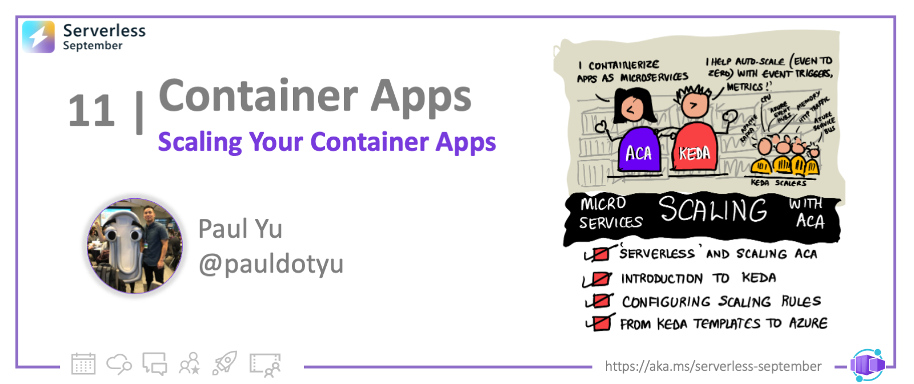
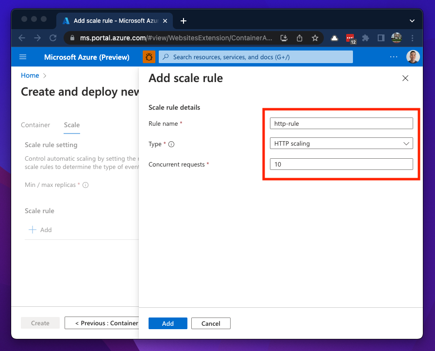
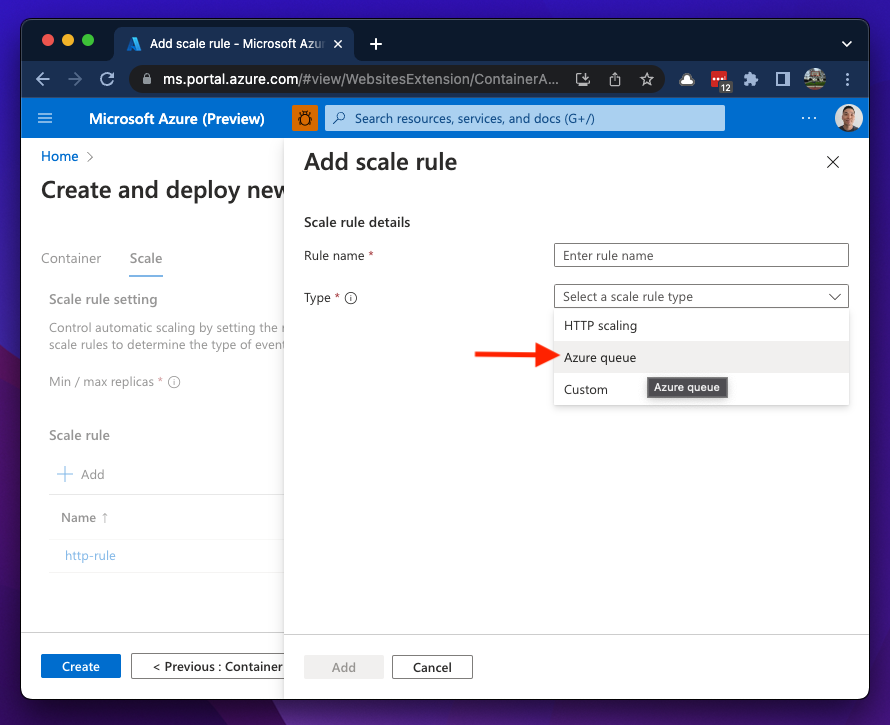
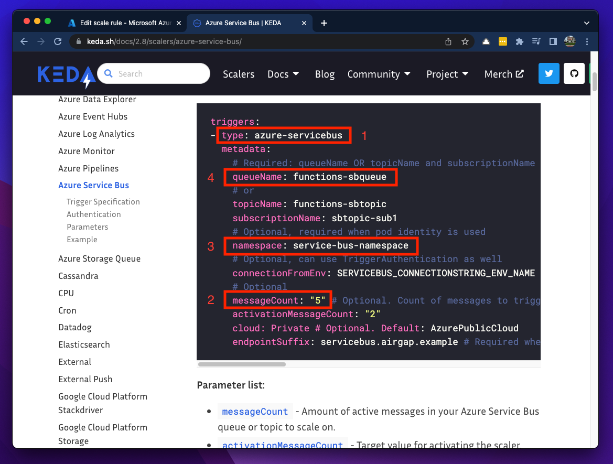
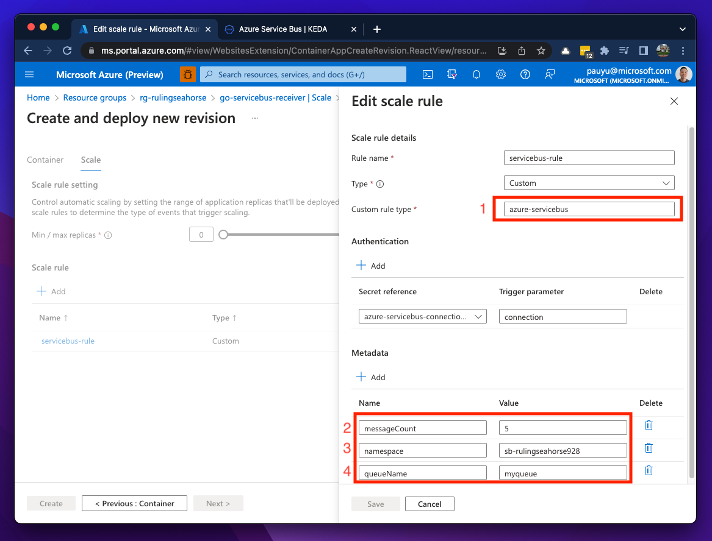

<!-- FIXME -->
<head>
  <meta name="twitter:url" 
    content="https://azure.github.io/Cloud-Native/blog/functions-1" />
  <meta name="twitter:title" 
    content="#30DaysOfServerless: Azure Functions Fundamentals" />
  <meta name="twitter:description" 
    content="#30DaysOfServerless: Azure Functions Fundamentals" />
  <meta name="twitter:image"
    content="https://azure.github.io/Cloud-Native/img/banners/post-kickoff.png" />
  <meta name="twitter:card" content="summary_large_image" />
  <meta name="twitter:creator" 
    content="@nitya" />
  <meta name="twitter:site" content="@AzureAdvocates" /> 
  <link rel="canonical" 
    href="https://azure.github.io/Cloud-Native/blog/08-functions-azure" />
</head>

---

Welcome to `Day 11` of #30DaysOfServerless!

---

## What We'll Cover
 * Section 1
 * Section 2
 * Section 3
 * Section 4
 * Exercise: Try this yourself!
 * Resources: For self-study!

---

## So, what makes Azure Container Apps "serverless"?

Today we are going to focus on what makes Azure Container Apps (ACA) a "serverless" offering. But what does the term "*serverless*" really mean? As much as we'd like to think there aren't any servers involved, that is certainly not the case. In general, "serverless" means that most (if not all) server maintenance has been abstracted away from you.

With serverless, you don't spend any time managing and patching servers. This concern is offloaded to Azure and you simply focus on adding business value through application delivery. In addition to operational efficiency, cost efficiency can be achieved with serverless on-demand pricing models. Your workload horizontally scales out based on need and you only pay for what you use. To me, this is **serverless**, and my teammate [@StevenMurawski](https://github.com/smurawski) said it best... "*being able to **scale to zero **is what gives ACA it's serverless magic*."

## Scaling your Container Apps

If you don't know by now, ACA is built on a solid open-source foundation. Behind the scenes, it runs on a managed Kubernetes cluster and includes several open-source components out-of-the box including [Dapr](https://dapr.io/) to help you build and run microservices, [Envoy Proxy](https://www.envoyproxy.io/) for ingress capabilities, and [KEDA](https://keda.sh/) for event-driven autoscaling. Again, you do not need to install these components yourself. All you need to be concerned with is enabling and/or configuring your container app to leverage these components.

Let's take a closer look at autoscaling in ACA to help you optimize your container app.

### What is KEDA?

KEDA stands for **K**ubernetes **E**vent-**D**riven **A**utoscaler. It is an open-source project initially started by Microsoft and Red Hat and has been donated to the [Cloud Native Computing Foundation (CNCF)](https://www.cncf.io/). It is being maintained by a [community of 200+ contributors and adopted by many large organizations](https://keda.sh/community/). In terms of its status as a CNCF project it is currently in the [**Incubating Stage**](https://github.com/cncf/toc/blob/main/process/graduation_criteria.md#incubating-stage) which means the project has gone through significant due diligence and on its way towards the [**Graduation Stage**](https://github.com/cncf/toc/blob/main/process/graduation_criteria.md#graduation-stage).

Prior to KEDA, horizontally scaling your Kubernetes deployment was achieved through the [Horizontal Pod Autoscaler (HPA)](https://kubernetes.io/docs/tasks/run-application/horizontal-pod-autoscale/) which relies on resource metrics such as CPU and memory to determine when additional replicas should be deployed. Being limited to CPU and memory falls a bit short for certain workloads. This is especially true for apps that need to processes messages from a queue or HTTP-based apps that can handle a specific amount of incoming HTTP requests at a time. KEDA aims to fill that gap and provides a much more robust framework for scaling by working in conjunction with HPA. It offers many [scalers](https://keda.sh/docs/scalers/) for you to implement and even allows your deployments to **scale to zero**! 🥳

### Configuring ACA scale rules

As I mentioned above, ACA's autoscaling feature leverages KEDA and gives you the ability to configure the number of replicas to deploy based on rules (event triggers). The number of replicas can be configured as a static number or a range (minimum and maximum). So if you need your containers to run 24/7, set the min and max to be the same value. By default, when you deploy a container app, it is set to scale from 0 to 10 replicas. The default scaling rule uses **HTTP scaling** and defaults to a [minimum of 10 concurrent requests](https://docs.microsoft.com/azure/container-apps/scale-app#http) per second. Once the threshold of 10 concurrent request per second is met, another replica will be deployed until it reaches the maximum number of replicas.

> At the time of this writing, a container app can have up to 30 replicas.

As a best practice, if you have a **Min / max replicas** range configured, you should configure a scaling rule even if it is just explicitly setting the default values.

In addition to **HTTP scaling**, you can also configure an **Azure queue** rule, which allows you to use [Azure Storage Queues](https://docs.microsoft.com/azure/storage/queues/storage-queues-introduction) as an event data source.

The most flexibility comes with the **Custom** rule type. This opens up a LOT more options for scaling. All of [KEDA's event-based scalers](https://keda.sh/docs/scalers/) are supported with this option 🚀

### Translating KEDA templates to Azure templates

When you implement **Custom** rules, you need to become familiar with translating KEDA templates to [Azure Resource Manager templates](https://docs.microsoft.com/azure/container-apps/azure-resource-manager-api-spec?tabs=arm-template) or [ACA YAML manifests](https://docs.microsoft.com/azure/container-apps/azure-resource-manager-api-spec?tabs=yaml). The [KEDA scaler](https://keda.sh/docs/scalers/) documentation is great and it should be simple to translate KEDA template `metadata` to an ACA rule `metadata`.

The images below shows how to translated a scaling rule which uses Azure Service Bus as an event data source. The custom rule type is set to `azure-servicebus` and details of the service bus is added to the Metadata section. One important thing to note here is that the connection string to the service bus was added as a secret on the container app and the trigger parameter must be set to `connection`.

Additional examples of KEDA scaler conversion can be found in the resources section and example video below.

## See Container App scaling in action

Now that we've built up some foundational knowledge on how ACA autoscaling is implemented and configured, let's look at a few examples.

### Autoscaling based on HTTP traffic load

<iframe src="https://player.vimeo.com/video/746678347?h=8f5ada4431&amp;badge=0&amp;autopause=0&amp;player_id=0&amp;app_id=58479" frameborder="0" allow="autoplay; fullscreen; picture-in-picture" allowfullscreen style={{ position:'absolute', top:0, left:0, width:'100%', height:'100%' }} title="http-scaling"></iframe>

### Autoscaling based on Azure Service Bus message queues

<iframe src="https://player.vimeo.com/video/746678266?h=89701121ed&amp;badge=0&amp;autopause=0&amp;player_id=0&amp;app_id=58479" frameborder="0" allow="autoplay; fullscreen; picture-in-picture" allowfullscreen style={{ position:'absolute' ,top:0, left:0, width:'100%', height:'100%' }} title="event-driven-scaling.mp4"></iframe>

## Summary

ACA brings you a true serverless experience and gives you the ability to configure autoscaling rules based on KEDA scaler templates. This gives you flexibility to scale based on a wide variety of data sources in an event-driven manner. With the amount built-in scalers currently available, there is probably a scaler out there for all your use cases. If not, I encourage you to get involved with the [KEDA community](https://keda.sh/community/) and help make it better!

## Exercise

By now, you've probably read and seen enough and now ready to give this autoscaling thing a try. The example I walked through in the videos above can be found at the [azure-opensource-labs](https://aka.ms/oss-labs) repo. I highly encourage you to head over to the [containerapps-terraform](https://github.com/Azure-Samples/azure-opensource-labs/tree/main/cloud-native/containerapps-terraform) folder and try the lab out. There you'll find instructions which will cover all the steps and tools you'll need implement autoscaling container apps within your own Azure subscription.

If you have any questions or feedback, please let us know in the comments below or reach out on Twitter [@pauldotyu](https://twitter.com/pauldotyu)

Have fun scaling your containers!

## Resources

* [Set scaling rules in Azure Container Apps](https://docs.microsoft.com/azure/container-apps/scale-app)
* [Kubernetes Event-driven Autoscaling (KEDA)](https://keda.sh/)
* [KEDA Scalers](https://keda.sh/docs/scalers/)
* [KEDA scalers conversion](https://docs.microsoft.com/en-us/azure/container-apps/scale-app#keda-scalers-conversion)