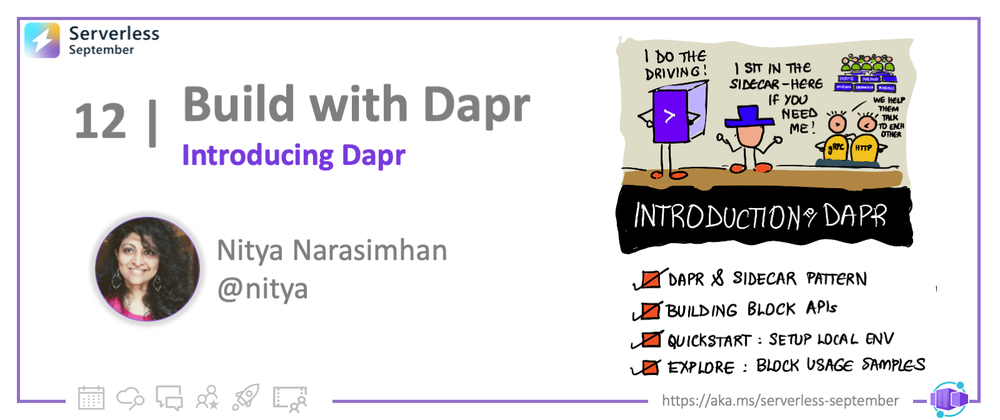

<head>
  <meta name="twitter:url" 
    content="https://azure.github.io/Cloud-Native/blog/12-build-with-dapr" />
  <meta name="twitter:title" 
    content="#30DaysOfServerless: Dapr Integration with ACA" />
  <meta name="twitter:description" 
    content="#30DaysOfServerless: Dapr Integration with ACA" />
  <meta name="twitter:image"
    content="https://azure.github.io/Cloud-Native/img/banners/post-kickoff.png" />
  <meta name="twitter:card" content="summary_large_image" />
  <meta name="twitter:creator" 
    content="@nitya" />
  <meta name="twitter:site" content="@AzureAdvocates" /> 
  <link rel="canonical" 
    href="https://azure.github.io/Cloud-Native/blog/12-build-with-dapr" />
</head>

---

Welcome to `Day 12` of #30DaysOfServerless!

So far we've looked at Azure Container Apps - what it is, how it enables microservices communication, and how it enables auto-scaling with KEDA compliant scalers. Today we'll shift gears and talk about Dapr - the Distributed Application Runtime - and how it makes microservices development with ACA _easier_ with core building blocks and a sidecar architecture!

Ready? Let's go!

---

## What We'll Cover
 * What is Dapr and why use it?
 * Building Block APIs
 * Dapr Quickstart and Tutorials
 * Dapr-enabled ACA: A Sidecar Approach
 * Exercise: Build & Deploy a Dapr-enabled ACA.
 * Resources: For self-study!



---


## Hello, Dapr! 

Building distributed applications is hard. Building **reliable and portable microservces** means having middleware that deals with challenges like service discovery, sync and async communications, state management, secure information sharing and more. Integrating these support services into your application can be challenging from both development and maintenance perspectives, adding complexity that is independent of the core application logic you want to focus on.

This is where [**Dapr (Distributed Application Runtime)**](https://dapr.io) shines - [it's defined as:](https://docs.dapr.io/):
>  a portable, event-driven runtime that makes it easy for any developer to build resilient, stateless and stateful applications that run on the cloud and edge and embraces the diversity of languages and developer frameworks. 

But what does this actually mean to me as an app developer? 

---

## Dapr + Apps: A Sidecar Approach

The strength of Dapr lies in its ability to:

 * abstract complexities of distributed systems middleware - with  **Building Block APIs** that implement components using best practices to tackle key challenges.
 * implement a **Sidecar Pattern** with interactions via APIs - allowing applications to keep their codebase clean and focus on app logic.
 * be **Incrementally Adoptable** - allowing developers to start by integrating one API, then evolving to use more as and when needed.
 * be **Platform Agnostic** - allowing applications to be developed in a preferred language or framework without impacting integration capabilities.

The application-dapr sidecar interaction is illustrated below. The API abstraction allows applications to get the desired functionality without having to know _how_ it was implemented, or without having to integrate Dapr-specific code into their codebase. Note how the sidecar process listens on port `3500` and the API provides clear routes for the specific building blocks supported by Dapr (e.g, `/secrets`, `/state` etc.)


---

## Dapr Building Blocks: API Interactions

Dapr Building Blocks refers to **HTTP and gRPC endpoints exposed by Dapr** API endpoints exposed by the Dapr sidecar, providing key capabilities like state management, observability, service-to-service invocation, pub/sub messaging and more to the associated application. 

| | **Building Blocks: Under the Hood**|
|:--|:--|
| | The Dapr API is implemented by [modular components](https://docs.dapr.io/concepts/building-blocks-concept/) that codify best practices for tackling the specific challenge that they represent. The API abstraction allows component implementations to evolve, or alternatives to be used , without requiring changes to the application codebase. |


The [latest Dapr release](https://docs.dapr.io/concepts/building-blocks-concept/) has the building blocks shown in the above figure. Not all capabilities are available to Azure Container Apps by default -  check the [documentation](https://learn.microsoft.com/azure/container-apps/dapr-overview?tabs=bicep1%2Cyaml#unsupported-dapr-capabilities) for the latest updates on this. For now, Azure Container Apps + Dapr integration provides the following capabilities to the application:
 
 * [Service-to-Service Invocation](https://docs.dapr.io/developing-applications/building-blocks/service-invocation/service-invocation-overview/) for synchronous communications
 * [State management](https://docs.dapr.io/developing-applications/building-blocks/state-management/state-management-overview/) for transactions and CRUD operations
 * [Pub/Sub messaging](https://docs.dapr.io/developing-applications/building-blocks/pubsub/pubsub-overview) for asynchronous (message-driven) communications
 * [Bindings](https://docs.dapr.io/developing-applications/building-blocks/bindings/bindings-overview/) for seamless workflow integrations using event triggers
 * [Actors](https://docs.dapr.io/developing-applications/building-blocks/actors/actors-overview/) for encapsulated & reusable objects that enable reliable, scalable behaviors
 * [Observability](https://learn.microsoft.com/azure/container-apps/observability) to monitor application events for health and performance

In the next section, we'll dive into Dapr-enabled Azure Container Apps. Before we do that, here are a couple of resources to help you explore the Dapr platform by itself, and get more hands-on experience with the concepts and capabilities:
 * [Dapr Quickstarts](https://docs.dapr.io/getting-started/quickstarts/) - build your first Dapr app, then explore quickstarts for a core APIs including service-to-service invocation, pub/sub, state mangement, bindings and secrets management.
 * [Dapr Tutorials](https://docs.dapr.io/getting-started/tutorials/) - go beyond the basic quickstart and explore more realistic service integrations and usage scenarios. Try the [distributed calculator](https://github.com/dapr/quickstarts/tree/master/tutorials/distributed-calculator) example!


## Integrate Dapr & Azure Container Apps

Dapr currently has a [v1.9 (preview)](https://v1-9.docs.dapr.io/) version, but Azure Container Apps supports [Dapr v1.8.3](https://learn.microsoft.com/azure/container-apps/dapr-overview#current-supported-dapr-version). In this section, we'll look at what it takes to enable, configure, and use, Dapr integration with Azure Container Apps. It involves 3 steps: _enabling_ Dapr using settings, _configuring_ Dapr components (API) for use, then invoking the APIs.

Here's a simple [a publisher-subscriber scenario](https://learn.microsoft.com/azure/container-apps/dapr-overview?tabs=bicep1%2Cyaml#dapr-settings) from the documentation. We have two Container apps identified as `publisher-app` and `subscriber-app` deployed in a single environment. Each ACA has an activated `daprd` sidecar, allowing them to use the _Pub/Sub_ API to communicate asynchronously with each other - without having to write the underlying pub/sub implementation themselves. Rather, we can see that the Dapr API uses a `pubsub,azure.servicebus` **component** to implement that capability.


Let's look at how this is setup.

### 1. [Enable Dapr in ACA: Settings](https://learn.microsoft.com/azure/container-apps/dapr-overview?tabs=bicep1%2Cyaml#enable-dapr) 

We can enable Dapr integration in the Azure Container App during creation by _specifying settings_ in one of two ways, based on your development preference:
 * **Using Azure CLI**: use custom commandline options for each setting
 * **Using Infrastructure-as-Code (IaC)**: using properties for Bicep, ARM templates

Once enabled, Dapr will run in the same _environment_ as the Azure Container App, and listen on **port 3500** for API requests. The Dapr sidecar can be shared my multiple Container Apps _deployed in the same environment_. 

There are four main settings - the example below shows the ARM template properties, but you can [find the equivalent CLI parameters here](https://learn.microsoft.com/azure/container-apps/dapr-overview?tabs=bicep1%2Cyaml#enable-dapr) for comparison.
 * `dapr.enabled` - enable Dapr for Azure Container App
 * `dapr.appPort` - specify port on which app is listening
 * `dapr.appProtocol` - specify if using `http` (default) or `gRPC` for API
 * `dapr.appId` - specify unique application ID for service discovery, usage

These are defined under the `properties.configuration` section for your resource. Changing Dapr settings does not update the revision but it _will_ restart ACA revisions and replicas. Here is what the relevant section of the ARM template looks like for the `publisher-app` ACA in the scenario shown above.

 ```json
 "dapr": {
    "enabled": true,
    "appId": "publisher-app",
    "appProcotol": "http",
    "appPort": 80
  }
 ```

### 2. [Configure Dapr in ACA:  Components](https://learn.microsoft.com/azure/container-apps/dapr-overview?tabs=bicep1%2Cyaml#configure-dapr-components)

The next step after activating the Dapr sidecar, is to define the _APIs_ that you want to use and potentially specify the **Dapr components** (specific implementations of that API) that you prefer. These components are created at environment-level and can be accessed by all Dapr-enabled Container Apps running in it. 

By default, Dapr-enabled containers apps in an environment will load the complete set of deployed components -- **use the `scopes` property** to be more specific about components loaded by each ACA. Here's what the ARM template `resources` section looks like for the example above. This tells us that the environment has a `dapr-pubsub` component of type `pubsub.azure.servicebus` deployed - where that component is loaded by default in apps specified by name (`publisher-app`, `subscriber-app`).

```json
{
  "resources": [
    {
      "type": "daprComponents",
      "name": "dapr-pubsub",
      "properties": {
        "componentType": "pubsub.azure.servicebus",
        "version": "v1",
        "secrets": [
          {
            "name": "sb-root-connectionstring",
            "value": "value"
          }
        ],
        "metadata": [
          {
            "name": "connectionString",
            "secretRef": "sb-root-connectionstring"
          }
        ],
        // Application scopes
        "scopes": ["publisher-app", "subscriber-app"]

      }
    }
  ]
}
```

With this configuration, the ACA is now set to use pub/sub capabilities from the Dapr sidecar, using standard HTTP requests to the exposed API endpoint for this service.

## Exercise: Deploy Dapr-enabled ACA

In the next post in this series, we'll be doing a walkthrough of a more complex example, to show how Dapr-enabled Azure Container Apps are created and deployed. 

However, you can get hands-on experience with these concepts by walking through one of these two tutorials, each providing an alternative approach to configure and setup the application describe in the scenario below:
 * **Tutorial 1**: [Deploy a Dapr-enabled ACA using **Azure CLI**](https://learn.microsoft.com/azure/container-apps/microservices-dapr)
 * **Tutorial 2**: [Deploy a Dapr-enabled ACA using **Bicep or ARM templates**](https://learn.microsoft.com/azure/container-apps/microservices-dapr)


## Resources

Here are the main resources to explore for self-study:
 * [Dapr Documentation: Core Concepts](https://v1-9.docs.dapr.io/concepts/)
 * [Dapr Quickstarts](https://docs.dapr.io/getting-started/quickstarts/)
 * [Dapr Tutorials](https://docs.dapr.io/getting-started/tutorials/)
 * [Azure Container Apps: Dapr Integration](https://learn.microsoft.com/azure/container-apps/dapr-overview)
 * [Dapr-enable Azure Container Apps: Using Azure CLI](https://learn.microsoft.com/azure/container-apps/microservices-dapr)
 * [Dapr-enabled Azure Container Apps: Using Bicep or ARM](https://learn.microsoft.com/azure/container-apps/microservices-dapr-azure-resource-manager)