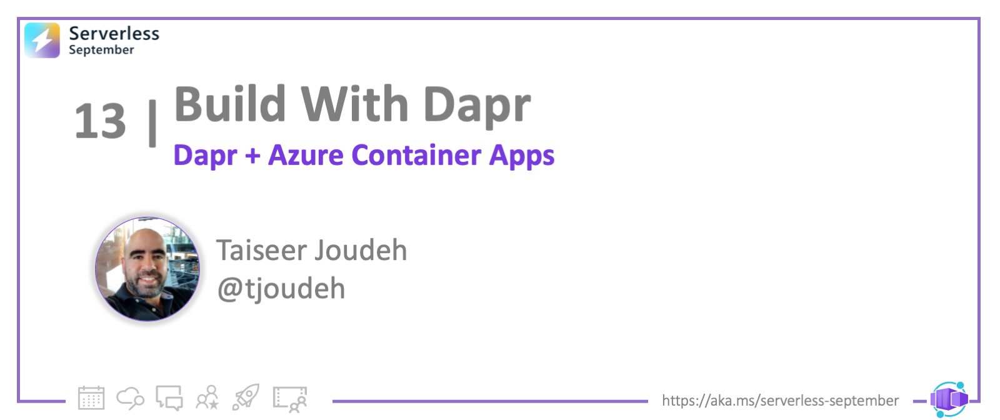
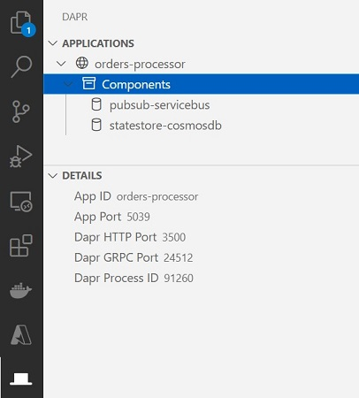
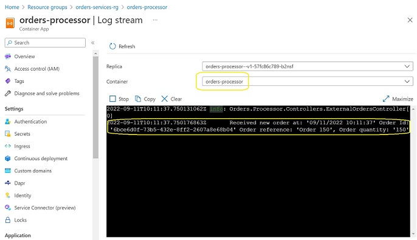

<head>
  <meta name="twitter:url" 
    content="https://azure.github.io/Cloud-Native/blog/14-dapr-aca-quickstart" />
  <meta name="twitter:title" 
    content="#30DaysOfServerless: Azure Container Apps + Dapr" />
  <meta name="twitter:description" 
    content="#30DaysOfServerless: Azure Container Apps + Dapr" />
  <meta name="twitter:image"
    content="https://azure.github.io/Cloud-Native/img/banners/post-kickoff.png" />
  <meta name="twitter:card" content="summary_large_image" />
  <meta name="twitter:creator" 
    content="@nitya" />
  <meta name="twitter:site" content="@AzureAdvocates" /> 
  <link rel="canonical" 
    href="https://azure.github.io/Cloud-Native/blog/13-dapr-aca-quickstart" />
</head>

---

Welcome to `Day 14` of #30DaysOfServerless!

In the past few days we focused our attention on Azure Container Apps, building microservices-based solutions and learning related concepts like environments, networking and auto-scaling - before introducing the sidecar capability of Dapr. Today, we look at how Dapr and ACA work seamlessly together to simplify microservices development in the cloud.

---

## What We'll Cover
 * What is Dapr - and why should you use it?
 * How Dapr works with your microservice app
 * Application scenario we are covering today
 * Quickstart: Build your first ACA with Dapr
 * Exercise: Try this yourself!
 * What's Next: Advanced scenario in 10-part series 
 * Resources: For self-study!



---


## Introduction To Dapr
As developers, we are often tasked with create scalable resilient and distributed microservices, but face challenges such as recovering state after failures, establishing reliable communication between services, integrating with external resources and instrumenting distributed tracing for end-to-end solution observability. Dapr (Distributed Application Runtime) offers an approach for solving these common problems more easily. 

Dapr provides its core capabilities as a set of [Building Blocks](https://docs.dapr.io/concepts/building-blocks-concept/) as detailed in the introduction to dapr article released as a part of this series. Building Blocks provide consistent APIs that abstract away the implementation details to keep microservices code simple and portable.

## Today's App Scenario
In this blog post we will create one single Azure Container App which will act as background processor services (service will not be accessible on the internet nor via other services) and configure two Dapr building blocks which they are the Pub/Sub and the State Store. Let's take a look at the architecture diagram below to have better understanding of what we are building:


Our fictious service named `orders-processor` will be processing messages published into an Azure Service Bus Topic named `orderreceivedtopic`, Dapr Pub/Sub building block will be configured by providing a configuration file named `pubsub-svcbus.yaml` which contains all the needed information to establish the relation between the container app and the service bus topic. Then when the message is consumed by the `orders-processor` service, it will store a copy of it into Azure Cosmos DB, we will rely on Dapr State Store building block by providing a configuration file named `statestore-cosmosdb.yaml` to configure the `orders-processor` service with the Azure Cosmos DB.

During the code walkthrough, you'll see that we will not introduce any SDK for Azure Service Bus nor Azure Cosmos DB, thanks for the abstracting done by Dapr building blocks, everything will be configured using the component files, so let's jump into the code :)

:::info Looking for Advanced scenarios?
This scenario is a simplified version of a detailed tutorial which covers more advanced scenarios, if you are interested you can check more [Advanced scenarios on my blog.](https://bitoftech.net/2022/08/25/tutorial-building-microservice-applications-azure-container-apps-dapr/)
:::

## Build ACA with Dapr
In today's post, we'll be using VS Code to build the app using ASP.NET Core 6.0. In the process, we'll setup our development environment with the relevant command-line tools and VS Code extensions. In addition to this I will walk you through creating the needed Azure resources to complete this tutorial, we will be relying on Azure CLI for this.

_Note: Completing this exercise may incur a a cost of a few USD based on your Azure subscription._

First, make sure you have your development environment setup and configured.
:::info PRE-REQUISITES

 1. **An Azure account with an active subscription** - [Create an account for free](https://azure.microsoft.com/free/?ref=microsoft.com&utm_source=microsoft.com&utm_medium=docs&utm_campaign=visualstudio)
 2. **dotnet 6.0** - [Install](https://dotnet.microsoft.com/download/dotnet/6.0)
 3. **Docker Desktop** - [Install](https://docs.docker.com/desktop/install/windows-install/) 
 4. **Visual Studio Code** - [Install](https://code.visualstudio.com/)
 5. **VS Code Docker extension** - [Install](https://marketplace.visualstudio.com/items?itemName=ms-azuretools.vscode-docker)
 6. **Dapr CLI. Details on installation on this post too** - [Install](https://docs.dapr.io/getting-started/install-dapr-cli/)
 7. **VS Code Dapr extension. Depends on Dapr CLI** - [Install](https://marketplace.visualstudio.com/items?itemName=ms-azuretools.vscode-dapr)
 8. **Azure CLI** - [Install](https://docs.microsoft.com/cli/azure/install-azure-cli)
:::

### 1. Create the service project (Web API)
1. Open a command-line terminal and create a folder for your project. Use the `code` command to launch Visual Studio Code from that directory as shown:

   ```powershell
   mkdir orders-service
   cd orders-service
   code .
    ```
2. From VS Code Terminal tab, open developer command prompt or PowerShell terminal in the project folder `orders-service` and initialize the project by typing: `dotnet new webapi -o Orders.Processor  --no-https` This will create and ASP.NET Web API project scaffolded with 1 single controller. 

3. We need to containerize this application so we can push it to Azure Container Registry as a docker image then deploy it to Azure Container Apps, to do so Open the VS Code Command Palette (<kbd>Ctrl</kbd> + <kbd>Shift</kbd> + <kbd>p</kbd>) and select `Docker: Add Docker Files to Workspace...`
    - Use `.NET: ASP.NET Core` when prompted for application platform.
    - Choose `Linux` when prompted to choose the operating system.
    - You will be asked if you want to add Docker Compose files. Select `No`.
    - Take a not of the provided **application port** as we will be using later on.
    - `Dockerfile` and `.dockerignore` files are added to the workspace.
4. Now we will add the DTO which will be used to deserialize the consumed message from Azure Service Bus Topic, so add a new file named `OrderModel.cs` under a new folder named `Models` and use the code below
    ```csharp
    public class OrderModel
    {
        public Guid OrderId { get; set; } = Guid.NewGuid();
        public string Reference { get; set; } = string.Empty;
        public int Quantity { get; set; }
        public DateTime CreatedOn { get; set; }
    }
    ```
5. Install Dapr Client NuGet package, we need this package to be able to subscribe to the Azure Service Bus Topic in a programmatic way, to do so, from developer command prompt or PowerShell terminal type `dotnet add package Dapr.AspNetCore`
6. Create an API endpoint for the consumer/service to subscribe to the topic, this endpoint will start receiving the messages published to the topic `orderreceivedtopic`, to do so, add a new controller named `ExternalOrdersController.cs` under `Controllers` folder and use the code below:
    ```csharp
    [ApiController]
    [Route("api/externalorders")]
    public class ExternalOrdersController : ControllerBase
    {
        private readonly ILogger<ExternalOrdersController> _logger;
        private readonly DaprClient _daprClient;
        public ExternalOrdersController(ILogger<ExternalOrdersController> logger, DaprClient daprClient)
        {
            _logger = logger;
            _daprClient = daprClient;
        }

        [Topic("pubsub-servicebus", "orderreceivedtopic")]
        [HttpPost("orderreceived")]
        public async Task<IActionResult> OrderReceived([FromBody] OrderModel orderModel)
        {
            _logger.LogInformation("Received new order at: '{0}' Order Id: '{1}' Order reference: '{2}', Order quantity: '{3}'",
                                    DateTime.UtcNow, orderModel.OrderId, orderModel.Reference, orderModel.Quantity);

            //Do your business logic with order received
            orderModel.CreatedOn = DateTime.UtcNow;

            ////ToDo: Your exercise :) Save the received message into CosmoDb using the SveStateAsync
            //await _daprClient.SaveStateAsync<OrderModel>("statestore-cosmosdb", orderModel.OrderId.ToString(), orderModel);

            //Return 200 ok to acknowledge order is processed successfully          
            return Ok($"Order Processing completed successfully");

            //Retunr 400 bad request to retry re-processing based on service broker configuration
            //return BadRequest($"Failed to process order due to: failure reason");
        }
    }
    ```
    What we have implemented here is the following:
      - We have added an action method named `orderreceived` which can be reached on the route `api/externalorders/orderreceived`
      - We have attributed this action method with the attribute `Topic`. The first argument is the name of the pub/sub component, the second argument is the topic to subscribe to, in our case `orderreceivedtopic`
      - The action method expects to receive a `OrderModel` object.
      - Inside this action method we start the business logic needed, once the logic is completed endpoint should return 200 ok response to indicate that the consumer processed the message successfully and the service broker (Azure Service Bus) can delete this message.
      - If anything went wrong during execution of business logic and we want to retry processing this message at a later time, we return 400 bad request, this will inform the message broker that the message needs to be retired based on the configuration in the message broker.
      - If we need to drop the message as we are aware it will not be processed even after multiple retries, we return a 404 not found response, this will tell the message broker to drop the message and move it to dead-letter or poison queue.
7. Register Dapr client and Subscribe handler at the service startup 
Open file `Program.cs` and replace its content with the content below:
    ```csharp
        var builder = WebApplication.CreateBuilder(args);

        // Add services to the container.

        builder.Services.AddControllers().AddDapr();
        // Learn more about configuring Swagger/OpenAPI at https://aka.ms/aspnetcore/swashbuckle
        builder.Services.AddEndpointsApiExplorer();
        builder.Services.AddSwaggerGen();

        var app = builder.Build();

        // Configure the HTTP request pipeline.
        if (app.Environment.IsDevelopment())
        {
        app.UseSwagger();
        app.UseSwaggerUI();
        }

        app.UseAuthorization();

        app.UseCloudEvents();

        app.MapControllers();

        app.MapSubscribeHandler();

        app.Run();
    ```
    :::note Want to know more?
       Check this [blog post](https://bitoftech.net/2022/09/02/azure-container-apps-async-communication-with-dapr-pub-sub-api-part-6/) which describes in detail how the consumer was able to discover available topic names, Pub/Sub names, and which routes/endpoints to push messages to.
    :::

### 2. Provision Azure Service Bus and Topic
We need to create the Azure Service Bus so we can configure the Dapr Pub/Sub component and test locally
1. Open PowerShell console and Login to Azure by using the command `az login` if you have multiple subscriptions, set the subscription you want to use in this tutorial before proceeding, you can do this by using `az account set --subscription <name or id>` As well calling `az upgrade` is a good practice to ensure you are running the latest Aure CLI Command.
2. Create Azure Resource Group by using the code below, feel free to change the name and location of the resource group
    ```powershell
    $RESOURCE_GROUP="orders-services-rg"
    $LOCATION="eastus"
    az group create `
      --name $RESOURCE_GROUP `
      --location "$LOCATION"
    ```
3. Create Azure Service Bus namespace, a topic and get the primary connection string, you can change the name space, and topic, but you have to update the codebase based on your changes. 
    ```powershell
    $NamespaceName="ordersservices"
    $TopicName="orderreceivedtopic"

    ##Create servicebus namespace
    az servicebus namespace create --resource-group $RESOURCE_GROUP --name $NamespaceName --location $LOCATION

    ##Create service topic under namespace
    az servicebus topic create --resource-group $RESOURCE_GROUP --namespace-name $NamespaceName --name $TopicName

    ##List connection string
    az servicebus namespace authorization-rule keys list --resource-group $RESOURCE_GROUP --namespace-name $NamespaceName --name RootManageSharedAccessKey --query primaryConnectionString --output tsv
    ```
You can navigate to the Azure Portal and check that the resource group is created and the service bus namespace is created too.


### 3. Setup Dapr for local dev
In order to run Dapr locally on our development machine, we need to install Dapr CLI Runtime, you can follow the [official documentation](https://docs.dapr.io/getting-started/install-dapr-cli/), but I will list the details too
1. Install the Dapr CLI, run PowerShell console as an administrator and run the below command: 
    ```powershell
     powershell -Command "iwr -useb https://raw.githubusercontent.com/dapr/cli/master/install/install.ps1 | iex"
    ```  
    Note: You might need to execute the following  PowerShell command `Set-ExecutionPolicy RemoteSigned -scope CurrentUser` before installing the Dapr CLI, this command is to allow local PowerShell scripts to run regardless of signature, and requires trusted digital signatures only for remote scripts.

2. Initialize Dapr in a local development environment: Dapr runs as a sidecar alongside our application. In self-hosted mode, this means it is a process on our local machine. By initializing Dapr, we will fetch and install the Dapr sidecar binaries locally, and we will create a development environment that streamlines application development with Dapr. To do so open the PowerShell console as an administrator and run the below command
    ```powershell
    dapr init
    ```
    To verify the deployment; check Dapr version by running the following command: `dapr --version` 
    :::note Want to know more?
        Check this [blog post](https://bitoftech.net/2022/08/29/dapr-integration-with-azure-container-apps/) which describes in detail what components added to your machine when we called `dapr init`
    ::: 


### 4. Create Dapr Component file for Pub/Sub 
Dapr uses a modular design where functionality is delivered as a component. Each component has an interface definition. All of the components are pluggable so that you can swap out one component with the same interface for another.

Components are configured at design-time with a YAML file which is stored in either a components/local folder within your solution, or globally in the .dapr folder created when invoking dapr init [(read here for more details)](https://bitoftech.net/2022/08/29/dapr-integration-with-azure-container-apps/). These YAML files adhere to the generic [Dapr component schema](https://docs.dapr.io/operations/components/component-schema/), but each is specific to the component specification.

1. Create 2 new folders under the project root directory `orders-service`, one named `dapr-component` and the second one `component` (will be used in next steps), then add a new yaml file named `pubsub-svcbus.yaml` under folder `dapr-component` and use the file content below:
    ```yaml
    apiVersion: dapr.io/v1alpha1
    kind: Component
    metadata:
      name: pubsub-servicebus
    spec:
      type: pubsub.azure.servicebus
      version: v1
      metadata:
      - name: connectionString # Required when not using Azure Authentication.
        value: "<Service Bus connection string from step 3.2>"
    scopes:
    - orders-processor
    ```
    Note that we used the name `pubsub-servicebus` which should match the name of Pub/Sub component we've used earlier in the `ExternalOrdersController.cs` controller on the action method with the attribute `Topic`. As well we have set the metadata (key/value) to allow us to connect to Azure Service Bus topic. You need to replace the `connectionString` value with your Service Bus connection string. For full metadata specs, you can [check this page](https://docs.dapr.io/reference/components-reference/supported-pubsub/setup-azure-servicebus/).

    :::warning
        The above example uses secrets as plain strings. It is recommended to use a secret store for the secrets, we will be doing this when we publish the app to Azure Container Apps. Don't check in connection string to source control by mistake!
    ::: 

    Note about The `Scopes` property: By default, all Dapr enabled container apps within the same environment will load the full set of deployed components. By adding scopes to a component, you tell the Dapr sidecars for each respective container app which components to load at runtime. Using scopes is recommended for production workloads.
    In our case, we have set the scopes to read `orders-processor` as this will be the application that needs access to Azure Service Bus.

### 5. Preview Dapr app locally for e2e testing
Now we should be ready to run our service locally with Dapr Sidecar and Pub/Sub API configured with Azure Service Bus 
1. Within VS Code, open PowerShell terminal, change the directory in the terminal to folder `orders-service` and run the below command in PS terminal:

    ```powershell
    dapr run --app-id orders-processor --app-port 5039 --dapr-http-port 3500 --components-path "../dapr-components" dotnet run
    ```
    When using `dapr run` command we are running a dapr process as a sidecar next to the Web API application, the properties we have configured as the following:

    - app-id: The unique identifier of the application. Used for service discovery, state encapsulation, and the pub/sub consumer identifier.
    - app-port: This parameter tells Dapr which port your application is listening on, you can get the app port from `dockerfile` in the Web API Project.
    - dapr-http-port: the HTTP port for Dapr to listen on.
    - components-path: path to the Dapr component(s) folder.
    For a full list of properties, you can check this [link](https://docs.dapr.io/reference/cli/dapr-run/)

    If all is working as expected, from VS Code, you can open Dapr extension and you should see our application `orders-processor` up and running as the image below:
    
    

2. To publish a message to the topic `orderreceivedtopic` we can use Dapr extension: 
    - Right click on the Dapr application `orders-processor` and select `Publish Message to Application`.
    - Wizard will ask what is the Pub/sub component name you want to publish to, provide `pubsub-servicebus` and hit enter.
    - Wizard will ask what topic name to publish to, provide `orderreceivedtopic` and hit enter.
    - Wizard will ask to provide a JSON payload for the method, provide the JSON below and hit enter.
      ```json
      {
          "reference": "Order 1",
          "quantity": 5,
          "createdOn": "2022-08-19T12:45:22.0983978Z"
      }
      ```
    - The JSON payload provided matches the model structure `OrderModel` expected in action method `OrderReceived` in controller `ExternalOrdersController`. Framework will automatically serialize the object to this model.
    - To check the results and if the flow completed end to end, go to the VS Code terminal and check the logs, in the action method we are logging information logs when a message is consumed, you should see something similar to the below
    
    :::info Want to debug Dapr application locally?
      If you want to set breakpoints and debug your daper application locally, you can do this in VS code by following simple steps. This is very important when you are running multiple services together and want to test your microservice where multi-services are invoking each other. To learn more, you can continue reading on [my blog.](https://bitoftech.net/2022/08/29/dapr-integration-with-azure-container-apps/)
    :::


### 6. Deploy app to Azure Container Apps
We will follow few steps in order to deploy the service `Orders.Processor` to Azure Container Apps, but we need to do one addition before deploying, we have to create a component file for Azure Service Bus which meets the [specs defined by Azure Container Apps](https://docs.microsoft.com/azure/container-apps/dapr-overview?tabs=bicep1%2Cyaml#configure-dapr-components).
      
  1. Create a new yaml file named `pubsub-svcbus.yaml` and add it under folder `components` (folder created earlier), use the file content below:
      ```yaml
      # pubsub.yaml for Azure Service Bus component
      componentType: pubsub.azure.servicebus
      version: v1
      metadata:
      - name: connectionString
        secretRef: sb-root-connectionstring
      secrets:
      - name: sb-root-connectionstring
        value: "<value>"
      # Application scopes  
      scopes:
      - orders-processor
      ```
      Two things to notice here:
      - We didn't specify the component name `pubsub-servicebus` when we created this component file, we are going to specify it once we add this dapr component to Azure Container Apps Environment via CLI.
      - The second thing, we are not setting the Azure Service Bus Connection string here, this will not be secure, we are using `secretRef` which will allow us to set the actual `sb-root-connectionstring` value after we deploy this component to the Azure Container Apps Environment. So this key will not be stored in the source code by mistake.
  2. Create Azure Container Registry (ACR) instance in the resource group to build/push and store docker images of our service. Feel free to change the name of the ACR, to do so run the following command:
      ```powershell
        ## Create Azure Container Registry
        $ACR_NAME="ordersservicesacr"
        az acr create `
          --resource-group $RESOURCE_GROUP `
          --name $ACR_NAME `
          --sku Basic `
          --admin-enabled true
      ```
  3. Build the Web API project on ACR and push the docker image to ACR. Use the below command to initiate the image build and push process using ACR:
      ```powershell
      ## Build and push image to ACR
      $BACKEND_SVC_NAME="orders-processor"
      cd {YourLocalPath}\orders-service
      az acr build --registry $ACR_NAME --image $BACKEND_SVC_NAME --file 'Orders.Processor/Dockerfile' .      
      ```
  4. Provision Azure Container Apps Env and Container App: Azure Container Apps Environment acts as a secure boundary around a group of all container apps, to create it, run the below command:
      ```powershell

        ## Upgrade az container app cli or install it
        az extension add --name containerapp --upgrade

        ## Create ACA Env
        $ENVIRONMENT="orders-services-aca-env"

        az containerapp env create `
          --name $ENVIRONMENT `
          --resource-group $RESOURCE_GROUP `
          --location $LOCATION
      ```
   5. Add Dapr Pub/Sub Component to Azure Container Apps Environment, we need to run the command below to add the component yaml file `.\components\pubsub-svcbus.yaml` to Azure Container Apps Environment, to do so run the below PowerShell command:
      ```powershell
          az containerapp env dapr-component set `
          --name $ENVIRONMENT --resource-group $RESOURCE_GROUP `
          --dapr-component-name pubsub-servicebus `
          --yaml '.\components\pubsub-svcbus.yaml'
      ```
        Notice that we set the component name `pubsub-servicebus` when we added it Container Apps Environment.
        Once the command completes and from the Azure Portal, navigate to your Container Apps Environment, select `Dapr Components`, then click on `pubsub-servicebus` component, and provide your Azure Service Bus Connection string in the Secrets text box value for secret `sb-root-connectionstring`, then click `Edit` button. It will be similar to the below image
        
   6. Now we need to create a new Azure Container App, this container app should have the below capabilities:
      - Ingress should be disabled (No access via HTTP at all, or other services, this is a background processor responsible to process published messages).
      - Dapr needs to be enabled 

      To achieve the above run the below PowerShell script and notice how we didn't provide the `Ingress` property, Ingress will be disabled for this Container App:
      ```powershell
      ## Create Azure COntain App
      $BACKEND_SVC_NAME="orders-processor"

      az containerapp create `
        --name $BACKEND_SVC_NAME  `
        --resource-group $RESOURCE_GROUP `
        --environment $ENVIRONMENT `
        --registry-server "$ACR_NAME.azurecr.io" `
        --image "$ACR_NAME.azurecr.io/$BACKEND_SVC_NAME" `
        --min-replicas 1 `
        --max-replicas 1 `
        --cpu 0.50 --memory 1.0Gi `
        --enable-dapr `
        --dapr-app-id  $BACKEND_SVC_NAME `
        --dapr-app-port 5039
      ```
  7. With all those steps implemented we are ready to test end to end on Azure, to do this:
      - From the Azure Portal, select the Azure Container App `orders-processor` and navigate to `Log stream` under `Monitoring` tab, leave the stream connected and opened.
      - From the Azure Portal, select the Azure Service Bus Namespace `ordersservices`, select the topic `orderreceivedtopic`, select the subscription named `orders-processor`, then click on `Service Bus Explorer (preview)` from there we need to publish/send a message, use the JSON payload below
      ```json
        {
          "data": {
              "reference": "Order 150",
              "quantity": 150,
              "createdOn": "2022-05-10T12:45:22.0983978Z"
            }
        }
      ```
      - If all is configured correctly, you should start seeing the information logs in Container Apps Log stream, similar to the images below
      
      - Information logs on the `Log stream` of the deployed Azure Container App
      

:::success 🎉 CONGRATULATIONS
You have successfully deployed to the cloud an Azure Container App and configured Dapr Pub/Sub API with Azure Service Bus.
:::

### 7. Clean up

If you are done with the tutorial, use the following command to delete the resource group and all its contained resources to avoid incurring further costs.

```powershell
az group delete --name $RESOURCE_GROUP
```

## Exercise
I left for you the configuration of the Dapr State Store API with Azure Cosmos DB :) 

When you look at the action method `OrderReceived` in controller `ExternalOrdersController`, you will see that I left a line with `ToDo:` note, this line is responsible to save the received message (OrderModel) into Azure Cosmos DB. 

There is no need to change anything on the code base (other than removing this commented line), that's the beauty of Dapr Building Blocks and how easy it allows us to plug components to our microservice application without any plumping and brining external SDKs.

For sure you need to work on the configuration part of Dapr State Store by creating a new component file like what we have done with the Pub/Sub API, things that you need to work on are:
- Provision Azure Cosmos DB Account and obtain its masterKey.
- Create a Dapr Component file adhering to Dapr Specs.
- Create an Azure Container Apps component file adhering to ACA component specs.
- Test locally on your dev machine using Dapr Component file.
- Register the new Dapr State Store component with Azure Container Apps Environment and set the Cosmos Db masterKey from the Azure Portal.
- Build a new image of the application and push it to Azure Container Registry.
- Update Azure Container Apps and create a new revision which contains the updated code.
- Verify the results by checking Azure Cosmos DB, you should see the Order Model stored in Cosmos DB.

If you need help, you can always refer to my blog post [Azure Container Apps State Store With Dapr State Management API](https://bitoftech.net/2022/08/29/azure-container-apps-state-store-with-dapr-state-management-api/) which contains exactly what you need to implement here, so I'm very confident you will be able to complete this exercise with no issues, happy coding :)

## What's Next?
If you enjoyed working with Dapr and Azure Container Apps, and you want to have a deep dive with more complex scenarios (Dapr bindings, service discovery, auto scaling with KEDA, sync services communication, distributed tracing, health probes, etc...) where multiple services deployed to a single Container App Environment; I have created a detailed tutorial which should walk you through step by step with through details to build the application.

So far, the published posts below, and I'm publishing more posts on weekly basis, so stay tuned :)

- [Tutorial for building Microservice Applications with Azure Container Apps and Dapr – Part 1](https://bitoftech.net/2022/08/25/tutorial-building-microservice-applications-azure-container-apps-dapr/)
- [Deploy backend API Microservice to Azure Container Apps – Part 2](https://bitoftech.net/2022/08/25/deploy-microservice-application-azure-container-apps/)
- [Communication between Microservices in Azure Container Apps – Part 3](https://bitoftech.net/2022/08/25/communication-microservices-azure-container-apps/)
- [Dapr Integration with Azure Container Apps – Part 4](https://bitoftech.net/2022/08/29/dapr-integration-with-azure-container-apps/)
- [Azure Container Apps State Store With Dapr State Management API – Part 5](https://bitoftech.net/2022/08/29/azure-container-apps-state-store-with-dapr-state-management-api/)
- [Azure Container Apps Async Communication with Dapr Pub/Sub API – Part 6](https://bitoftech.net/2022/09/02/azure-container-apps-async-communication-with-dapr-pub-sub-api-part-6/)
- [Azure Container Apps with Dapr Bindings Building Block – Part 7](https://bitoftech.net/2022/09/05/azure-container-apps-with-dapr-bindings-building-block/)
- [Azure Container Apps Monitoring and Observability with Application Insights – Part 8](https://bitoftech.net/2022/09/09/azure-container-apps-monitoring-and-observability-with-application-insights-part-8/)
- _Integrate Health probes in Azure Container Apps – Part 9_
- _Azure Container Apps Auto Scaling with KEDA – Part 10_
- _Use IaC to provision Azure Container Apps Environment with Bicep – Part 11_

## Resources
- [Azure Container Apps documentation](https://docs.microsoft.com/azure/container-apps/)
- [Getting started with Dapr](https://docs.dapr.io/getting-started/)
- [Dapr for .NET Developers](https://docs.microsoft.com/dotnet/architecture/dapr-for-net-developers/)
- [az containerapp cli](https://docs.microsoft.com/cli/azure/containerapp?view=azure-cli-latest)
