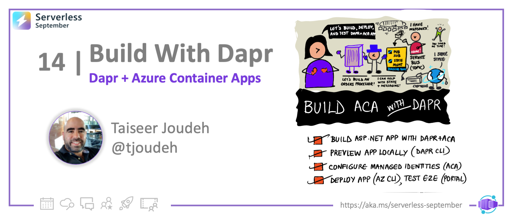

<head>
  <meta name="twitter:url" 
    content="https://azure.github.io/Cloud-Native/blog/13-aca-managed-id" />
  <meta name="twitter:title" 
    content="#30DaysOfServerless: Secrets in Azure Container Apps />
  <meta name="twitter:description" 
    content="#30DaysOfServerless: Secrets in Azure Container Apps" />
  <meta name="twitter:image"
    content="https://azure.github.io/Cloud-Native/img/banners/post-kickoff.png" />
  <meta name="twitter:card" content="summary_large_image" />
  <meta name="twitter:creator" 
    content="@kendallroden" />
  <meta name="twitter:site" content="@AzureAdvocates" /> 
  <link rel="canonical" 
    href="https://azure.github.io/Cloud-Native/blog/13-aca-managed-id" />
</head>

---

Welcome to `Day 13` of #30DaysOfServerless! In the previous post, we learned about all things Distributed Application Runtime (Dapr) and highlighted the capabilities you can unlock through managed Dapr in Azure Container Apps! Now we will dive into how to make use of Container Apps secrets and managed identities to securely access cloud-hosted resources that your Container Apps depend on! 
  
---

 ## What We'll Cover
  * Secure access to external services overview
  * Using Container Apps Secrets
  * Using Managed Identity for connecting to Azure resources
  * Using Dapr secret store component references (Dapr-only)
  * Conclusion   
  * Resources: For self-study!



---

## Secure access to external services overview 

In most, if not all, microservice-based applications, one or more services in the system will rely on other cloud-hosted resources; Think external services like databases, secret stores, message brokers, event sources, etc. To interact with these services, an application must have the ability to establish a secure connection. Traditionally, an application will authenticate to these backing resources using some type of connection string or password. 
  
I'm not sure if it was just me, but one of the first things I learned as a developer was to ensure credentials and other sensitive information were never checked into the codebase. The ability to inject these values at runtime is a non-negotiable.
  
In Azure Container Apps, applications can securely leverage connection information via Container Apps Secrets. If the resource is Azure-based, a more ideal solution that removes the dependence on secrets altogether is using Managed Identity. 

Specifically for Dapr-enabled container apps, users can now tap into the power of the Dapr secrets API! With this new capability unlocked in Container Apps, users can call the Dapr secrets API from their application code to securely access secrets from Key Vault or other backing secret stores. In addition, customers can also make use of a secret store component reference when wiring up Dapr state store components and more! ALSO, I'm excietd to share that support for  Dapr + Managed Identity is now available as well. What does this mean? It means that you can enable Managed Identity for your container app, and when establishing connections via Dapr, the Dapr sidecar can use this identity! This means simplified components without the need for secrets when connecting to Azure services! 
  
Let's dive a bit deeper into the following three topics:
  1. Using Container Apps secrets in your container apps
  2. Using Managed Identity to connect to Azure services
  3. Connecting to services securely for Dapr-enabled apps 
                                                                      
## Secure access to external services without Dapr  

### Leveraging Container Apps secrets at runtime 

Users can leverage this approach for any values which need to be securely stored, however, it is recommended to use Managed Identity where possible when connecting to Azure-specific resources. 
  
Before we dive in, let's establish a few important points regarding secrets in container apps:  
- Secrets are scoped at the container app level, meaning secrets cannot be shared across container apps today 
- When running in multiple-revision mode, changes to secrets **do not** generate a new revision
- When running in multiple-revision mode, running revisions will not be automatically restarted to reflect changes. If you want to force update existing container app revisions to reflect the changed secrets values, you will need to perform revision restarts. 
  
Step 1: Provide the secure value as a secret parameter when creating your container app using the syntax **"SECRET_NAME=SECRET_VALUE"**

  ```bash
  az containerapp create \
    --resource-group "my-resource-group" \
    --name queuereader \
    --environment "my-environment-name" \
    --image demos/queuereader:v1 \
    --secrets "queue-connection-string=$CONNECTION_STRING"
  ```
  
Step 2: Create an environment variable which references the value of the secret created in step 1 using the syntax **"ENV_VARIABLE_NAME=secretref:SECRET_NAME"**
  
  ```bash
  az containerapp create \
    --resource-group "my-resource-group" \
    --name myQueueApp \
    --environment "my-environment-name" \
    --image demos/myQueueApp:v1 \
    --secrets "queue-connection-string=$CONNECTIONSTRING" \
    --env-vars "QueueName=myqueue" "ConnectionString=secretref:queue-connection-string"
  ```

This **ConnectionString** environment variable can be used within your application code to securely access the connection string value at runtime.
                                                                                       
### Using Managed Identity to connect to Azure services
  
A managed identity from Azure Active Directory (Azure AD) allows your container app to access other Azure AD-protected resources. This approach is recommended where possible as it eliminates the need for managing secret credentials in your container apps and allows you to properly scope the permissions needed for a given container app using role-based access control. Both system-assigned and user-assigned identities are available in container apps. For more background on managed identities in Azure AD, see [Managed identities for Azure resources](https://learn.microsoft.com/en-us/azure/active-directory/managed-identities-azure-resources/overview).
  
To configure your app with a system-assigned managed identity you will follow similar steps to the following: 
  
Step 1: Run the following command to create a system-assigned identity for your container app 
  
  ```bash
  az containerapp identity assign \
    --name "myQueueApp" \
    --resource-group "my-resource-group" \
    --system-assigned
  ```
  
Step 2: Retrieve the identity details for your container app and store the Principal ID for the identity in a variable **"PRINCIPAL_ID"**

  ```bash
  az containerapp identity show \
    --name "myQueueApp" \
    --resource-group "my-resource-group"
  ```
  
Step 3: Assign the appropriate roles and permissions to your container app's managed identity using the Principal ID in step 2 based on the resources you need to access (example below)
  
  ```bash
  az role assignment create \
    --role "Storage Queue Data Contributor" \
    --assignee $PRINCIPAL_ID \
    --scope "/subscriptions/<subscription>/resourceGroups/<resource-group>/providers/Microsoft.Storage/storageAccounts/<storage-account>/queueServices/default/queues/<queue>"
 ```
  
After running the above commands, your container app will be able to access your Azure Store Queue because it's managed identity has been assigned the "Store Queue Data Contributor" role. The role assignments you create will be contingent solely on the resources your container app needs to access. To instrument your code to use this managed identity, see more details [here](https://learn.microsoft.com/en-us/azure/container-apps/managed-identity?tabs=portal%2Cdotnet#connect-to-azure-services-in-app-code). 

In addition to using managed identity to access services from your container app, you can also use managed identity to [pull your container images from Azure Container Registry](https://learn.microsoft.com/en-us/azure/container-apps/containers#container-registries).

## Secure access to external services with Dapr  

For Dapr-enabled apps, there are a few ways to connect to the resources your solutions depend on. In this section, we will discuss recommendation on when to use each approach. 
  1. Using Container Apps secrets in your Dapr components
  1. Using Managed Identity with Dapr Components 
  1. Using Dapr Secret Stores for runtime secrets and component references 

### Using Container Apps secrets in your Dapr components

Prior to providing support for the Dapr Secret's Management building block, this was the only approach available for securely storing sensitive values for use in Dapr components. 

In Dapr OSS, when no secret store reference is provided in a Dapr component file, the default secret store is set to "Kubernetes secrets". In Container Apps, we do not expose the ability to use this default store. Rather, Container Apps secrets can be used in it's place. 
  
With the introduction of the Secrets API and the ability to use Dapr + Managed Identity, this approach is useful for a limited number of scenarios: 
  - Quick demos and dev/test scenarios using the Container Apps CLI 
  - Securing values when a secret store is not configured or available for use
  - Using service principal credentials to configure an Azure Key Vault secret store component (Using Managed Identity is recommend) 
  - Securing access credentials which may be required when creating a non-Azure secret store component 
  
Step 1: Create a Dapr component which can be used by one or more services in the container apps environment. In the below example, you will create a secret to store the storage account key and reference this secret from the appropriate Dapr metadata property. 
  
   ```yaml
      componentType: state.azure.blobstorage
      version: v1
      metadata:
      - name: accountName
        value: testStorage
      - name: accountKey
        secretRef: account-key
      - name: containerName
        value: myContainer
      secrets:
      - name: account-key
        value: "<STORAGE_ACCOUNT_KEY>"
      scopes:
      - myApp
   ```
  
Step 2: Deploy the Dapr component using the below command with the appropriate arguments.
  
 ```bash 
  az containerapp env dapr-component set \
    --name "my-environment" \
    --resource-group "my-resource-group" \
    --dapr-component-name statestore \
    --yaml "./statestore.yaml"
  ```
  
### Using Managed Identity with Dapr Components 

Dapr-enabled container apps can now make use of managed identities within Dapr components. This is the most ideal path for connecting to Azure services securely, and allows for the removal of sensitive values in the component itself. 

The Dapr sidecar makes use of the existing identities available within a given container app; Dapr itself does not have it's own identity. Therefore, the steps to enable Dapr + MI are similar to those in the section regarding managed identity for non-Dapr apps. See example steps below specifically for using a system-assigned identity: 

Step 1: Create a system-assigned identity for your container app 
Step 2: Retrieve the identity details for your container app and store the Principal ID for the identity in a variable **"PRINCIPAL_ID"**
Step 3: Assign the appropriate roles and permissions for accessing the resources backing your Dapr components to your container app's managed identity using the Principal ID
Step 4:. Create a simplified Dapr component without any secrets required 
 
  ```yaml
      componentType: state.azure.blobstorage
      version: v1
      metadata:
      - name: accountName
        value: testStorage
      - name: containerName
        value: myContainer
      scopes:
      - myApp
   ```
Step 5: Deploy the component to test the connection from your container app via Dapr! 
  
Keep in mind, all Dapr components will be loaded by each Dapr-enabled container app in an environment by default. In order to avoid apps without the appropriate permissions from loading a component unsuccessfully, use scopes. This will ensure that only applications with the appropriate identities to access the backing resource load the component. 
  
### Using Dapr Secret Stores for runtime secrets and component references  

Dapr integrates with secret stores to provide apps and other components with secure storage and access to secrets such as access keys and passwords. The Dapr Secrets API is now available for use in Container Apps. 

Using Dapr’s secret store building block typically involves the following:
  - Setting up a component for a specific secret store solution.
  - Retrieving secrets using the Dapr secrets API in the application code.
  - Optionally, referencing secrets in Dapr component files.
  

  
Let's walk through a couple sample workflows involving the use of Dapr's Secrets Management capabilities! 
 
####  Setting up a component for a specific secret store solution
Step 1: Create an Azure Key Vault instance for hosting the secrets required by your application.
  
  ```bash
  az keyvault create --name "<your-unique-keyvault-name>" --resource-group "my-resource-group" --location "<your-location>"
  ```
  
Step 2: Create an Azure Key Vault component in your environment without the secrets values, as the connection will be established to Azure Key Vault via Managed Identity.
  
  ```yaml 
      componentType: secretstores.azure.keyvault
      version: v1
      metadata:
      - name: vaultName
        value: "[your_keyvault_name]"
      scopes:
      - myApp 
  ```
  
  ```bash 
  az containerapp env dapr-component set \
    --name "my-environment" \
    --resource-group "my-resource-group" \
    --dapr-component-name secretstore \
    --yaml "./secretstore.yaml"
  ```
  
Step 3: Run the following command to create a system-assigned identity for your container app 
  
  ```bash
  az containerapp identity assign \
    --name "myApp" \
    --resource-group "my-resource-group" \
    --system-assigned
  ```
  
Step 4: Retrieve the identity details for your container app and store the Principal ID for the identity in a variable **"PRINCIPAL_ID"**

  ```bash
  az containerapp identity show \
    --name "myApp" \
    --resource-group "my-resource-group"
  ```
  
Step 5: Assign the appropriate roles and permissions to your container app's managed identity to access Azure Key Vault
  
  ```bash
  az role assignment create \
  --role "Key Vault Secrets Officer" \
  --assignee $PRINCIPAL_ID \
  --scope /subscriptions/{subscriptionid}/resourcegroups/{resource-group-name}/providers/Microsoft.KeyVault/vaults/{key-vault-name}
 ```
 
Step 6: Begin using the Dapr Secrets API in your application code to retrieve secrets! See additional details [here] https://docs.dapr.io/reference/api/secrets_api/)
  
#### Referencing secrets in Dapr component files
  
Once a Dapr secret store component is available in the environment, it can be used to retrieve secrets for use in other components. For example, when creating a state store component, you can add a reference to the Dapr secret store from which you would like to source connection information. You will no longer use secrets directly in the component spec, but rather will instruct the Dapr sidecar to retrieve the secrets from the specified store. 
  
  ```yaml
        componentType: state.azure.blobstorage
        version: v1
        metadata:
        - name: accountName
          value: testStorage
        - name: accountKey
          secretRef: account-key
        - name: containerName
          value: myContainer
        secretStoreComponent: "<SECRET_STORE_COMPONENT_NAME>"
        scopes:
          - myApp
  ```
  
## Summary 
  
In this post, we have covered the high-level details on how to work with secret values in Azure Container Apps for both Dapr and Non-Dapr apps. In the next article, we will walk through a complex Dapr example from end-to-end which makes use of the new support for Dapr + Managed Identity. Stayed tuned for additional documentation around Dapr secrets as it will be release in the next two weeks! 

## Resources

Here are the main resources to explore for self-study:
 * [Azure Container Apps Secrets](https://learn.microsoft.com/en-us/azure/container-apps/manage-secrets?tabs=azure-cli)
 * [Managed Identities in Azure Container Apps]()
 * [Dapr Documentation: Core Concepts](https://v1-9.docs.dapr.io/concepts/)
 * [Dapr Quickstarts](https://docs.dapr.io/getting-started/quickstarts/)
 * [Dapr Tutorials](https://docs.dapr.io/getting-started/tutorials/)
 * [Azure Container Apps: Dapr Integration](https://learn.microsoft.com/azure/container-apps/dapr-overview)
 * [Dapr-enabled Azure Container Apps: Using Azure CLI](https://learn.microsoft.com/azure/container-apps/microservices-dapr)
 * [Dapr-enabled Azure Container Apps: Using Bicep or ARM](https://learn.microsoft.com/azure/container-apps/microservices-dapr-azure-resource-manager)
