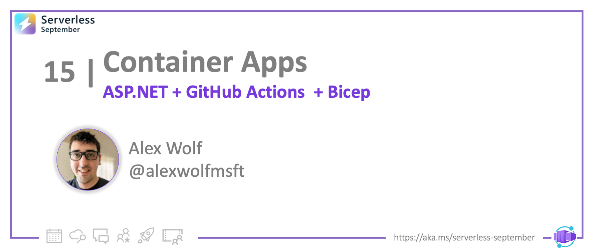
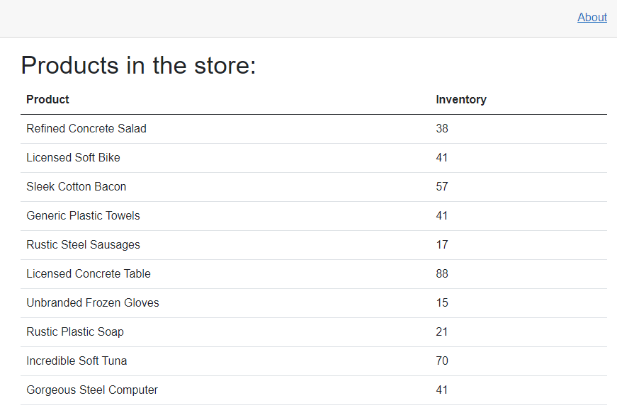
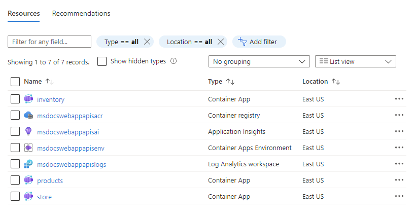

<head>
  <meta name="twitter:url" 
    content="https://azure.github.io/Cloud-Native/blog/15-aca-dotnet" />
  <meta name="twitter:title" 
    content="#30DaysOfServerless: Deploy an ASP.NET app to Azure Container Apps " />
  <meta name="twitter:description" 
    content="#30DaysOfServerless: Deploy an ASP.NET app to Azure Container Apps" />
  <meta name="twitter:image"
    content="https://azure.github.io/Cloud-Native/img/banners/post-kickoff.png" />
  <meta name="twitter:card" content="summary_large_image" />
  <meta name="twitter:creator" 
    content="@nitya" />
  <meta name="twitter:site" content="@AzureAdvocates" /> 
  <link rel="canonical" 
    href="https://azure.github.io/Cloud-Native/blog/15-aca-dotnet" />
</head>

---

Welcome to `Day 15` of #30DaysOfServerless!

---

## What We'll Cover
 * Deploy ASP.NET Core 6.0 app to Azure Container Apps
 * Automate deployment workflows using GitHub Actions
 * Provision and deploy resources using Azure Bicep
 * Exercise: Try this yourself!
 * Resources: For self-study!



---

# Introduction

Azure Container Apps enables you to run microservices and containerized applications on a serverless platform. With Container Apps, you enjoy the benefits of running containers while leaving behind the concerns of manually configuring cloud infrastructure and complex container orchestrators.

In this tutorial, you'll deploy a containerized ASP.NET Core 6.0 application to Azure Container Apps. The application consists of a front-end web app built using Blazor Server, as well as two Web API projects to manage data. These projects will exist as three separate containers inside of a shared container apps environment.

You will use GitHub Actions in combination with Bicep to deploy the application. These tools provide an approachable and sustainable solution for building CI/CD pipelines and working with Container Apps.

:::info PRE-REQUISITES
- An Azure subscription. [Sign up for free](https://azure.microsoft.com).
- A [GitHub account](https://github.com/join), with access to GitHub Actions.
- The [Azure CLI](https://docs.microsoft.com/azure/install-azure-cli) installed locally.
- [Microsoft Visual Studio 2022](https://visualstudio.microsoft.com/vs/)
:::

## Architecture

In this tutorial, we'll setup a container app environment with a separate container for each project in the sample store app. The major components of the sample project include:

- A Blazor Server front-end web app to display product information
- A products API to list available products
- An inventory API to determine how many products are in stock
- GitHub Actions and Bicep templates to provision Azure resources and then build and deploy the sample app. 

You will explore these templates later in the tutorial.

Public internet traffic should be proxied to the Blazor app. The back-end APIs should only be reachable via requests from the Blazor app inside the container apps environment. This setup can be achieved using container apps environment ingress configurations during deployment.


---

## Project Sources

Want to follow along? Fork the sample below. The tutorial can be completed with or without Dapr integration. Pick the path you feel comfortable in. Dapr provides various benefits that make working with Microservices easier - you can learn more in the docs. For this tutorial you will need GitHub and Azure CLI.

:::info PICK YOUR PATH
To follow along with this tutorial, fork the relevant sample project below.  
 * [**Project Repo: Without Dapr**](https://github.com/Azure-Samples/dotNET-FrontEnd-to-BackEnd-on-Azure-Container-Apps)
 * [**Project Repo: With Dapr**](https://github.com/Azure-Samples/dotNET-FrontEnd-to-BackEnd-with-DAPR-on-Azure-Container-Apps)

:::

You can run the app locally from Visual Studio:
 * Right click on the Blazor **Store** project and select **Set as Startup Project**. 
 * Press the start button at the top of Visual Studio to run the app. 
 * (Once running) start each API in the background by 
  - right-clicking on the project node 
  - selecting **Debug --> Start without debugging**.

Once the Blazor app is running, you should see something like this:



---

## Configuring Azure credentials

In order to deploy the application to Azure through GitHub Actions, you first need to create a service principal. The service principal will allow the GitHub Actions process to authenticate to your Azure subscription to create resources and deploy code. You can [learn more about Service Principals](https://docs.microsoft.com/azure/create-an-azure-service-principal-azure-cli) in the Azure CLI documentation. For this step you'll need to be logged into the Azure CLI.

1) If you have not done so already, make sure to [fork the sample project](https://github.com/Azure-Samples/dotNET-FrontEnd-to-BackEnd-on-Azure-Container-Apps) to your own GitHub account or organization. 

1) Once you have completed this step, create a service principal using the Azure CLI command below:

    ```azurecli
    $subscriptionId=$(az account show --query id --output tsv)
    az ad sp create-for-rbac --sdk-auth --name WebAndApiSample --role Contributor --scopes /subscriptions/$subscriptionId
    ```

1) Copy the JSON output of the CLI command to your clipboard

1) Under the settings tab of your forked GitHub repo, create a new secret named **AzureSPN**. The name is important to match the Bicep templates included in the project, which we'll review later. Paste the copied service principal values on your clipboard into the secret and save your changes. This new secret will be used by the GitHub Actions workflow to authenticate to Azure.

    :::image type="content" source="./img/dotnet/github-secrets.png" alt-text="A screenshot of adding GitHub secrets.":::

## Deploy using Github Actions

You are now ready to deploy the application to Azure Container Apps using GitHub Actions. The sample application includes a GitHub Actions template that is configured to build and deploy any changes to a branch named **deploy**.  The deploy branch does not exist in your forked repository by default, but you can easily create it through the GitHub user interface.

1) Switch to the **Actions** tab along the top navigation of your GitHub repository. If you have not done so already, ensure that workflows are enabled by clicking the button in the center of the page.


1) Navigate to the main **Code** tab of your repository and select the **main** dropdown. Enter *deploy* into the branch input box, and then select **Create branch: deploy from 'main'**.  


1) On the new **deploy** branch, navigate down into the **.github/workflows** folder. You should see a file called **deploy.yml**, which contains the main GitHub Actions workflow script. Click on the file to view its content. You'll learn more about this file later in the tutorial.

1) Click the pencil icon in the upper right to edit the document.

1) Change the **RESOURCE_GROUP_NAME:** value to *msdocswebappapis* or another valid resource group name of your choosing. 

1) In the upper right of the screen, select **Start commit** and then **Commit changes** to commit your edit. This will persist the change to the file and trigger the GitHub Actions workflow to build and deploy the app.


1) Switch to the **Actions** tab along the top navigation again. You should see the workflow running to create the necessary resources and deploy the app. The workflow may take several minutes to run. When it completes successfully, all of the jobs should have a green checkmark icon next to them.


## Explore the Azure resources

Once the GitHub Actions workflow has completed successfully you can browse the created resources in the Azure portal.  

1) On the left navigation, select **Resource Groups**. Next,choose the **msdocswebappapis** resource group that was created by the GitHub Actions workflow.

2) You should see seven resources available that match the screenshot and table descriptions below.




|Resource name  |Type  |Description  |
|---------|---------|---------|
|inventory     | Container app        | The containerized inventory API.          |
|msdocswebappapisacr     | Container registry         | A registry that stores the built Container images for your apps.         |
|msdocswebappapisai    | Application insights        | Application insights provides advanced monitoring, logging and metrics for your apps.         |
|msdocswebappapisenv     | Container apps environment         | A container environment that manages networking, security and resource concerns. All of your containers live in this environment.        |
|msdocswebappapislogs     | Log Analytics workspace         | A workspace environment for managing logging and analytics for the container apps environment         |
|products     | Container app         | The containerized products API.         |
|store     | Container app         | The Blazor front-end web app.         |
    
3) You can view your running app in the browser by clicking on the **store** container app. On the overview page, click the **Application Url** link on the upper right of the screen.

    :::image type="content" source="./img/dotnet/application-url.png" alt-text="The link to browse the app.":::

## Understanding the GitHub Actions workflow

The GitHub Actions workflow created and deployed resources to Azure using the **deploy.yml** file in the **.github** folder at the root of the project. The primary purpose of this file is to respond to events - such as commits to a branch - and run jobs to accomplish tasks. The **deploy.yml** file in the sample project has three main jobs:

- **Provision**: Create the necessary resources in Azure, such as the container apps environment. This step leverages Bicep templates to create the Azure resources, which you'll explore in a moment.
- **Build**: Create the container images for the three apps in the project and store them in the container registry.
- **Deploy**: Deploy the container images to the different container apps created during the provisioning job.

The **deploy.yml** file also accepts parameters to make the workflow more dynamic, such as setting the resource group name or the Azure region resources will be provisioned to. 

Below is a commented version of the **deploy.yml** file that highlights the essential steps.

```yml
name: Build and deploy .NET application to Container Apps

# Trigger the workflow on pushes to the deploy branch
on:
  push:
    branches:
    - deploy

env:
  # Set workflow variables
  RESOURCE_GROUP_NAME: msdocswebappapis

  REGION: eastus

  STORE_DOCKER: Store/Dockerfile
  STORE_IMAGE: store

  INVENTORY_DOCKER: Store.InventoryApi/Dockerfile
  INVENTORY_IMAGE: inventory

  PRODUCTS_DOCKER: Store.ProductApi/Dockerfile
  PRODUCTS_IMAGE: products

jobs:
  # Create the required Azure resources
  provision:
    runs-on: ubuntu-latest

    steps:

    - name: Checkout to the branch
      uses: actions/checkout@v2

    - name: Azure Login
      uses: azure/login@v1
      with:
        creds: ${{ secrets.AzureSPN }}

    - name: Create resource group
      uses: azure/CLI@v1
      with:
        inlineScript: >
          echo "Creating resource group in Azure"
          echo "Executing 'az group create -l ${{ env.REGION }} -n ${{ env.RESOURCE_GROUP_NAME }}'"
          az group create -l ${{ env.REGION }} -n ${{ env.RESOURCE_GROUP_NAME }}

    # Use Bicep templates to create the resources in Azure
    - name: Creating resources
      uses: azure/CLI@v1
      with:
        inlineScript: >
          echo "Creating resources"
          az deployment group create --resource-group ${{ env.RESOURCE_GROUP_NAME }} --template-file '/github/workspace/Azure/main.bicep' --debug

  # Build the three app container images
  build:
    runs-on: ubuntu-latest
    needs: provision
    
    steps:

    - name: Checkout to the branch
      uses: actions/checkout@v2

    - name: Azure Login
      uses: azure/login@v1
      with:
        creds: ${{ secrets.AzureSPN }}

    - name: Set up Docker Buildx
      uses: docker/setup-buildx-action@v1

    - name: Login to ACR
      run: |
        set -euo pipefail
        access_token=$(az account get-access-token --query accessToken -o tsv)
        refresh_token=$(curl https://${{ env.RESOURCE_GROUP_NAME }}acr.azurecr.io/oauth2/exchange -v -d "grant_type=access_token&service=${{ env.RESOURCE_GROUP_NAME }}acr.azurecr.io&access_token=$access_token" | jq -r .refresh_token)
        docker login -u 00000000-0000-0000-0000-000000000000 --password-stdin ${{ env.RESOURCE_GROUP_NAME }}acr.azurecr.io <<< "$refresh_token"

    - name: Build the products api image and push it to ACR
      uses: docker/build-push-action@v2
      with:
        push: true
        tags: ${{ env.RESOURCE_GROUP_NAME }}acr.azurecr.io/${{ env.PRODUCTS_IMAGE }}:${{ github.sha }}
        file: ${{ env.PRODUCTS_DOCKER }}

    - name: Build the inventory api image and push it to ACR
      uses: docker/build-push-action@v2
      with:
        push: true
        tags: ${{ env.RESOURCE_GROUP_NAME }}acr.azurecr.io/${{ env.INVENTORY_IMAGE }}:${{ github.sha }}
        file: ${{ env.INVENTORY_DOCKER }}

    - name: Build the frontend image and push it to ACR
      uses: docker/build-push-action@v2
      with:
        push: true
        tags: ${{ env.RESOURCE_GROUP_NAME }}acr.azurecr.io/${{ env.STORE_IMAGE }}:${{ github.sha }}
        file: ${{ env.STORE_DOCKER }}

  # Deploy the three container images
  deploy:
    runs-on: ubuntu-latest
    needs: build

    steps:

    - name: Checkout to the branch
      uses: actions/checkout@v2

    - name: Azure Login
      uses: azure/login@v1
      with:
        creds: ${{ secrets.AzureSPN }}

    - name: Installing Container Apps extension
      uses: azure/CLI@v1
      with:
        inlineScript: >
          az config set extension.use_dynamic_install=yes_without_prompt

          az extension add --name containerapp --yes

    - name: Login to ACR
      run: |
        set -euo pipefail
        access_token=$(az account get-access-token --query accessToken -o tsv)
        refresh_token=$(curl https://${{ env.RESOURCE_GROUP_NAME }}acr.azurecr.io/oauth2/exchange -v -d "grant_type=access_token&service=${{ env.RESOURCE_GROUP_NAME }}acr.azurecr.io&access_token=$access_token" | jq -r .refresh_token)
        docker login -u 00000000-0000-0000-0000-000000000000 --password-stdin ${{ env.RESOURCE_GROUP_NAME }}acr.azurecr.io <<< "$refresh_token"

    - name: Deploy Container Apps
      uses: azure/CLI@v1
      with:
        inlineScript: >
          az containerapp registry set -n products -g ${{ env.RESOURCE_GROUP_NAME }} --server ${{ env.RESOURCE_GROUP_NAME }}acr.azurecr.io

          az containerapp update -n products -g ${{ env.RESOURCE_GROUP_NAME }} -i ${{ env.RESOURCE_GROUP_NAME }}acr.azurecr.io/${{ env.PRODUCTS_IMAGE }}:${{ github.sha }}

          az containerapp registry set -n inventory -g ${{ env.RESOURCE_GROUP_NAME }} --server ${{ env.RESOURCE_GROUP_NAME }}acr.azurecr.io

          az containerapp update -n inventory -g ${{ env.RESOURCE_GROUP_NAME }} -i ${{ env.RESOURCE_GROUP_NAME }}acr.azurecr.io/${{ env.INVENTORY_IMAGE }}:${{ github.sha }}

          az containerapp registry set -n store -g ${{ env.RESOURCE_GROUP_NAME }} --server ${{ env.RESOURCE_GROUP_NAME }}acr.azurecr.io
          
          az containerapp update -n store -g ${{ env.RESOURCE_GROUP_NAME }} -i ${{ env.RESOURCE_GROUP_NAME }}acr.azurecr.io/${{ env.STORE_IMAGE }}:${{ github.sha }}

    - name: logout
      run: >
        az logout

```

## Understanding the Bicep templates

During the provisioning stage of the GitHub Actions workflow, the **main.bicep** file is processed. Bicep files provide a declarative way of generating resources in Azure and are ideal for managing infrastructure as code. You can [learn more about Bicep](https://docs.microsoft.com/azure/azure-resource-manager/bicep/overview?tabs=bicep) in the related documentation.  The *main.bicep* file in the sample project creates the following resources:

- The container registry to store images of the containerized apps.
- The container apps environment, which handles networking and resource management for the container apps.
- Three container apps - one for the Blazor front-end and two for the back-end product and inventory APIs.
- Configuration values to connect these services together

### [*main.bicep* without Dapr](#tab/exclude-dapper)

```yml
param location string = resourceGroup().location

# create the azure container registry
resource acr 'Microsoft.ContainerRegistry/registries@2021-09-01' = {
  name: toLower('${resourceGroup().name}acr')
  location: location
  sku: {
    name: 'Basic'
  }
  properties: {
    adminUserEnabled: true
  }
}

# create the aca environment
module env 'environment.bicep' = {
  name: 'containerAppEnvironment'
  params: {
    location: location
  }
}

# create the various configuration pairs
var shared_config = [
  {
    name: 'ASPNETCORE_ENVIRONMENT'
    value: 'Development'
  }
  {
    name: 'APPINSIGHTS_INSTRUMENTATIONKEY'
    value: env.outputs.appInsightsInstrumentationKey
  }
  {
    name: 'APPLICATIONINSIGHTS_CONNECTION_STRING'
    value: env.outputs.appInsightsConnectionString
  }
]

# create the products api container app
module products 'container_app.bicep' = {
  name: 'products'
  params: {
    name: 'products'
    location: location
    registryPassword: acr.listCredentials().passwords[0].value
    registryUsername: acr.listCredentials().username
    containerAppEnvironmentId: env.outputs.id
    registry: acr.name
    envVars: shared_config
    externalIngress: false
  }
}

# create the inventory api container app
module inventory 'container_app.bicep' = {
  name: 'inventory'
  params: {
    name: 'inventory'
    location: location
    registryPassword: acr.listCredentials().passwords[0].value
    registryUsername: acr.listCredentials().username
    containerAppEnvironmentId: env.outputs.id
    registry: acr.name
    envVars: shared_config
    externalIngress: false
  }
}

# create the store api container app
var frontend_config = [
  {
    name: 'ProductsApi'
    value: 'http://${products.outputs.fqdn}'
  }
  {
    name: 'InventoryApi'
    value: 'http://${inventory.outputs.fqdn}'
  }
]

module store 'container_app.bicep' = {
  name: 'store'
  params: {
    name: 'store'
    location: location
    registryPassword: acr.listCredentials().passwords[0].value
    registryUsername: acr.listCredentials().username
    containerAppEnvironmentId: env.outputs.id
    registry: acr.name
    envVars: union(shared_config, frontend_config)
    externalIngress: true
  }
}

```

### [*main.bicep* with Dapr](#tab/include-dapper)

```yml

param location string = resourceGroup().location

# create the azure container registry
resource acr 'Microsoft.ContainerRegistry/registries@2021-09-01' = {
  name: toLower('${resourceGroup().name}acr')
  location: location
  sku: {
    name: 'Basic'
  }
  properties: {
    adminUserEnabled: true
  }
}

# create the aca environment
module env 'environment.bicep' = {
  name: 'containerAppEnvironment'
  params: {
    location: location
  }
}

# create the various config pairs
var shared_config = [
  {
    name: 'ASPNETCORE_ENVIRONMENT'
    value: 'Development'
  }
  {
    name: 'APPINSIGHTS_INSTRUMENTATIONKEY'
    value: env.outputs.appInsightsInstrumentationKey
  }
  {
    name: 'APPLICATIONINSIGHTS_CONNECTION_STRING'
    value: env.outputs.appInsightsConnectionString
  }
]

# create the products api container app
module products 'container_app.bicep' = {
  name: 'products'
  params: {
    name: 'products'
    location: location
    registryPassword: acr.listCredentials().passwords[0].value
    registryUsername: acr.listCredentials().username
    containerAppEnvironmentId: env.outputs.id
    registry: acr.name
    envVars: shared_config
    externalIngress: false
  }
}

# create the inventory api container app
module inventory 'container_app.bicep' = {
  name: 'inventory'
  params: {
    name: 'inventory'
    location: location
    registryPassword: acr.listCredentials().passwords[0].value
    registryUsername: acr.listCredentials().username
    containerAppEnvironmentId: env.outputs.id
    registry: acr.name
    envVars: shared_config
    externalIngress: false
  }
}

# create the store api container app
module store 'container_app.bicep' = {
  name: 'store'
  params: {
    name: 'store'
    location: location
    registryPassword: acr.listCredentials().passwords[0].value
    registryUsername: acr.listCredentials().username
    containerAppEnvironmentId: env.outputs.id
    registry: acr.name
    envVars: shared_config
    externalIngress: true
  }
}

```

---

### Bicep Modules 

The *main.bicep* file references modules to create resources, such as `module products`. Modules are a feature of Bicep templates that enable you to abstract resource declarations into their own files or sub-templates. As the *main.bicep* file is processed, the defined modules are also evaluated. Modules allow you to create resources in a more organized and reusable way. They can also define input and output parameters that are passed to and from the parent template, such as the name of a resource.

For example, the *environment.bicep* module extracts the details of creating a container apps environment into a reusable template. The module defines necessary resource dependencies such as Log Analytics Workspaces and an Application Insights instance.

### [*environment.bicep* without Dapr](#tab/exclude-dapper)

```yml
param baseName string = resourceGroup().name
param location string = resourceGroup().location

resource logs 'Microsoft.OperationalInsights/workspaces@2021-06-01' = {
  name: '${baseName}logs'
  location: location
  properties: any({
    retentionInDays: 30
    features: {
      searchVersion: 1
    }
    sku: {
      name: 'PerGB2018'
    }
  })
}

resource appInsights 'Microsoft.Insights/components@2020-02-02' = {
  name: '${baseName}ai'
  location: location
  kind: 'web'
  properties: {
    Application_Type: 'web'
    WorkspaceResourceId: logs.id
  }
}

resource env 'Microsoft.App/managedEnvironments@2022-01-01-preview' = {
  name: '${baseName}env'
  location: location
  properties: {
    appLogsConfiguration: {
      destination: 'log-analytics'
      logAnalyticsConfiguration: {
        customerId: logs.properties.customerId
        sharedKey: logs.listKeys().primarySharedKey
      }
    }
  }
}

output id string = env.id
output appInsightsInstrumentationKey string = appInsights.properties.InstrumentationKey
output appInsightsConnectionString string = appInsights.properties.ConnectionString

```

### [*environment.bicep* with Dapr](#tab/include-dapper)

```yml

param baseName string = resourceGroup().name
param location string = resourceGroup().location

resource logs 'Microsoft.OperationalInsights/workspaces@2021-06-01' = {
  name: '${baseName}logs'
  location: location
  properties: any({
    retentionInDays: 30
    features: {
      searchVersion: 1
    }
    sku: {
      name: 'PerGB2018'
    }
  })
}

resource appInsights 'Microsoft.Insights/components@2020-02-02' = {
  name: '${baseName}ai'
  location: location
  kind: 'web'
  properties: {
    Application_Type: 'web'
    WorkspaceResourceId: logs.id
  }
}

resource env 'Microsoft.App/managedEnvironments@2022-01-01-preview' = {
  name: '${baseName}env'
  location: location
  properties: {
    appLogsConfiguration: {
      destination: 'log-analytics'
      logAnalyticsConfiguration: {
        customerId: logs.properties.customerId
        sharedKey: logs.listKeys().primarySharedKey
      }
    }
  }
}

output id string = env.id
output appInsightsInstrumentationKey string = appInsights.properties.InstrumentationKey
output appInsightsConnectionString string = appInsights.properties.ConnectionString

```
---

The *container_apps.bicep* template defines numerous parameters to provide a reusable template for creating container apps. This allows the module to be used in other CI/CD pipelines as well. 

### [*container_app.bicep* without Dapr](#tab/exclude-dapper)

```yml
param name string
param location string = resourceGroup().location
param containerAppEnvironmentId string
param repositoryImage string = 'mcr.microsoft.com/azuredocs/containerapps-helloworld:latest'
param envVars array = []
param registry string
param minReplicas int = 1
param maxReplicas int = 1
param port int = 80
param externalIngress bool = false
param allowInsecure bool = true
param transport string = 'http'
param registryUsername string
@secure()
param registryPassword string

resource containerApp 'Microsoft.App/containerApps@2022-01-01-preview' ={
  name: name
  location: location
  properties:{
    managedEnvironmentId: containerAppEnvironmentId
    configuration: {
      activeRevisionsMode: 'single'
      secrets: [
        {
          name: 'container-registry-password'
          value: registryPassword
        }
      ]      
      registries: [
        {
          server: registry
          username: registryUsername
          passwordSecretRef: 'container-registry-password'
        }
      ]
      ingress: {
        external: externalIngress
        targetPort: port
        transport: transport
        allowInsecure: allowInsecure
      }
    }
    template: {
      containers: [
        {
          image: repositoryImage
          name: name
          env: envVars
        }
      ]
      scale: {
        minReplicas: minReplicas
        maxReplicas: maxReplicas
      }
    }
  }
}

output fqdn string = containerApp.properties.configuration.ingress.fqdn

```

### [*container_app.bicep* with Dapr](#tab/include-dapper)

```yml

param name string
param location string = resourceGroup().location
param containerAppEnvironmentId string
param repositoryImage string = 'mcr.microsoft.com/azuredocs/containerapps-helloworld:latest'
param envVars array = []
param registry string
param minReplicas int = 1
param maxReplicas int = 1
param port int = 80
param externalIngress bool = false
param allowInsecure bool = true
param transport string = 'http'
param appProtocol string = 'http'
param registryUsername string
@secure()
param registryPassword string

resource containerApp 'Microsoft.App/containerApps@2022-01-01-preview' ={
  name: name
  location: location
  properties:{
    managedEnvironmentId: containerAppEnvironmentId
    configuration: {
      dapr: {
        enabled: true
        appId: name
        appPort: port
        appProtocol: appProtocol
      }
      activeRevisionsMode: 'single'
      secrets: [
        {
          name: 'container-registry-password'
          value: registryPassword
        }
      ]      
      registries: [
        {
          server: registry
          username: registryUsername
          passwordSecretRef: 'container-registry-password'
        }
      ]
      ingress: {
        external: externalIngress
        targetPort: port
        transport: transport
        allowInsecure: allowInsecure
      }
    }
    template: {
      containers: [
        {
          image: repositoryImage
          name: name
          env: envVars
        }
      ]
      scale: {
        minReplicas: minReplicas
        maxReplicas: maxReplicas
      }
    }
  }
}

output fqdn string = containerApp.properties.configuration.ingress.fqdn

```
---

## Understanding configuration differences with Dapr

The code for this specific sample application is largely the same whether or not Dapr is integrated. However, even with this simple app, there are a few benefits and configuration differences when using Dapr that are worth exploring. 

In this scenario most of the changes are related to communication between the container apps. However, you can explore the full range of Dapr benefits by reading the [Dapr integration with Azure Container Apps](https://docs.microsoft.com/en-us/azure/container-apps/dapr-overview?tabs=bicep1%2Cyaml) article in the conceptual documentation.

### [Without Dapr](#tab/exclude-dapper)

Without Dapr the *main.bicep* template handles wiring up the front-end store app to communicate with the back-end apis by manually managing environment variables. The bicep template retrieves the fully qualified domains (fqdn) of the API apps as output parameters when they are created. Those configurations are then set as environment variables on the store container app.

```yml

# Retrieve environment variables from API container creation 
var frontend_config = [
  {
    name: 'ProductsApi'
    value: 'http://${products.outputs.fqdn}'
  }
  {
    name: 'InventoryApi'
    value: 'http://${inventory.outputs.fqdn}'
  }
]

# create the store api container app, passing in config
module store 'container_app.bicep' = {
  name: 'store'
  params: {
    name: 'store'
    location: location
    registryPassword: acr.listCredentials().passwords[0].value
    registryUsername: acr.listCredentials().username
    containerAppEnvironmentId: env.outputs.id
    registry: acr.name
    envVars: union(shared_config, frontend_config)
    externalIngress: true
  }
}

```

The environment variables are then retrieved inside of the `program` class and used to configure the base URLs of the corresponding HTTP clients.

```csharp

builder.Services.AddHttpClient("Products", (httpClient) => httpClient.BaseAddress = new Uri(builder.Configuration.GetValue<string>("ProductsApi")));
builder.Services.AddHttpClient("Inventory", (httpClient) => httpClient.BaseAddress = new Uri(builder.Configuration.GetValue<string>("InventoryApi")));

```

### [With Dapr](#tab/include-dapper)

Dapr can be enabled on a container app when it is created, as seen below. This configuration adds a Dapr sidecar to the app to streamline discovery and communication features between the different container apps in your environment.

```yml

# Create the container app with Dapr enabled
resource containerApp 'Microsoft.App/containerApps@2022-01-01-preview' ={
  name: name
  location: location
  properties:{
    managedEnvironmentId: containerAppEnvironmentId
    configuration: {
      dapr: {
        enabled: true
        appId: name
        appPort: port
        appProtocol: appProtocol
      }
      activeRevisionsMode: 'single'
      secrets: [
        {
          name: 'container-registry-password'
          value: registryPassword
        }
      ]      
      
    # Rest of template omitted for brevity...
  }
}

```

Some of these Dapr features can be surfaced through the `program` file. You can configure your HttpClient to leverage Dapr configurations when communicating with other apps in your environment.

```csharp

// reconfigure code to make requests to Dapr sidecar
var baseURL = (Environment.GetEnvironmentVariable("BASE_URL") ?? "http://localhost") + ":" + (Environment.GetEnvironmentVariable("DAPR_HTTP_PORT") ?? "3500");
builder.Services.AddHttpClient("Products", (httpClient) =>
{
    httpClient.BaseAddress = new Uri(baseURL);
    httpClient.DefaultRequestHeaders.Add("dapr-app-id", "Products");
});

builder.Services.AddHttpClient("Inventory", (httpClient) =>
{
    httpClient.BaseAddress = new Uri(baseURL);
    httpClient.DefaultRequestHeaders.Add("dapr-app-id", "Inventory");
});

```

---

## Clean up resources

If you're not going to continue to use this application, you can delete the Azure Container Apps and all the associated services by removing the resource group.

Follow these steps in the Azure portal to remove the resources you created:

1. In the Azure portal, navigate to the **msdocswebappsapi** resource group using the left navigation or search bar.
1. Select the **Delete resource group** button at the top of the resource group *Overview*.
1. Enter the resource group name **msdocswebappsapi** in the *Are you sure you want to delete "msdocswebappsapi"* confirmation dialog.
1. Select **Delete**.  
    The process to delete the resource group may take a few minutes to complete.
