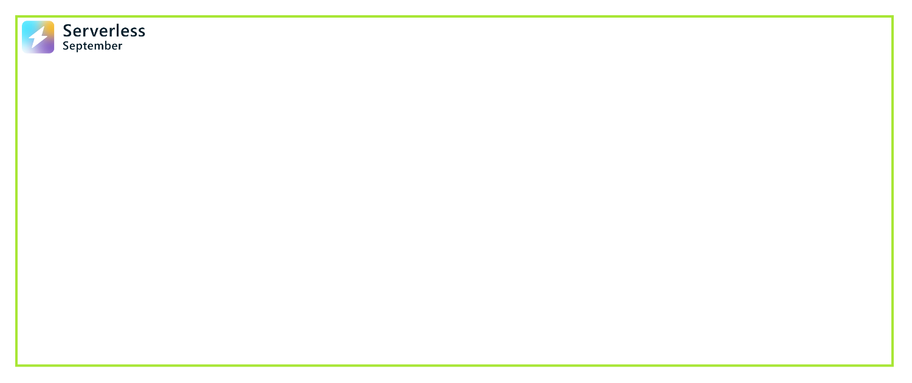

<!-- FIXME -->
<head>
  <meta name="twitter:url" 
    content="https://azure.github.io/Cloud-Native/blog/functions-1" />
  <meta name="twitter:title" 
    content="#30DaysOfServerless: Azure Functions Fundamentals" />
  <meta name="twitter:description" 
    content="#30DaysOfServerless: Azure Functions Fundamentals" />
  <meta name="twitter:image"
    content="https://azure.github.io/Cloud-Native/img/banners/post-kickoff.png" />
  <meta name="twitter:card" content="summary_large_image" />
  <meta name="twitter:creator" 
    content="@nitya" />
  <meta name="twitter:site" content="@AzureAdvocates" /> 
  <link rel="canonical" 
    href="https://azure.github.io/Cloud-Native/blog/08-functions-azure" />
</head>

---

Welcome to `Day 15` of #30DaysOfServerless!

---

## What We'll Cover
 * Spring boot apps in containers
 * CI/CD for containerized Spring boot apps
 * Step-by-step: Deploying to ACR
 * Step-by-step: Deploying and running on ACA
 * Exercise: Try this yourself!
 * Resources: For self-study!

---

## Spring boot apps in containers
    - CI/CD for containerized Spring Apps
    - Introduction to Azure Container Apps
    - Introduction to feature flags
## CI/CD for containerized Spring boot apps
     - GitHub Actions for CI/CD
     - Azure container Registry
     - CI/CD for containerized Spring Boot Apps
## Step-by-step: Deploying to ACR
     - Create an ACR instance
     - Deploy an image to ACR
     - View images in your registry
## Deploying and running on ACA
     - Create an ACA Environment
     - Create a Container App
     - Verify deployment
     - A/B testing using Feature Flags
 
## Exercise

## Resources