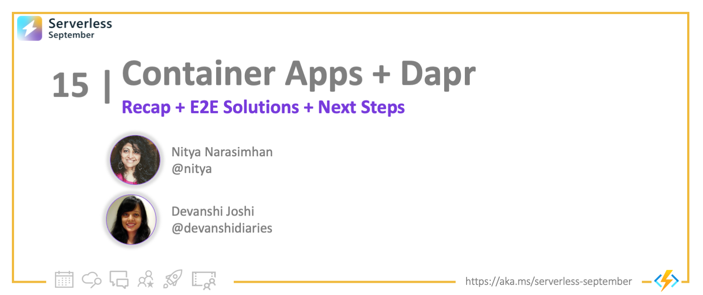
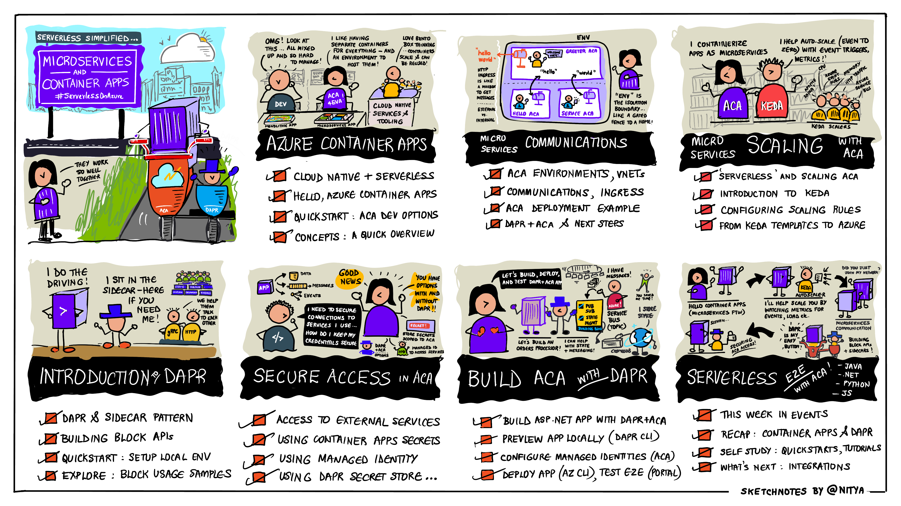

<head>
  <meta name="twitter:url" 
    content="https://azure.github.io/Cloud-Native/blog/15-microservices-azure" />
  <meta name="twitter:title" 
    content="#30DaysOfServerless: Azure Functions Fundamentals" />
  <meta name="twitter:description" 
    content="#30DaysOfServerless: Azure Functions Fundamentals" />
  <meta name="twitter:image"
    content="https://azure.github.io/Cloud-Native/img/banners/post-kickoff.png" />
  <meta name="twitter:card" content="summary_large_image" />
  <meta name="twitter:creator" 
    content="@nitya" />
  <meta name="twitter:site" content="@AzureAdvocates" /> 
  <link rel="canonical" 
    href="https://azure.github.io/Cloud-Native/blog/15-microservices-azure" />
</head>

---

Welcome to `Day 15` of #30DaysOfServerless!

This post marks the midpoint of our Serverless on Azure journey! Our [Week 2 Roadmap](https://azure.github.io/Cloud-Native/serverless-september/30DaysOfServerless/) showcased two key technologies - [Azure Container Apps (ACA)](https://learn.microsoft.com/azure/container-apps/) and [Dapr](https://dapr.io) - for building serverless microservices. We'll also look at what happened elsewhere in #ServerlessSeptember, then set the stage for our next week's focus: Serverless Integrations.

Ready? Let's Go!

---

## What We'll Cover
 * **ICYMI**: This Week on #ServerlessSeptember
 * **Recap**: Microservices, Azure Container Apps & Dapr
 * **Coming Next:** Serverless Integrations
 * **Exercise**: [Take the Cloud Skills Challenge](https://docs.microsoft.com/learn/challenges?id=b950cd7a-d456-46ab-81ba-3bd1ad86dc1c&WT.mc_id=javascript-99907-ninarasi)
 * **Resources**: For self-study!

## This Week In Events

We had a number of activities happen this week - here's a quick summary:
 * On **Zero To Hero:**  Anthony Chu took us on a [Journey to the Cloud with Azure Container Apps](/blog/zero2hero-aca-04) exploring tools to simplify develop-deploy workflows for ACA. And Melony Qin talked about [Using Custom Handlers For Go](/blog/zero2hero-func-03), explaining how this allows extended languages support in Azure Functions.
 * On **Serverless Hacks:**   Gwyn was joined by Liam Hampton as they talked about [How to DevOps and Serverless The Right Way](https://www.youtube.com/watch?v=EcsAcm22GqI). And it's not too late to complete the hack and [submit your solution to our hall of fame](https://azure.github.io/Cloud-Native/serverless-september/ServerlessHacks/).
 * On **Ask The Expert:**  We had our first Live Q&A Session featuring members of the Azure Functions team, hosted by Gwyn. Catch up on the [recording](https://www.youtube.com/watch?v=wB5Va1a-MeY) for useful tips and guidance.

## This Week in #30Days

In our #30Days series we focused on Azure Container Apps and Dapr.
 * In [Hello Container Apps](https://azure.github.io/Cloud-Native/blog/09-aca-fundamentals) we learned how Azure Container Apps helps you run microservices and containerized apps on serverless platforms. And we build and deployed our first ACA.
 * In [Microservices Communication](https://azure.github.io/Cloud-Native/blog/microservices-10) we explored concepts like _environments_ and _virtual networking_, with a hands-on example to show how two microservices communicate in a deployed ACA.
 * In [Scaling Your Container Apps](https://azure.github.io/Cloud-Native/blog/11-scaling-container-apps) we learned about KEDA (Kubernetes Event-Driven Autoscaler) and how to configure autoscaling for your ACA based on KEDA-supported triggers.
 * In [Build with Dapr](https://azure.github.io/Cloud-Native/blog/12-build-with-dapr) we introduced the Distributed Application Runtime (Dapr) and learned how its Building Block APIs and sidecar architecture make it easier to develop microservices with ACA.
 * In [Secure ACA Access](https://azure.github.io/Cloud-Native/blog/13-aca-managed-id) we learned how to secure ACA access to external services with - and without - Dapr, covering Secret Stores and Managed Identity.
 * Finally, [Build ACA with Dapr](https://azure.github.io/Cloud-Native/blog/14-dapr-aca-quickstart) tied it all together with a enterprise app scenario where an orders processor (ACA) uses Dapr APIs (PubSub, State Management) to receive and store order messages from Azure Service Bus.

Here's a visual recap:

## Self Study: Code Samples & Tutorials

There's no better way to get familiar with the concepts, than to dive in and play with code samples and hands-on tutorials. Here are 4 resources to bookmark and try out:
 1. [Dapr Quickstarts](https://docs.dapr.io/getting-started/quickstarts/) - these walk you through samples showcasing individual Building Block APIs - with multiple language options available.
 2. [Dapr Tutorials](https://docs.dapr.io/getting-started/tutorials/) provides more complex examples of microservices applications and tools usage, including a [Distributed Calculator](https://github.com/dapr/quickstarts/tree/master/tutorials/distributed-calculator) polyglot app.
 3. Next, try to [Deploy a Dapr application to Azure Container Apps](https://learn.microsoft.com/azure/container-apps/microservices-dapr?tabs=bash) to get familiar with the process of setting up the environment, then deploying the app.
 4. Or, explore the many [Azure Container Apps samples](https://learn.microsoft.com/azure/container-apps/samples?source=recommendations) showcasing various features and more complex architectures tied to real world scenarios.

## What's Next: Serverless Integrations!

So far we've talked about core technologies (Azure Functions, Azure Container Apps, Dapr) that provide foundational support for your serverless solution. Next, we'll look at **Serverless Integrations** - specifically at technologies like Azure Logic Apps and Azure Event Grid that _automate workflows_ and create seamless end-to-end solutions that integrate _other_ Azure services in serverless-friendly ways.

## Take the Challenge! 

The [**Cloud Skills Challenge**](https://docs.microsoft.com/learn/challenges?id=b950cd7a-d456-46ab-81ba-3bd1ad86dc1c&WT.mc_id=javascript-99907-ninarasi) is still going on, and we've already had hundreds of participants join and complete the learning modules to skill up on Serverless.

There's still time to join and get yourself on the leaderboard. Get familiar with Azure Functions, SignalR, Logic Apps, Azure SQL and more - in serverless contexts!! 

---
