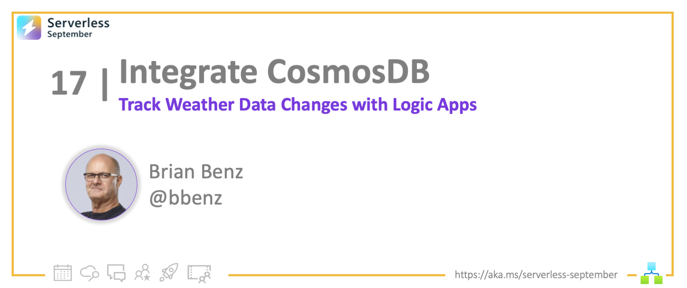
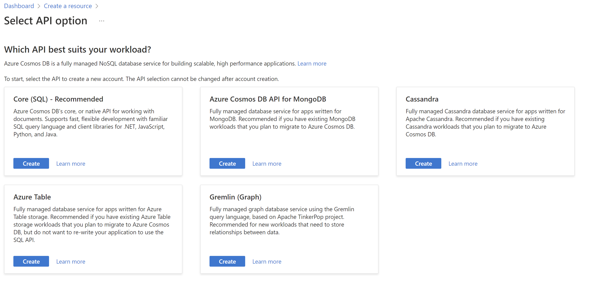
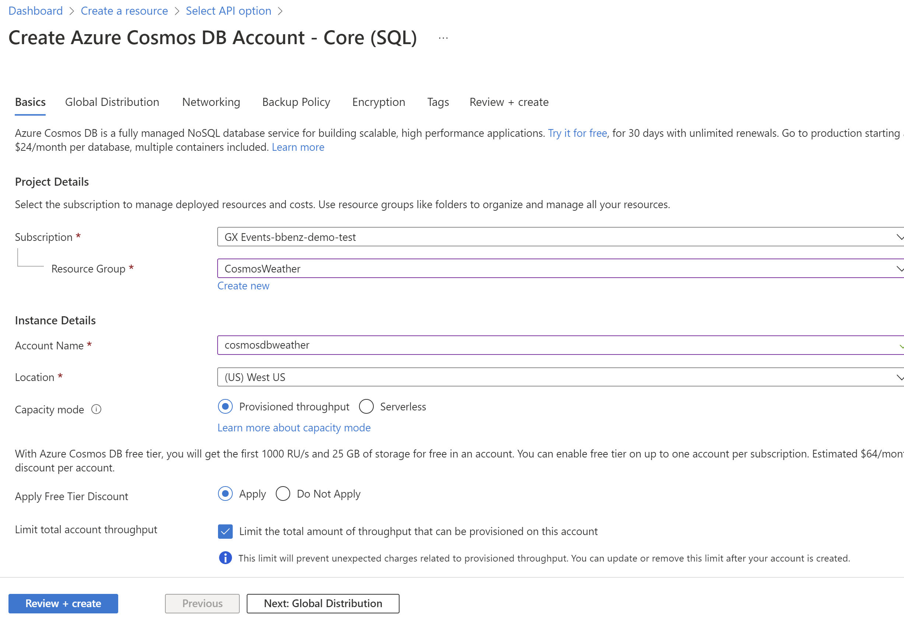
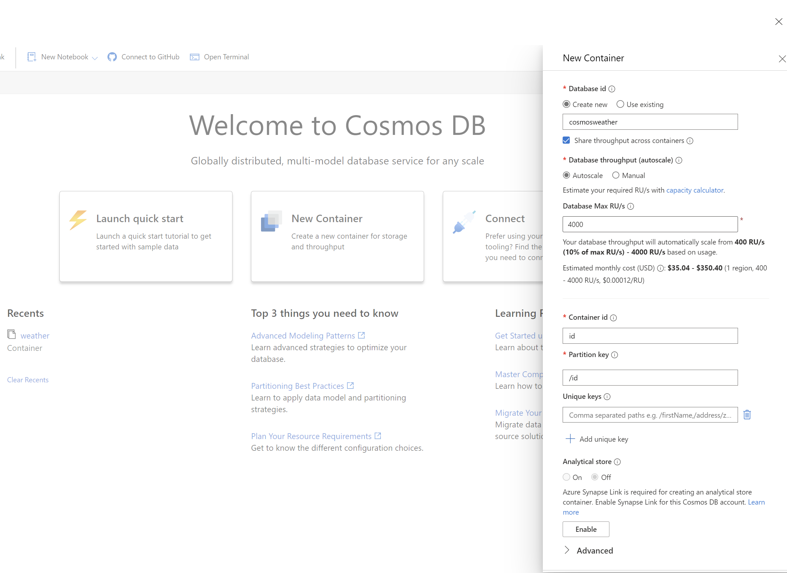
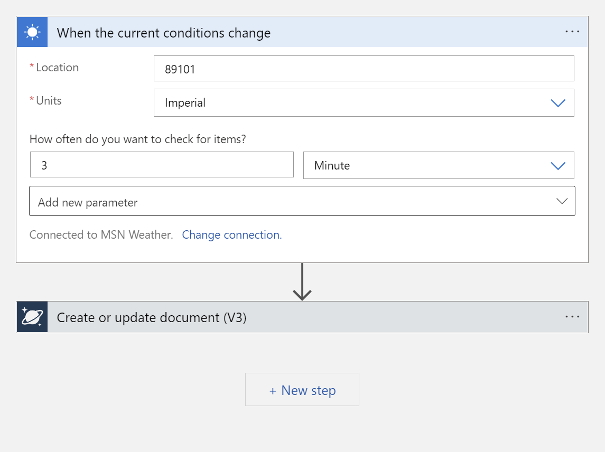
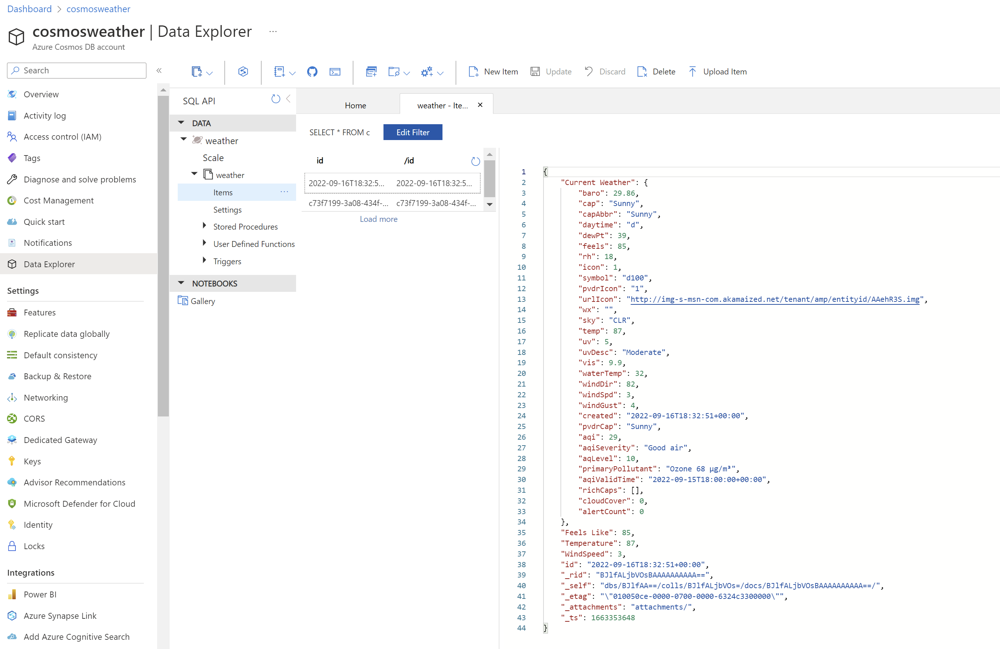

<!-- FIXME -->
<head>
  <meta name="twitter:url" 
    content="https://azure.github.io/Cloud-Native/blog/17-integrate-cosmosdb" />
  <meta name="twitter:title" 
    content="#30DaysOfServerless: Azure Functions Fundamentals" />
  <meta name="twitter:description" 
    content="#30DaysOfServerless: Azure Functions Fundamentals" />
  <meta name="twitter:image"
    content="https://azure.github.io/Cloud-Native/img/banners/post-kickoff.png" />
  <meta name="twitter:card" content="summary_large_image" />
  <meta name="twitter:creator" 
    content="@nitya" />
  <meta name="twitter:site" content="@AzureAdvocates" /> 
  <link rel="canonical" 
    href="https://azure.github.io/Cloud-Native/blog/17-integrate-cosmosdb" />
</head>

---

Welcome to `Day 17` of #30DaysOfServerless!

In past weeks, we've covered serverless technologies that provide core capabilities (functions, containers, microservices) for building serverless solutions. This week we're looking at technologies that make **service integrations** more seamless, starting with **Logic Apps**. Let's look at one usage example today!

Ready? Let's Go!

---

## What We'll Cover
 * Introduction to Logic Apps
 * Settng up Cosmos DB for Logic Apps
 * Setting up a Logic App connection and event
 * Writing data to Cosmos DB from a Logic app
 * Resources: For self-study!



---

## Introduction to Logic Apps

Previously in Serverless September, we've covered Azure Functions, where the event triggers code. In Logic Apps, the event triggers a workflow that you design. Logic Apps enable serverless applications to connect to external sources for data then automate business processes via workflows.

In this post I'll walk you through setting up a Logic App that works with Cosmos DB.  For this example, we'll connect to the MSN weather service, an design a logic app workflow that collects data when weather changes, and writes the data to Cosmos DB.

:::info PREREQUISITES

* An active Azure subscription (with Contributor or Owner permissions).
* Don't have one? [Create an account for free](https://azure.microsoft.com/free/).
:::


## Setup Cosmos DB for Logic Apps
Cosmos DB has [many APIs to choose from](https://learn.microsoft.com/azure/cosmos-db/choose-api), but to use the [default Logic App connection](https://docs.microsoft.com/connectors/documentdb/), we need to choose the a Cosmos DB SQL API.  We'll set this up via the Azure Portal. 

To get started with Cosmos DB, you create an account, then a database, then a container to store JSON documents. To create a new Cosmos DB account from the [portal dashboard](https://portal.azure.com), Select **Create a resource > Azure Cosmos DB > Create**.  Choose **core SQL** for the API.



Select your subscription, then create a new resource group called **CosmosWeather**.  Enter an account name and choose a location, select provisioned throughput capacity mode and apply the free tier discount. From here you can select **Review and Create**, then **Create** 

> Azure Cosmos DB is available in two different capacity modes: provisioned throughput and [serverless](https://docs.microsoft.com/azure/cosmos-db/throughput-serverless). You can perform the same database operations in both modes, but the way you get billed for these operations is different. We wil be using provisioned throughput and the free tier for this example.




Next, create a new database and container. Go to the **Data Explorer** in your new Cosmos DB account, and choose **New Container**.  Name the database, and keep all the orher defaults except:  

| Setting | Action |
|---|---|
| Container ID | id |
| Container partition |  /id |

Press **OK** to create a database and container

>A database is analogous to a traditional DBMS namespace. It's used to organize one or more containers.



Now we're ready to set up our logic app an write to Cosmos DB!  

## Setup Logic App connection + event

Once the Cosmos DB SQL API account is created, we can set up our Logic App.  From the [portal dashboard](https://portal.azure.com), Select **Create a resource > Integration > Logic App > Create**.  Name your Logic App and select a location, the rest fo the settings can be left at their defaults.  Once you new Logic App is created, select **Create a workflow from designer** to get started.  

>A workflow is a series of steps that defines a task or process. Each workflow starts with a single trigger, after which you must add one or more actions.

When in designer, search for **weather** on the right under **Add a trigger**.  Choose **MSN Weather**.  Choose 
**When the current conditions change** as the trigger.  

>A trigger is always the first step in any workflow and specifies the condition for running any further steps in that workflow. 

Add a location.  Valid locations are City, Region, State, Country, Landmark, Postal Code, latitude and longitude.  This triggers a new workflow when the conditions change for a location.

## Write data from Logic App to Cosmos DB 

Now we are ready to set up the action to write data to Cosmos DB.  Choose **add an action** and choose Cosmos DB.  

> An action is each step in a workflow after the trigger. Every action runs some operation in a workflow.

In this case, we will be writing a JSON document to the Cosmos DB container we created earlier.  Choose **Create or Update Document** from the actions.  At this point you should have a workflow in designer that looks something like this: 



Start wth the connection for set up the Cosmos DB action.  Select **Access Key**, and provide the primary read-write key (found under keys in Cosmos DB), and the Cosmos DB account ID (without 'documents.azure.com'). 

Next, fill in your Cosmos DB Database ID and Collection ID.  Create a JSON document bt selecting dynamic content elements and wrapping JSON formatting around them.  

You will need a unique ID for each document that you write to Cosmos DB, for that you can use an expression.  Because we declared **id** to be our unique ID in Cosmos DB, we will use use that for the name.  Under expressions, type ```guid()``` and press enter to add a unique ID to the JSON document.  When complete, you should have a workflow in designer that looks something like this:  


Save the workflow and test the connections by clicking **Run Trigger > Run**.  If connections are working, you should see documents flowing into Cosmos DB over the next few minutes.   

Check the data in Cosmos Db by opening the Data explorer, then choosing the container you created and selecting **items**.  You should see documents similar to this: 



## Resources: For self-study!

Once you've grasped the basics in ths post, there is so much more to learn!  

- Check out the other [Serverless September posts](https://azure.github.io/Cloud-Native/blog).  
- For more detail about Cosmos DB, see the docs at https://learn.microsoft.com/azure/cosmos-db/
- For more info on Logic Apps, see the docs at https://learn.microsoft.com/azure/logic-apps/

Thanks for stopping by!  

