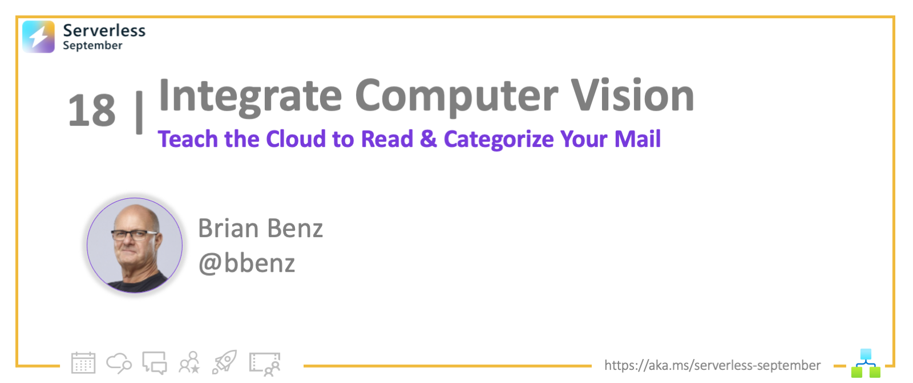
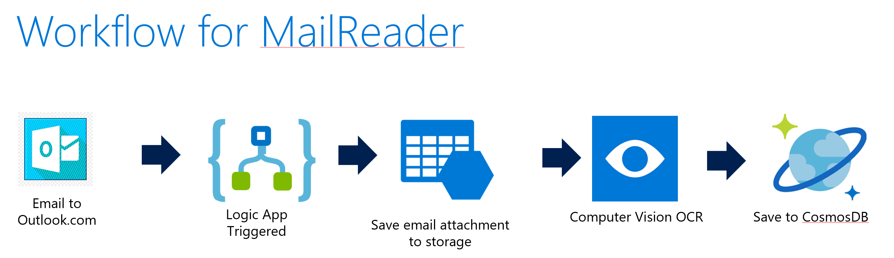
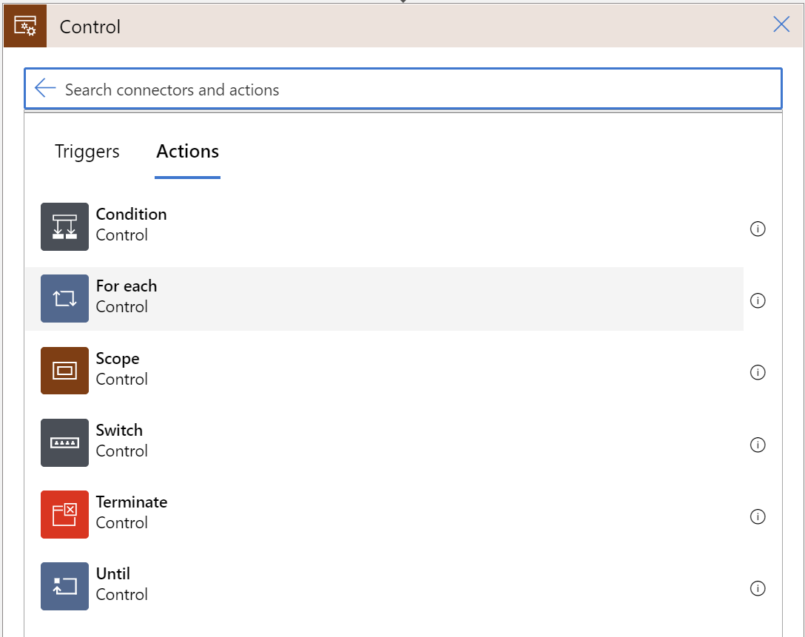
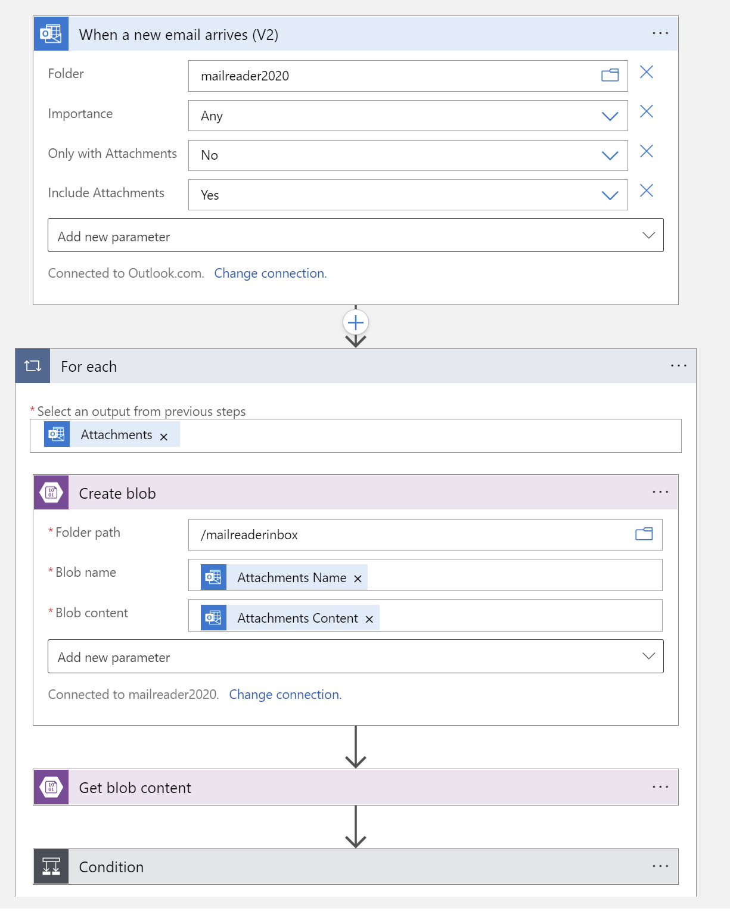
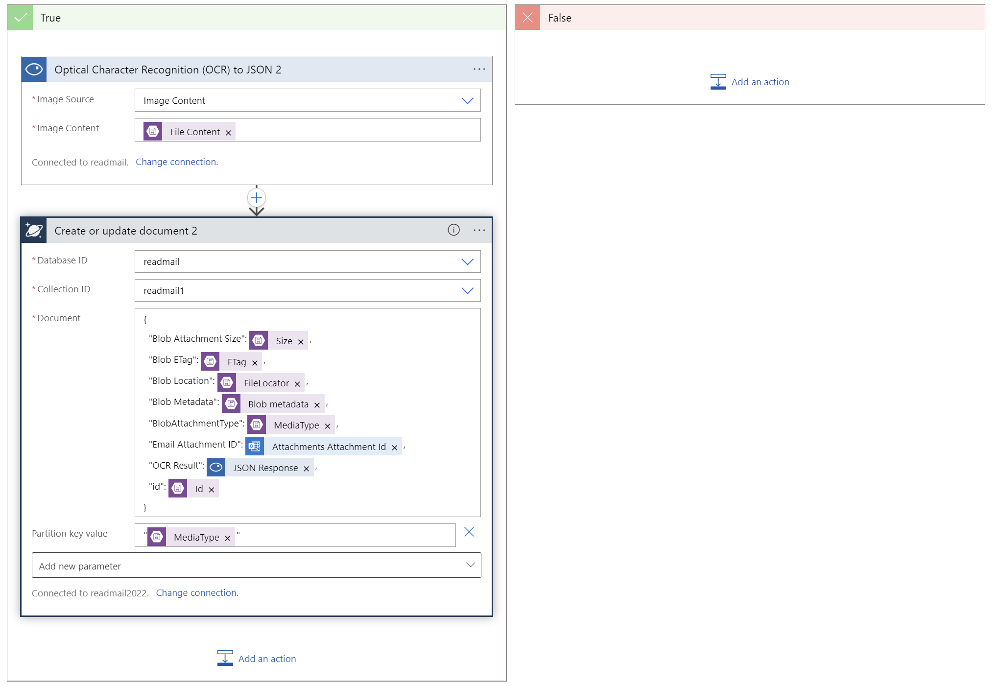

<!-- FIXME -->
<head>
  <meta name="twitter:url" 
    content="https://azure.github.io/Cloud-Native/blog/18-cloudmail" />
  <meta name="twitter:title" 
    content="#30DaysOfServerless: Logic Apps + Computer Vision" />
  <meta name="twitter:description" 
    content="#30DaysOfServerless: Logic Apps + Computer Vision" />
  <meta name="twitter:image"
    content="https://azure.github.io/Cloud-Native/img/banners/post-kickoff.png" />
  <meta name="twitter:card" content="summary_large_image" />
  <meta name="twitter:creator" 
    content="@nitya" />
  <meta name="twitter:site" content="@AzureAdvocates" /> 
  <link rel="canonical" 
    href="https://azure.github.io/Cloud-Native/blog/18-cloudmail" />
</head>

---

Welcome to `Day 18` of #30DaysOfServerless!

Yesterday my Serverless September post introduced you to making Azure Logic Apps and Azure Cosmos DB work together with a sample application that collects weather data.  Today I'm sharing a more robust solution that actually reads my mail.  Let's learn about **Teaching the cloud to read your mail!**

Ready? Let's go!

---

## What We'll Cover
 * Introduction to the ReadMail solution
 * Setting up Azure storage, Cosmos DB and Computer Vision
 * Connecting it all together with a Logic App 
 * Resources: For self-study!

---

## Introducing the ReadMail solution

The US Postal system offers [a subscription service](https://informeddelivery.usps.com/) that sends you images of mail it will be delivering to your home.  I decided it would be cool to try getting Azure to collect data based on these images, so that I could categorize my mail and track the types of mail that I received.  

To do this, I used Azure storage, Cosmos DB, Logic Apps, and computer vision.  When a new email comes in from the US Postal service (USPS), it triggers a logic app that:

* Posts attachments to Azure storage
* Triggers Azure Computer vision to perform an OCR function on attachments
* Extracts any results into a JSON document
* Writes the JSON document to Cosmos DB 

In this post I'll walk you through setting up the solution for yourself.  

:::info Prerequisites

- Contributor or Owner permissions on an active Azure subscription.
  - Don't have one? [Create an account for free](https://azure.microsoft.com/free/).
- A [USPS Informed Delivery account](https://informeddelivery.usps.com/).
  - Alternatively, any service that sends attached images via email
:::

---

## Setup Azure Services

First, we'll create all of the target environments we need to be used by our Logic App, then we;ll create the Logic App.  

### 1. Azure Storage 

We'll be using Azure storage to collect attached images from emails as they arrive.  Adding images to Azure storage will also trigger a workflow that performs OCR on new attached images and stores the OCR data in Cosmos DB.  
 
To create a new Azure storage account from the [portal dashboard](https://portal.azure.com), Select **Create a resource > Storage account > Create**.  

The **Basics** tab covers all of the features and information that we will need for this solution: 

| Section | Field | Required or optional | Description |
|--|--|--|--|
| Project details | Subscription | Required | Select the subscription for the new storage account. |
| Project details | Resource group | Required | Create a new resource group that you will use for storage, Cosmos DB, Computer Vision and the Logic App. |
| Instance details | Storage account name | Required | Choose a unique name for your storage account. Storage account names must be between 3 and 24 characters in length and may contain numbers and lowercase letters only. |
| Instance details | Region | Required | Select the appropriate region for your storage account.  |
| Instance details | Performance | Required | Select **Standard** performance for general-purpose v2 storage accounts (default). |
| Instance details | Redundancy | Required | Select **locally-redundant Storage (LRS)** for this example.  |

Select **Review + create** to accept the remaining default options, then validate and create the account.

### 2. Azure CosmosDB

CosmosDB will be used to store the JSON documents returned by the COmputer Vision OCR process.  

> See more details and screen shots for setting up CosmosDB in yesterday's Serverless September post - **Using Logic Apps with Cosmos DB**

To get started with Cosmos DB, you create an account, then a database, then a container to store JSON documents. To create a new Cosmos DB account from the [portal dashboard](https://portal.azure.com), Select **Create a resource > Azure Cosmos DB > Create**.  Choose **core SQL** for the API.

Select your subscription, then for simplicity use the same resource group you created when you set up storage.  Enter an account name and choose a location, select provisioned throughput capacity mode and apply the free tier discount. From here you can select **Review and Create**, then **Create** 

Next, create a new database and container. Go to the **Data Explorer** in your new Cosmos DB account, and choose **New Container**.  Name the database, and keep all the other defaults except:  

| Setting | Action |
|---|---|
| Container ID | id |
| Container partition |  /id |

Press **OK** to create a database and container

### 3. Azure Computer Vision

Azure Cognitive Services' [Computer Vision](https://azure.microsoft.com/products/cognitive-services/computer-vision/) will perform an OCR process on each image attachment that is stored in Azure storage.  

From the [portal dashboard](https://portal.azure.com), Select **Create a resource > AI + Machine Learning > Computer Vision > Create**. 

The **Basics** and **Identity** tabs cover all of the features and information that we will need for this solution: 

**Basics Tab**

| Section | Field | Required or optional | Description |
|--|--|--|--|
| Project details | Subscription | Required | Select the subscription for the new service. |
| Project details | Resource group | Required | Use the same resource group that you used for Azure storage and Cosmos DB. |
| Instance details | Region | Required | Select the appropriate region for your Computer Vision service. |
| Instance details | Name | Required | Choose a unique name for your Computer Vision service. |
| Instance details | Pricing | Required | Select the free tier for this example. |

**Identity Tab**

| Section | Field | Required or optional | Description |
|--|--|--|--|
| System assigned managed identity | Status | Required | Enable system assigned identity to grant the resource access to other existing resources. |

Select **Review + create** to accept the remaining default options, then validate and create the account.

---

## Connect it all with a Logic App 

Now we're ready to put this all together in a Logic App workflow!  

:::tip 1. Create Logic App
:::
From the [portal dashboard](https://portal.azure.com), Select **Create a resource > Integration > Logic App > Create**.  Name your Logic App and select a location, the rest of the settings can be left at their defaults.  

:::tip 2. Create Workflow: Add Trigger
:::
Once the Logic App is created, select **Create a workflow from designer**.  

>A workflow is a series of steps that defines a task or process. Each workflow starts with a single trigger, after which you must add one or more actions.

When in designer, search for **outlook.com** on the right under **Add a trigger**.  Choose **outlook.com**.  Choose 
**When a new email arrives** as the trigger.  

>A trigger is always the first step in any workflow and specifies the condition for running any further steps in that workflow. 

Set the following values: 

| Parameter | Value | 
|--|--|
| Folder | Inbox | 
| Importance | Any | 
| Only With Attachments | Yes | 
| Include Attachments | Yes | 

Then add a new parameter:

| Parameter | Value | 
|--|--|
| From | Add the email address that sends you the email with attachments | 

:::tip 3. Create Workflow: Add Action (for Trigger)
:::

Choose **add an action** and choose **control > for-each**. 

Inside the for-each action, in **Select an output from previous steps**, choose **attachments**.  Then, again inside the  for-each action, add the **create blob** action: 

Set the following values: 

| Parameter | Value | 
|--|--|
| Folder Path | /mailreaderinbox | 
| Blob Name | Attachments Name | 
| Blob Content | Attachments Content | 

This extracts attachments from the email and created a new blob for each attachment. 

Next, inside the same for-each action, add the **get blob content** action.

Set the following values: 

| Parameter | Value | 
|--|--|
| Blob | id | 
| Infer content type | Yes | 

> We create and read from a blob for each attachment because Computer Vision needs a non-virtual source to read from when performing an OCR process. Because we enabled system assigned identity to grant Computer Vision to other existing resources, it can access the blob but not the outlook.com attachment.  Also, we pass the ID of the blob to use as a unique ID when writing to Cosmos DB.

Next, inside the same for-each action, choose **add an action** and choose **control > condition**. Set the value to **Media Type > is equal to > image/JPEG**

> The USPS sends attachments of multiple types, but we only want to scan attachments that have images of our mail, which are always JPEG images. If the condition is true, we will process the image with Computer Vision OCR and write the results to a JSON document in CosmosDB.

In the **True** section of the condition, add an action and choose **Computer Vision API > Optical Character Recognition (OCR) to JSON**. 

Set the following values: 

| Parameter | Value | 
|--|--|
| Image Source | Image Content | 
| Image content | File Content | 

In the same **True** section of the condition, choose **add an action** and choose Cosmos DB.  Choose **Create or Update Document** from the actions.  Select **Access Key**, and provide the primary read-write key (found under keys in Cosmos DB), and the Cosmos DB account ID (without 'documents.azure.com'). 

Next, fill in your Cosmos DB Database ID and Collection ID.  Create a JSON document by selecting dynamic content elements and wrapping JSON formatting around them. 

>Be sure to use the ID passed from blob storage as your unique ID for CosmosDB.  That way you can troubleshoot and JSON or OCR issues by tracing back the JSON document in Cosmos Db to the blob in Azure storage.  Also, include the Computer Vision JSON response, as it contains the results of the Computer Vision OCR scan.  all other elements are optional.  

:::tip 4. TEST WORKFLOW
:::

When complete, you should have an action the Logic App designer that looks something like this:  

Save the workflow and test the connections by clicking **Run Trigger > Run**.  If connections are working, you should see documents flowing into Cosmos DB each time that an email arrives with image attachments.   

Check the data in Cosmos Db by opening the Data explorer, then choosing the container you created and selecting **items**.  You should see documents similar to this: 

:::tip 1. Congratulations
You just built your personal ReadMail solution with Logic Apps! 🎉
:::

---

## Resources: For self-study!

Once you have an understanding of the basics in ths post, there is so much more to learn!  

- Check out the other [Serverless September posts](https://azure.github.io/Cloud-Native/blog).  
- For more detail about Cosmos DB, see the docs at https://learn.microsoft.com/azure/cosmos-db/
- For more info on Logic Apps, see the docs at https://learn.microsoft.com/azure/logic-apps/
- For details on Azure Cognitive Services and Computer Vision, see https://azure.microsoft.com/products/cognitive-services/computer-vision/.

Thanks for stopping by!  