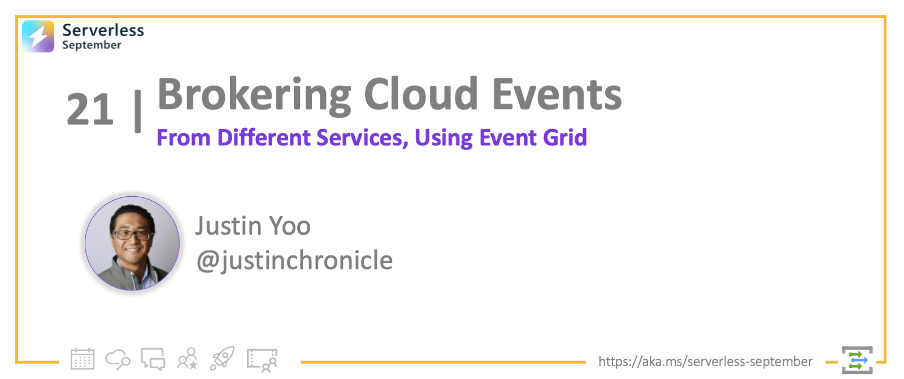

<!-- FIXME -->
<head>
  <meta name="twitter:url" 
    content="https://azure.github.io/Cloud-Native/blog/21-cloudevents-via-event-grid" />
  <meta name="twitter:title" 
    content="#30DaysOfServerless: CloudEvents and Azure Event Grid" />
  <meta name="twitter:description" 
    content="#30DaysOfServerless: How to Consume CloudEvents via Azure Event Grid" />
  <meta name="twitter:image"
    content="https://azure.github.io/Cloud-Native/img/banners/post-kickoff.png" />
  <meta name="twitter:card" content="summary_large_image" />
  <meta name="twitter:creator" 
    content="@nitya" />
  <meta name="twitter:site" content="@AzureAdvocates" /> 
  <link rel="canonical" 
    href="https://azure.github.io/Cloud-Native/blog/21-cloudevents-via-event-grid" />
</head>

---

Welcome to `Day 21` of #30DaysOfServerless!

We've so far walked through what [Azure Event Grid][az eg] is and how it generally works. Today, let's discuss how Azure Event Grid deals with [CloudEvents][ce].

---

## What We'll Cover

- [What We'll Cover](#what-well-cover)
- [What is CloudEvents?](#what-is-cloudevents)
- [How Azure Event Grid brokers CloudEvents](#how-azure-event-grid-brokers-cloudevents)
  - [Azure Event Grid for Azure](#azure-event-grid-for-azure)
  - [Azure Event Grid for Systems outside Azure](#azure-event-grid-for-systems-outside-azure)
- [How Azure Logic Apps consumes CloudEvents](#how-azure-logic-apps-consumes-cloudevents)
- [Exercise: Try this yourself!](#exercise-try-this-yourself)
- [Resources: For self-study!](#resources-for-self-study)



---

OK. Let's get started!


## What is CloudEvents?

Needless to say, events are everywhere. Events come not only from event-driven systems but also from many different systems and devices, including IoT ones like Raspberry PI.

But the problem is that every event publisher (system/device that creates events) describes their events differently, meaning there is no standard way of describing events. It has caused many issues between systems, mainly from the interoperability perspective.

1. Consistency: No standard way of describing events resulted in developers having to write their own event handling logic for each event source.
2. Accessibility: There were no common libraries, tooling and infrastructure to deliver events across systems.
3. Productivity: The overall productivity decreases because of the lack of the standard format of events.

<div style="text-align: center;">
  
</div>

Therefore, [CNCF (Cloud-Native Computing Foundation)][cncf] has brought up the concept, called [CloudEvents][ce]. CloudEvents is a specification that commonly describes event data. Conforming any event data to this spec will simplify the event declaration and delivery across systems and platforms and more, resulting in a huge productivity increase.


## How Azure Event Grid brokers CloudEvents

Before CloudEvents, [Azure Event Grid][az eg] described events in their own way. Therefore, if you want to use Azure Event Grid, you should follow the event format/schema that Azure Event Grid declares. However, not every system/service/application follows the Azure Event Grid schema. Therefore, Azure Event Grid now supports [CloudEvents spec][az eg ce] as input and output formats.


### Azure Event Grid for Azure

Take a look at the simple diagram below, which describes how Azure Event Grid captures events raised from various Azure services. In this diagram, Azure Key Vault takes the role of the event source or event publisher, and [Azure Logic Apps][az logapp] takes the role of the event handler (I'll discuss Azure Logic Apps as the event handler later in this post). We use [Azure Event Grid System Topic][az eg topic system] for Azure.

![Azure Event Grid for Azure][image-01]

Therefore, let's create an [Azure Event Grid System Topic][az eg topic system] that captures events raised from [Azure Key Vault][az kv] when a new version of a secret is added.

![Azure Event Grid System Topic for Key Vault][image-02]

As Azure Event Grid makes use of the [pub/sub pattern][enterprisepattern pubsub], you need to create the [Azure Event Grid Subscription][ag eg sub] to consume the events. Here's the subscription that uses the Event Grid data format:

![Azure Event Grid System Subscription for Key Vault in Event Grid Format][image-03]

Once you create the subscription, create a new version of the secret on Azure Key Vault. Then, Azure Key Vault raises an event, which is captured in the Event Grid format:

```json
[
  {
    "id": "6f44b9c0-d37e-40e7-89be-f70a6da291cc",
    "topic": "/subscriptions/xxxxxxxx-xxxx-xxxx-xxxx-xxxxxxxxxxxx/resourceGroups/rg-aegce-krc/providers/Microsoft.KeyVault/vaults/kv-xxxxxxxx",
    "subject": "hello",
    "eventType": "Microsoft.KeyVault.SecretNewVersionCreated",
    "data": {
      "Id": "https://kv-xxxxxxxx.vault.azure.net/secrets/hello/064dfc082fec463f8d4610ed6118811d",
      "VaultName": "kv-xxxxxxxx",
      "ObjectType": "Secret",
      "ObjectName": "hello",
      "Version": "064dfc082fec463f8d4610ed6118811d",
      "NBF": null,
      "EXP": null
    },
    "dataVersion": "1",
    "metadataVersion": "1",
    "eventTime": "2022-09-21T07:08:09.1234567Z"
  }
]
```

So, how is it different from the CloudEvents format? Let's take a look. According to the [spec][ce spec json], the JSON data in CloudEvents might look like this:

```json
{
  "id" : "C234-1234-1234",
  "source" : "/mycontext",
  "specversion" : "1.0",
  "type" : "com.example.someevent",
  "comexampleextension1" : "value",
  "time" : "2018-04-05T17:31:00Z",
  "datacontenttype" : "application/cloudevents+json",
  "data" : {
    "appinfoA" : "abc",
    "appinfoB" : 123,
    "appinfoC" : true
  }
}
```

This time, let's create another subscription using the CloudEvents schema. Here's how to create the subscription against the system topic:

![Azure Event Grid System Subscription for Key Vault in CloudEvents Format][image-04]

Therefore, Azure Key Vault emits the event data in the CloudEvents format:

```json
{
  "id": "6f44b9c0-d37e-40e7-89be-f70a6da291cc",
  "source": "/subscriptions/xxxxxxxx-xxxx-xxxx-xxxx-xxxxxxxxxxxx/resourceGroups/rg-aegce-krc/providers/Microsoft.KeyVault/vaults/kv-xxxxxxxx",
  "specversion": "1.0",
  "type": "Microsoft.KeyVault.SecretNewVersionCreated",
  "subject": "hello",
  "time": "2022-09-21T07:08:09.1234567Z",
  "data": {
    "Id": "https://kv-xxxxxxxx.vault.azure.net/secrets/hello/064dfc082fec463f8d4610ed6118811d",
    "VaultName": "kv-xxxxxxxx",
    "ObjectType": "Secret",
    "ObjectName": "hello",
    "Version": "064dfc082fec463f8d4610ed6118811d",
    "NBF": null,
    "EXP": null
  }
}
```

Can you identify some differences between the Event Grid format and the CloudEvents format? Fortunately, both Event Grid schema and CloudEvents schema look similar to each other. But they might be significantly different if you use a different event source outside Azure.


### Azure Event Grid for Systems outside Azure

As mentioned above, the event data described outside Azure or your own applications within Azure might not be understandable by Azure Event Grid. In this case, we need to use [Azure Event Grid Custom Topic][az eg topic custom]. Here's the diagram for it:

![Azure Event Grid for Applications outside Azure][image-05]

Let's create the Azure Event Grid Custom Topic. When you create the topic, make sure that you use the CloudEvent schema during the provisioning process:

![Azure Event Grid Custom Topic][image-06]

If your application needs to publish events to Azure Event Grid Custom Topic, your application should build the event data in the CloudEvents format. If you use a .NET application, add the [NuGet package][az eg nuget] first.

```bash
dotnet add package Azure.Messaging.EventGrid
```

Then, create the publisher instance. You've already got the topic endpoint URL and the access key.

```csharp
var topicEndpoint = new Uri("<Azure Event Grid Custom Topic Endpoint URL>");
var credential = new AzureKeyCredential("<Azure Event Grid Custom Topic Access Key>");
var publisher = new EventGridPublisherClient(topicEndpoint, credential);
```

Now, build the event data like below. Make sure that you follow the CloudEvents schema that requires additional metadata like event source, event type and content type.

```csharp
var source = "/your/event/source";
var type = "com.source.event.your/OnEventOccurs";

var data = new MyEventData() { Hello = "World" };

var @event = new CloudEvent(source, type, data);
```

And finally, send the event to Azure Event Grid Custom Topic.

```csharp
await publisher.SendEventAsync(@event);
```

The captured event data looks like the following:

```json
{
  "id": "cc2b2775-52b8-43b8-a7cc-c1c33c2b2e59",
  "source": "/your/event/source",
  "type": "com.source.event.my/OnEventOccurs",
  "data": {
    "Hello": "World"
  },
  "time": "2022-09-21T07:08:09.1234567+00:00",
  "specversion": "1.0"
}
```

However, due to limitations, someone might insist that their existing application doesn't or can't emit the event data in the CloudEvents format. In this case, what should we do? There's no standard way of sending the event data in the CloudEvents format to Azure Event Grid Custom Topic. One of the approaches we may be able to apply is to put a converter between the existing application and Azure Event Grid Custom Topic like below:

![Azure Event Grid for Applications outside Azure with Converter][image-07]

Once the Function app (or any converter app) receives legacy event data, it internally converts the CloudEvents format and publishes it to Azure Event Grid.

```csharp
var data = default(MyRequestData);
using (var reader = new StreamReader(req.Body))
{
    var serialised = await reader.ReadToEndAsync();
    data = JsonConvert.DeserializeObject<MyRequestData>(serialised);
}

var converted = new MyEventData() { Hello = data.Lorem };
var @event = new CloudEvent(source, type, converted);
```

The converted event data is captured like this:

```json
{
  "id": "df296da3-77cd-4da2-8122-91f631941610",
  "source": "/your/event/source",
  "type": "com.source.event.my/OnEventOccurs",
  "data": {
    "Hello": "ipsum"
  },
  "time": "2022-09-21T07:08:09.1234567+00:00",
  "specversion": "1.0"
}
```

This approach is beneficial in many integration scenarios to make all the event data canonicalised.


## How Azure Logic Apps consumes CloudEvents

I put [Azure Logic Apps][az logapp] as the event handler in the previous diagrams. According to the [CloudEvents spec][ce spec webhook], each event handler must implement request validation to avoid abuse. One good thing about using Azure Logic Apps is that it has already implemented this request validation feature. It implies that we just subscribe to the topic and consume the event data.

Create a new Logic Apps instance and add the HTTP Request trigger. Once it saves, you will get the endpoint URL.

![Azure Logic Apps with HTTP Request Trigger][image-08]

Then, create the Azure Event Grid Subscription with:

* Endpoint type: Webhook
* Endpoint URL: The Logic Apps URL from above.

![Azure Logic Apps with HTTP Request Trigger][image-09]

Once the subscription is ready, this Logic Apps works well as the event handler. Here's how it receives the CloudEvents data from the subscription.

![Azure Logic Apps that Received CloudEvents data][image-10]

Now you've got the CloudEvents data. It's entirely up to you to handle that event data however you want!


## Exercise: Try this yourself!

You can fork this [GitHub repository][gh sample] to your account and play around with it to see how Azure Event Grid with CloudEvents works. Alternatively, the "Deploy to Azure" button below will provision all necessary Azure resources and deploy an Azure Functions app to mimic the event publisher.

[](https://portal.azure.com/#create/Microsoft.Template/uri/https%3A%2F%2Fraw.githubusercontent.com%2Fjustinyoo%2Fazure-event-grid-cloudevents-sample%2Fmain%2FResources%2Fazuredeploy.json)


## Resources: For self-study!

Want to know more about CloudEvents in real-life examples? Here are several resources you can take a look at:

* [Azure CLI for EventGrid Subscription to Custom Topic][post 1]
* [CloudEvents for Azure EventGrid via Azure Functions][post 2]
* [WebSub to EventGrid via CloudEvents, and Beyond][post 3]
* [Event-Driven KeyVault Secrets Rotation Management][post 4]


[image-01]: img/21-cloudevents-via-event-grid-01.png
[image-02]: img/21-cloudevents-via-event-grid-02.png
[image-03]: img/21-cloudevents-via-event-grid-03.png
[image-04]: img/21-cloudevents-via-event-grid-04.png
[image-05]: img/21-cloudevents-via-event-grid-05.png
[image-06]: img/21-cloudevents-via-event-grid-06.png
[image-07]: img/21-cloudevents-via-event-grid-07.png
[image-08]: img/21-cloudevents-via-event-grid-08.png
[image-09]: img/21-cloudevents-via-event-grid-09.png
[image-10]: img/21-cloudevents-via-event-grid-10.png


[cncf]: https://cncf.io/
[ce]: https://cloudevents.io/
[ce spec json]: https://github.com/cloudevents/spec/blob/v1.0/json-format.md#23-examples
[ce spec webhook]: https://github.com/cloudevents/spec/blob/v1.0/http-webhook.md#4-abuse-protection

[az eg]: https://docs.microsoft.com/azure/event-grid/overview?WT.mc_id=dotnet-75362-juyoo
[az eg topic system]: https://docs.microsoft.com/azure/event-grid/system-topics?WT.mc_id=dotnet-75362-juyoo
[az eg topic custom]: https://docs.microsoft.com/azure/event-grid/custom-topics?WT.mc_id=dotnet-75362-juyoo
[ag eg sub]: https://docs.microsoft.com/azure/event-grid/concepts?WT.mc_id=dotnet-75362-juyoo#event-subscriptions
[az eg ce]: https://docs.microsoft.com/azure/event-grid/cloudevents-schema?WT.mc_id=dotnet-75362-juyoo
[az eg nuget]: https://www.nuget.org/packages/Azure.Messaging.EventGrid

[az kv]: https://docs.microsoft.com/azure/key-vault/general/basic-concepts?WT.mc_id=dotnet-75362-juyoo

[az logapp]: https://docs.microsoft.com/azure/logic-apps/logic-apps-overview?WT.mc_id=dotnet-75362-juyoo

[enterprisepattern pubsub]: https://www.enterpriseintegrationpatterns.com/PublishSubscribeChannel.html

[gh sample]: https://github.com/justinyoo/azure-event-grid-cloudevents-sample

[post 1]: https://techcommunity.microsoft.com/t5/apps-on-azure-blog/azure-cli-for-eventgrid-subscription-to-custom-topic/ba-p/2038834?WT.mc_id=dotnet-75362-juyoo
[post 2]: https://techcommunity.microsoft.com/t5/apps-on-azure-blog/cloudevents-for-azure-eventgrid-via-azure-functions/ba-p/2048140?WT.mc_id=dotnet-75362-juyoo
[post 3]: https://techcommunity.microsoft.com/t5/apps-on-azure-blog/websub-to-eventgrid-via-cloudevents-and-beyond/ba-p/2092709?WT.mc_id=dotnet-75362-juyoo
[post 4]: https://techcommunity.microsoft.com/t5/apps-on-azure-blog/event-driven-keyvault-secrets-rotation-management/ba-p/2187249?WT.mc_id=dotnet-75362-juyoo
