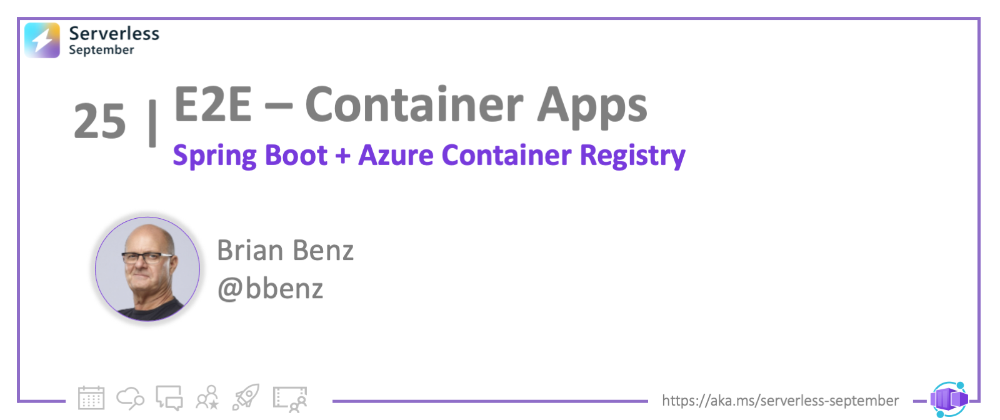

 
<head>
  <meta name="twitter:url" 
    content="https://azure.github.io/Cloud-Native/blog/23-aca-java" />
  <meta name="twitter:title" 
    content="#30DaysOfServerless: Deploy Spring Boot App to ACA" />
  <meta name="twitter:description" 
    content="#30DaysOfServerless: Deploy Spring Boot App to ACA" />
  <meta name="twitter:image"
    content="https://azure.github.io/Cloud-Native/img/banners/post-kickoff.png" />
  <meta name="twitter:card" content="summary_large_image" />
  <meta name="twitter:creator" 
    content="@nitya" />
  <meta name="twitter:site" content="@AzureAdvocates" /> 
  <link rel="canonical" 
    href="https://azure.github.io/Cloud-Native/blog/23-aca-java" />
</head>

---

Welcome to `Day 25` of #30DaysOfServerless!


[Azure Container Apps](https://docs.microsoft.com/azure/container-apps/overview) enable application code packaged in containers to run and scale without the overhead of managing cloud infrastructure and container orchestration.  In this post I'll show you how to **deploy a Java application running on Spring Boot in a container to Azure Container Registry and Azure Container Apps.** 

---

## What We'll Cover
 * Introduction to Deploying Java containers in the cloud
 * Step-by-step: Deploying to Azure Container Registry
 * Step-by-step: Deploying and running on Azure Container Apps
 * Resources: For self-study!



---


## Deploy Java containers to cloud

We'll deploy a Java application running on Spring Boot in a container to Azure Container Registry and Azure Container Apps. Here are the main steps:

- Create Azure Container Registry (ACR) on Azure portal
- Create Azure Container App (ACA) on Azure portal.
- Deploy code to Azure Container Registry from the Azure CLI. 
- Deploy container from ACR to ACA using the Azure portal.

:::info PRE-REQUISITES
-  **Active Azure subscription** with Contributor or Owner permissions. [Create an account for free](https://azure.microsoft.com/free/) if you don't have one.
- **GitHub account**. Sign up for [free](https://github.com/join) if you don't have one.
- Install **[Git](https://github.com/git-guides/install-git)**.
- Install the **[Azure CLI](https://learn.microsoft.com/cli/azure/install-azure-cli)**.
:::

Sign in to Azure from the CLI using the ```az login``` command, and follow the prompts in your browser to complete the authentication process.  Also, ensure you're running the latest version of the CLI by using the ```az upgrade```  command.

## 1. Get Sample Code
Fork and clone the [sample GitHub repo](https://github.com/bbenz/spring-boot-docker-aca) to your local machine.  Navigate to the  and click **Fork** in the top-right corner of the page.

> The [example code](https://github.com/bbenz/spring-boot-docker-aca) that we're using is a very basic containerized Spring Boot example.  There are a lot more details to learn about Spring boot apps in docker, for a deep dive check out this [Spring Boot Guide](https://spring.io/guides/gs/spring-boot-docker/) 

## 2. Run Sample Locally (Optional)

If you have docker installed locally, you can optionally test the code on your local machine.  Navigate to the root directory of the forked repository and run the following commands:

```azurecli
docker build -t spring-boot-docker-aca .
docker run -p 8080:8080 spring-boot-docker-aca
```

Open a browser and go to https://localhost:8080.  You should see this message: 

```azurecli
Hello Docker World
```

That indicates the the Spring Boot app is successfully running locally in a docker container. 

Next, let's set up an Azure Container Registry an an Azure Container App and deploy this container to the cloud!

---

## 3. Step-by-step: Deploy to ACR

To create a container registry from the [portal dashboard](https://portal.azure.com), Select **Create a resource > Containers > Container Registry**.


In the Basics tab, enter values for Resource group and Registry name. The registry name must be unique within Azure, and contain 5-50 alphanumeric characters. Create a new resource group in the West US location named spring-boot-docker-aca.  Select the 'Basic' SKU.

Keep the default values for the remaining settings. Then select **Review + create**, then  **Create**.  When the Deployment succeeded message appears, select the container registry in the portal.

Note the registry server name ending with azurecr.io. You will use this in the following steps when you push and pull images with Docker.

### 3.1 Log into registry using the Azure CLI
Before pushing and pulling container images, you must log in to the registry instance. Sign into the Azure CLI on your local machine, then run the ```az acr login``` command. For this step, use the registry name, not the server name ending with azurecr.io.

From the command line, type: 

```azurecli
az acr login --name myregistryname
```
The command returns **Login Succeeded** once completed.

### 3.2 Build & deploy with `az acr build`
Next, we're going to deploy the docker container we created earlier using the AZ ACR Build command.  [AZ ACR Build](https://docs.microsoft.com/cli/azure/acr?view=azure-cli-latest#az-acr-build) creates a docker build from local code and pushes the container to Azure Container Registry if the build is successful. 

Go to your local clone of the **spring-boot-docker-aca** repo in the command line, type: 

```azurecli
az acr build --registry myregistryname --image spring-boot-docker-aca:v1 .
```

### 3.3 List container images
Once the AZ ACR Build command is complete, you should be able to view the container as a repository in the registry.  In the portal, open your registry and select **Repositories**, then select the **spring-boot-docker-aca** repository you created with docker push.  You should also see the **v1** image under Tags.


## 4. Deploy on ACA

Now that we have an image in the Azure Container Registry, we can deploy it to Azure Container Apps. For the first deployment, we'll pull the container from our ACR as part of the ACA setup.

### 4.1 Create a container app

We'll create the container app at the same place that we created the container registry in the Azure portal.  From the portal, select **Create a resource > Containers > Container App**.  In the *Basics* tab, set these values:

### 4.2 Enter project details

| Setting | Action |
|---|---|
| Subscription | Your Azure subscription. |
| Resource group | Use the **spring-boot-docker-aca** resource group |
| Container app name |  Enter **spring-boot-docker-aca**. |

### 4.3 Create an environment

1. In the *Create Container App environment* field, select **Create new**.
1. In the *Create Container App Environment* page on the *Basics* tab, enter the following values:

    | Setting | Value |
    |---|---|
    | Environment name | Enter **my-environment**. |
    | Region | Select **westus3**. |

1. Select **OK**.
1. Select the **Create** button at the bottom of the *Create Container App Environment* page.
1. Select the **Next: App settings** button at the bottom of the page.

## 5. App settings tab

The *App settings* tab is where you connect to the ACR and pull the repository image:

| Setting | Action |
|---|---|
| Use quickstart image | **Uncheck** the checkbox. |
| Name | Enter **spring-boot-docker-aca**. |
| Image source | Select **Azure Container Registry**|
| Registry | Select your ACR from the list. |
| Image | Select **spring-boot-docker-aca** from the list. |
| Image Tag | Select **v1** from the list. |

### 5.1 Application ingress settings

| Setting | Action |
|---|---|
| Ingress | Select **Enabled**. |
| Ingress visibility | Select **External** to publicly expose your container app. |
| Target port | Enter **8080**. |

### 5.2 Deploy the container app

1. Select the **Review and create** button at the bottom of the page.  
1. Select **Create**.

Once the deployment is successfully completed, you'll see the message: *Your deployment is complete*.

### 5.3 Verify deployment

In the portal, go to the Overview of your **spring-boot-docker-aca** Azure Container App, and click on the Application Url.   You should see this message in the browser: 

```azurecli
Hello Docker World
```

That indicates the the Spring Boot app is running in a docker container in your **spring-boot-docker-aca** Azure Container App.   


## Resources: For self-study!

Once you have an understanding of the basics in ths post, there is so much more to learn!  
- Check out the other [Serverless September posts](https://azure.github.io/Cloud-Native/blog).  
- For DevOps and Java on Azure, see the tutorials and workshops at https://aka.ms/devopsforjavashops
- Also see https://developer.microsoft.com/java for everything Java on Azure!

Thanks for stopping by!  
