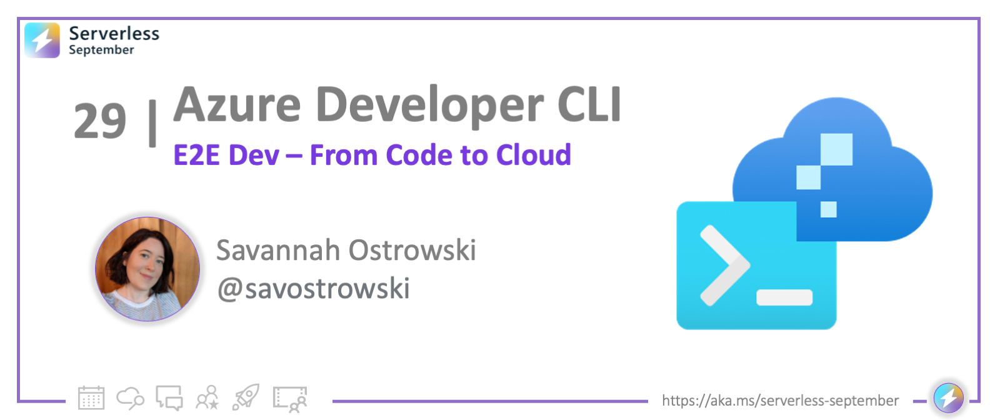
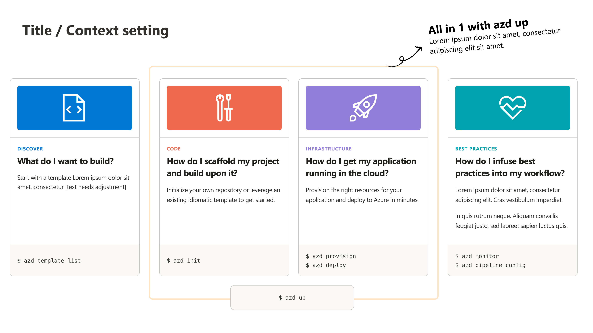
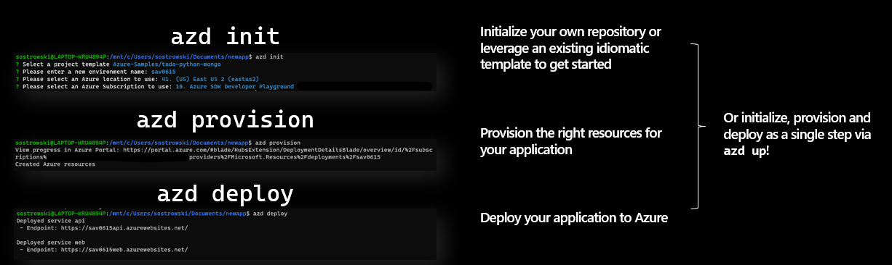
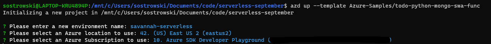
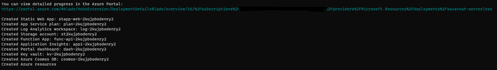
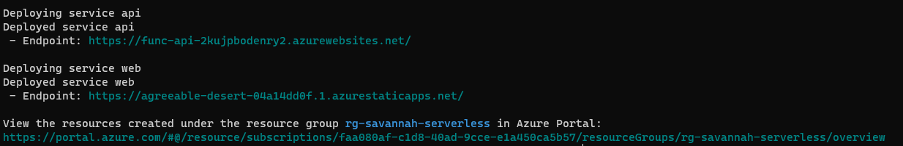
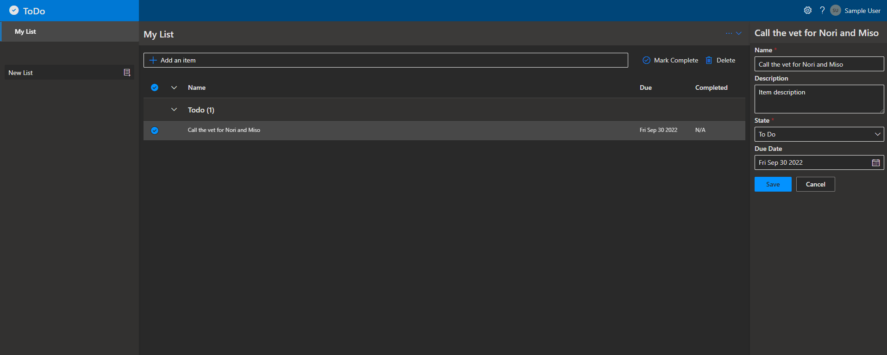
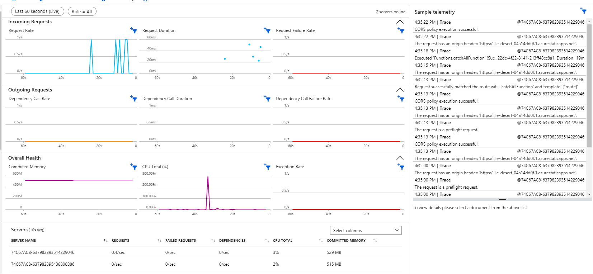
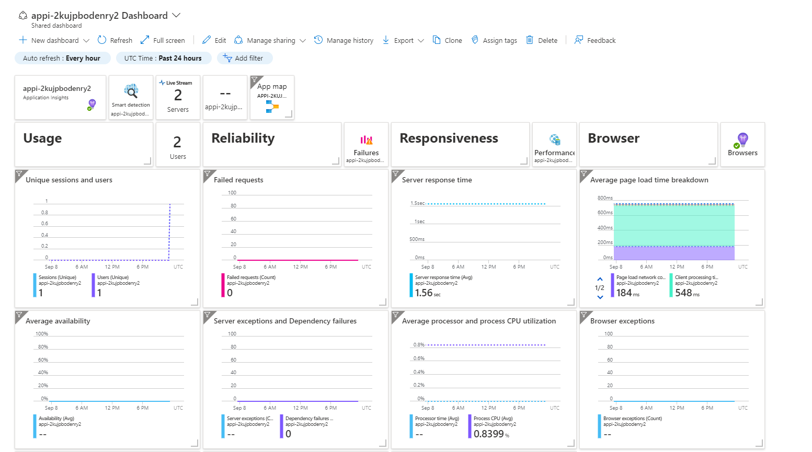
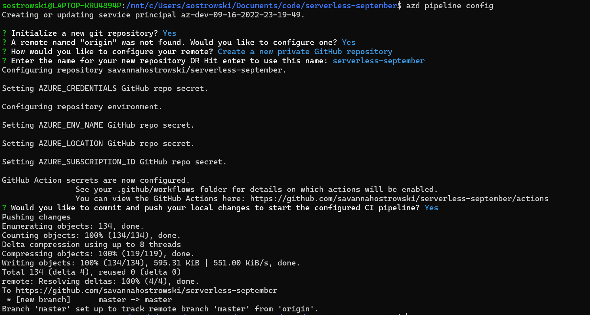

<!-- FIXME -->
<head>
  <meta name="twitter:url" 
    content="https://azure.github.io/Cloud-Native/blog/functions-1" />
  <meta name="twitter:title" 
    content="#30DaysOfServerless: Azure Functions Fundamentals" />
  <meta name="twitter:description" 
    content="#30DaysOfServerless: Azure Functions Fundamentals" />
  <meta name="twitter:image"
    content="https://azure.github.io/Cloud-Native/img/banners/post-kickoff.png" />
  <meta name="twitter:card" content="summary_large_image" />
  <meta name="twitter:creator" 
    content="@savostrowski" />
  <meta name="twitter:site" content="@AzureAdvocates" /> 
  <link rel="canonical" 
    href="https://azure.github.io/Cloud-Native/blog/08-functions-azure" />
</head>

---

Welcome to `Day 29` of #30DaysOfServerless!

---

## What We'll Cover
 * **A new tool has entered the chat:** Azure Developer CLI (`azd`)
 * **(Template) Anatomy 101**: What makes an `azd` template?
 * **End-to-end support:** Move code to cloud in a single step!
 * **Best practices:** Monitor your application and run CI/CD on every commit
 * **Exercise:** Try this yourself or create your own `azd` template
 * **Resources:** For self-study!

---

## **A new tool has entered the chat:** What is the Azure Developer CLI (`azd`)?
The Azure Developer CLI (`azd`) is a new, open source tool that makes it quick and simple for you to move your application from your local development environment to Azure while considering your end-to-end developer workflow. You might be familiar with other CLIs that focus on Infrastructure as Code or scaffolding your application but the Azure Developer CLI does all that and more!

The Azure Developer CLI commands are simple, high-level and map to core stages in your developer workflow. Think project initialization/creation, build, deploy, repeat!

By using [idiomatic and flexible application templates](https://aka.ms/azure-dev/templates?source=serverless-september), the Azure Developer CLI uses recipes for common application architectures that you can customize for your use case. These templates include:
- best practices
- sample application code that goes beyond "Hello World!"
- infrastructure as code assets so you can move your code to the cloud and set up monitoring for your application, and
- all the bits to set up CI/CD to run on every commit to your repo against resources on Azure

...all in the language(s) you're most comfortable in. You can use an [existing template](https://aka.ms/azure-dev/templates?source=serverless-september) or even create your own (more on that later!).

## **(Template) Anatomy 101**: What makes an `azd` template?
So now that you've been introduced to the Azure Developer CLI, let's take a look at an `azd`-enabled codebase, which we call a template. You can think of a template as a recipe - it provides a solid foundation that you can customize depending on your preference/use case/requirements. 

To make this concrete and because it's #ServerlessSeptember, we're going to walk through this [ToDo application template](https://github.com/Azure-Samples/todo-python-mongo-swa-func) that uses Azure Static Web Apps and Azure Functions.

Let's talk about the files in terms of their purpose:

### Azure Developer CLI-specific files
  - `azure.yaml` - contains metadata that describes the application (Azure hosts, languages, template name) and serves as an entrypoint for functionality in Visual Studio Code (oh yeah, you can also use `azd` using [a VS Code extension](https://aka.ms/azure-dev/vscode-ext?source=serverless-september)!).

### Application development support (code, run, debug, test)
  - `.devcontainer/` - support for if you're [writing code in a container](https://code.visualstudio.com/docs/remote/containers)
  - `.vscode/` - support for local development in Visual Studio Code via [launch.json](https://code.visualstudio.com/docs/editor/debugging) (for debugging) and [tasks.json](https://code.visualstudio.com/docs/editor/tasks) (for spinning up the web app for local development)
  - `src/` - contains all the sample application code which you can modify or swap out for your own application
  - `tests/` - test for the application, written using [Playwright](https://playwright.dev/)

### Infrastructure as Code (provisioning and deploying infrastructure on Azure, programmatically)
  - `infra/` - contains all infrastructure as code (IaC) assets written in [Bicep](https://docs.microsoft.com/en-us/azure/azure-resource-manager/bicep/overview?tabs=bicep) or [Terraform](https://aka.ms/azure-dev/terraform); includes logic to set up all components we need to set up the application on Azure, wire everything up securely, and monitor application health, performance and usage!

### CI/CD
  - `.github/` - contains a GitHub Actions workflow to set up a CI/CD pipeline that runs on every new commit to the repo

## **End-to-end support:** Move code to cloud in a single step!
### If you want to follow along in this section and don't already have the Azure Developer CLI installed, check out [these instructions](https://aka.ms/azure-dev/install-instructions?source=serverless-september) to install it on Windows, Linux or MacOS in your favorite terminal!

So now that we've gone over what this template contains on GitHub, let's pull this template code down to our local machine, set it up for local development, provision the right infrastructure, and deploy the code on Azure in a **single step**.

When designing the CLI, we wanted the experience to be both flexible and non-magical (no side effects, easy to understand). That being said, we're going to run this all with `azd up` but you could alternatively run a series of three commands and the outcome would be the same - `azd init --template Azure-Samples/todo-python-mongo-swa-func` (to pull the code down to your machine), `azd provision` (to provision infrastructure) and then `azd deploy` (to deploy application code on Azure). Choose your own adventure!

So let's walk through it. On running `azd up -t todo-python-mongo-swa-func`, I'm prompted for a couple pieces of information as part of the `azd init` process being run under the hood:
    - **An environment name** - the prefix for the resource group that will be created to hold all Azure resources
    - **An Azure region** - the Azure location where your resources will be deployed
    - **An Azure subscription** - the Azure subscription where your resources will be deployed

Once that information is provided, `azd` will pull down the code from GitHub and create a `.azure/` directory in the project root that contains all Azure Developer CLI environment information that you just entered. This directory will be important when it comes time to provision and deploy infrastructure in the next step in the `up` process.

The next step here is provisioning. `azd` is running `azd provision` on your behalf and leveraging the IaC assets in the `.infra/` directory in the project. As the tool works to provision, you'll see an output of each resource (name alongside a unique identifier which you can use to reference back to the Azure Portal, if you want)

Finally, the final step here in running `azd up` is deployment. `azd` is running `azd deploy` and deploying the application code to the resources that we're provisioned in the previous phase of the process. Once this has completed, you'll be able to click on two different endpoint URLs - one for the back-end and one for the front-end. 

The back-end endpoint (`service api`) hosts the specification for the API via the `openapi.yaml` file that's also in the root of the project template. You can explore the endpoints that are available in the web app here. 

The front-end endpoint (`service web`) hosts a fully-fledged and functional ToDo web app with a UI, Cosmos DB for the database and Key Vault for application secrets. This isn't just application hosting. It's really everything you need to be successful and productive, all set up on your behalf by the Azure Developer CLI.

...and that's it! We've successfully deployed our application on Azure! 

But there's more!

## Best practices: Monitoring and CI/CD!
In my opinion, it's not enough to _just_ set up the application on Azure! I want to know that my web app is performant and serving my users reliably! I also want to make sure that I'm not inadvertently breaking my application as I continue to make changes to it. Thankfully, the Azure Developer CLI also handles all of this via two additional commands - `azd monitor` and `azd pipeline config`.

### Application Monitoring
When we provisioned all of our infrastructure, we also set up application monitoring via a Bicep file in our `.infra/` directory that spec'd out an Application Insights dashboard. By running `azd monitor` we can see the dashboard with live metrics that was configured for the application. 

We can also navigate to the Application Dashboard by clicking on the resource group name, where you can set a specific refresh rate for the dashboard, and see usage, reliability, and performance metrics over time.

I don't know about everyone else but I have spent a ton of time building out similar dashboards. It can be super time-consuming to write all the queries and create the visualizations so this feels like a real time saver.

### CI/CD
Finally let's talk about setting up CI/CD! This might be my favorite `azd` feature. As I mentioned before, the Azure Developer CLI has a command, `azd pipeline config`, which uses the files in the `.github/` directory to set up a GitHub Action. More than that, if there is no upstream repo, the Developer CLI will actually help you create one. But what does this mean exactly? Because our GitHub Action is using the same commands you'd run in the CLI under the hood, we're actually going to have CI/CD set up to run on every commit into the repo, against real Azure resources. What a sweet collaboration feature!

That's it! We've gone end-to-end with the Azure Developer CLI - initialized a project, provisioned the resources on Azure, deployed our code on Azure, set up monitoring logs and dashboards, and set up a CI/CD pipeline with GitHub Actions to run on every commit into the repo (on real Azure resources!).

## **Exercise:** Try it yourself or create your own template!
As an exercise, try out the workflow above with [any template on GitHub](https://aka.ms/azure-dev/templates)!

Or, try turning your own project into an Azure Developer CLI-enabled template by following [this guidance](https://aka.ms/azure-dev/enabletemplate). If you create your own template, don't forget to tag the repo with the [`azd-templates` topic](https://aka.ms/azure-dev/templates) on GitHub to help others find it (unfamiliar with GitHub topics? [Learn how to add topics to your repo](https://docs.github.com/en/repositories/managing-your-repositorys-settings-and-features/customizing-your-repository/classifying-your-repository-with-topics#adding-topics-to-your-repository))! We'd also love to chat with you about your experience creating an `azd` template - if you're open to providing feedback around this, please fill out [this form](https://aka.ms/azd-user-research-signup?source=serverless-september)!

## **Resources**
- [Read more about the Azure Developer CLI preview release](https://aka.ms/announcing-azure-dev-cli?source=serverless-september)
- [Install the Azure Developer CLI](https://aka.ms/azure-dev/install-instructions?source=serverless-september)
- [Familiarize yourself with our Developer Hub](https://aka.ms/azd?source=serverless-september)
- [Take a look at some foundational templates on GitHub](https://aka.ms/azure-dev/templates?source=serverless-september)
- [Download the Azure Developer CLI VS Code extension](https://aka.ms/azure-dev/vscode-ext?source=serverless-september)