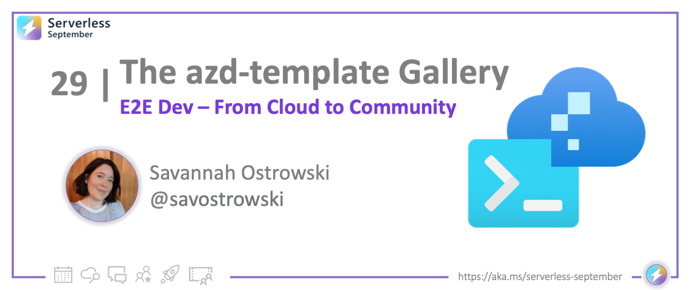

<!-- FIXME -->
<head>
  <meta name="twitter:url" 
    content="https://azure.github.io/Cloud-Native/blog/29-awesome-azd" />
  <meta name="twitter:title" 
    content="#30DaysOfServerless: Cloud to Community with `awesome-azd`" />
  <meta name="twitter:description" 
    content="#30DaysOfServerless: Cloud to Community with `awesome-azd`" />
  <meta name="twitter:image"
    content="https://azure.github.io/Cloud-Native/img/banners/post-kickoff.png" />
  <meta name="twitter:card" content="summary_large_image" />
  <meta name="twitter:creator" 
    content="@savostrowski" />
  <meta name="twitter:site" content="@AzureAdvocates" /> 
  <link rel="canonical" 
    href="https://azure.github.io/Cloud-Native/blog/29-awesome-azd" />
</head>

---

Welcome to `Beyond #30DaysOfServerless!` in October!

Yes, it's October!! And since we ended #ServerlessSeptember with a focus on **End-to-End Development** for Serverless on Azure, we thought it would be good to share updates in October that can help you skill up further.

Today we're following-up on our post on [**Code to Cloud with `azd`**](./../2022-09-29/index.md) (Day #29) where we introduced the Azure Developer CLI, an open-source tool for streamlining your end-to-end developer experience. In today's post, we celebrate the _October 2022_ release of the tool, with three cool new features. 

And if it's October, it must be **#Hacktoberfest**!! Read on to learn about how you can take advantage of one of the new features, to contribute meaningfully to the azd community and ecosytem!

Ready? Let's go!

---

## What We'll Cover
 * **Azure Friday**: Introducing the Azure Developer CLI (Video)
 * **October 2022 Release**: What's New In Azure Developer CLI? 
    * **Azure Pipleines for CI/CD**: [Learn more](https://learn.microsoft.com/azure/developer/azure-developer-cli/configure-devops-pipeline?tabs=azdo)
    * **Improved Infra as Code structure:** [Learn more](https://devblogs.microsoft.com/azure-sdk/azure-developer-cli-azd-october-2022-release/#improved-infrastructure-as-code-structure-via-bicep-modules)
    * **New Templates Gallery:** [Learn more](https://devblogs.microsoft.com/azure-sdk/azure-developer-cli-azd-october-2022-release/#new-template-gallery-awesome-azd)
 * **Awesome-Azd:** The new `azd-templates` gallery for Community use
    * Features: discover, create, contribute, request - templates
    * Hacktobest: opportunities to contribute in October - and beyond!

---

## Azure Friday

This post is a follow-up to our #ServerlessSeptember post on [**Code to Cloud with Azure Developer CLI](./../2022-09-29/index.md) where we introduced `azd`, the new open-source tool that makes it quick and simple for you to move your application from a _local development environment_ to Azure, streamlining your _end-to-end developer workflow_ in the process. 

Prefer to watch a video overview? I have you covered! Check out my recent conversation with Scott Hanselman on [Azure Friday](https://learn.microsoft.com/Shows/Azure-Friday/) where we:
 - talked about the Code-to-Cloud Journey
 - learned about `azd-templates`
 - explored Azure Developer CLI with a sample app and demo
 - checked out the deployed components and learning resources

<iframe width="500" height="300" src="https://www.youtube.com/embed/VTk-FhJyo7s" title="Introducing the Azure Developer CLI (azd) | Azure Friday" frameborder="0" allow="accelerometer; autoplay; clipboard-write; encrypted-media; gyroscope; picture-in-picture" allowfullscreen></iframe>

---

## October Release

We're pleased to announce the October 2022 release of the Azure Developer CLI (currently `0.3.0-beta.1`). Read [the release announcement](https://devblogs.microsoft.com/azure-sdk/azure-developer-cli-azd-october-2022-release/#new-template-gallery-awesome-azd) for more details. Here are the highlights:

  * **Azure Pipleines for CI/CD**: This addresses [azure-dev#101](https://github.com/Azure/azure-dev/issues/101), adding support for Azure Pipelines (alongside GitHub Actions) as a CI/CD provider. [Learn more](https://learn.microsoft.com/azure/developer/azure-developer-cli/configure-devops-pipeline?tabs=azdo) about usage and related documentation.
  * **Improved Infra as Code structure:** This addresses [azure-dev#543](https://github.com/Azure/azure-dev/issues/543), which recognized the complexity of using a single `resources.bicep` file for all resources. With this release, you can split up files into modules organized by purpose. [Learn more](https://devblogs.microsoft.com/azure-sdk/azure-developer-cli-azd-october-2022-release/#improved-infrastructure-as-code-structure-via-bicep-modules) about this structure, and how to use it.
  * **New Templates Gallery:** This addresses [azure-dev#398](https://github.com/Azure/azure-dev/issues/398), which looked at ways to make templates discoverable and easier to contribute. [Learn more](https://devblogs.microsoft.com/azure-sdk/azure-developer-cli-azd-october-2022-release/#new-template-gallery-awesome-azd) about how the new gallery tackles this issue.

In the next section, we'll dive briefly into the last feature, introducing the new [`awesome-azd`](https://aka.ms/awesome-azd) site and resource for templates discovery and contribution. And, since it's #Hacktoberfest season, we'll talk about the **Contributor Guide** and the many ways you can contribute to this project - with, or without, code.

---

## It's `awesome-azd`

Welcome to `awesome-azd` a new template gallery hosted on GitHub Pages, and meant to be a destination site for discovering, requesting, and contributing, valid `azd-template` instances for community use. 

In addition, it's **README** reflects the [awesome-list](https://github.com/topics/awesome-list) resource format, providing a location for the community to share best-of resources for Azure Developer CLI - from blog posts and videos, to full-scale tutorials and templates.

 * Visit the [awesome-azd Gallery](https://azure.github.io/awesome-azd/)
 * Browse the [awesome-azd README](https://github.com/Azure/awesome-azd/blob/main/README.md)

The Gallery is organized into three main areas:
 - [Gallery](https://azure.github.io/awesome-azd/) page hosting templates.
 - [Contributor Guide](https://azure.github.io/awesome-azd/docs/intro) with an FAQ for contributors.
 - [Custom Issues](https://github.com/Azure/awesome-azd/issues/new/choose) for the types of contributions you can make

Take a minute to explore the Gallery and note the features:
 - **Search** for templates by name
 - **Requested** Templates - indicating asks from the community
 - **Featured** Templates - highlighting high-quality templates
 - **Filters** - to discover templates by and/or query combinations

Check back often to see the latest contributed templates and requests!

---

## Hacktoberfest

So, why is this a good time to talk about the Gallery? Because October means it's time for [#Hacktoberfest](https://hacktoberfest.com/) - a month-long celebration of open-source projects and their maintainers, and an opportunity for **first-time contributors** to get support and guidance making their first pull-requests! Check out the [#Hacktoberfest](https://github.com/topics/hacktoberfest) topic on GitHub for projects you can contribute to.

And we hope you think of `awesome-azd` as another possible project to contribute to. 
 * Explore [Custom Issues](https://azure.github.io/awesome-azd/docs/intro#our-custom-issues) for actionable ways to contribute code.
 * Explore [Other Ways To Help](https://azure.github.io/awesome-azd/docs/intro#other-ways-to-help) for equally important non-code contributions.
 
Check out the FAQ section to learn how to [create](https://azure.github.io/awesome-azd/docs/faq/create-template), [discover](https://azure.github.io/awesome-azd/docs/faq/discover-azd), and [contribute](https://azure.github.io/awesome-azd/docs/faq/contribute-template) templates. And don't hesitate to reach out to us - either via Issues on the repo, or in the [Discussions](https://github.com/Azure/Cloud-Native/discussions) section of this site, to give us feedback!

Happy Hacking! 🎃

---