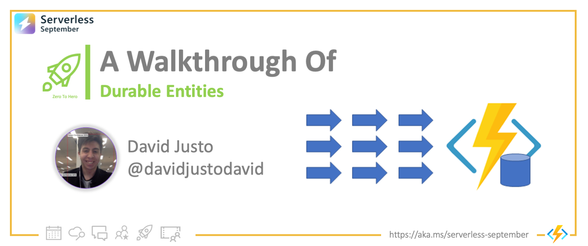

<head>
  <meta name="twitter:url" 
    content="https://azure.github.io/Cloud-Native/blog/zero2hero-func-02" />
  <meta name="twitter:title" 
    content="#ZeroToHero: A Walkthrough of Durable Entities" />
  <meta name="twitter:description" 
    content="#ZeroToHero: A Walkthrough of Durable Entities" />
  <meta name="twitter:image"
    content="https://azure.github.io/Cloud-Native/img/banners/serverless-zero2hero.png" />
  <meta name="twitter:card" content="summary_large_image" />
  <meta name="twitter:creator" 
    content="@nitya" />
  <meta name="twitter:site" content="@AzureAdvocates" /> 
  <link rel="canonical" 
    href="https://techcommunity.microsoft.com/t5/apps-on-azure-blog/a-walkthrough-of-durable-entities/ba-p/3616832" />
</head>

---

Welcome to `Day 6` of #30DaysOfServerless!


Today, we have a special set of posts from our [Zero To Hero 🚀](/serverless-september/ZeroToHero) initiative, featuring blog posts authored by our Product Engineering teams for #ServerlessSeptember. _Posts were originally published on the [Apps on Azure](https://techcommunity.microsoft.com/t5/apps-on-azure-blog/a-walkthrough-of-durable-entities/ba-p/3616832?WT.mc_id=javascript-99907-cxa) blog on Microsoft Tech Community._

---

## What We'll Cover
 * What are Durable Entities
 * Some Background
 * A Programming Model
 * Entities for a Micro-Blogging Platform



---
 

[Durable Entities](https://docs.microsoft.com/azure/azure-functions/durable/durable-functions-entities?tabs=csharp&WT.mc_id=javascript-99907-cxa) are a special type of Azure Function that allow you to implement stateful objects in a serverless environment. They make it easy to introduce stateful components to your app without needing to manually persist data to external storage, so you can focus on your business logic. We’ll demonstrate their power with a real-life example in the last section.

## Entities 101: Some Background
 
Programming Durable Entities feels a lot like object-oriented programming, except that these “objects” exist in a distributed system. Like objects, each Entity instance has a unique identifier, i.e. an entity ID that can be used to read and manipulate their internal state. Entities define a list of operations that constrain how their internal state is managed, like an object interface.

Some experienced readers may realize that Entities sound a lot like an implementation of the Actor Pattern. For a discussion of the relationship between Entities and Actors, please refer to [this documentation](https://docs.microsoft.com/azure/azure-functions/durable/durable-functions-entities?tabs=csharp#comparison-with-virtual-actors).

Entities are a part of the Durable Functions Extension, an extension of Azure Functions that empowers programmers with stateful abstractions for serverless, such as Orchestrations (i.e. workflows).

[Durable Functions](https://docs.microsoft.com/azure/azure-functions/durable/durable-functions-overview?tabs=csharp) is available in most Azure Functions runtime environments: .NET, Node.js, Python, PowerShell, and Java (preview). For this article, we’ll focus on the C# experience, but note that Entities are also available in Node.js and Python; their availability in other languages is underway.


## Entities 102: The programming model
 
Imagine you want to implement a simple Entity that just counts things. Its interface allows you to get the current count, add to the current count, and to reset the count to zero.

If you implement this in an object-oriented way, you’d probably define a class (say “Counter”) with a method to get the current count (say “Counter.Get”), another to add to the count (say “Counter.Add”), and another to reset the count (say “Counter.Reset”). Well, the implementation of an Entity in C# is not that different from this sketch:


```
[JsonObject(MemberSerialization.OptIn)] 
public class Counter 
{ 
    [JsonProperty("value")] 
    public int Value { get; set; } 
 
    public void Add(int amount)  
    { 
        this.Value += amount; 
    } 

    public Task Reset()  
    { 
        this.Value = 0; 
        return Task.CompletedTask; 
    } 
 
    public Task<int> Get()  
    { 
        return Task.FromResult(this.Value); 
    } 
    [FunctionName(nameof(Counter))] 
    public static Task Run([EntityTrigger] IDurableEntityContext ctx) 
        => ctx.DispatchAsync<Counter>(); 

} 
```

We’ve defined a class named Counter, with an internal count stored in the variable “Value” which is manipulated through the “Add” and “Reset” methods, and which can be read via “Get”.

The “Run” method is simply boilerplate required for the Azure Functions framework to interact with the object we’ve defined – it’s the method that the framework calls internally when it needs to load the Entity object. When `DispatchAsync` is called, the Entity and its corresponded state (the last count in “Value”) is loaded from storage. Again, this is mostly just boilerplate: your Entity’s business logic lies in the rest of the class.

Finally, the Json annotation on top of the class and the Value field tells the Durable Functions framework that the “Value” field is to be durably persisted as part of the durable state on each Entity invocation. If you were to annotate other class variables with JsonProperty, they would also become part of the managed state.

 

## Entities for a micro-blogging platform
 
We’ll try to implement a simple micro-blogging platform, a la Twitter. Let’s call it “Chirper”. In Chirper, users write chirps (i.e tweets), they can follow, and unfollow other users, and they can read the chirps of users they follow.

### Defining Entity
Just like in OOP, it’s useful to begin by identifying what are the stateful agents of this scenario. In this case, users have state (who they follow and their chirps), and chirps have state in the form of their content. So, we could model these stateful agents as Entities!

Below is a potential way to implement a User for Chirper as an Entity:

```
  [JsonObject(MemberSerialization = MemberSerialization.OptIn)] 
  public class User: IUser  
  { 
      [JsonProperty] 
      public List<string> FollowedUsers { get; set; }  = new List<string>(); 

      public void Add(string user) 
      { 
          FollowedUsers.Add(user); 
      } 

      public void Remove(string user) 
      { 
          FollowedUsers.Remove(user); 
      } 

      public Task<List<string>> Get() 
      { 
          return Task.FromResult(FollowedUsers); 
      } 
      // note: removed boilerplate “Run” method, for conciseness. 
  } 
```

In this case, our Entity’s internal state is stored in “FollowedUsers” which is an array of accounts followed by this user. The operations exposed by this entity allow clients to read and modify this data: it can be read by “Get”, a new follower can be added via “Add”, and a user can be unfollowed via “Remove”.

With that, we’ve modeled a Chirper’s user as an Entity! Recall that Entity instances each has a unique ID, so we can consider that unique ID to correspond to a specific user account.

What about chirps? Should we represent them as Entities as well? That would certainly be valid. However, we would then need to create a mapping between an entity ID and every chirp entity ID that this user wrote.

For demonstration purposes, a simpler approach would be to create an Entity that stores the list of all chirps authored by a given user; call it UserChirps. Then, we could fix each User Entity to share the same entity ID as its corresponding UserChirps Entity, making client operations easier.

Below is a simple implementation of UserChirps:

```
  [JsonObject(MemberSerialization = MemberSerialization.OptIn)] 
  public class UserChirps : IUserChirps 
  { 
      [JsonProperty] 
      public List<Chirp> Chirps { get; set; } = new List<Chirp>(); 

      public void Add(Chirp chirp) 
      { 
          Chirps.Add(chirp); 
      } 

      public void Remove(DateTime timestamp) 
      { 
          Chirps.RemoveAll(chirp => chirp.Timestamp == timestamp); 
      } 

      public Task<List<Chirp>> Get() 
      { 
          return Task.FromResult(Chirps); 
      } 

      // Omitted boilerplate “Run” function 
  } 
```

Here, our state is stored in Chirps, a list of user posts. Our operations are the same as before: Get, Read, and Add. It’s the same pattern as before, but we’re representing different data.

To put it all together, let’s set up Entity clients to generate and manipulate these Entities according to some REST API.

### Interacting with Entity

Before going there, let’s talk briefly about how you can interact with an Entity. Entity interactions take one of two forms -- [calls and signals](https://docs.microsoft.com/azure/azure-functions/durable/durable-functions-entities?tabs=csharp#access-entities):

Calling an entity is a two-way communication. You send an operation message to the entity and then wait for the response message before you continue. The response can be a result value or an error.
Signaling an entity is a one-way (fire-and-forget) communication. You send an operation message but don’t wait for a response. You have the reassurance that the message will be delivered eventually, but you don’t know when and don’t know what the response is.
For example, when you read the state of an Entity, you are performing a “call” interaction. When you record that a user has followed another, you may choose to simply signal it.

Now say user with a given userId (say “durableFan99” ) wants to post a chirp. For this, you can write an HTTP endpoint to signal the UserChips entity to record that chirp. We can leverage the HTTP Trigger functionality from Azure Functions and pair it with an entity client binding that signals the Add operation of our Chirp Entity:

```
[FunctionName("UserChirpsPost")] 
public static async Task<HttpResponseMessage> UserChirpsPost( 
    [HttpTrigger(AuthorizationLevel.Function, "post", Route = "user/{userId}/chirps")] 
    HttpRequestMessage req, 
    DurableClient] IDurableClient client, 
    ILogger log,  
    string userId) 
    { 
        Authenticate(req, userId); 
        var chirp = new Chirp() 
        { 
            UserId = userId, 
            Timestamp = DateTime.UtcNow, 
            Content = await req.Content.ReadAsStringAsync(), 
        }; 
        await client.SignalEntityAsync<IUserChirps>(userId, x => x.Add(chirp)); 
        return req.CreateResponse(HttpStatusCode.Accepted, chirp); 
    } 
``` 

Following the same pattern as above, to get all the chirps from a user, you could read the status of your Entity via `ReadEntityStateAsync`, which follows the call-interaction pattern as your client expects a response:

```
[FunctionName("UserChirpsGet")] 
public static async Task<HttpResponseMessage> UserChirpsGet( 
  [HttpTrigger(AuthorizationLevel.Function, "get", Route = "user/{userId}/chirps")] HttpRequestMessage req, 
  [DurableClient] IDurableClient client, 
  ILogger log, 
  string userId) 
  { 

      Authenticate(req, userId); 
      var target = new EntityId(nameof(UserChirps), userId); 
      var chirps = await client.ReadEntityStateAsync<UserChirps>(target); 
      return chirps.EntityExists 
            ? req.CreateResponse(HttpStatusCode.OK, chirps.EntityState.Chirps) 
            : req.CreateResponse(HttpStatusCode.NotFound); 
  } 
```

And there you have it! To play with a complete implementation of Chirper, you can try out our sample in the [Durable Functions extension repo](https://github.com/Azure/azure-functions-durable-extension/tree/dev/samples/entitites-csharp/Chirper).  

Thank you!
 
:::info
Thanks for following along, and we hope you find Entities as useful as we do! If you have questions or feedback, please file issues in the repo above or tag us [@AzureFunctions](https://twitter.com/AzureFunctions) on Twitter
:::

 