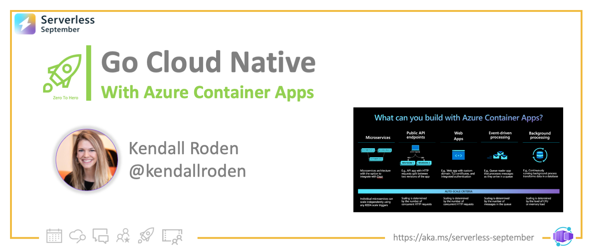

<head>
  <meta name="twitter:url" 
    content="https://azure.github.io/Cloud-Native/blog/zero2hero-aca-01" />
  <meta name="twitter:title" 
    content="#ZeroToHero: Go Cloud Native With Azure Container Apps" />
  <meta name="twitter:description" 
    content="#ZeroToHero: Go Cloud Native With Azure Container Apps" />
  <meta name="twitter:image"
    content="https://azure.github.io/Cloud-Native/img/banners/serverless-zero2hero.png" />
  <meta name="twitter:card" content="summary_large_image" />
  <meta name="twitter:creator" 
    content="@nitya" />
  <meta name="twitter:site" content="@AzureAdvocates" /> 
  <link rel="canonical" 
    href="https://techcommunity.microsoft.com/t5/apps-on-azure-blog/go-cloud-native-with-azure-container-apps/ba-p/3616407" />
</head>

---

Welcome to `Day 6` of #30DaysOfServerless!

Today, we have a special set of posts from our [Zero To Hero 🚀](/serverless-september/ZeroToHero) initiative, featuring blog posts authored by our Product Engineering teams for #ServerlessSeptember. _Posts were originally published on the [Apps on Azure](https://techcommunity.microsoft.com/t5/apps-on-azure-blog/go-cloud-native-with-azure-container-apps/ba-p/3616407?WT.mc_id=javascript-74010-cxa) blog on Microsoft Tech Community._

---

## What We'll Cover
 * Defining Cloud Native
 * Introduction to Azure Container Apps
 * Dapr In Azure Container Apps
 * Conclusion

---

## Defining Cloud Native 
 
While I’m positive I’m not the first person to ask this, I think it’s an appropriate way for us to kick off this article: **“How many developers does it take to define cloud native?”** I hope you aren’t waiting for a punch line because I seriously want to know your thoughts (drop your perspectives in the comments..) but if you ask me, the limit does not exist!

A quick online search of the topic returns a laundry list of articles, e-books, twitter threads, etc. all trying to nail down the one true definition. While diving into the rabbit hole of cloud native, you will inevitably find yourself on the Cloud Native Computing Foundation (CNCF) site. The CNCF is part of the Linux Foundation and aims to make "cloud native computing ubiquitous" through deep open source project and community involvement. The CNCF has also published arguably the most popularized definition of cloud native which begins with the following statement:

> “Cloud native technologies empower organizations to build and run scalable applications in modern, dynamic environments such as public, private, and hybrid clouds."

Over the past four years, my day-to-day work has been driven primarily by the surging demand for application containerization and the drastic adoption of Kubernetes as the de-facto container orchestrator. Customers are eager to learn and leverage patterns, practices and technologies that enable building "loosely coupled systems that are resilient, manageable, and observable". Enterprise developers at these organizations are being tasked with rapidly deploying event-driven, horizontally-scalable, polyglot services via repeatable, code-to-cloud pipelines.

While building cloud native solutions can enable rapid innovation, the transition to adopting a cloud native architectural approach comes with a steep learning curve and a new set of considerations. In a document published by Microsoft called What is Cloud Native?, there are a few key areas highlighted to aid customers in the adoption of best practices for building modern, portable applications which I will summarize below:
 
**Cloud infrastructure**

 * Cloud native applications leverage cloud infrastructure and make use of Platform-as-a-service offerings
 * Cloud native applications depend on highly-elastic infrastructure with automatic scaling, self-healing, and monitoring capabilities
 
**Modern application design**
 * Cloud native applications should be constructed using principles outlined in the 12 factor methodology
 
**Microservices**
 * Cloud native applications are typically composed of microservices where each core function, or service, is built and deployed independently
 
**Containers**

 * Cloud native applications are typically deployed using containers as a packaging mechanism where an application's code and dependencies are bundled together for consistency of deployment
 * Cloud native applications leverage container orchestration technologies- primarily Kubernetes- for achieving capabilities such as workload scheduling, self-healing, auto-scale, etc.
 
**Backing services**
 * Cloud native applications are ideally stateless workloads which retrieve and store data in data stores external to the application hosting infrastructure. Cloud providers like Azure provide an array of backing data services which can be securely accessed from application code and provide capabilities for ensuring application data is highly-available
 
**Automation**
* Cloud native solutions should use deployment automation for backing cloud infrastructure via versioned, parameterized Infrastructure as Code (IaC) templates which provide a consistent, repeatable process for provisioning cloud resources.
* Cloud native solutions should make use of modern CI/CD practices and pipelines to ensure successful, reliable infrastructure and application deployment.
 

## Azure Container Apps
 
In many of the conversations I've had with customers that involve talk of Kubernetes and containers, the topics of cost-optimization, security, networking, and reducing infrastructure and operations inevitably arise. I personally have yet to meet with any customers eager to have their developers get more involved with infrastructure concerns.

One of my former colleagues, Jeff Hollan, made a statement while appearing on a 2019 episode of The Cloud Native Show where he shared his perspective on Cloud Native:

> "When I think about cloud native... it's writing applications in a way where you are specifically thinking about the benefits the cloud can provide... to me, serverless is the perfect realization of that because the only reason you can write serverless applications is because the cloud exists."

I must say that I agree with Jeff's perspective. In addition to optimizing development practices for the cloud native world, reducing infrastructure exposure and operations is equally as important to many organizations and can be achieved as a result of cloud platform innovation.

In May of 2022, Microsoft announced the general availability of Azure Container Apps. Azure Container Apps provides customers with the ability to run microservices and containerized applications on a serverless, consumption-based platform. 

For those interested in taking advantage of the open source ecosystem while reaping the benefits of a managed platform experience, Container Apps run on Kubernetes and provides a set of managed open source projects embedded directly into the platform including the Kubernetes Event Driven Autoscaler (KEDA), the Distributed Application Runtime (Dapr) and Envoy.

Container apps provides other cloud native features and capabilities in addition to those above including, but not limited to: 

 * [Revisions](https://docs.microsoft.com/azure/container-apps/application-lifecycle-management?WT.mc_id=javascript-74010-cxa): immutable snapshot representative of a specific version of a container app which can take advantage of the [managed traffic splitting capability](https://docs.microsoft.com/azure/container-apps/revisions-manage?tabs=bash&WT.mc_id=javascript-74010-cxa) 
 * [Health probes](https://docs.microsoft.com/azure/container-apps/health-probes?tabs=arm-template?WT.mc_id=javascript-74010-cxa): Based on [Kubernetes health probes](https://kubernetes.io/docs/tasks/configure-pod-container/configure-liveness-readiness-startup-probes/?WT.mc_id=javascript-74010-cxa) with support for Readiness, Liveness and Startup 
 * [Built-in authentication](https://docs.microsoft.com/azure/container-apps/authentication-openid?WT.mc_id=javascript-74010-cxa)
 * [Managed Identity](https://docs.microsoft.com/azure/container-apps/managed-identity?tabs=portal%2Cdotnet&WT.mc_id=javascript-74010-cxa)
 * [Custom domain names and certificates](https://docs.microsoft.com/azure/container-apps/custom-domains-certificates?WT.mc_id=javascript-74010-cxa)
 * [Virtual Network injection](https://docs.microsoft.com/azure/container-apps/networking?WT.mc_id=javascript-74010-cxa)
 * [Platform observability](https://docs.microsoft.com/azure/container-apps/observability?tabs=bash&WT.mc_id=javascript-74010-cxa) : log streaming, console connect, Azure monitor 
 
The ability to dynamically scale and support growing numbers of users, events, and requests is one of the core requirements for most cloud native, distributed applications. Azure Container Apps is purpose-built with this and other cloud native tenants in mind. 

## Dapr in Azure Container Apps
 
As a quick personal note before we dive into this section I will say I am a bit bias about Dapr. When Dapr was first released, I had an opportunity to immediately get involved and became an early advocate for the project. It is created by developers for developers, and solves tangible problems customers architecting distributed systems face:

:::info HOW DO I
 * integrate with external systems that my app has to react and respond to?
 * create event driven apps which reliably send events from one service to another?
 * observe the calls and events between my services to diagnose issues in production?
 * access secrets securely from within my application?
 * discover other services and call methods on them?
 * prevent committing to a technology early and have the flexibility to swap out an alternative based on project or environment changes?
:::
 
While existing solutions were in the market which could be used to address some of the concerns above, there was not a lightweight, CNCF-backed project which could provide a unified approach to solve the more fundamental ask from customers: "How do I make it easy for developers to build microservices based on cloud native best practices?"

:::success Enter Dapr!

The [Distributed Application Runtime (Dapr)](https://dapr.io/) provides APIs that simplify microservice connectivity. Whether your communication pattern is service to service invocation or pub/sub messaging, Dapr helps you write resilient and secured microservices. By letting Dapr’s sidecar take care of the complex challenges such as service discovery, message broker integration, encryption, observability, and secret management, you can focus on business logic and keep your code simple."
:::

The Container Apps platform provides a managed and supported Dapr integration which eliminates the need for deploying and managing the Dapr OSS project. In addition to providing managed upgrades, the platform also exposes a simplified Dapr interaction model to increase developer productivity and reduce the friction required to leverage Dapr capabilities. While the Dapr integration makes it easier for customers to adopt cloud native best practices in container apps it is not required to make use of the container apps platform. 

For additional insight into the dapr integration visit aka.ms/aca-dapr. 

 

## Conclusion
 
Backed by and integrated with powerful cloud native technologies, Azure Container Apps strives to make developers productive, while reducing the operational overhead and learning curve that typically accompanies adopting a cloud-native strategy. 

If you are interested in building resilient, portable and highly-scalable apps visit [Azure Container Apps | Microsoft Azure](https://azure.microsoft.com/en-us/services/container-apps/) today!