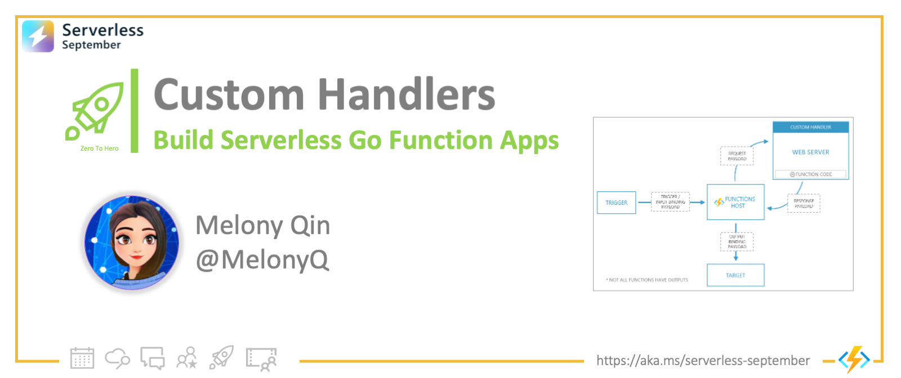
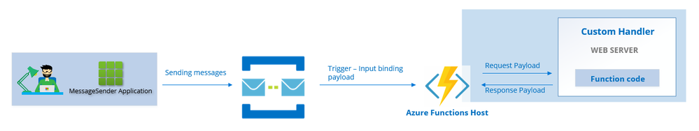
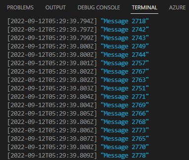

<head>
  <meta name="twitter:url" 
    content="https://azure.github.io/Cloud-Native/blog/zero2hero-func-03" />
  <meta name="twitter:title" 
    content="#ZeroToHero: Serverless Go Apps Using Custom Handlers" />
  <meta name="twitter:description" 
    content="#ZeroToHero: Serverless Go Apps Using Custom Handlers" />
  <meta name="twitter:image"
    content="https://azure.github.io/Cloud-Native/img/banners/serverless-zero2hero.png" />
  <meta name="twitter:card" content="summary_large_image" />
  <meta name="twitter:creator" 
    content="@nitya" />
  <meta name="twitter:site" content="@AzureAdvocates" /> 
  <link rel="canonical" 
    href="https://techcommunity.microsoft.com/t5/apps-on-azure-blog/building-serverless-go-applications-with-azure-functions-custom/ba-p/3623617" />
</head>

---


Welcome to `Day 12` of #30DaysOfServerless!


Today, we have a special set of posts from our [Zero To Hero 🚀](/serverless-september/ZeroToHero) initiative, featuring blog posts authored by our Product Engineering teams for #ServerlessSeptember. _Posts were originally published on the [Apps on Azure](https://techcommunity.microsoft.com/t5/apps-on-azure-blog/building-serverless-go-applications-with-azure-functions-custom/ba-p/3623617?WT.mc_id=javascript-99907-cxa) blog on Microsoft Tech Community._

---

## What We'll Cover
 * What are Custom Handlers, and why use them?
 * How Custom Handler Works
 * Message Processing With Azure Custom Handler
 * Azure Portal Monitoring



---
 
If you have been working with [Azure Functions](https://docs.microsoft.com/azure/azure-functions/?WT.mc_id=javascript-99907-cxa) for a while, you may know Azure Functions is a serverless FaaS (Function as a Service) offered provided by Microsoft Azure, which is built for your key scenarios, including building web APIs, processing file uploads, responding to database changes, processing IoT data streams, managing message queues, and more.


## Custom Handlers: What and Why

Azure functions support multiple programming languages including C#, F#, Java, JavaScript, Python, typescript, and PowerShell. If you want to get **extended language support with Azure functions for other languages** such as Go, and Rust, that’s where custom handler comes in.

An Azure function custom handler allows the use of any language that supports HTTP primitives and author Azure functions. With custom handlers, you can use triggers and input and output bindings via extension bundles,  hence it supports all the triggers and bindings you're used to with Azure functions.


## How a Custom Handler Works

Let’s take a look at custom handlers and how it works.  
 * A request is sent to the function host when an event is triggered.  It’s up to the function host to issue a request payload to the custom handler, which holds the trigger and inputs binding data as well as other metadata for the function. 
  * The custom handler is a local HTTP web server. It executes the function code and returns a response payload to the Functions host. 
  * The Functions host passes data from the response to the function's output bindings which will be passed to the downstream stream services for data processing. 
  
Check out [this article to know more about Azure functions custom handlers](https://docs.microsoft.com/azure/azure-functions/functions-custom-handlers?WT.mc_id=javascript-99907-cxa).

---

## Message processing with Custom Handlers

[Message processing](https://docs.microsoft.com/azure/architecture/guide/technology-choices/messaging?WT.mc_id=javascript-99907-cxa) is one of the key scenarios that Azure functions are trying to address. In the message-processing scenario, events are often collected in queues. These events can trigger Azure functions to execute a piece of business logic. 

You can use the Service Bus trigger to respond to messages from an [Azure Service Bus queue](https://docs.microsoft.com/azure/service-bus-messaging/service-bus-messaging-overview?WT.mc_id=javascript-99907-cxa) - it's then up to the Azure functions custom handlers to take further actions to process the messages. The process is described in the following diagram:



In Azure function, the `function.json` defines the function's trigger, input and output bindings, and other configuration settings. Note that every function can have multiple bindings, but it can only have one trigger. The following is an example of setting up the Service Bus queue trigger in the function.json file :

```json
{
 "bindings": [
   {
     "name": "queueItem",
     "type": "serviceBusTrigger",
     "direction": "in",
     "queueName": "functionqueue",
     "connection": "ServiceBusConnection"
    }
   ]
}
```

You can add a binding definition in the function.json to write the output to a database or other locations of your desire. [Supported bindings can be found here](https://docs.microsoft.com/azure/azure-functions/functions-triggers-bindings?tabs=csharp#add-bindings-to-a-function&WT.mc_id=javascript-99907-cxa).

As we’re programming in Go, so we need to set the value of `defaultExecutablePath` to handler in the `customHandler.description` section in the `host.json` file.

Assume we’re programming in Windows OS, and we have named our go application as `server.go`,  after we executed `go build server.go` command,  it produces an executable called `server.exe`. So here we set `server.exe` in the `host.json` as the following example :

```json
  "customHandler": {
    "description": {
      "defaultExecutablePath": "./server.exe",
      "workingDirectory": "",
      "arguments": []
    }
  }
```

We’re showcasing a simple Go application here with Azure functions custom handlers where we print out the messages received from the function host. The following is the full code of `server.go` application :

```go
package main

import (
	"encoding/json"
	"fmt"
	"log"
	"net/http"
	"os"
)

type InvokeRequest struct {
	Data     map[string]json.RawMessage
	Metadata map[string]interface{}
}

func queueHandler(w http.ResponseWriter, r *http.Request) {
	var invokeRequest InvokeRequest

	d := json.NewDecoder(r.Body)
	d.Decode(&invokeRequest)

	var parsedMessage string
	json.Unmarshal(invokeRequest.Data["queueItem"], &parsedMessage)

	fmt.Println(parsedMessage)
}

func main() {
	customHandlerPort, exists := os.LookupEnv("FUNCTIONS_CUSTOMHANDLER_PORT")
	if !exists {
		customHandlerPort = "8080"
	}
	mux := http.NewServeMux()
	mux.HandleFunc("/MessageProcessorFunction", queueHandler)
	fmt.Println("Go server Listening on: ", customHandlerPort)
	log.Fatal(http.ListenAndServe(":"+customHandlerPort, mux))

}
```

Ensure you have [Azure functions core tools](https://github.com/Azure/azure-functions-core-tools) installed, then we can use func start command to start our function. Then we’ll have have a [C#-based Message Sender application](https://github.com/cloudmelon/cloud-native-serverless/tree/main/message-sender-servicebus/MessageSendToServiceBus) on Github to send out 3000 messages to the Azure service bus queue. You’ll see Azure functions instantly start to process the messages and print out the message as the following:



---

## Azure portal monitoring

Let’s go back to Azure portal portal the events see how those messages in Azure Service Bus queue were being processed. There was 3000 messages were queued in the Service Bus queue ( the Blue line stands for incoming Messages ). The outgoing messages (the red line in smaller wave shape ) showing there are progressively being read by Azure functions as the following :


Check out [this article about monitoring Azure Service bus](https://docs.microsoft.com/azure/service-bus-messaging/monitor-service-bus?WT.mc_id=javascript-99907-cxa) for further information.

## Next steps

Thanks for following along, we’re looking forward to hearing your feedback.  Also, if you discover potential issues, please record them on [Azure Functions host](https://github.com/Azure/azure-functions-host/issues)  GitHub repository or tag us [@AzureFunctions on Twitter](https://twitter.com/AzureFunctions). 


:::info RESOURCES 
Start to build your serverless applications with custom handlers, check out the official documentation:

 * [Getting started with Azure functions custom handlers](https://docs.microsoft.com/azure/azure-functions/functions-custom-handlers?WT.mc_id=javascript-99907-cxa) 
 * [Create a Go or Rust function in Azure using Visual Studio Code](https://docs.microsoft.com/azure/azure-functions/create-first-function-vs-code-other?tabs=go%2Cwindows&WT.mc_id=javascript-99907-cxa)
:::

Life is a journey of learning.  Let’s stay tuned!