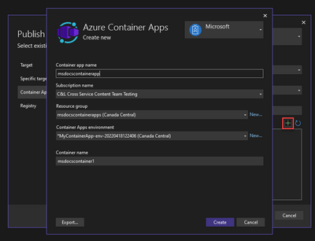
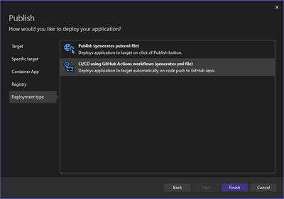
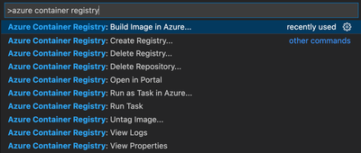
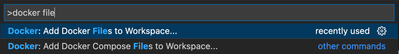
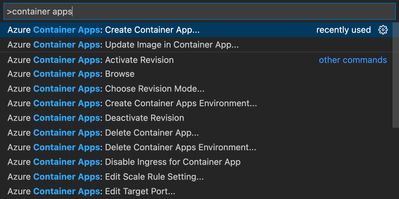

<head>
  <meta name="twitter:url" 
    content="https://azure.github.io/Cloud-Native/blog/zero2hero-aca-01" />
  <meta name="twitter:title" 
    content="#ZeroToHero: Go Cloud-Native With Azure Container Apps" />
  <meta name="twitter:description" 
    content="#ZeroToHero: Go Cloud-Native With Azure Container Apps" />
  <meta name="twitter:image"
    content="https://azure.github.io/Cloud-Native/img/banners/serverless-zero2hero.png" />
  <meta name="twitter:card" content="summary_large_image" />
  <meta name="twitter:creator" 
    content="@nitya" />
  <meta name="twitter:site" content="@AzureAdvocates" /> 
  <link rel="canonical" 
    href="https://techcommunity.microsoft.com/t5/apps-on-azure-blog/go-cloud-native-with-azure-container-apps/ba-p/3616407" />
</head>

---

Welcome to `Day 12` of #30DaysOfServerless!

Today, we have a special set of posts from our [Zero To Hero 🚀](/serverless-september/ZeroToHero) initiative, featuring blog posts authored by our Product Engineering teams for #ServerlessSeptember. _Posts were originally published on the [Apps on Azure](https://techcommunity.microsoft.com/t5/apps-on-azure-blog/journey-to-the-cloud-with-azure-container-apps/ba-p/3622609?WT.mc_id=javascript-74010-cxa) blog on Microsoft Tech Community._

---

## What We'll Cover
 * Using Visual Studio
 * Using Visual Studio Code: Docker, ACA extensions
 * Using Azure CLI
 * Using CI/CD Pipelines


---

Last week, [@kendallroden](https://techcommunity.microsoft.com/t5/user/viewprofilepage/user-id/296868?WT.mc_id=javascript-74010-cxa) wrote about [what it means to be Cloud-Native](https://techcommunity.microsoft.com/t5/apps-on-azure-blog/go-cloud-native-with-azure-container-apps/ba-p/3616407) and how Azure Container Apps provides a serverless containers platform for hosting all of your Cloud-Native applications. Today, we’ll walk through a few ways to get your apps up and running on Azure Container Apps.

Depending on where you are in your Cloud-Native app development journey, you might choose to use different tools to deploy your apps.

 * **“Right-click, publish”** – Deploying an app directly from an IDE or code editor is often seen as a bad practice, but it’s one of the quickest ways to test out an app in a cloud environment.
 * **Command line interface** – CLIs are useful for deploying apps from a terminal. Commands can be run manually or in a script.
 * **Continuous integration/deployment** – To deploy production apps, the recommended approach is to automate the process in a robust CI/CD pipeline.
 
Let's explore some of these options in more depth.

## Visual Studio
 
Visual Studio 2022 has built-in support for deploying .NET applications to Azure Container Apps. You can use the familiar publish dialog to provision Container Apps resources and deploy to them directly. This helps you prototype an app and see it run in Azure Container Apps with the least amount of effort.



Once you’re happy with the app and it’s ready for production, Visual Studio allows you to push your code to GitHub and set up a GitHub Actions workflow to build and deploy your app every time you push changes. You can do this by checking a box.


 

## Visual Studio Code
 
There are a couple of valuable extensions that you’ll want to install if you’re working in VS Code.


### Docker extension
 
The Docker extension provides commands for building a container image for your app and pushing it to a container registry. It can even do this without requiring Docker Desktop on your local machine --- the “Build image in Azure” command remotely builds and pushes a container image to Azure Container Registry.



And if your app doesn’t have a dockerfile, the extension will generate one for you.



### Azure Container Apps extension

Once you’ve built your container image and pushed it to a registry, the Azure Container Apps VS Code extension provides commands for creating a container app and deploying revisions using the image you’ve built.




## Azure CLI
 

The Azure CLI can be used to manage pretty much anything in Azure. For Azure Container Apps, you’ll find commands for creating, updating, and managing your Container Apps resources.

Just like in VS Code, with a few commands in the Azure CLI, you can create your Azure resources, build and push your container image, and then deploy it to a container app.

To make things as simple as possible, the Azure CLI also has an “az containerapp up” command. This single command takes care of everything that’s needed to turn your source code from your local machine to a cloud-hosted application in Azure Container Apps.

```bash
az containerapp up --name myapp --source ./src
```
 
We saw earlier that Visual Studio can generate a GitHub Actions workflow to automatically build and deploy your app on every commit. “az containerapp up” can do this too. The following adds a workflow to a repo.

```bash
az containerapp up --name myapp --repo https://github.com/myorg/myproject
```

## CI/CD pipelines

When it’s time to take your app to production, it’s strongly recommended to set up a CI/CD pipeline to automatically and repeatably build, test, and deploy it. We’ve already seen that tools such as Visual Studio and Azure CLI can automatically generate a workflow for GitHub Actions. You can set up a pipeline in Azure DevOps too. This is an example Azure DevOps pipeline.

 
```yml
trigger:
  branches:
    include:
    - main

pool:
  vmImage: ubuntu-latest

stages:

- stage: Build

  jobs:
  - job: build
    displayName: Build app

    steps:
    - task: Docker@2
      inputs:
        containerRegistry: 'myregistry'
        repository: 'hello-aca'
        command: 'buildAndPush'
        Dockerfile: 'hello-container-apps/Dockerfile'
        tags: '$(Build.BuildId)'

- stage: Deploy

  jobs:
  - job: deploy
    displayName: Deploy app

    steps:
    - task: AzureCLI@2
      inputs:
        azureSubscription: 'my-subscription(5361b9d6-46ea-43c3-a898-15f14afb0db6)'
        scriptType: 'bash'
        scriptLocation: 'inlineScript'
        inlineScript: |
          # automatically install Container Apps CLI extension
          az config set extension.use_dynamic_install=yes_without_prompt

          # ensure registry is configured in container app
          az containerapp registry set \
            --name hello-aca \
            --resource-group mygroup \
            --server myregistry.azurecr.io \
            --identity system

          # update container app
          az containerapp update \
            --name hello-aca \
            --resource-group mygroup \
            --image myregistry.azurecr.io/hello-aca:$(Build.BuildId)
```

Conclusion
 

In this article, we looked at a few ways to deploy your Cloud-Native applications to Azure Container Apps and how to decide which one to use based on where you are in your app’s journey to the cloud.

To learn more, visit [Azure Container Apps | Microsoft Azure](https://azure.microsoft.com/services/container-apps/?WT.mc_id=javascript-74010-cxa) today!

:::info ASK THE EXPERT: LIVE Q&A
The Azure Container Apps team will answer questions live on **September 29**. 
 * [Sign up to attend](https://reactor.microsoft.com/reactor/events/17004/?WT.mc_id=javascript-74010-ninarasi) for live Q&A with the team
 * [submit your questions](https://github.com/Azure/Cloud-Native/issues/new?assignees=&labels=ask+the+expert&template=---ask-the-expert-.md&title=%5BAsk+The+Expert%5D++) ahead of time, for prioritization.
:::