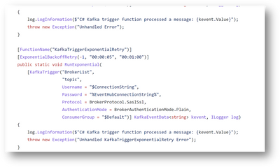
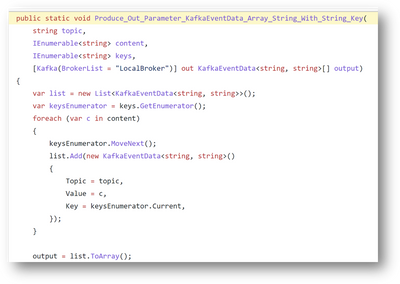

<head>
  <meta name="twitter:url" 
    content="https://azure.github.io/Cloud-Native/blog/zero2hero-func-05" />
  <meta name="twitter:title" 
    content="#ZeroToHero: Error Handling with Apache Kafka extension for Azure Functions " />
  <meta name="twitter:description" 
    content="#ZeroToHero: Error Handling with Apache Kafka extension for Azure Functions " />
  <meta name="twitter:image"
    content="https://azure.github.io/Cloud-Native/img/banners/serverless-zero2hero.png" />
  <meta name="twitter:card" content="summary_large_image" />
  <meta name="twitter:creator" 
    content="@nitya" />
  <meta name="twitter:site" content="@AzureAdvocates" /> 
  <link rel="canonical" 
    href="https://techcommunity.microsoft.com/t5/apps-on-azure-blog/error-handling-with-apache-kafka-extension-for-azure-functions/ba-p/3628936" />
</head>

---

Welcome to `Day 19` of #30DaysOfServerless!

Today, we have a special set of posts from our [Zero To Hero 🚀](/serverless-september/ZeroToHero) initiative, featuring blog posts authored by our Product Engineering teams for #ServerlessSeptember. _Posts were originally published on the [Apps on Azure](https://techcommunity.microsoft.com/t5/apps-on-azure-blog/error-handling-with-apache-kafka-extension-for-azure-functions/ba-p/3628936?WT.mc_id=javascript-99907-cxa) blog on Microsoft Tech Community._

---

## What We'll Cover
 * Retry Policy Support - in Apache Kafka Extension
 * AutoOffsetReset property - in Apache Kafka Extension
 * Key support for Kafka messages - in Apache Kafka Extension
 * References: Apache Kafka Extension for Azure Functions

---

_Recently we launched the [Apache Kafka extension for Azure functions](https://github.com/Azure/azure-functions-kafka-extension) in GA with some cool new features like deserialization of Avro Generic records and Kafka headers support. We received great responses - so we're back with more updates!_

## Retry Policy support

Handling errors in Azure Functions is important to avoid data loss or miss events or monitor the health of an application. Apache Kafka Extension for Azure Functions supports retry policy which tells the runtime to rerun a failed execution until either successful completion occurs or the maximum number of retries is reached.

A retry policy is evaluated when a trigger function raises an uncaught exception. As a best practice, you should catch all exceptions in your code and rethrow any errors that you want to result in a retry.

There are two retry strategies supported by policy that you can configure :- fixed delay and exponential backoff

1. **Fixed Delay** -  A specified amount of time is allowed to elapse between each retry.
2. **Exponential Backoff** - The first retry waits for the minimum delay. On subsequent retries, time is added exponentially to the initial duration for each retry, until the maximum delay is reached. Exponential back-off adds some small randomization to delays to stagger retries in high-throughput scenarios.

:::info Please Note
Retry Policy for Kafka extension **is NOT supported** for C# (in proc and out proc) trigger and output binding. This is supported for languages like Java, Node (JS , TypeScript), PowerShell and Python trigger and output bindings.
:::

Here is the sample code view of exponential backoff retry strategy

## AutoOffsetReset property

AutoOffsetReset property enables customers to configure the behaviour in the absence of an initial offset. Imagine a scenario when there is a need to change consumer group name. The consumer connected using a new consumer group had to reprocess all events starting from the oldest (earliest) one,  as this was the default one and this setting wasn’t exposed as configurable option in the Apache Kafka extension for Azure Functions(previously). With the help of this kafka setting you can configure on how to start processing events for newly created consumer groups.

Due to lack of the ability to configure this setting, offset commit errors were causing topics to restart from earliest offset· Users were looking to be able to set  offset setting  to either latest or earliest  based on their requirements.

We are happy to share that we have enabled the AutoOffsetReset setting as a configurable one to either - Earliest(Default) and Latest. Setting the value to Earliest configures the consumption of the messages from the the earliest/smallest offset or beginning of the topic partition. Setting the property to Latest configures the consumption of the messages from the latest/largest offset or from the end of the topic partition. This is supported for all the Azure Functions supported languages (C# (in & out), Java, Node (JS and TypeScript), PowerShell and python) and can be used for both triggers and output binding

## Key support for Kafka messages

With keys the producer/output binding can be mapped to broker and partition to write based on the message. So alongside the message value, we can choose to send a message key and that key can be whatever you want it could be a string, it could be a number . In case  you don’t send the key, the key is set to null then the data will be sent in a [Round Robin](https://www.geeksforgeeks.org/round-robin-scheduling-with-different-arrival-times/) fashion to make it very simple. **But in case you send a key with your message**, all the messages that share the same key will always go to the same partition and thus you can enable grouping of similar messages into partitions

Previously while consuming a Kafka event message using the Azure Function kafka extension, the event key was always none although the key was present in the event message.

Key support was implemented in the extension which enables customers to set/view key in the Kafka event messages coming in to the kafka trigger and set keys to the messages going in to kafka topics (with keys set) through output binding. Therefore key support was enabled in the extension to support both trigger and output binding for all Azure Functions supported languages ( (C# (in & out), Java, Node (JS and TypeScript), PowerShell and python)

Here is the view of an output binding producer code where Kafka messages are being set with key

## Conclusion:

In this article you have learnt about the latest additions to the Apache Kafka extension for Azure Functions. Incase you have been waiting for these features to get released or need them you are all set and please go head and try them out!! They are available in the latest extension bundles

 
:::info Want to learn more?
Please refer to [Apache Kafka bindings for Azure Functions](https://docs.microsoft.com/azure/azure-functions/functions-bindings-kafka?tabs=in-process%2Cportal&pivots=programming-language-csharp) | Microsoft Docs for detail documentation, samples on the Azure function supported languages and more!
:::

## References

 * [Apache Kafka bindings for Azure Functions | Microsoft Docs](https://docs.microsoft.com/azure/azure-functions/functions-bindings-kafka?tabs=in-process%2Cportal&pivots=programming-language-csharp)

:::tip FEEDBACK WELCOME
 
 * If you would like to provide feedback on Kafka trigger extension, please post them to our GitHub repository- Issues · [Azure/azure-functions-kafka-extension (github.com)](https://github.com/Azure/azure-functions-kafka-extension/issues)
 * This extension is being developed in the open-source community. Please contribute, try out and post any issues on the [Azure Functions Kafka extension GitHub repo](https://github.com/Azure/azure-functions-kafka-extension)
:::

Keep in touch with us on Twitter via [@AzureFunctions](https://twitter.com/AzureFunctions).