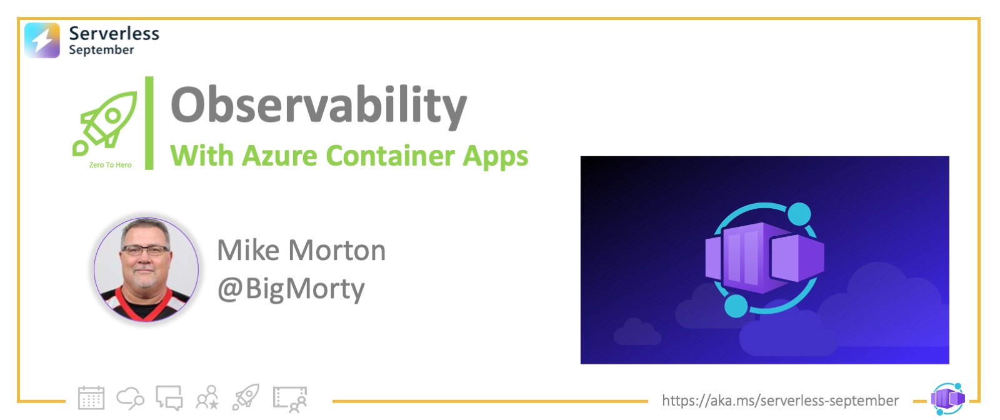
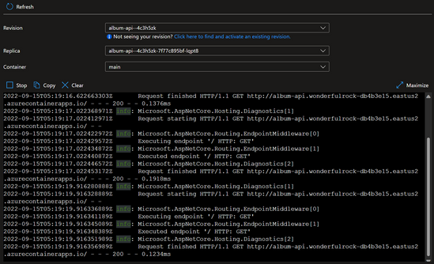
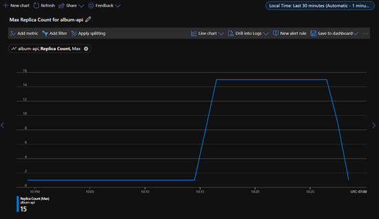
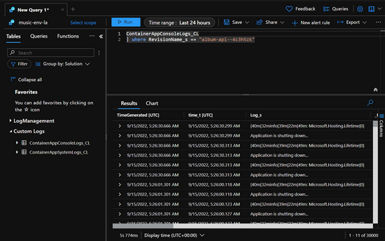
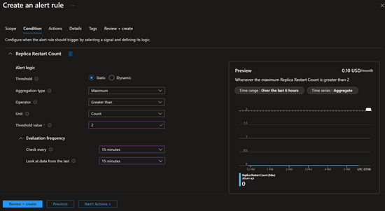

<head>
  <meta name="twitter:url" 
    content="https://azure.github.io/Cloud-Native/blog/zero2hero-aca-06" />
  <meta name="twitter:title" 
    content="#ZeroToHero: Observability with Azure Container Apps" />
  <meta name="twitter:description" 
    content="#ZeroToHero: Observability with Azure Container Apps" />
  <meta name="twitter:image"
    content="https://azure.github.io/Cloud-Native/img/banners/serverless-zero2hero.png" />
  <meta name="twitter:card" content="summary_large_image" />
  <meta name="twitter:creator" 
    content="@nitya" />
  <meta name="twitter:site" content="@AzureAdvocates" /> 
  <link rel="canonical" 
    href="https://techcommunity.microsoft.com/t5/apps-on-azure-blog/observability-with-azure-container-apps/ba-p/3627909" />
</head>

---

Welcome to `Day 19` of #30DaysOfServerless!

Today, we have a special set of posts from our [Zero To Hero 🚀](/serverless-september/ZeroToHero) initiative, featuring blog posts authored by our Product Engineering teams for #ServerlessSeptember. _Posts were originally published on the [Apps on Azure](https://techcommunity.microsoft.com/t5/apps-on-azure-blog/observability-with-azure-container-apps/ba-p/3627909?WT.mc_id=javascript-74010-cxa) blog on Microsoft Tech Community._

---

## What We'll Cover
 * Log Streaming - in Azure Portal
 * Console Connect - in Azure Portal
 * Metrics - using Azure Monitor
 * Log Analytics - using Azure Monitor
 * Metric Alerts and Log Alerts - using Azure Monitor



---

In past weeks, [@kendallroden](https://techcommunity.microsoft.com/t5/user/viewprofilepage/user-id/296868) wrote about [what it means to be Cloud-Native](https://techcommunity.microsoft.com/t5/apps-on-azure-blog/go-cloud-native-with-azure-container-apps/ba-p/3616407) and [@Anthony Chu](https://techcommunity.microsoft.com/t5/user/viewprofilepage/user-id/236816) the various ways to [get your apps running on Azure Container Apps](https://techcommunity.microsoft.com/t5/apps-on-azure-blog/journey-to-the-cloud-with-azure-container-apps/ba-p/3622609). Today, we will talk about the **observability tools** you can use to observe, debug, and diagnose your Azure Container Apps.

**Azure Container Apps** provides several observability features to help you debug and diagnose your apps. There are both Azure portal and CLI options you can use to help understand the health of your apps and help identify when issues arise.

While these features are helpful throughout your container app’s lifetime, there are two that are especially helpful.  Log streaming and console connect can be a huge help in the initial stages when issues often rear their ugly head. Let's dig into both of these a little.

## Log Streaming
Log streaming allows you to use the Azure portal to view the streaming logs from your app. You’ll see the logs written from the app to the container’s console (stderr and stdout). If your app is running multiple revisions, you can choose from which revision to view logs. You can also select a specific replica if your app is configured to scale. Lastly, you can choose from which container to view the log output. This is useful when you are running a custom or Dapr sidecar container.


Here’s an example CLI command to view the logs of a container app.

```bash
az containerapp logs show -n MyContainerapp -g MyResourceGroup
```
You can find more information about the different options in our [CLI docs](https://aka.ms/container-apps/logs-cli).

 
## Console Connect
In the Azure portal, you can connect to the console of a container in your app. Like log streaming, you can select the revision, replica, and container if applicable. After connecting to the console of the container, you can execute shell commands and utilities that you have installed in your container.  You can view files and their contents, monitor processes, and perform other debugging tasks.

This can be great for checking configuration files or even modifying a setting or library your container is using. Of course, updating a container in this fashion is not something you should do to a production app, but tweaking and re-testing an app in a non-production environment can speed up development.


Here’s an example CLI command to connect to the console of a container app.

```bash
az containerapp exec -n MyContainerapp -g MyResourceGroup
```

You can find more information about the different options in our [CLI docs](https://aka.ms/container-apps/exec-cli).


## Metrics
Azure Monitor collects metric data from your container app at regular intervals to help you gain insights into the performance and health of your container app. Container apps provide these metrics:

- CPU usage
- Memory working set bytes
- Network in bytes
- Network out bytes
- Requests
- Replica count
- Replica restart count

Here you can see the metrics explorer showing the replica count for an app as it scaled from one replica to fifteen, and then back down to one.



You can also retrieve metric data through [the Azure CLI](https://aka.ms/container-apps/azure-monitor-metrics-cli).

 

## Log Analytics
Azure Monitor Log Analytics is great for viewing your historical logs emitted from your container apps. There are two custom tables of interest, the ContainerAppConsoleLogs_CL which contains all the log messages written by your app (stdout and stderr), and the ContainerAppSystemLogs_CL which contain the system messages from the Azure Container Apps service.	



You can also query Log Analytics through the [Azure CLI](https://aka.ms/container-apps/azure-monitor-logs-cli).


## Alerts
Azure Monitor alerts notify you so that you can respond quickly to critical issues. There are two types of alerts that you can define:

 * [Metric alerts](https://docs.microsoft.com/azure/azure-monitor/alerts/alerts-types#metric-alerts) based on Azure Monitor metric data
 * [Log alerts](https://docs.microsoft.com/azure/azure-monitor/alerts/alerts-types#log-alerts) based on Azure Monitor Log Analytics data

You can create alert rules from metric charts in the metric explorer and from queries in Log Analytics. You can also define and manage alerts from the **Monitor|Alerts** page.

Here is what creating an alert looks like in the Azure portal. In this case we are setting an alert rule from the metric explorer to trigger an alert if the replica restart count for a specific container app is greater than two within the last fifteen minutes.



To learn more about alerts, refer to [Overview of alerts in Microsoft Azure](https://docs.microsoft.com/azure/azure-monitor/alerts/alerts-overview).


## Conclusion
In this article, we looked at the several ways to observe, debug, and diagnose your Azure Container Apps. As you can see there are rich portal tools and a complete set of CLI commands to use. All the tools are helpful throughout the lifecycle of your app, be sure to take advantage of them when having an issue and/or to prevent issues.

To learn more, visit [Azure Container Apps | Microsoft Azure](https://aka.ms/containerapps) today!

 
:::info ASK THE EXPERT: LIVE Q&A
The Azure Container Apps team will answer questions live on **September 29**. 
 * [Sign up to attend](https://reactor.microsoft.com/reactor/events/17004/?WT.mc_id=javascript-74010-ninarasi) for live Q&A with the team
 * [submit your questions](https://github.com/Azure/Cloud-Native/issues/new?assignees=&labels=ask+the+expert&template=---ask-the-expert-.md&title=%5BAsk+The+Expert%5D++) ahead of time, for prioritization.
:::