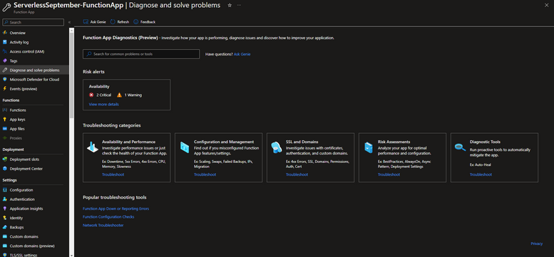

<head>
  <meta name="twitter:url" 
    content="https://azure.github.io/Cloud-Native/blog/zero2hero-func-07" />
  <meta name="twitter:title" 
    content="#ZeroToHero: Monitoring and troubleshooting apps in Azure Functions " />
  <meta name="twitter:description" 
    content="#ZeroToHero: Monitoring and troubleshooting apps in Azure Functions" />
  <meta name="twitter:image"
    content="https://azure.github.io/Cloud-Native/img/banners/serverless-zero2hero.png" />
  <meta name="twitter:card" content="summary_large_image" />
  <meta name="twitter:creator" 
    content="@nitya" />
  <meta name="twitter:site" content="@AzureAdvocates" /> 
  <link rel="canonical" 
    href="https://techcommunity.microsoft.com/t5/apps-on-azure-blog/error-handling-with-apache-kafka-extension-for-azure-functions/ba-p/3628936" />
</head>

---

Welcome to `Day 26` of #30DaysOfServerless!

Today, we have a special set of posts from our [Zero To Hero 🚀](/serverless-september/ZeroToHero) initiative, featuring blog posts authored by our Product Engineering teams for #ServerlessSeptember. _Posts were originally published on the [Apps on Azure](https://techcommunity.microsoft.com/t5/apps-on-azure-blog/monitoring-and-troubleshooting-apps-in-azure-functions/ba-p/3638230?WT.mc_id=javascript-99907-cxa) blog on Microsoft Tech Community._

---

## What We'll Cover
 * Monitoring your Azure Functions
 * Built-in log streaming
 * Live Metrics stream
 * Troubleshooting Azure Functions

---

## Monitoring your Azure Functions:

Azure Functions uses **Application Insights** to collect and analyze log data from individual function executions in your function app.

### Using Application Insights

Application Insights collects _log, performance, and error data_. By automatically detecting performance anomalies and featuring powerful analytics tools, you can more easily diagnose issues and better understand how your functions are used. These tools are designed to help you continuously improve performance and usability of your functions. You can even use Application Insights during local function app project development.

Typically, you create an Application Insights instance when you create your function app. In this case, the instrumentation key required for the integration is already set as an application setting named `APPINSIGHTS_INSTRUMENTATIONKEY`. With Application Insights integration enabled, telemetry data is sent to your connected Application Insights instance. This data includes logs generated by the Functions host, traces written from your functions code, and performance data. In addition to data from your functions and the Functions host, you can also collect data from the [Functions scale controller](https://learn.microsoft.com/azure/azure-functions/functions-monitoring#scale-controller-logs?WT.mc_id=javascript-99907-cxa).

By default, the data collected from your function app is stored in Application Insights. In the [Azure portal](https://portal.azure.com/), Application Insights provides an extensive set of visualizations of your telemetry data. You can drill into error logs and query events and metrics. To learn more, including basic examples of how to view and query your collected data, see [Analyze Azure Functions telemetry in Application Insights](https://learn.microsoft.com/azure/azure-functions/analyze-telemetry-data?WT.mc_id=javascript-99907-cxa).

### Using Log Streaming 

In addition to this, you can have a smoother debugging experience through log streaming. There are two ways to view a stream of log files being generated by your function executions.

 * **Built-in log streaming**: the App Service platform lets you view a stream of your application log files. This is equivalent to the output seen when you debug your functions during [local development](https://learn.microsoft.com/azure/azure-functions/functions-develop-local?WT.mc_id=javascript-99907-cxa) and when you use the Test tab in the portal. All log-based information is displayed. For more information, see [Stream logs](https://learn.microsoft.com/azure/app-service/troubleshoot-diagnostic-logs#stream-logs?WT.mc_id=javascript-99907-cxa). This streaming method supports only a single instance and can't be used with an app running on Linux in a Consumption plan.
* **Live Metrics Stream**: when your function app is [connected to Application Insights](https://learn.microsoft.com/azure/azure-functions/configure-monitoring#enable-application-insights-integration?WT.mc_id=javascript-99907-cxa), you can view log data and other metrics in near real-time in the Azure portal using [Live Metrics Stream](https://learn.microsoft.com/azure/azure-monitor/app/live-stream?WT.mc_id=javascript-99907-cxa). Use this method when monitoring functions running on multiple-instances or on Linux in a Consumption plan. This method uses [sampled data](https://learn.microsoft.com/azure/azure-functions/configure-monitoring#configure-sampling?WT.mc_id=javascript-99907-cxa).
Log streams can be viewed both in the portal and in most local development environments.

:::info Monitoring Azure Functions
Learn how to [configure monitoring for your Azure Functions](https://learn.microsoft.com/azure/azure-functions/configure-monitoring?source=recommendations&tabs=v2&WT.mc_id=javascript-99907-cxa). See [Monitoring Azure Functions data reference](https://learn.microsoft.com/azure/azure-functions/monitor-functions-reference?WT.mc_id=javascript-99907-cxa) for detailed information on the metrics and logs metrics created by Azure Functions.
:::
 
In addition to this, Azure Functions uses [Azure Monitor](https://learn.microsoft.com/azure/azure-monitor/overview) to [monitor the health of your function apps](https://learn.microsoft.com/azure/azure-functions/monitor-functions?tabs=portal). Azure Functions collects the same kinds of monitoring data as other Azure resources that are described in [Azure Monitor data collection](https://learn.microsoft.com/azure/azure-monitor/essentials/monitor-azure-resource#monitoring-data-from-azure-resources). See [Monitoring Azure Functions data reference](https://learn.microsoft.com/azure/azure-functions/monitor-functions-reference) for detailed information on the metrics and logs metrics created by Azure Functions.

## Troubleshooting your Azure Functions:

When you do run into issues with your function app, Azure Functions diagnostics points out what’s wrong. It guides you to the right information to troubleshoot and resolve the issue more easily and quickly.

Let’s explore how to use Azure Functions diagnostics to diagnose and solve common function app issues.

 1. Navigate to your function app [in the Azure portal](https://portal.azure.com/?WT.mc_id=javascript-99907-cxa).
 2. Select Diagnose and solve problems to open Azure Functions diagnostics.
 3. Once you’re here, there are multiple ways to retrieve the information you’re looking for. Choose a category that best describes the issue of your function app by using the keywords in the homepage tile. You can also type a keyword that best describes your issue in the search bar. There’s also a section at the bottom of the page that will directly take you to some of the more popular troubleshooting tools. For example, you could type execution to see a list of diagnostic reports related to your function app execution and open them directly from the homepage.

 4. For example, click on the Function App Down or Reporting Errors link under Popular troubleshooting tools section. You will find detailed analysis, insights and next steps for the issues that were detected. On the left you’ll see a list of detectors. Click on them to explore more, or if there’s a particular keyword you want to look for, type it Into the search bar on the top.
 

:::tip TROUBLESHOOTING TIP

Here are some general troubleshooting tips that you can follow if you find your Function App throwing [Azure Functions Runtime unreachable](https://learn.microsoft.com/azure/azure-functions/functions-recover-storage-account?WT.mc_id=javascript-99907-cxa) error. 

Also be sure to check out the recommended best practices to ensure your Azure Functions are highly reliable. [This article](https://learn.microsoft.com/azure/azure-functions/functions-best-practices?source=recommendations&tabs=csharp&WT.mc_id=javascript-99907-cxa) details some best practices for designing and deploying efficient function apps that remain healthy and perform well in a cloud-based environment.
:::
Bonus tip: 