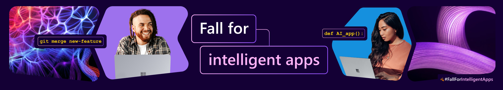

# Cloud Skills Challenge

:::info 🚨 [**REGISTER NOW TO COMPETE**](https://aka.ms/fallforIA/apps-csc) 🚨

Use the link above to start the Cloud Skills Challenge today! The challenge runs till Oct 31, so **an early start helps**! 

:::

---

## Fall for Intelligent Apps Skills Challenge

Join us on a learning journey this fall to skill up on your core skills for developing intelligent apps. Explore how to combine the power of AI, cloud-scale data, and cloud-native app development to create highly differentiated digital experiences.

* [**Intelligent Apps Skills Challenge**](https://aka.ms/fallforIA/apps-csc?WT.mc_id=javascript-99907-ninarasi) - Applications are at the core of intelligent solution development. Cloud-native app development empowers you to create modern containerized and serverless apps to build innovative solutions. Explore how to get started with building intelligent apps using Azure Kubernetes Service, Azure Functions and GitHub.

* [**Data Skills Challenge**](https://aka.ms/fallforIA/data-csc?WT.mc_id=javascript-99907-ninarasi) - It is time to activate our enormous data stores for building data driven intelligent solutions. Explore the capabilities of cloud-scale data with Microsoft Fabric in this Cloud Skills Challenge! Follow along with the Fabric Community @ https://aka.ms/fabriccommunity.

* [**AI Skills Challenge**](https://aka.ms/fallforIA/ai-csc?WT.mc_id=javascript-99907-ninarasi) - The world of generative AI is rapidly evolving. Learn how to create intelligent solutions that extract semantic meaning from text and support common computer vision scenarios. Explore how to take advantage of large-scale, generative AI models with deep understandings of language and code to enable new reasoning and comprehension capabilities for building cutting-edge applications responsibly.

---

## About Cloud Skills

The Cloud Skills Challenge is a fun way to skill up on Azure serverless technologies while competing with other members of the community for a chance to win fun swag!

You'll work your way through [learning modules](https://learn.microsoft.com) that skill you up on relevant technologies - while collecting points that place you on a Leaderboard.

 1. 🎯 **Compete** - Benchmark your progress against friends and coworkers.
 2. 🎓 **Learn** - Increase your understanding by completing learning modules.
 3. 🏆 **Skill Up** - Gain useful technical skills and prep for certifications.

---

## About Microsoft Learn

Completed the Cloud Skills Challenge, and want to keep going on your learning journey?  Or, perhaps there are other Cloud+AI topics you want to skill up in? Check out these three resources for building your professional profile!

| 1️⃣ - [**LEARNING PATHS**](https://docs.microsoft.com/learn/browse/?WT.mc_id=javascript-99907-ninarasi) | 2️⃣ - [** CERTIFICATIONS**](https://docs.microsoft.com/learn/certifications/?WT.mc_id=javascript-99907-ninarasi)| 3️⃣ - [**LEARNING EVENTS**](https://docs.microsoft.com/events/?WT.mc_id=javascript-99907-ninarasi)|
|:---:|:---:|:---:|
| Skill up on a topic with guided paths for self-study!| Showcase your expertise with industry-recognized credentials!| Learn from subject matter experts in live & recorded events|
|  |    |   |

