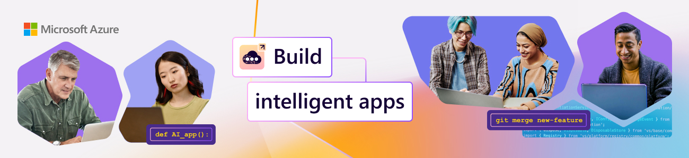

# Build AI Apps and Agents with the Microsoft Learn AI Skills Fest

---

Gaining AI skills can increase wages by an average of 21%. Build in-demand skills with the Microsoft Learn AI Skills Fest! Master cutting-edge AI technologies like Microsoft Copilot, GitHub, Microsoft Azure, and Microsoft Fabric. Engage in six curated topics, interactive community events, and expert-led sessions to deepen your understanding. Take advantage of a selection of certification offers to showcase your technical knowledge to potential employers. Start your AI journey today!

#LearnMicrosoftAI  

[Register now](https://aiskillsfest.event.microsoft.com/?ocid=biafy25h1_aiskillschallenge_webpage_azuremktg) to compete and level up your AI skills. AI Skills Fest is live for 50 days of AI discovery and learning **April 8 through May 28!**

---

## Earn a Microsoft Learn badge 

By completing this challenge before **May 28, 2025**, you will receive a Microsoft Learn **badge** on your Learn profile. These will be delivered to the email address associated with your Microsoft Learn profile. Confirm or add a contact email [here](https://learn.microsoft.com/users/me/settings?ocid=biafy25h1_aiskillschallenge_webpage_azuremktg) to ensure emails are delivered.

---

## About Microsoft Learn

Completed the Microsoft Learn AI Skills Fest, and want to keep going on your learning journey? Or, perhaps there are other Cloud and AI topics you want to skill up in? Check out these three resources for building your professional profile!

| 1️⃣ - [**LEARNING PATHS**](https://docs.microsoft.com/learn/browse/?ocid=biafy25h1_aiskillschallenge_webpage_azuremktg) | 2️⃣ - [**CERTIFICATIONS**](https://docs.microsoft.com/learn/certifications/?ocid=biafy25h1_aiskillschallenge_webpage_azuremktg) | 3️⃣ - [**LEARNING EVENTS**](https://docs.microsoft.com/events/?ocid=biafy25h1_aiskillschallenge_webpage_azuremktg)|
|:---:|:---:|:---:|
| Skill up on a topic with guided paths for self-study!| Showcase your expertise with industry-recognized credentials!| Learn from subject matter experts in live & recorded events|
|  |    |   |

