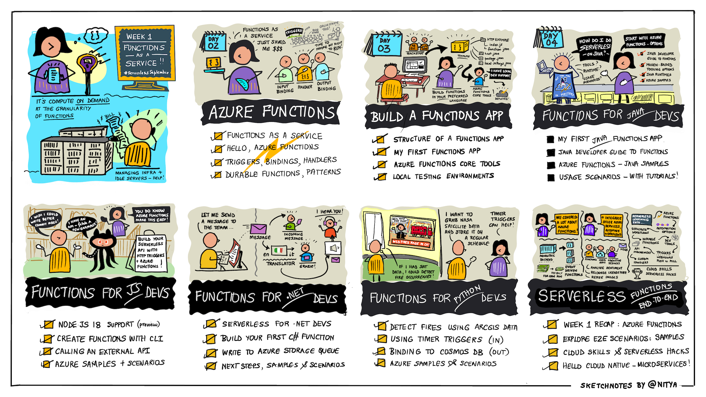

# Roadmap for #30Days

---

## Welcome! 

This is a tentative roadmap for #30DaysOfServerless, a daily content series planned for the upcoming **Serverless September** project. It's a month-long celebration of [Serverless On Azure](https://azure.microsoft.com/en-us/solutions/serverless/?WT.mc_id=javascript-74010-ninarasi) with a curated journey that takes you from understanding core technologies to developing solutions for end-to-end scenarios - organized into 4 stages:

 * **Go Serverless** with Azure Functions
 * **Deploy Microservices** with Azure Container Apps
 * **Simplify Integrations** with Azure Event Grid & Logic Apps
 * **Build End-to-End Solutions** using familiar Dev Tools & Languages

:::warning 🚨 SEP 08: CHANGE IN PUBLISHING SCHEDULE

Starting from Week 2 (Sep 8), we'll be publishing blog posts in _batches_ rather than on a daily basis, so you can read a series of related posts together. _Don't want to miss updates?_ Just [subscribe to the feed](https://azure.github.io/Cloud-Native/blog/rss.xml)
:::

Here are some actions you can take in the meantime:
 * Visit our [Discussions](https://github.com/Azure/Cloud-Native/discussions) board and leave us feedback or requests under the #30DaysOfServerless topic!
 * Register for the [Cloud Skills Challenge](https://docs.microsoft.com/learn/challenges?id=b950cd7a-d456-46ab-81ba-3bd1ad86dc1c&WT.mc_id=javascript-74010-ninarasi).
 * Check out the [official Serverless September collection](https://docs.microsoft.com/users/leannturpin-6614/collections/kjqpsnzg4opdo2?WT.mc_id=javascript-74010-ninarasi) of learning modules and don't forget to 

---

## Sep 1: Kickoff 

_Welcome to our September Serverless kickoff!!_ Our Serverless September officially kicks off on September 1, 2022. However, we'll be sharing a few posts ahead of time, to share more information about the many awesome initiatives we are planning for you.

:::success SERVERLESS SEPTEMBER INITIATIVES
 * [**30DaysOfServerless**](/serverless-september/30DaysOfServerless) - daily blog posts on this site and [dev.to/azure](https://dev.to/azure)
 * [**Serverless Hacks**](/serverless-september/ServerlessHacks) - weekly hack sessions at [Microsoft Reactor](https://developer.microsoft.com/en-us/reactor/?WT.mc_id=javascript-74010-ninarasi)
 * [**Zero To Hero**](/serverless-september/ZeroToHero) - 4-part blog from Product Engineering teams on [Microsoft Tech Community](https://techcommunity.microsoft.com/t5/apps-on-azure-blog/bg-p/AppsonAzureBlog?WT.mc_id=javascript-74010-ninarasi)
 * [**Cloud Skills Challenge**](/serverless-september/CloudSkills) - Interactive skilling [competition](https://docs.microsoft.com/learn/challenges?id=b950cd7a-d456-46ab-81ba-3bd1ad86dc1c&WT.mc_id=javascript-74010-ninarasi) that can help with certification.
 * [**Ask The Expert**](/serverless-september/AskTheExpert) - Live 30 minute broadcast to [get questions answered](https://docs.microsoft.com/shows/ask-the-expert/?WT.mc_id=javascript-74010-ninarasi) by product experts 
 * [**Community Buzz**](/serverless-september/CommunityBuzz) - A chance for *you* to showcase your posts or apps on this site.

:::

:::warning LINKS TO POSTS
Posts will be published nightly on our main [blog](/blog) page. Once the post is published, we will update the corresponding items in the sections below with direct links. You can [subscribe](https://azure.github.io/Cloud-Native/blog/rss.xml) to the blog to get updates delivered directly to your feed reader.
:::

---

## Azure Functions

_Welcome to the Week 1 of your learning journey into Serverless technologies. Let's talk about Azure Functions - what it is, core features and tools, and best practices for getting started in the programming language of your choice._

:::info WEEK 1 - AZURE FUNCTIONS
_Posts will be linked here once published._
 * Sep 02 - [Learn Core Concepts](/blog/02-functions-intro)
 * Sep 03 - [Build Your First Function](/blog/03-functions-quickstart)
 * Sep 04 - [Functions for Java Developers](/blog/04-functions-java)
 * Sep 05 - [Functions for JavaScript Developers](/blog/05-functions-js)
 * Sep 06 - [Functions for .NET Developers](/blog/06-functions-dotnet)
 * Sep 07 - [Functions for Python Developers](/blog/07-functions-python)
 * Sep 08 - Functions + Serverless On Azure
:::

---

## Azure Container Apps

_Welcome to Week 2. You've learnt how to build event-driven serverless backends using Azure Functions. But how can you orchestrate and scale more complex solutions? The answer lies in microservice architectures and containerized apps. This week we explore Azure Container Apps (ACA) - and learn how the Distributed Application Runtime (Dapr) technology can work alongside ACA to unlock richer capabilities and simplify developer experience._

:::info WEEK 2 - AZURE CONTAINER APPS & DAPR
_Posts will be linked here once published._
 *  Sep 09 - Learn Core Concepts
 *  Sep 10 - Build an ACA (with/out Dapr)
 *  Sep 11 - Learn About: Communication
 *  Sep 12 - Learn About: State Management
 *  Sep 13 - Learn About: Observability
 *  Sep 14 - Learn About: Secure Access
 *  Sep 15 - ACA + Serverless On Azure
:::

---

## Serverless Integrations

_Welcome to Week 3 - you've learned to build serverless applications using functions and microservices, orchestrated as containerized applications. Now let's explore a few core Azure services that streamline integrations with Azure and non-Azure services in standard, scalable ways._

:::info WEEK 3 - AZURE EVENT GRID & AZURE LOGIC APP
_Posts will be linked here once published._
 *  Sep 16 - Logic Apps: Core Concepts
 *  Sep 17 - Logic Apps: Quickstart
 *  Sep 18 - Logic Apps: Best Practices
 *  Sep 19 - Event Grid: Core Concepts
 *  Sep 20 - Event Grid: Quickstart
 *  Sep 21 - Event Grid: Best Practices
 *  Sep 22 - Integrations + Serverless On Azure
:::

---

## Serverless End-To-End

_It's the final week of Serverless September! So far we've talked about various components of a Serverless solution on Azure. Now let's explore various end-to-end examples and learn how we can make these components work together._

:::info Week 4 ARTICLES
_Posts will be linked here once published._
 *  Sep 23 -  TBA
 *  Sep 24 -  TBA
 *  Sep 25 -  TBA
 *  Sep 26 -  TBA
 *  Sep 27 -  TBA
 *  Sep 28 -  TBA
 *  Sep 29 -  TBA
:::

---

## Sep 30: Summary

:::success THANK YOU & NEXT STEPS
Thank you for staying the course with us. In the final two posts of this series we'll do two things:
 * **Look Back** - with a quick retrospective of what was covered.
 * **Look Ahead** - with resources and suggestions for how you can skill up further!

We appreciate your time and attention and we hope you found this curated tour valuable. Feedback and suggestions are always welcome. From our entire team, we wish you **good luck with the learning journey - now go build some apps and share your knowledge!** 🎉
:::

---